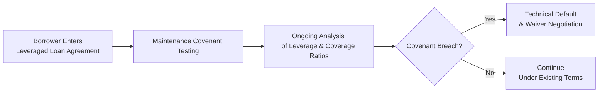

## Introduction and Context

It might sound a little funny at first, but every time I hear the word “covenant,” I think of a promise made with some gravity behind it—like a solemn vow. In the realm of corporate debt markets, covenants are effectively promises (enforced by legal language) that borrowers make to lenders. They help ensure that, hey, if you’re borrowing my money, you’ll follow some rules to keep me—your lender—protected. And in the context of leveraged loans and high-yield (HY) bonds, these promises become critical, mainly because we’re talking about higher-risk lending to companies that already carry substantial debt or lower credit quality.

In strong bull markets (where everyone’s feeling optimistic), borrowers might get away with looser or “covenant-lite” structures. But when the economic cycle turns south, the strength and detail of these covenants come into sharp focus—essentially deciding whether creditors can take corrective actions early, or whether they have to wait until it’s too late.

Below, we dive into the specific types of covenants commonly found in leveraged loan agreements and high-yield bond indentures, explore how they shape issuer behavior, and delve into practical (and sometimes personal) stories that highlight why these provisions matter. Our goal is to make this part of corporate debt markets feel much more intuitive, while still maintaining the rigor and detail a CFA candidate (or any serious finance reader) expects.

## Distinguishing Leveraged Loans and High-Yield Bonds

Before taking a closer look at covenants themselves, let’s clarify where leveraged loans and HY bonds generally stand in the hierarchy:

• Leveraged Loans:  
  – Often issued by companies with higher leverage ratios, lower credit scores, or both.  
  – Typically secured by company assets, meaning lenders have a direct claim on collateral if the borrower defaults.  
  – Traded in liquid secondary markets, with large holders like CLO managers and institutional investors.  

• High-Yield Bonds:  
  – Unsecured (quite often), ranking below secured lenders in the capital structure.  
  – They carry higher coupon rates to compensate for elevated credit risk.  
  – Can have intermediate maturities but often come with various call features and incurrence covenants.  

One personal memory: a colleague of mine once joked, “If you’re calling your loan ‘leveraged,’ you’d better expect the entire contract to read like your strict old cousin’s house rules—lots of do’s and don’ts, delivered in a stern tone.” He was right. Leveraged loan agreements are famously thorough.

## Covenant Types: Maintenance vs. Incurrence

### Maintenance Covenants

Maintenance covenants, common in leveraged loans, effectively require that the borrower remain ≤ a certain leverage ratio (e.g., debt-to-EBITDA) or ≥ a given coverage ratio (e.g., EBITDA-to-interest). Think of them as ongoing checkups: the borrower must pass these “health tests” at regular intervals—quarterly, for instance. If it fails, well, that triggers a technical default. Lenders can then demand remedial action such as:  
• Negotiated waivers (with stricter terms or higher pricing).  
• Amend-and-extend agreements.  
• Potential acceleration of repayment if terms aren’t renegotiated.

### Incurrence Covenants

By contrast, incurrence covenants, more frequently found in high-yield bonds, are triggered only if the borrower takes a certain action—like issuing additional debt, paying large dividends, or disposing of key assets. These limit the company’s capacity to do things that might reduce its overall creditworthiness. But if the borrower just hums along without trying anything major, the incurrence-based covenant doesn’t come into play.

An analogy I’ve used in class is: maintenance is like a monthly weigh-in (must stay under 200 lbs to keep your sports membership discount!), whereas incurrence is triggered only if you decide to go on a three-week-long pastry binge or sign up for an intense cross-country trip.

## Covenant Packages: Protecting the Lender, Restricting the Borrower

In higher-risk credit environments, lenders aim to include a comprehensive package of covenants to retain a level of control and offset the potential for defaults or aggressive borrower tactics. Common elements include:

• Leverage Ratio Tests:  
  – Ensures that total debt relative to EBITDA doesn’t exceed a specified threshold.  
  – In leveraged loans, tested regularly (maintenance).  
  – In HY bonds, typically triggered if new debt is being issued (incurrence).

• Interest Coverage Tests:  
  – A requirement that operating profits (often approximated by EBITDA) exceed interest expense by a defined multiple (e.g., 2.0× coverage).  
  – Helps ensure the borrower can meet its cash-pay obligations.

• Restricted Payment Baskets:  
  – Limit dividends, share repurchases, or investments in affiliates.  
  – Borrower must stay within the “basket” (a set dollar limit or ratio-based limit) or meet certain ratios before paying out large sums.

• Asset Sales and Dispositions:  
  – Mandate that proceeds from asset sales go toward debt repayment or reinvestments supporting core operations, rather than, say, distributing to shareholders.

• Negative Pledge Clauses:  
  – Restrict or prohibit the borrower from granting additional security over assets that would rank senior or equal to existing creditors.

### Covenant-Lite (Cov-Lite) Structures

In robust credit markets, it’s not unusual to see “covenant-lite” or “cov-lite” leveraged loans that incorporate fewer maintenance tests. These loans might feature only incurrence-based tests or impose no coverage requirements at all. While they’re more borrower-friendly and presumably reflect intense market competition among lenders, they can leave investors more exposed if the issuer’s fundamentals deteriorate quickly.

I remember the 2006–2007 era, right before the Global Financial Crisis: cov-lite deals were all the rage, with syndicated lenders seemingly tripping over one another to extend credit on super-generous terms. A year or two later, some of those fancy deals encountered trouble, and lenders found they had fewer contractual levers to pull. Predictably, that led to lower recovery rates in many distressed scenarios.

## Anatomy of Financial Maintenance Tests

Leveraged loans typically require the borrower to maintain certain financial ratios each quarter. A typical formula might look like:

Leverage Ratio =  
\\(\displaystyle \frac{\text{Total Debt}}{\text{EBITDA}}\\)

where EBITDA might include certain addbacks for items like restructuring costs or cost synergies (sometimes referred to as “EBITDA addbacks”). Overly aggressive addbacks can be something of a joke among credit analysts—“Wait, you’re telling me that your synergy will reduce operating costs by 50% next year?”—and it leads to big differences in reported vs. reality-based EBITDA.

If the ratio goes above a predetermined threshold, the loan is in technical default. In practice, the borrower will usually try to negotiate a waiver or amendment. The lender often extracts a higher spread or additional fees for providing that waiver.

### Diagram: Maintenance Covenant Testing

Below is a simple flowchart illustrating what happens when a borrower fails its maintenance test:

In a high-yield bond scenario, however, the incurrence test might say something like: “If the company’s leverage ratio would exceed 4.0× after issuing additional debt, it can’t issue more unless it meets certain conditions.” That’s still protective but not quite as continuous.

## Implications of Covenant Breaches

### Technical Default and Cross-Acceleration

Many leveraged loans include a **cross-acceleration clause**, meaning that if the borrower defaults (even technically) on one tranche of its debt, lenders on another tranche can also demand accelerated repayment. Suddenly, what started as a single covenant breach on a small facility can escalate into a major capital structure meltdown.

### Negotiated Waivers and Amendments

A technical default doesn’t necessarily lead to an immediate meltdown. Often the first step is a **negotiated waiver**: lenders might say, “All right, we’ll waive this breach, but we want an extra 50 basis points in spread, an upfront fee, or additional collateral.” From an investor perspective, these nuanced negotiations can significantly alter your return, especially if you’re an active manager or hedge fund buying leveraged loans in the secondary market and anticipating a covenant breach that allows you to extract concessions.

### Effect on Recovery Rates

When loans or bonds do eventually enter distress or default, covenant strength can influence the timeline for restructuring and the ultimate share of principal investors get back (recovery). In strong covenant packages:  
• Lenders spot early signs of trouble and can push for restructuring (or partial debt paydown) before the borrower’s finances deteriorate beyond repair.  
• By contrast, with loose covenants, the borrower might continue piling on liabilities or paying out equity dividends, leaving the lender with diminished collateral or enterprise value.

## Investor Insights: Pricing and Secondary Trading

Institutional investors, CLO managers, and hedge funds often trade these instruments in robust secondary markets. The existence (and tightness) of covenants is a huge driver in determining a security’s yield spread. Typically:  
• Tighter covenants → greater protection → all else equal, narrower spreads (lenders accept a slightly lower yield because their risk is lower).  
• Looser covenants → less protection → all else equal, wider spreads (creditors demand more yield to compensate for risk).

Don’t forget: covenant analysis also ties closely to the topics in Chapter 9 on credit risk and default probabilities. A borrower with borderline credit fundamentals but strong covenant oversight might actually pose less risk to certain lenders than a borrower with moderate fundamentals and absolute freedom to load up on more debt.

## Best Practices and Pitfalls

1. Overlooking the Fine Print:  
   – Even within a single “maintenance covenant,” definitions of EBITDA can vary wildly, so read the footnotes and parentheses carefully.

2. Relying on Ratings Alone:  
   – Credit ratings agencies consider covenant quality, but they also weigh many other factors. A “BB” rated bond with extremely loose covenants may be more dangerous than you’d think.

3. Negotiation Leverage:  
   – Lenders who hold a large position in the loan can influence outcomes when a breach occurs. Smaller investors might have less say and be forced to go along with the majority.  

4. Market Cyclicality:  
   – During bullish market conditions, covenant-lite structures flourish. In a downturn, these same instruments often yield more dramatic outcomes (e.g., distressed exchanges, forced refinancings).

## Case Study: The Ambitious Merger

Here’s an example (slightly fictionalized but based on real events) to show how covenants come into play. Suppose Company Z, a mid-sized manufacturing firm, took on a leveraged loan to fund an ambitious merger—claiming that synergy would cut expenses by 30%. Because everyone seemed sure it would work, the credit agreement allowed a big EBITDA addback for “anticipated synergy.” However, synergy never materialized. By the time the lenders tested the maintenance covenant at quarter-end, the actual leverage ratio soared well above the limit. Company Z found itself in technical default, with lenders in a position to accelerate repayment or demand new terms. The company negotiated a waiver, paying an additional 1.0% interest margin and a 100 bps fee upfront. Six months later, the poor synergy story repeated itself, and the lenders threatened a second default—ultimately pulling the trigger on a restructuring that cost equity holders dearly but helped preserve value for the lenders. This story highlights how covenant quality and realistic synergy assumptions can make or break an investment’s success.

## Relationship to Broader Credit Analysis

For deeper understanding, you may cross-reference Chapter 9 (Credit Risk and Credit Analysis) to see how probability of default models incorporate covenant structures. Additionally, consider how rating agencies, identified in Section 5.4, incorporate covenant analysis into their overall rating methodology. The presence of robust maintenance or incurrence covenants might not directly elevate a borrower’s letter rating, but it can certainly influence the bond’s or loan’s notching relative to senior unsecured or junior debt.

## Exam Tips for Section 5.12

• Identify what type of covenant you are analyzing (maintenance vs. incurrence).  
• Be ready to interpret financial ratios in a covenant. For instance, you might see a question that calculates a coverage ratio to test if there’s a technical breach.  
• Understand the typical consequences of a covenant breach—particularly how cross-acceleration can escalate the situation quickly.  
• Grasp the strategic differences for lenders between tighter covenant packages and covenant-lite deals and why the latter might offer higher yields but more risk.  
• Integrate a discussion of credit risk, potential default, and recovery rates in any question involving the analysis of leveraged loan or high-yield bond indentures.

## References

• S&P Global Market Intelligence. “Leveraged Loan Primer.”  
• Moody’s Investor Service. “Covenant Quality Assessments.”  
• Loan Syndications and Trading Association (LSTA). “Standardized Leveraged Loan Documents.”  

## Test Your Knowledge: Covenants in Leveraged Loan and High-Yield Bond Markets



### Which of the following best describes a maintenance covenant in a leveraged loan?

- [ ] A covenant that only comes into effect when the borrower issues new debt.
- [x] A covenant that must be complied with on a regular basis, such as maintaining a fixed leverage ratio each quarter.
- [ ] A covenant that applies only to certain subsidiaries of the borrower.
- [ ] A covenant that automatically provides lenders with equity in the event of default.

> **Explanation:** Maintenance covenants require ongoing (periodic) compliance, typically involving specific financial ratios like leverage or coverage. Incurrence covenants are activated by a particular action, such as issuing new debt.

### In high-yield bonds, which type of covenant typically restricts the issuance of additional debt?

- [ ] Maintenance covenant
- [x] Incurrence covenant
- [ ] Cross-acceleration covenant
- [ ] Negative pledge covenant

> **Explanation:** High-yield bonds generally use incurrence covenants that are triggered by certain actions, including taking on new debt or engaging in significant asset sales or restricted payments.

### What is a common outcome if a borrower violates a maintenance covenant?

- [x] The borrower is in technical default and must negotiate with lenders for a waiver or possibly face accelerated repayment.
- [ ] The borrower loses all collateral pledged under the loan.
- [ ] The borrower must repay all accrued interest but not principal.
- [ ] The covenant is automatically waived without cost.

> **Explanation:** Breaching a maintenance covenant places the borrower in technical default. It typically initiates a process where lenders can demand repayment unless an amendment or waiver is arranged, often at a cost.

### Which statement correctly characterizes a “covenant-lite” (cov-lite) leveraged loan?

- [ ] A loan with a lower coupon because of tighter financial ratio requirements.
- [ ] A loan that has both maintenance and incurrence covenants tested monthly.
- [x] A loan with fewer or no maintenance covenants, heavily favoring the borrower.
- [ ] A loan that applies only to investment-grade issuers.

> **Explanation:** Covenant-lite loans eliminate or significantly reduce traditional maintenance covenants, shifting more risk to the lender.

### Which of the following factors is most likely to help lenders preserve value if a borrower shows signs of financial distress?

- [x] Strong and enforceable covenants that trigger early lender intervention.
- [ ] Long grace periods with no restrictions on dividends.
- [x] Cross-acceleration clauses that unify default triggers across multiple debt tranches.
- [ ] Unsecured structures with minimal collateral requirements.

> **Explanation:** Enforceable maintenance covenants, early default triggers (technical defaults), and cross-acceleration clauses allow lenders to address problems sooner, preserving collateral and enterprise value.

### What does the term “EBITDA addback” commonly refer to in leveraged loan agreements?

- [x] An adjustment used to increase EBITDA by allowing certain projected synergies or one-time expenses.
- [ ] A portion of interest expense added back to EBITDA.
- [ ] The investor’s share of earnings reinvested for expansion.
- [ ] The direct intangible assets recorded on the borrower’s balance sheet.

> **Explanation:** EBITDA addbacks permit borrowers to adjust reported EBITDA, often for synergy or nonrecurring costs, to remain in compliance with financial covenants. They are sometimes controversial if too aggressively applied.

### If a borrower is tested on its leverage ratio quarterly and fails this test, which best categorizes this situation?

- [x] A technical default under a maintenance covenant.
- [ ] An incurrence covenant violation that triggers new debt issuance constraints.
- [x] A cross-acceleration event directly leading to immediate liquidation.
- [ ] A default under IFRS standards mandated by the central bank.

> **Explanation:** Failing a quarterly leverage test is a breach of a maintenance covenant, resulting in a technical default. The breach might also lead to cross-acceleration if included in the agreements, but it is first and foremost a technical default.

### When assessing the risk of a high-yield bond, which factor would most likely reduce the bond’s interest spread (all else equal)?

- [x] The presence of strong incurrence covenants limiting further debt issuance.
- [ ] A covenant-lite structure with minimal investor protections.
- [ ] Absence of any negative pledge clause.
- [ ] A short-term maturity with considerable refunding risk.

> **Explanation:** Strong incurrence covenants can limit additional debt, reducing the risk to existing bondholders. Therefore, the bond might trade at a narrower spread compared to an issue without such protections.

### How do restricted payments baskets protect creditors’ interests?

- [x] By limiting the borrower’s ability to pay dividends or buy back equity unless certain thresholds are met.
- [ ] By forcing the borrower to maintain steady levels of capital expenditures.
- [ ] By preventing the borrower from rolling over its debt at maturity.
- [ ] By ensuring the borrower invests only in real estate projects.

> **Explanation:** Restricted payments covenants limit the amount of cash that can leave the firm via dividends, share repurchases, or other non-essential uses, thereby preserving cash flow for debt service.

### A negotiated waiver in response to a covenant breach most often results in:

- [x] Revised loan terms at a higher spread or additional fees.
- [ ] Immediate liquidation of the company’s collateral.
- [ ] Forgiveness of all principal and interest.
- [ ] Automatic escalation to a rating downgrade by all agencies.

> **Explanation:** Lenders typically require higher compensation or stricter terms to grant a waiver. While a rating downgrade may or may not occur, the immediate outcome centers on renegotiating the loan’s economic or structural terms.




