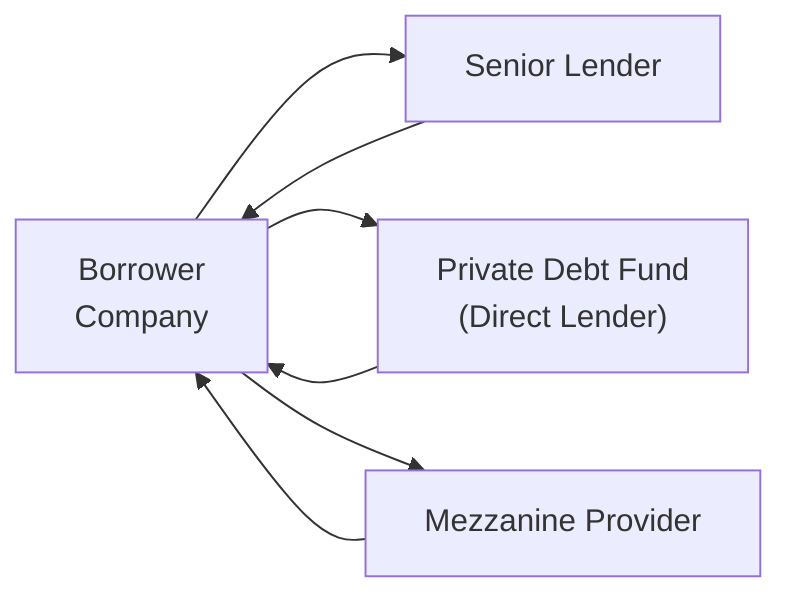

## Introduction

Private debt is one of those areas in finance that feels a bit mysterious at first—like, “Where are the official bond listings?”—because it’s not traded on public exchanges and often lacks the transparency we see in public markets. Yet, private debt is an increasingly significant channel for corporate financing worldwide. If you’ve ever had coffee with a friend who invests in a private credit fund or works for a direct lending firm, you might have found yourself nodding (but maybe not fully understanding all the details!). Let’s take a thorough look at private debt markets, how direct lending works, and why institutional investors, family offices, and even some sovereign wealth funds have found this space so compelling.

## Nature of Private Debt Versus Public Debt

Private debt is essentially any kind of corporate borrowing that’s negotiated outside the public bond markets. Instead of accessing capital through a public bond issuance where thousands of investors might buy a company’s bonds, a borrower accesses funds from a more limited group. This smaller group can be private debt funds, insurance companies, pension funds, or even family offices. These are typically more “relationship-driven” lenders, meaning they spend a lot of time getting to know borrowers and structuring deals. 

As a result, private debt carries a few distinguishing features:

• Less Liquidity: There’s no active secondary market, unlike publicly traded bonds.  
• Higher Yields: Investors demand higher returns for shouldering illiquidity and often higher credit risk.  
• Customized Covenants: Terms and conditions can be highly tailored, reflecting each borrower’s unique risk profile.  
• Lower Disclosure Requirements: Borrowers don’t typically publish extensive financial details like a public issuer might.  

In practice, private debt can range from small-scale loans for expansion of family businesses to multi-hundred-million-dollar unitranche facilities for middle-market companies. But the common thread, from the smallest to the biggest deals, is that it’s done quietly, behind closed doors, away from the public spotlight.

## Key Structures in Direct Lending

Investors who put their money into private debt can do so through various structures, including bilateral loan agreements, club deals (where a small group of lenders team up), or syndicated private placements. Let’s explore some of these structures in more detail.

### Unitranche Loans
A unitranche loan is a single lending facility that blends senior and junior debt into one rate. It’s kind of a one-stop shop for borrowers. Instead of having separate tranches with different rates (first lien, second lien, etc.), everything is wrapped up in one neat package. 

• Advantage for Borrowers: Simplifies negotiations and can accelerate funding.  
• Advantage for Lenders: Potentially higher returns given part of the loan is effectively subordinate, but structured within a single agreement.  

Though it sounds straightforward, behind the scenes, there can be complex “agreement among lenders” (AAL) documents that define how recoveries are shared if there’s a default. Sometimes, you get these “first-out/last-out” splits, where some lenders have priority on the collateral if things go south.

### Mezzanine Financing
Mezzanine financing sits between senior debt and equity in the capital structure. It’s riskier than senior secured debt but less risky than common equity—at least in theory. Mezzanine lenders often enhance their returns through:

• Warrants: The lender gets the option to buy shares at a certain price, sharing the company’s upside.  
• Convertible Features: The debt can convert to equity under predefined conditions.  

For the borrower, mezzanine financing can be a creative way to fund growth when bank financing isn’t sufficient. In one of my early experiences in direct lending, I remember seeing a mid-sized manufacturer in the U.S. rust belt that couldn’t tap public markets. They went with mezzanine financing, giving the lender some equity conversion rights. Once business took off, the lender reaped a nice additional return, and the owners got the liquidity they needed for expansion. That taught me how flexible and powerful these structures can be for both sides.

### Second-Lien Loans
A second-lien loan is secured by the same collateral as a first-lien loan, but it ranks behind the first-lien in order of payment. If the borrower defaults, the first-lien lender gets priority in the collateral claims. Because it’s riskier, second-lien loans typically come with higher yields. You’ll often see them in leveraged acquisitions or leveraged buyouts (LBOs) where the sponsor layers in different types of debt to finance the deal.

## Reasons for Growth in Private Debt

Why has private debt taken off in recent years? Let’s highlight a few drivers:

• Bank Regulatory Changes: Post-crisis regulations encouraged banks to reduce certain risk-weighted exposures, leaving non-bank lenders to step in.  
• Demand for Yield: Institutional investors are hungry for yield in a low-rate environment, so an illiquid instrument with a premium can be attractive.  
• Complexity Premium: Private lenders can structure deals creatively and capture additional yield where public markets might not be so flexible.  
• Relationship Focus: Some borrowers value a close relationship with lenders who understand their business model intimately and can offer more than just capital (e.g., strategic advice).  

## Risk and Return Characteristics

Private debt investing can offer juicy returns but isn’t for the faint of heart. It brings its own mix of risk factors:

• Credit Risk: Private borrowers might be smaller or less established. Cagey financials or unpredictable operating environments can complicate risk assessments.  
• Illiquidity: You can’t just sell a private loan overnight if you change your mind.  
• Operational Risk: The lender must perform thorough due diligence and ongoing monitoring, which can become quite expensive.  
• Limited Transparency: Minimal disclosures and less regulatory oversight can lead to big surprises.  

But the upside can be appealing. Illiquidity and complexity premiums mean yields can surpass comparable public high-yield bonds. Also, a well-managed private debt portfolio can exhibit lower mark-to-market volatility if valuations aren’t tracked daily.

## Underwriting and Due Diligence

Underwriting standards in private debt vary widely. You’ve got some large private debt funds that run thorough processes—akin to what banks do—while others might rely more on trust or a borrower’s track record. Typically, you’ll see:

• Extensive Financial Modeling: Lenders stress-test the borrower’s cash flows under various scenarios (e.g., economic downturn, supply chain disruptions).  
• Management Meetings and Site Visits: Ensures direct knowledge of the borrower’s operations.  
• Covenant Analysis: Lenders set financial or operational triggers. For instance, a total debt/EBITDA threshold or minimum coverage ratio.  
• Legal Structuring: Clear rights in case of default, protective covenants, and robust collateral packages.  

In practice, an experienced lender might also rely on personal judgments, like evaluating the management team’s skill set or the sponsor’s reputation. Information asymmetry is a big threat, so obtaining accurate data is paramount.

## Covenants and Covenant Headroom

Covenants in private debt can be more stringent than typical public bond covenants. They might require monthly financial reporting, prohibit certain acquisitions, or demand immediate notification of operational hiccups. The concept of “covenant headroom” basically means how much breathing room the borrower has before violating a covenant. This can be:

• Tight Covenant: Lender has greater control and can intervene early.  
• Loose Covenant: Might give the borrower more freedom but can expose the lender to greater risk.  

In direct lending, covenant headroom is carefully negotiated, especially when the borrower’s cash flows are uncertain or seasonal. If the borrower violates a covenant, the lender can demand additional collateral, higher interest, or sometimes more equity-like features.

## Relationship Lenders and Management Oversight

One unique element of private debt is how lenders often become deeply involved in the borrower’s strategy. This “relationship lender” approach can include:

• Board Representation: Some lenders negotiate a board seat or at least observer rights.  
• Management Rights Letter: Ensures access to critical data and the ability to attend board meetings.  
• Operational Guidance: Lenders may advise on acquisitions, expansions, or cost optimizations.  

I recall a scenario where a direct lending fund specialized in renewable energy projects. They would not only lend capital but also bring in external consultants to help optimize technology choices. For them, it wasn’t just about collecting interest; it was also about ensuring the borrower succeeded in building out clean energy infrastructure.

## Mezzanine Layer and Upside Potential

Mezzanine financing is where debt can morph into equity or at least produce equity-like returns. The flexible nature of mezz can benefit both parties: the lender can share in the company’s upside, and the borrower can secure growth capital without issuing new equity outright (which might dilute existing shareholders).

A typical mezzanine structure might revolve around:

• Payment-in-Kind (PIK) Interest: Borrower can pay interest in additional debt instead of cash.  
• Warrants: Lender earns a potential share of equity appreciation.  
• Subordination: Mezz sits below senior creditors in the capital structure, so it’s riskier.  

The trade-off is that, if everything goes well, mezz investors can get double-digit returns—sometimes well above senior lending rates. If things go poorly, however, they risk losing their principal, since senior lenders get first crack at any collateral.

## Monitoring and Exit Strategies

Monitoring is crucial for private lenders to ensure that the borrower stays in solid financial shape:

• Periodic Updates: Monthly or quarterly management accounts, operational updates, covenant checks.  
• Ongoing Site Visits: Verify the borrower’s claims and gather real-time insights.  
• Event-Driven Check-ins: If the borrower contemplates an acquisition or large capital expenditure, lenders want to weigh the financing implications.  

Exits from private debt investments typically come through contractual maturity, refinancing, or early repayment. Some private lenders might also sell their loan interests in a secondary market, but that market is far less liquid compared to public bonds, so it’s not a sure exit route.

## Example: Structuring a Direct Lending Deal

Below is a simple diagram illustrating how a direct lending transaction might be structured between a private debt fund, the borrower, and potential subordinate or senior lenders:



• The Borrower Company receives different layers of financing.  
• The Senior Lender holds a first-lien claim.  
• The Private Debt Fund might provide a second-lien or unitranche facility.  
• The Mezzanine Provider supplies a subordinate layering in the structure.  

In all cases, each lender has unique rights, collateral protections, and in some situations, potential equity conversion.

## Private Debt in Portfolios

From a portfolio-management perspective, investors are drawn to private debt for its diversification benefits and relatively stable yields (at least in theory, since prices aren’t marked to market frequently). However, it’s not without challenges:

• Limited Secondary Liquidity: Hard to rebalance quickly if investors need cash.  
• High Due Diligence Costs: Particularly for smaller deals in niche sectors.  
• Regulatory Differences: In times of stress, private debt holders might have complicated negotiations with other creditors.  

Nonetheless, private debt can serve as an attractive alternative for investors seeking higher returns while accepting illiquidity. Some large institutions allocate a portion of their alternatives budget to private credit, seeing it as complementary to more liquid fixed-income assets.

## Regulatory and Disclosure Nuances

Unlike public markets with filings like 10-Ks or 10-Qs (under U.S. SEC regulations, for instance), private debt generally has fewer mandatory disclosures. Lenders rely on private information, NDAs, and negotiated terms. This environment demands robust internal risk management:

• Borrower-Specific NDAs: Ensure confidentiality of financials.  
• Ongoing Reporting in Loan Agreements: Borrowers may have to deliver monthly or quarterly statements.  
• Security and Collateral Documentation: More reliant on thorough legal counsel and specialized contract provisions.

Across different regions, some countries might require minimal regulatory reporting, while others impose slightly stricter rules for private placements. In cross-border deals, complexities compound further.

## Modeling Cash Flows and IRR

Private debt often involves modeling the Internal Rate of Return (IRR) to evaluate potential returns that include both interest and possible equity kickers. A simple IRR formula can be expressed as:


\text{IRR} \quad \text{of} \quad \{\mathrm{C}_0, \mathrm{C}_1, ..., \mathrm{C}_n\} \quad \text{is} \quad \text{the} \quad r \quad \text{that solves:} 



\sum_{t=0}^{n} \frac{\mathrm{C}_t}{(1 + r)^t} = 0 


Where C₀ is typically the negative outflow (the investment) and Cₜ for t>0 are the inflows (interest, principal repayment, equity upside).

In practice, lenders incorporate scenario analysis. For instance, “What if EBITDA falls 20%?” or “What if the company experiences supply chain disruptions?” This kind of modeling can get quite intricate.

Below is a quick (and simplified) Python snippet to illustrate an IRR calculation for a single direct lending deal:

```python
import numpy as np

cash_flows = [-1000, 100, 200, 300, 400, 600]

def npv(rate, cashflows):
    return sum([cf / ((1+rate)**i) for i, cf in enumerate(cashflows)])

def irr(cashflows, guess=0.1):
    # Newton-Raphson or bisection can be used, but let's just do a simple search for clarity
    lower, upper = -1.0, 2.0
    for _ in range(1000):
        mid = (lower + upper) / 2
        val = npv(mid, cashflows)
        if abs(val) < 1e-6:
            return mid
        elif val > 0:
            lower = mid
        else:
            upper = mid
    return mid

calculated_irr = irr(cash_flows)
print(f"Estimated IRR: {calculated_irr*100:.2f}%")
```

In reality, direct lending deals often have fees, penalty interest, and complex repayment schedules. But the principle remains the same.

## Common Pitfalls and Best Practices

• Insufficient Due Diligence: Relying on incomplete borrower information can lead to nasty surprises.  
• Over-Leverage: Especially in a competitive environment, lenders might offer too generous terms.  
• Covenant-Lite Structures: Looser covenants demand stronger risk monitoring to avoid stealth deterioration in credit quality.  
• Sector Concentration: Lenders who put too many eggs in one industry basket can get blindsided by sector downturns.  

Best practices include robust diversification, thorough legal documentation, consistent monitoring, and alignment of interest between lender and borrower—sometimes achieved through equity participations or board observation rights.

## Real-World Example: Family-Owned Manufacturer

Picture a 70-year-old family-owned manufacturer of specialty chemicals. They want to upgrade facilities and expand into higher-value product lines but can’t raise enough from traditional banks. Public bond markets might be too expensive or complicated, especially if annual revenues are below a certain threshold and credit ratings aren’t in place.

Enter: a direct lending fund. After on-site visits, they structure a $50 million five-year unitranche loan with an 8% base rate plus a small equity kicker (2% of the borrower’s equity in warrants). The manufacturers get the capital they need, the lender secures a healthy yield plus potential upside, and because it’s not a public issuance, the time to close is quicker than a complicated public bond offering. Everybody’s happy—assuming the business plan pans out.

## Conclusion

Private debt markets, particularly direct lending, present an innovative and flexible mechanism for corporate financing—often providing mutually beneficial solutions for both borrowers and lenders. Borrowers can secure tailored funding arrangements, while lenders can target stable, higher-yield returns grounded in deeper relationships and stricter underwriting. Of course, with fewer disclosure requirements and the illiquidity factor, it’s not without risks. Diving into private debt effectively demands a strong due diligence process, careful structuring, robust monitoring, and a willingness to get intimately involved in a borrower’s day-to-day operations.

When approached carefully, private debt can serve as a valuable addition to a diversified portfolio, offering a unique balance of risk and return that is difficult to replicate in the public markets alone.

## References, Further Reading, and Links

• Preqin: “The Private Debt Market: Investor Perspectives” – for industry fundraising data and investor sentiment.  
• Deloitte / KPMG: “Direct Lending 101” – excellent primers on structuring and marketing private loans.  
• Private Credit Summit – conferences and white papers offering the latest trends.  
• CFA Institute’s Recommended Reading on Fixed Income – sections discussing alternative credit strategies.

---

## Test Your Knowledge: Private Debt Markets and Direct Lending Quiz



### Which of the following best characterizes private debt markets?
- [ ] They trade daily on public exchanges. 
- [x] They involve lending arrangements negotiated outside public markets. 
- [ ] They are legally prohibited in the U.S. 
- [ ] They provide lower relative yields than most public bonds. 

> **Explanation:** Private debt markets involve non-public lending structures with fewer disclosure requirements and typically higher yields compared to similar credit-rated public bonds.

### In a unitranche loan, which statement is generally true?
- [ ] It refers only to second-lien loans. 
- [x] It blends senior and junior financing into a single lending facility. 
- [ ] It provides 100% equity to borrowers. 
- [ ] It is strictly regulated by central banks worldwide. 

> **Explanation:** A unitranche loan consolidates senior and junior debt into a single agreement, often simplifying the borrower’s capital structure.

### Mezzanine debt is positioned:
- [ ] At the highest priority in the event of default. 
- [ ] Equal to first-lien loans. 
- [x] Below senior debt but above equity. 
- [ ] In parallel with common equity. 

> **Explanation:** Mezzanine debt is subordinate to senior claims but senior to common equity, often accompanied by warrants or convertible features to enhance returns.

### Which of the following is a typical benefit of mezzanine financing to the borrower?
- [x] Obtaining growth capital without issuing common equity outright. 
- [ ] Lower interest rates than senior secured loans. 
- [ ] Guaranteed public bond listing. 
- [ ] No due diligence requirements. 

> **Explanation:** Mezzanine capital can provide funding for growth while minimizing immediate equity dilution, though it carries higher interest costs relative to senior debt.

### A second-lien loan can best be described as:
- [x] A loan that is secured by the same collateral but ranks behind the first-lien lender. 
- [ ] Always unsecured and unsubordinated debt. 
- [x] A loan that may offer higher yields due to its lower claim priority. 
- [ ] A loan that merges senior and mezzanine debt into a single facility. 

> **Explanation:** Second-lien loans share collateral with the first-lien lenders but have a lower priority on recovery, leading to higher yields to compensate for the added risk.

### Why might an investor be attracted to private debt?
- [x] Potentially higher yields than public bonds. 
- [ ] High daily liquidity. 
- [ ] Strict disclosure standards equivalent to public markets. 
- [ ] Government guarantees in most jurisdictions. 

> **Explanation:** Private debt typically offers higher returns due to illiquidity and complexity premiums, though it lacks the liquidity and transparency found in public markets.

### Covenant headroom primarily refers to:
- [x] The difference between actual financial metrics and covenant thresholds. 
- [ ] A type of interest rate cap for floating-rate loans. 
- [x] A measure of how closely a borrower is to breaching financial covenants. 
- [ ] A universal agreement to waive loan covenants in normal times. 

> **Explanation:** Covenant headroom is the buffer that a borrower has before triggering a loan covenant violation. Tighter covenants mean less headroom.

### Which type of lender arrangement is most common in private debt deals?
- [x] Bilateral or small club deals with relationship-driven agreements. 
- [ ] Mass-market offerings on the stock exchange. 
- [ ] Daily transparent auctions. 
- [ ] Anonymous block trades. 

> **Explanation:** Private debt is typically negotiated between a borrower and a small group of relationship lenders, rather than undergoing broad public issuance.

### An advantage of mezzanine debt for the lender is:
- [x] Potential upside participation via warrants. 
- [ ] Complete insulation from default risk. 
- [ ] Always minimal due diligence requirements. 
- [ ] Guaranteed senior lien on collateral. 

> **Explanation:** Mezzanine lenders often receive warrants or other equity kickers, providing them with the opportunity for equity-like returns if the borrower’s business thrives.

### In a private debt structure, is it true that every business must publicly disclose all loan terms?
- [x] True
- [ ] False

> **Explanation:** While some jurisdictions may demand minimal filings, generally private debt arrangements are not subject to the same extensive public disclosure requirements as publicly traded bonds. However, in certain cases (e.g., large syndicated deals), some aspects may still be publicly available.


