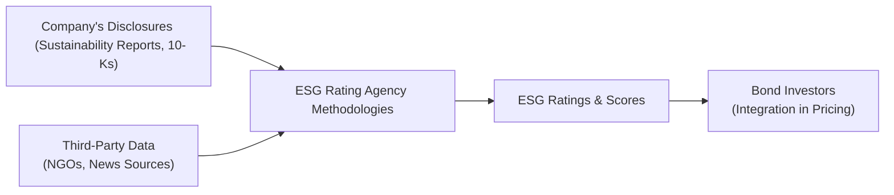

## Introduction and Context

So, we’ve heard a lot about ESG—Environmental, Social, and Governance—when it comes to stocks, right? But here’s the interesting part: ESG factors can be critical for bond investors, too. And if you’ve been following trends in credit markets, you’ll notice they’ve become a near household name in the corporate bond world. The reason is simple: ESG is about gauging non-financial (yet material) risks like carbon emissions, labor standards, governance structures, and so forth, which can significantly impact an issuer’s creditworthiness. Maybe you’ve even joked with a friend about “green finance” or “greenwashing,” but in all seriousness, these topics are now central to modern bond investing.

In this section, we’ll pin down the practical implications of ESG ratings for corporate bonds—covering everything from rating methodologies to regulatory frameworks, from greenwashing pitfalls to the future outlook. We’ll also talk about how bond investors incorporate ESG data in analyzing default probabilities and yields, how corporations issue green or sustainability-linked bonds, and how rating discrepancies might require some detective work.

## Why ESG Ratings Matter in Corporate Debt Markets

### Complementing Traditional Credit Analysis
When we talk about bond investing, step one is always analyzing an issuer’s capacity and willingness to repay debt. Historically, that capacity was measured with classic metrics like leverage ratios, interest coverage, and so on. But ESG factors add another layer—think climate risks, workforce turnover, data security breaches, or questionable board structures. Any of these can materialize into regulatory fines, reputational damage, or even major operational disruptions.

Some large companies have faced intense public scrutiny over environmental missteps, culminating in lawsuits or big cleanup costs that hammered their ability to finance operations cheaply. ESG ratings, ideally, help you see these storm clouds before they trigger rating downgrades and higher credit spreads. In other words, you’re not just crunching numbers from last quarter’s income statement—you’re trying to see hidden risks that might pop up next year or the year after.

### Relationship with Default Risk and Spread
There’s also mounting evidence that firms with strong ESG profiles tend to enjoy somewhat tighter spreads—often because investors are more confident in the management of non-financial risks. It doesn’t mean that poor ESG performers automatically default, but let’s just say the ability to access capital markets cheaply can be hindered if an issuer’s environmental controversies or weak governance come to light. 

Now, we shouldn’t jump to the conclusion that good ESG always equals lower risk. But if a company aligns its operations with recognized sustainability practices or demonstrates robust governance, that may reduce the surprise factor of potential liabilities and protect intangible assets like brand value. And intangible assets can be a huge piece of the puzzle, especially if the firm is consumer-facing or heavily reliant on brand reputation.

## ESG Ratings: Methodologies and Discrepancies

### Diverse Approaches
Rating agencies like MSCI ESG, Sustainalytics, S&P Global ESG, and a host of niche providers each have their own approach for evaluating environmental, social, and governance factors. They weigh a range of data: carbon footprints, board diversity metrics, supply chain audits, controversies, philanthropic activities, and more. The challenge for investors is that two agencies often arrive at different ratings for the exact same company. One might focus more on governance structures, another might place heavier emphasis on climate transition strategies.

### Blending Data Sources
Given such discrepancies, many bond analysts and portfolio managers blend multiple ESG ratings or conduct their own proprietary analysis. They might also consult direct disclosures from the company, cross-referencing them with third-party data sets or media reports. This mosaic approach aims to reduce blind spots: if one rating misses a red flag (like heavy water usage in a drought region), hopefully another rating picks it up.

### A Quick Visual

Below is a simple diagram illustrating the variety of inputs and outputs in an ESG rating ecosystem:

Think of it like a funnel: the company’s own disclosures and external data feed into various ESG methodologies. Then these ratings reach bond investors, who use them in pricing and credit decision-making.

## Bond Issuance with ESG Focus

### Green Bonds and Sustainability-Linked Bonds
You’ve probably heard of “green bonds,” which funnel proceeds into environmentally beneficial projects—such as renewable energy, pollution control, or climate adaptation measures. Sustainability-linked bonds (SLBs) are a little different: the coupon might step up if the issuer fails to meet pre-defined ESG targets, like cutting greenhouse gas emissions by a certain percentage. In other words, the cost of capital can rise if they miss their goals. 

This approach aligns the issuer’s financial incentives with achieving ESG outcomes. If a firm truly believes in its decarbonization trajectory (and wants to prove it to the market), it can tie its interest payments to these targets. From the investor perspective, it’s a measurable way to track whether the company is delivering the goods on ESG commitments—there’s “skin in the game.”

### ICMA’s Green Bond Principles
Open any conversation about ESG-labeled debt, and you’ll bump into the International Capital Market Association (ICMA) Green Bond Principles. They outline recommended guidelines: for instance, the issuer must clearly articulate how the proceeds will be used, how projects will be evaluated, and commit to regular reporting. The aim: promote transparency and standardization. A second-party opinion (SPO) from an external reviewer might also confirm whether the framework is credible. 

Anyway, the takeaway is that these standards are not just feel-good suggestions. They’re fast becoming an industry staple for credibility. And in an era where dedicated sustainable investing funds hold billions in assets, that credibility can be rewarded with robust demand, translating into narrower yield spreads at issuance.

## Avoiding Greenwashing

### What Greenwashing Looks Like
Greenwashing occurs when an issuer overstates or misrepresents the ESG benefits of its activities—maybe labeling a bond as “green” but using the proceeds for projects that only nominally (or not at all) reduce environmental harm. In the worst cases, investors are led to believe they’re funding something beneficial, but the real impact is marginal.

We all chuckle about marketing hype, but for fixed-income investors, it’s no laughing matter. If regulators or media uncover that an issuer is stretching the truth, reputational risk skyrockets, and bond prices can take a hit. Greenwashing can also undermine the credibility of the broader ESG debt market, making it tougher for legitimate issuers to gain traction.

### Mitigation Tactics
At the portfolio level, thorough due diligence is essential. This often includes:

• Checking if there’s a robust set of key performance indicators (KPIs) tied to the use of proceeds.  
• Engaging external reviewers or second-party opinion providers.  
• Monitoring ongoing reporting to ensure funds are spent as promised.  

We’re increasingly seeing corporate bond investors actively track the progress of green or social projects. It’s not just a “buy and forget” approach; it’s a continuous monitoring process.

## Pushing for Better ESG Practices

### Lender Influence
As an investor—or as part of a large lending institution—your power can sometimes influence corporate behavior. Bondholders have historically had less direct influence than equity shareholders, but that’s beginning to shift. Many institutional players now engage with issuers about board diversity, carbon footprint disclosures, or better supply chain monitoring. 

One reason? Over the long haul, issuers that address these topics can reduce the probability of credit events. Let’s say a company is exposed to climate transition risks. By encouraging them to adopt net-zero targets or new governance frameworks, you’re effectively reducing potential vulnerabilities—and maybe improving the risk/return profile of your bond holdings.

### Engagement and Covenant Adjustments
While typical bond covenants revolve around financial metrics, some newly minted ESG-themed issuances add performance triggers based on certain social or environmental criteria. If the issuer fails, the covenant might require additional reporting or even an increase in coupon payments. Investors can also become more active in negotiations, insisting that any ESG claims be verified or that projects meet recognized standards, ensuring alignment with the original bond framework.

## Real-World Examples and Case Studies

• Green Auto Manufacturer: Consider a hypothetical auto manufacturer issuing a green bond to fund the development of electric vehicles (EVs). If the company has robust ESG ratings—highlighting reduced carbon emissions, safer labor practices, and a well-structured board—investors might accept a lower yield compared to a traditional bond by the same issuer, reflecting the market’s enthusiasm for green initiatives.  

• Sustainability-Linked Retail Chain: Another firm might issue an SLB where the coupon steps up by 25 basis points if they fail to cut their energy consumption in half within three years. This structure signals management’s commitment to real performance improvements. Investors in this scenario keep track of the chain’s annual production and energy usage data to confirm progress.  

• Controversy Scenario: On the flip side, there have been cases where companies issue sustainability-labeled debt but promptly face controversies—like environmental fines or labor disputes. Bond spreads can widen if the market perceives the ESG label as merely surface-level. This scenario underscores the importance of verifying claims and performing thorough due diligence.  

## Challenges and Potential Pitfalls

### Fragmented Rating Systems
One pitfall is the sheer number of ESG scoring frameworks. A company might have an “A” from one provider and a “C+” from another. If you’re not careful, you can draw the wrong conclusion about a company’s overall sustainability performance.  

### Data Gaps and Quality Issues
Another biggie is incomplete or poor-quality data. Smaller issuers in emerging markets may not have the resources or consistent reporting frameworks that large multinational issuers do. This can leave big blind spots.  

### Regulatory Evolution
Regulators are stepping up their involvement, which is largely positive but can create confusion if there’s no global uniformity. For instance, the EU’s Sustainable Finance Disclosure Regulation imposes rules on asset managers regarding Principal Adverse Impact (PAI) disclosures. Meanwhile, other jurisdictions have their own guidelines. This patchwork of regulations means bond investors must stay current with multiple frameworks.  

## Integrating ESG into Credit Analysis

### Step-by-Step Process

1. Preliminary Screening: Review an issuer’s business model, sectoral ESG norms, and any known controversies.
2. Quantitative Analysis: Factor in revenue, earnings, and leverage metrics. Then overlay them with ESG data points (e.g., carbon intensity compared to sector peers).
3. Qualitative Assessment: Check governance practices—like board independence—and assess the issuer’s track record on labor relations or community impact.
4. Adjust Spreads and Ratings: Incorporate the ESG evaluation into your fundamental credit analysis. This might result in a slightly lower or higher fair yield than a purely traditional analysis would suggest.
5. Ongoing Monitoring: Track changes in ESG-related controversies or improvements. If the issuer’s ESG rating is cut, you might see an uptick in yield spreads or a rating agency reevaluation.

### Example Calculation (Simplified)
Here’s a fictitious scenario:

• Traditional fair yield for a certain 5-year corporate bond: 3.50%.  
• After factoring in aggressive carbon reduction plans and an independent board structure, you might reduce your internal risk premium by 20 bps, implying a fair yield of 3.30%.  
• Conversely, if the company had high controversy risk or known environmental violations, you might add 50 bps, raising your fair yield to 4.00%.  

Yes, this is a simplified demonstration—real-world analysis involves more granular detail—but it highlights how ESG signals can shift your yield targets.

## Future Outlook for ESG and Corporate Bonds

### Standardization on the Horizon
There’s a strong push for standardized disclosures across jurisdictions. Over time, frameworks like TCFD (Task Force on Climate-related Financial Disclosures) and IFRS sustainability standards may become universal yardsticks. This improved consistency should help reduce confusion.

### Technology and Data Analytics
Providers increasingly use big data, AI, and machine learning to parse thousands of data points—like satellite imagery, social media sentiment, and shipping records. This might sound futuristic, but it’s happening now, and it intensifies as investors demand more precise ESG insights.

### Expanding Product Ecosystem
We’re seeing the universe of GSSS (Green, Social, Sustainability, Sustainability-Linked) bonds expand rapidly into new sectors and regions. Emerging market issuers, for instance, can tap global investor appetite by issuing local-currency green or social bonds. The growth potential is huge, and we can expect more creative structures bridging ESG objectives with corporate financing needs.

## Final Exam Tips

• Understand the Core Concepts: Make sure you grasp how ESG factors complement traditional credit risk analysis and why they matter for bond spreads.  
• Distinguish Green Bonds from SLBs: Know that green bonds use proceeds for environmental projects, while sustainability-linked bonds tie coupon/payment terms to ESG performance metrics.  
• Watch for Greenwashing: The CFA exam might present scenarios where an issuer’s ESG claims are dubious. Tie the concept back to potential credit and reputational risks.  
• Methodological Differences: You might be asked about discrepancies between ESG rating providers. Remember that each provider has unique weighting factors.  
• Practice Scenario Analysis: The exam could test how ESG controversies affect an issuer’s spreads under different circumstances.  
• Time Management: For item set and constructed-response questions, focus on clarity. If asked to integrate ESG into credit analysis, structure your answer logically—qualitative factors, quantitative factors, final yield/spread adjustments.

## References and Further Reading

• ICMA Green Bond Principles:  
  https://www.icmagroup.org/sustainable-finance/  

• Sustainalytics, MSCI ESG, and S&P Global ESG for widely used rating methodologies.  

• G20 Sustainable Finance Working Group reports on ESG regulation and disclosure standards.  

• CFA Institute: Official Publications on ESG Integration and Fixed-Income Portfolio Management.  

• IFRS Foundation: Standards and Updates on Sustainability Disclosures.  

• For a deeper dive into advanced ESG metrics: TCFD (Task Force on Climate-related Financial Disclosures) guidelines.

--------------------------------------------------------------------------------

## Test Your Knowledge: Trends in ESG Ratings and Corporate Bond Implications



### Which of the following best describes how ESG factors influence corporate bond default risk?

- [ ] They prevent an issuer from accruing any additional debt.  
- [x] They can expose an issuer to non-financial risks that may affect its ability to repay.  
- [ ] They have no significant impact on bond pricing.  
- [ ] They ensure that an issuer qualifies for a lower tax rate.  

> **Explanation:** ESG considerations reveal potential non-financial risks (like climate or reputational risks) that could weaken an issuer’s balance sheet and raise default probabilities.

### An SLB (Sustainability-Linked Bond) typically has which unique feature?

- [ ] The coupon rate is fixed regardless of ESG performance.  
- [ ] It only funds renewable energy projects.  
- [x] Its coupon may increase if the issuer fails to meet specific ESG targets.  
- [ ] It carries no credit risk because it’s underwritten by an NGO.  

> **Explanation:** Sustainability-Linked Bonds are designed so that the issuer’s coupon might step up (or be adjusted) if predefined sustainability or ESG performance metrics are not achieved.

### When bond investors incorporate multiple ESG rating providers in their analysis, they do so primarily to:

- [x] Mitigate methodological biases and discrepancies in individual ESG ratings.  
- [ ] Ensure they avoid an issuer’s convertible bonds.  
- [ ] Automatically hedge currency exposure.  
- [ ] Invest only in AAA-rated corporate bonds.  

> **Explanation:** Different ESG rating providers can weigh factors differently, so combining multiple data sources helps reduce inaccuracies and biases.

### A key motivation behind issuing a green bond is:

- [ ] To transfer existing debt to the equity market.  
- [ ] To completely eliminate the issuer’s carbon footprint in one year.  
- [x] To raise capital specifically for environmentally beneficial projects under recognized frameworks.  
- [ ] To receive an immediate credit rating upgrade.  

> **Explanation:** Green bonds finance projects such as renewable energy and pollution prevention. Their activities must align with recognized frameworks like ICMA’s Green Bond Principles.

### Which of the following strategies helps investors avoid greenwashing?

- [x] Requiring independent second-party opinions and ongoing reporting.  
- [x] Reviewing how proceeds are spent and verifying actual environmental impact data.  
- [ ] Accepting the issuer’s claims without verification.  
- [ ] Automatically excluding all green-labeled bonds.  

> **Explanation:** Investors should scrutinize the use of proceeds, monitor progress, and, when possible, seek external reviews to confirm that sustainability claims are valid.

### In analyzing ESG data, one critical challenge is:

- [x] Varying methodologies and data inconsistencies across rating providers.  
- [ ] Absolute uniformity in ratings for all companies.  
- [ ] The impossibility of integrating ESG measures into credit spreads.  
- [ ] No data available on environmental factors.  

> **Explanation:** One major limitation is inconsistent ratings among providers. Many investors use multiple sources or proprietary methods to overcome these challenges.

### When a corporation’s ESG profile is considered strong:

- [x] It may enjoy tighter credit spreads due to lower perceived risk.  
- [ ] Credit spreads are always higher.  
- [x] It could attract dedicated sustainable investing capital.  
- [ ] It cannot issue longer-dated bonds.  

> **Explanation:** Strong ESG performance can translate into better market sentiment and dedicated investor demand, which often leads to tighter spreads and improved funding conditions. Also, many sustainability-focused investors are eager to purchase ESG-compliant debt.

### A second-party opinion (SPO) in the green bond market:

- [x] Independently reviews and verifies the issuer’s green bond framework.  
- [ ] Guarantees the bond will never default.  
- [ ] Ensures that the bond will have a higher yield than non-green bonds.  
- [ ] Is always provided by the issuer’s in-house legal team.  

> **Explanation:** SPOs are rendered by specialized consultancies to assess whether the bond’s framework genuinely aligns with recognized green or social principles—helping to mitigate greenwashing.

### An SLB that fails to meet its sustainability targets most likely:

- [x] Requires the issuer to pay an increased coupon.  
- [ ] Automatically defaults on principal.  
- [ ] Becomes ineligible for listing on major exchanges.  
- [ ] Decreases its coupon to reflect poor performance.  

> **Explanation:** With SLBs, missing the sustainability targets typically triggers a step-up in the coupon, penalizing the issuer financially for not achieving the stated ESG objectives.

### The statement “ESG integration means always prioritizing environmental factors above all else” is:

- [x] True  
- [ ] False  

> **Explanation:** Actually, this statement is false if taken literally. ESG integration balances environmental, social, and governance factors based on overall materiality, not just environmental concerns.  


