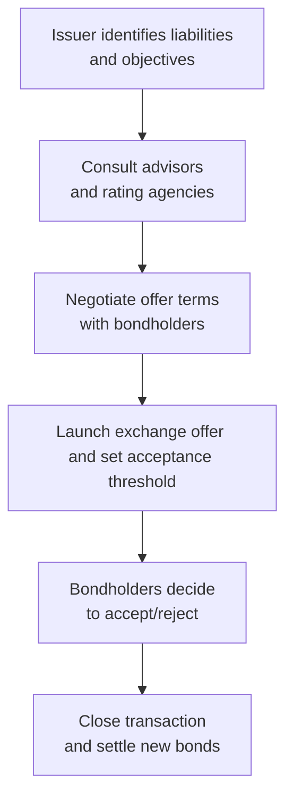

## Introduction

If you’ve ever seen a friend reorganize their home mortgage after a rough financial patch or simply to nab a better rate, congratulations—you’ve basically witnessed a small-scale version of what corporations do all the time with their bonds. And yes, it can get a lot more complex and a bit more exciting (or nerve-racking, depending on your perspective). Enter corporate liability management exercises, which revolve around exchange offers and consent solicitations. These mechanisms help issuers, especially those under stress or looking to optimize finances, reshape existing debt terms to be more favorable.

Below, we’ll dive into the nitty gritty, showing you the “why” and “how” behind each approach, highlighting potential pitfalls, real-world applications, and exam-relevant details. By the end, you’ll have a clear sense of why corporate liability management is crucial for both issuers and investors, and how it fits into the broader fixed-income picture.

## Definition and Rationale

Liability management exercises are issuer-driven strategies aiming to modify the terms under which corporate debt obligations exist. Let’s say your company has a large chunk of high-coupon bonds coming due next year. With interest rates dropping, or new projects soaking up cash, you might prefer to push that maturity further into the future or lower your interest expenses. That’s basically the impetus for:

• Exchange Offers: Replacing an existing bond with a new instrument (maybe new bonds, equity, or a combination).  
• Consent Solicitations: Requesting bondholders to approve changes to specific bond covenants or structural elements (often involving a consent fee).

Because bond issuance and redemption can get pricey (think underwriting fees, legal costs, and rating implications), many issuers prefer to tweak what they already have outstanding rather than starting from scratch with a brand-new bond.

## Exchange Offers

Let’s start with exchange offers—arguably the more dramatic of the two. When an issuer launches an exchange offer, it invites bondholders to swap their current bonds for new ones or, sometimes, for shares of equity. The new terms might include:

• Reduced coupon obligations.  
• Extended maturities.  
• Adjusted collateral or security features.  
• Partial cash redemptions combined with new bond issuance.  

### Motivations for Exchange Offers

1. Reducing Interest Costs  
   If the market’s interest-rate environment has improved, or if the issuer’s own credit quality is stronger, an exchange can lower the overall coupon. It’s a bit like refinancing a mortgage to reduce monthly payments.

2. Avoiding Imminent Default  
   More defensive exchange offers happen when an issuer sees a big payment looming but lacks liquidity. They might swap maturing bonds with new ones that extend the maturity date, buying time to stabilize cash flow.

3. Restructuring Under Distress  
   In severe cases—think distressed exchanges—the issuer is close to or in default. The exchange might propose a haircut on principal or coupon, offering bondholders less value than originally owed.

### Process Overview

Below is a simplified flowchart depicting an exchange offer timeline:

It sounds straightforward, right? But in practice, each arrow can involve complex negotiations, legal documentation, and a bit of behind-the-scenes drama. Exchange offers often come with acceptance thresholds—meaning if a minimum percentage of bondholders doesn’t agree, the deal could fall apart or require reworking. Some global bonds include collective action clauses (CACs), which bind all bondholders to the majority decision once a certain threshold is reached, reducing the power of holdouts.

### Partial Redemptions

You might also see partial redemptions paired with an exchange. Picture this: an issuer offers to repurchase (for cash) a certain percentage of outstanding bonds while simultaneously providing an option to exchange the rest into new instruments. This strategy can be a crowd-pleaser if some bondholders want immediate liquidity while others prefer to stay invested.

## Consent Solicitations

Consent solicitations are arguably less dramatic but can still be pivotal. Imagine an issuer wanting to relax a negative covenant that restricts additional borrowings or asset sales. Or maybe they need to remove an event of default trigger. To do this, the issuer circulates a document outlining the proposed changes and seeks bondholders’ approval. If enough bondholders consent (and the transaction is executed properly), the covenant changes are binding on all bondholders—sometimes courtesy of CACs or specific trust deed provisions.

### Consent Fees and Coercive Exchanges

Issuers might sweeten the deal with a consent fee, paid to those who say “yes.” Some deals get structured to penalize non-participants—a phenomenon dubbed a “coercive exchange.” For instance, the issuer may say, “If you accept, you get this new bond plus a fee. If you don’t, you keep the old bond, which will soon rank behind the new instrument we’re issuing or will lose certain protective covenants.” That’s one way of encouraging bondholder participation.

### Use Cases and Benefits

1. **Covenant Relief**  
   Particularly useful when an issuer’s strategic plans (like an acquisition) conflict with restrictive covenants.

2. **Regulatory Adjustments**  
   If new regulations or credit rating guidelines necessitate changes in bond documentation, consent solicitations can provide a more efficient route than paying off the bond entirely.

3. **Credit Rating Maintenance**  
   Rating agencies might require certain changes to avoid a downgrade if the economy or the issuer’s balance sheet climate shifts rapidly.

## Key Investor Considerations

From an investor’s perspective, consenting to changes or entering an exchange can feel risky. Are you really better off giving up your old bonds for new terms? Important factors include:

• Yield: Does the new yield compensate for potential added risk or the extended maturity?  
• Risk Profile: Are you moving from a senior bond to a subordinated note, or are you taking on equity risk?  
• Collateral Changes: Are you getting more or less security for the obligations?  
• Tax Consequences: In some jurisdictions, exchanging bonds can trigger capital gains taxes or alter tax liabilities.  
• Potential for Distressed Exchange: If the offer is considered “distressed,” rating agencies might see it as a near-default scenario, which could have ramifications for the value of both old and new bonds.

Sometimes, bondholders bring in restructuring advisors to do a thorough, line-by-line comparison of old vs. new terms—including all those subtle legal bells and whistles that might hide landmines.

## Restructuring Advisors and Minimum Acceptance

Often, an issuer will announce a minimum acceptance threshold—say, 80% of bondholders—for the transaction to proceed. In other words, if enough participants don’t say “yes,” the issuer might withdraw the offer or revise the terms. Restructuring advisors come in handy here, orchestrating communications with bondholders and building consensus. It’s kind of like being the wedding planner for a big ceremony: they try to make sure everything is in place, from the legal disclaimers to the post-transaction capital structure.

## Collective Action Clauses (CACs)

CACs often apply to sovereign or global corporate bonds denominated in certain currencies, letting a supermajority of holders bind everyone. This can really deflate tensions created by holdout bondholders—those who refuse the exchange, hoping for a better deal or to push for a full payout. With CACs, if you can get the threshold of consenting holders, the objecting minority is forced to accept the new terms.

## Regulatory and Accounting Aspects

By now you might be wondering, “Wait, how do we deal with IFRS or US GAAP treatment for these deals?” Under IFRS (International Financial Reporting Standards), a substantial modification in terms can lead to de-recognition of the old liability and recognition of a new one. US GAAP has parallel rules: if the change is considered “substantially different” (based on quantitative tests of cash flows and qualitative factors), it’s accounted for as an extinguishment of debt and the new instrument is recognized at its fair value. Make sure to pay attention to each framework’s thresholds because swings in recognized gain or loss on the statement of comprehensive income can be significant.

On the regulatory side, in the United States, tender offers and exchange offers must comply with the Securities and Exchange Commission (SEC) guidelines, including specific disclosures and timelines. In the European Union (EU), prospectus requirements outline what must be disclosed to bondholders, especially when new securities are involved.

## Credit Rating Implications

Rating agencies (Moody’s, S&P, Fitch, etc.) usually zero in on whether a proposed exchange is voluntary or distressed. If the latter, the rating might tumble into junk territory, or the entire transaction might be labeled as a “selective default.” It’s not always gloom and doom, though—sometimes agencies see an exchange as a proactive measure that improves the issuer’s financial position, which can be a rating-positive event in the longer term.

## Practical Example: Opportunistic vs. Defensive Exchanges

• Opportunistic Exchange: A well-rated tech firm might notice that interest rates are down 200 basis points from when it first issued its 10-year notes. The firm’s finances are strong, so it offers to replace the old bonds with new notes carrying a lower coupon. Investors, enticed by the stable credit profile (and maybe a modest consent fee), sign up. Result: the issuer trims interest expenses, while bondholders might be okay with a slightly lower rate because the new bonds retain a good rating and an acceptable yield spread.

• Defensive Exchange: A retailer under stress sees its debt coming due soon but lacks the cash to pay it off, nor can it tap new markets easily. It proposes a distressed exchange, offering new bonds with a lower coupon and pushing out maturity by three more years. Bondholders weigh the risk of rejecting the deal (potentially pushing the company into default) against the improved chance of partial recovery if they play along. They might hold their noses and accept the “haircut,” seeing it as the lesser of two evils.

## Best Practices and Common Pitfalls

When an issuer undertakes a liability management exercise, a few approaches can help ensure success:

• Transparent Communication: The clearer the rationale and the benefits for bondholders, the better. Muddled messaging can spark panic and lead to legal disputes.  
• Fair Incentives: While “coercive” exchanges can strong-arm bondholders into participating, they also risk reputational harm and possible legal challenges. A balanced approach fosters better relationships.  
• Adequate Legal and Financial Counsel: This process can be complicated—for example, figuring out cross-default provisions, verifying compliance with listing rules if the bonds trade on multiple exchanges, and ensuring local regulations are satisfied.  
• Rating Agency Dialogue: Early engagement with ratings analysts helps gauge potential rating moves. Surprising them at the last minute rarely ends well.  

Meanwhile, pitfalls include:

• Overly Complicated Structuring: Complex deals might lead to confusion or insufficient acceptance rates.  
• Insufficient Participation: Without meeting threshold requirements, an exchange could fail, leaving the issuer worse off.  
• Misjudged Timing: Launching a big exchange right before major macro data releases or during market turbulence can hamper success.

## Personal Reflection

I remember back when I first encountered an exchange offer as an analyst—yes, it was a messy scenario. The issuer was trying to combine a partial redemption (to please bondholders who wanted out) with new subordinated notes, all while sweetening the pot through a small consent fee. Trying to parse what was “fair value” for those new notes took me down a rabbit hole of comparing them with the old bonds’ yield, adjusting for changed covenants, and factoring in the looming risk of default. It was intense, but it showcased exactly why these exercises can be a lifeline (or, occasionally, a last gasp) for a company’s capital structure.

## Conclusion and Exam Tips

Corporate liability management exercises—exchange offers and consent solicitations—are crucial for any investor or issuer navigating the fixed-income world. While they might appear intricate, the rationale is straightforward: refine or overhaul existing debt terms to align with current strategic, financial, or market realities.

For CFA® exam preparation, pay attention to:

• Key differences between exchange offers and consent solicitations.  
• The interplay of covenant modifications, consent fees, and holdout creditors.  
• Recognition of distressed exchanges and rating agency implications.  
• IFRS vs. US GAAP in accounting for significant modifications of debt.  
• Collective action clauses (CACs) and their role in binding minority holders.

Understanding these mechanics not only helps on the exam but also clarifies how real-world credit markets operate under pressure.  

## References and Further Reading

• IMF Working Papers: “Restructuring Debt in Distressed Exchanges: Lessons from Market Practices.”  
• J.P. Morgan or Citigroup Liability Management Guides (available on their investor relations websites).  
• SEC “Tender Offer Rules”: https://www.sec.gov  

---

## Test Your Knowledge: Corporate Liability Management Exercises



### Which of the following best describes an exchange offer?

- [ ] A proposal to amend covenants within the same bond issue, without offering new instruments.  
- [x] An invitation by the issuer to replace existing bonds with new securities, often with altered terms.  
- [ ] A procedure where bondholders must surrender their bonds at par value for immediate payment.  
- [ ] A technical rating downgrade process initiated by credit agencies.  

> **Explanation:** An exchange offer typically involves swapping existing bonds for new ones. It can affect coupon, maturity, and occasionally seniority or collateral.  

### Which scenario best fits a “defensive” exchange offer?

- [ ] A well-capitalized issuer replacing existing debt with brand-new, higher-coupon notes to attract more investors.  
- [x] A retailer under financial pressure offering to extend bond maturities and lower coupon payments to avoid default.  
- [ ] A software firm voluntarily prepaying bonds ahead of schedule to boost its credit rating.  
- [ ] A central bank stepping in to regulate a government bond yield.  

> **Explanation:** Defensive exchange offers typically arise when an issuer faces potential default and must restructure terms to improve liquidity or extend maturities.  

### What is the main purpose of a consent solicitation?

- [x] To seek bondholders’ approval for specific amendments to bond covenants or existing loan agreements.  
- [ ] To compel bondholders to convert their debt into equity.  
- [ ] To issue brand-new bonds at a higher interest rate to replace older ones.  
- [ ] To settle a bond’s coupon obligations before maturity.  

> **Explanation:** Consent solicitations let the issuer propose alterations to terms, such as covenant amendments, requiring bondholder consent.  

### How does a collective action clause (CAC) affect holdout bondholders?

- [ ] It prevents holdout bondholders from transferring their bonds to other parties.  
- [ ] It automatically lowers the holdout bondholders’ coupon if they disagree with the majority.  
- [x] It can bind minority bondholders to modifications approved by a supermajority of bondholders.  
- [ ] It ensures holdout bondholders receive enhanced protections under forced restructurings.  

> **Explanation:** CACs allow a supermajority of bondholders to agree on new terms that become binding on all, reducing the power of holdouts.  

### Which of the following is generally considered a “distressed exchange”?

- [ ] Any change in coupon payment initiated by an issuer with a high credit rating.  
- [x] An exchange that offers bondholders significantly less value than originally promised, often near default.  
- [ ] A routine refinancing exercise for a well-capitalized issuer at a marginal decrease in coupon.  
- [ ] An exchange in which bondholders gain a premium over par value.  

> **Explanation:** A distressed exchange happens when an issuer close to default offers terms that provide less value than the original promise, often to stave off bankruptcy.  

### In the context of liability management, which factor is most likely to trigger a “coercive exchange”?

- [x] Issuer structuring the deal so non-participants remain in an inferior position or lose protective covenants.  
- [ ] A significant reduction in global interest rates for investment-grade issuers.  
- [ ] Overcollateralization of bonds through additional assets.  
- [ ] Strict tax regulations that require early bond redemption.  

> **Explanation:** A coercive exchange means the issuer creates incentives (or penalties) that pressure bondholders to accept new terms.  

### If the issuer wants to execute an exchange offer but also provide bondholders partial cash-out, what structure might they employ?

- [ ] Total redemption with no new bond issuance.  
- [x] A hybrid approach that redeems some portion with cash while replacing the rest with a new bond.  
- [ ] A vanilla consent solicitation with no payment to bondholders.  
- [ ] A forced equity conversion at maturity.  

> **Explanation:** A partial redemption plus new bond issuance is a hybrid approach, letting some bondholders exit for cash while others accept new terms.  

### Which of the following is a direct motivation for launching a consent fee?

- [ ] Align bond covenants solely with IFRS standards.  
- [ x] Provide compensation to bondholders for agreeing to modify bond terms.  
- [ ] Ensure bond ratings remain at investment-grade levels.  
- [ ] Coerce bondholders into defaulting on outstanding obligations.  

> **Explanation:** A consent fee is usually offered as an incentive or compensation to bondholders for agreeing to modify covenants or other bond terms.  

### Under IFRS, when must the issuer generally derecognize the old liability and recognize a new one in an exchange?

- [x] When the old debt’s cash flows or terms are substantially different from the new ones.  
- [ ] Whenever the issuer obtains written consent from 51% of bondholders.  
- [ ] Only if the new coupon is at least 200 basis points lower.  
- [ ] If the bonds are traded on a regulated exchange.  

> **Explanation:** IFRS requires derecognition if the new terms differ substantially from the old in either quantitative or qualitative ways.  

### True or False: A distressed exchange can sometimes be treated as a selective default by rating agencies.

- [x] True  
- [ ] False  

> **Explanation:** Rating agencies often classify distressed exchanges as a form of default, especially if bondholders don’t receive the full value of their original claim.  


