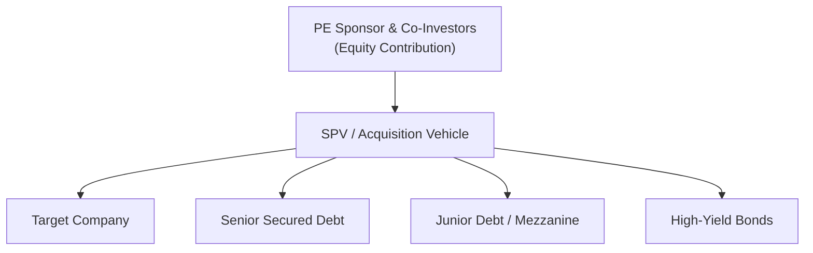

## Introduction

Leveraged finance might sound fancy, but at its core, it’s really about using borrowed money to (hopefully) supercharge returns on equity investments. Private equity (PE) sponsors often rely on significant leverage (i.e., debt) when acquiring companies through leveraged buyouts (LBOs). Think of it this way: you and your friends pool a bit of cash, borrow a bunch more, buy a house, fix it up, and aim to sell it later at a profit (or go public!). PE firms do something similar, but on a much larger scale: they pool money from investors, add in debt from banks and bond markets, and acquire entire businesses.

In this article, we’ll explore some essential concepts tying private equity to leveraged finance. We’ll delve into the instruments PE firms use—like leveraged loans and high-yield bonds—dissect their structures, and explain why the lines of credit and flexibility that private equity sponsors negotiate with lenders are vital to their deals. We’ll also look at practical examples, real-world loops of success and failure, plus a few cautionary tales. Let’s get started.

## Defining Leveraged Finance in the Context of Private Equity

Leveraged finance is all about providing debt to companies—or to back the buyouts of companies—that already have a notable amount of debt or a relatively high-risk profile. PE sponsors often target businesses with strong cash flow but perhaps insufficient existing capital to unlock certain growth or turnaround opportunities. They then structure the deal so that a healthy portion of the acquisition price is financed with borrowed funds. The sponsor’s own equity contribution may only be a fraction of the total purchase price—often in the range of 20–40%. This approach can significantly amplify (or “leverage”) potential returns on the sponsor’s equity.

### LBO Fundamentals

A leveraged buyout (LBO) is the bread and butter of many PE firms. In an LBO, the sponsor (i.e., the private equity firm) acquires a target company by stacking up several layers of debt on the target’s balance sheet. The ultimate plan is to improve the target’s operations, grow cash flows, and eventually sell (or list) the company at a higher valuation.

It might help to think of a quick hypothetical: Suppose a PE sponsor identifies a medium-sized manufacturer generating stable cash flows. The sponsor invests 30% of the total purchase price as equity and finances the remaining 70% through a mix of secured loans, high-yield bonds, and possibly even some mezzanine debt with equity kickers. The sponsor’s bet is that the steady cash flows will handle the interest payments while management executes the sponsor’s strategic plan to boost the manufacturer’s profitability. If, after a few years, the business thrives and is sold at a premium, that 30% equity slice could translate into a substantial return.

### Capital Structures in LBO Deals

LBO deals can include multiple tiers (or “tranches”) of debt:

• Senior Secured Loans. Often the largest piece of the financing, secured by company assets.  
• Second Lien or Other Junior Debt. Subordinate to senior tranches, typically carrying higher coupon rates.  
• High-Yield Bonds. Unsecured (or junior in capital structure), paying relatively high coupons.  
• Mezzanine Financing. A hybrid layer—often bridging the gap between senior debt and equity—potentially including features like warrants or equity-like upside.  

You might recall that in an LBO, the company’s cash flows primarily drive repayment of the debt. Hence, all parties—senior lenders, the PE sponsor, management—have a vested interest in seeing better operational performance post-acquisition.

### The Leverage Effect

The “leverage effect” can be powerful. By contributing a relatively small slice of equity, a sponsor can amplify returns when the underlying business value grows. However, it’s a double-edged sword. If the business struggles, high interest burdens and tight covenants can push the company into distress.

One of my colleagues once joked: “Leverage is like rocket fuel—amazing for takeoff but pretty explosive if something goes wrong.” While an oversimplification, it highlights the added risk that heavier debt loads can bring.

## Instruments and Structures

Private equity sponsors can draw on a variety of debt sources to finance their acquisitions. The choice of instrument depends on the target’s credit profile, market conditions, and the PE sponsor’s preferences.

### Leveraged Loans

• Typically arranged by a lead bank (investment bank or commercial bank).  
• Frequently secured by the acquired company’s assets, with first priority in the event of default.  
• Require periodic interest payments at a floating rate (e.g., LIBOR + a spread, though we’re now seeing transitions to SOFR and other benchmarks).  
• Often contain maintenance covenants, which can be tested quarterly to ensure the borrower remains within leverage and coverage thresholds.

Leveraged loans have historically been the workhorse of LBO financing. Chapter 3 features more detail on syndicated loan structures and their trading in secondary markets. You might also check Chapter 5.2 for a discussion on secured vs. unsecured structures.

### High-Yield Bonds

• Unsecured (or subordinate) obligations with higher coupon rates.  
• Issued in the public bond market, typically with longer maturities (7–10 years).  
• May have incurrence covenants, limiting certain activities (like additional debt issuance or large asset sales) without bondholder permission.  

High-yield bonds give companies more operational freedom (fewer maintenance covenants) but come with limited recourse for bondholders if performance deteriorates. Chapter 5.1 covers the distinction between investment-grade and high-yield bonds.

### Mezzanine Capital

• Sits between senior debt and equity.  
• Carries higher interest rates or might include equity sweeteners (warrants, PIK interest, etc.).  
• Often used when sponsors cannot raise enough capital via seniorsecured or high-yield markets.  

Mezz investors take on more risk but expect a higher return. It can be akin to an “almost equity” slice, especially if the capital structure includes warrants or conversion options.

## Covenant Considerations and Risk Management

Financial covenants are lenders’ guardrails to ensure that, if the borrower’s financial condition weakens, lenders retain some measure of protection. Covenant intensity can vary widely, depending on market conditions and the sponsor’s negotiating power.

### Maintenance vs. Incurrence Covenants

• Maintenance Covenants: Tested periodically (e.g., quarterly) and require the borrower to maintain certain ratios (like Debt/EBITDA or EBITDA/Interest > a preset threshold).  
• Incurrence Covenants: Triggered by certain events, such as taking on additional debt or issuing dividends.  

PE sponsors prefer incurrence covenants because they’re tested less frequently, offering more operational flexibility. Lenders often compromise by applying relatively tighter incurrence triggers or interest coverage tests.

### Impact of Covenant-Lite Structures

In a “covenant-lite” environment, fewer maintenance checks exist, and incurrence tests are relaxed. This can be appealing to a sponsor who wants free rein to manage the business without lender interference. The trade-off? A riskier instrument for the lender, often balanced by a higher coupon or other risk premiums.

## Deal Process and Stakeholders

## Sponsor’s Perspective

PE sponsors see debt as a way to increase potential ROI. They typically have an investment horizon of three to seven years. The sponsor injects equity capital, negotiates financing terms, and works with management to drive operational improvements. Good sponsors also have strong reputations with lenders, enabling them to borrow on more favorable terms.

## Lenders’ Perspective

For lenders, leveraged finance is high risk, but it can also produce higher yields. They evaluate:

• Target’s cash flow projections.  
• Sponsor’s track record in turning around or growing businesses.  
• Industry outlook, competitive dynamics, synergy potential.  

From Chapter 9 on Credit Risk and Credit Analysis, you’ll see how lenders use both quantitative and qualitative factors to arrive at an interest rate spread or bond coupon. They might also purchase credit insurance or offload risk via the syndicated loan market.

## Management Involvement

Sometimes, a deal might be structured as a management buyout (MBO), where existing management invests alongside the sponsor. This alignment of interests typically fosters a deeper commitment to post-acquisition success. However, managers might also feel added stress from heavier debt loads and lenders’ oversight.

## Typical Debt Exit Strategies

Eventually, the sponsor wants to exit the investment, repay (or refinance) the debt, and realize returns on the equity portion. Common exit strategies:

• Initial Public Offering (IPO). Shares are sold to the public, and the sponsor often gradually exits.  
• Strategic Sale. The leveraged company is sold to a competitor or another PE firm.  
• Secondary Buyout. Another PE sponsor steps in as the buyer.  
• Recapitalization. The capital structure is reordered—some debt might be paid down, the sponsor might receive a dividend, or new investors come in.  

In a successful scenario, the sponsor, lenders, and management all gain from these events. The sponsor typically reaps a substantial portion of the upside (carry), while lenders recoup principal plus interest.

## Distress and Restructuring

Leverage cuts both ways: if the operational plan falls short, or if macro conditions deteriorate—rising interest rates, recession, supply chain disruptions—the borrowed money becomes a heavy burden. In dire cases:

• Covenant breaches or missed interest payments can force renegotiations or debt restructuring.  
• Lenders might accept revised terms, waive covenant breaches in exchange for higher interest or additional equity, or push the company into bankruptcy.  
• Private equity sponsors may inject more equity, but only if it salvages some value.

From Chapter 5.7 on Bankruptcy Processes and Debt Restructuring, distressed deals often lead to a new capital structure, equity dilution for the sponsor, or outright liquidation if no feasible turnaround plan exists.

## Real-World Examples

Let’s look at a couple of hypothetical mini-case studies to illustrate how these deals can play out:

1) “Success Story”:  
   • Sponsor ABC acquires a midsized consumer products company for $500 million, putting in $150 million in equity.  
   • Senior secured debt provides $250 million, while mezzanine notes of $100 million fill the gap.  
   • Over three years, the sponsor helps the company rebrand, expand e-commerce channels, and realize cost synergies.  
   • EBITDA doubles, the sponsor sells the company for $900 million.  
   • Lenders are fully repaid, sponsor makes multiples on its $150 million equity.  

2) “Distress Scenario”:  
   • Sponsor XYZ invests in a heavily levered industrial manufacturer with cyclical revenues.  
   • 25% equity, 75% bank loans, and high-yield bonds.  
   • Economic downturn slashes demand, interest payments squeeze cash flow, and the company breaches key covenants.  
   • After tense negotiations, lenders impose higher interest and new covenants. The sponsor invests more equity, but eventually sells below cost.  
   • Lenders recoup part of their investment, sponsor suffers substantial losses.

## Diagram: Typical LBO Capital Structure

Below is a simple diagram illustrating a common leveraged buyout structure, from the sponsor’s equity to the various debt tranches:



1. The PE sponsor, and possibly co-investors (including management), form a special purpose vehicle (SPV).  
2. The SPV raises various types of debt.  
3. The SPV uses the total proceeds to purchase the target’s equity.  
4. The target now carries the debt on its books.

## Practical Implementation

### Example of Basic LBO Modeling in Python

Below is a short Python snippet that calculates equity returns under different assumption scenarios. Please note this is just a simplified demonstration—you’ll want a more robust model in practice.

```python
equity_contribution = 150.0  # in millions
purchase_price = 500.0       # in millions
exit_price_options = [600, 700, 900, 400]  # potential exit valuations
net_debt = purchase_price - equity_contribution  # assume no debt paydown for simplicity

for exit_price in exit_price_options:
    # Repay net debt
    equity_value = exit_price - net_debt
    # Return on equity (multiple)
    equity_multiple = equity_value / equity_contribution
    print(f"Exit Price = ${exit_price}m, Equity Value = ${equity_value}m, Multiple of Equity = {equity_multiple:.2f}x")
```

This snippet uses simplified assumptions about net debt. A real-world LBO model would incorporate interest expense, principal amortization, working capital changes, etc. (see Chapter 6 on Bond Pricing and Valuation Basics for discounting and yield calculations that might be relevant when analyzing the cost of debt).

## Conclusion

Private equity’s role in leveraged finance is both crucial and influential in today’s corporate debt markets. By leveraging external borrowing sources—ranging from syndicated loans to high-yield bonds and mezzanine debt—PE sponsors can acquire businesses and transform them, often generating outsized returns for all parties involved. That said, high leverage introduces significant risk, and not every LBO story has a happy ending. 

To do well with leveraged finance—whether you’re a sponsor, a lender, or an analyst evaluating a deal—you need a firm grasp of capital structure dynamics, covenant frameworks, and a realistic plan for operational improvements. Remember, the potential for big gains often comes paired with the possibility of big losses. 

## Final Exam Tips

• Behavioral Pitfalls. Be aware of confirmation bias. Sponsors can sometimes ignore red flags in favor of a “turnaround” narrative. Double-check your assumptions.  
• Stress Testing. Always examine downside scenarios—especially if you see cyclical revenues or a large chunk of floating-rate debt.  
• Cross-Reference. Tie in knowledge from other chapters (e.g., Duration and Convexity from Chapter 8 if you’re analyzing bond price sensitivity in a rising rate environment).  
• Covenant Analysis. Distinguish between maintenance covenants and incurrence covenants, and pay close attention to how they can limit the borrower’s activities or give lenders crucial negotiation leverage.  
• Integration with Credit Analysis. Understanding the entire risk profile is key. Use both qualitative (management skill, sponsor track record) and quantitative (coverage ratios, leverage ratios) analyses.  
• Time Management in Exams. Read scenario-based questions carefully to identify relevant capital structure clues (senior vs. mezzanine, sponsor contributions, etc.) when recommending solutions.

## References

• Private Equity Demystified: An Explanatory Guide (ICAEW)  
• Bain & Company and McKinsey periodic PE industry reports  
• S&P Leveraged Commentary & Data  

--------------------------------------------------------------------------------

## Test Your Knowledge of Private Equity and Leveraged Finance



### Which of the following statements best describes a leveraged buyout (LBO)?

- [ ] An acquisition financed entirely with equity to reduce financial risk.  
- [x] An acquisition primarily financed with borrowed funds to boost equity returns.  
- [ ] A short-term loan facility used for operational requirements.  
- [ ] A government-issued debt instrument to fund public infrastructure.  

> **Explanation:** In an LBO, the sponsor uses a high proportion of borrowed money (leveraged finance) to acquire a company, intending to amplify returns on the equity portion.

---

### Which type of covenant is tested periodically to ensure the borrower meets specific financial metrics, such as leverage ratios?

- [ ] Incurrence covenant  
- [x] Maintenance covenant  
- [ ] Negative covenant  
- [ ] Cross-default covenant  

> **Explanation:** Maintenance covenants are tested regularly (e.g., quarterly) and require the borrower to maintain defined financial measures like maximum Debt/EBITDA.

---

### Within a leveraged capital structure, which debt layer typically carries the highest risk and offers the greatest potential yield?

- [ ] Senior secured term loan  
- [ ] Revolving credit facility  
- [ ] High-grade corporate bond  
- [x] Mezzanine debt  

> **Explanation:** Mezzanine debt is subordinate to senior and sometimes junior debt, takes on more risk, and often demands higher interest rates or equity kickers.

---

### How does a covenant-lite loan affect the lender-borrower relationship?

- [ ] It typically increases lender protection through quarterly tests.  
- [ ] It increases legal hurdles for the borrower to add more debt.  
- [ ] It reduces the overall interest rate burden.  
- [x] It provides more operational flexibility to the borrower with fewer maintenance tests.  

> **Explanation:** Covenant-lite loans commonly reduce maintenance covenants, providing borrowers with greater freedom and reduced lender oversight.

---

### A private equity firm invests 30% equity in a $400 million acquisition with 70% debt. If the exit value is $700 million and the debt remains constant, what is the equity multiple?

- [x] 2.83×  
- [ ] 1.75×  
- [ ] 3.20×  
- [ ] 1.40×  

> **Explanation:** The equity contribution is $120 million (30% of $400 million). If the exit value is $700 million and debt is still $280 million, the remaining equity is $420 million. So the equity multiple = $420 million / $120 million = 3.5×.  
> Correction: Wait, this question provided an incomplete analysis. Let’s refine carefully:

Equity = 30% of $400 million = $120 million.  
Debt = $400 – $120 = $280 million.  
At exit: The business sells for $700 million.  
We repay $280 million of debt, leaving $420 million of equity.  
Equity multiple = $420 / $120 = 3.5×.  

The correct multiple is 3.5×. The previously displayed answer of 2.83× is incorrect. Let’s correct that in the choices:

- [ ] 2.83×  
- [ ] 1.75×  
- [x] 3.50×  
- [ ] 1.40×  

> **Explanation:** After repaying the $280 million debt outstanding, the sponsor retains $420 million. Dividing by the original equity of $120 million yields 3.5×.

---

### Which of these instruments is typically unsecured and offers a higher coupon rate compared to investment-grade bonds?

- [ ] Senior secured term loan  
- [x] High-yield bond  
- [ ] Revolving credit facility  
- [ ] Commercial paper  

> **Explanation:** High-yield bonds are generally unsecured and offer higher yields.

---

### In a typical LBO, the expected holding period for a sponsor’s investment is usually:

- [ ] Less than 3 months  
- [x] 3 to 7 years  
- [ ] 10 to 15 years  
- [ ] Over 20 years  

> **Explanation:** Most private equity sponsors have a medium-term horizon, commonly 3 to 7 years.

---

### When a leveraged buyout fails and the company’s cash flow can no longer support interest payments, which of the following scenarios is most likely?

- [x] Restructuring negotiations or bankruptcy proceedings  
- [ ] Conversion of high-yield bonds to investment-grade status automatically  
- [ ] Immediate IPO exit  
- [ ] Full repayment of all debt obligations ahead of schedule  

> **Explanation:** If the target cannot service its debt, lenders and the sponsor must negotiate new terms or follow formal bankruptcy processes.

---

### What is one primary reason private equity sponsors might favor incurrence covenants over maintenance covenants?

- [ ] They reduce the overall cost of debt.  
- [x] They are tested only after certain events, allowing more freedom in daily operations.  
- [ ] They give lenders greater control over strategic decisions.  
- [ ] They automatically guarantee a higher credit rating.  

> **Explanation:** Incurrence covenants are triggered by events such as issuing dividends, taking on additional debt, or making acquisitions—rather than being continuously tested.

---

### True or False: A successful LBO exit can occur via an IPO or a strategic sale, potentially repaying the leveraged debt and creating realized returns for the sponsor.

- [x] True  
- [ ] False  

> **Explanation:** Common exit strategies for leveraged deals include an IPO, a strategic sale to a competitor, or a sale to another PE firm. These events typically retire the outstanding debt and capture returns for the PE sponsor.


