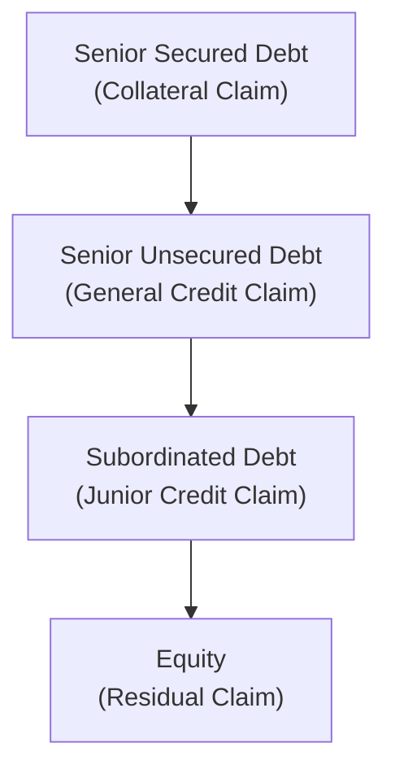

## Introduction

Secured and unsecured bonds form a critical part of corporate debt markets. These two financing structures might sound straightforward: one is backed by collateral, and the other is not. But dig a bit deeper, and you’ll see that the exact nature of collateral, the legal mechanisms ensuring its enforceability, and the impact on investor recoveries can all get pretty intricate. And, honestly, I’ve had a few “aha” moments myself while trying to figure out just how different collateral packages could affect default risk and pricing.

In this section, we’ll explore the nuts and bolts of secured vs. unsecured debt structures, highlight practical considerations for both issuers and investors, and connect these concepts with key credit and covenant features. We’ll also illustrate how collateral can shape bond yields, influence credit ratings, and determine bondholders’ potential recovery in a worst-case scenario.

## Context within Corporate Debt Markets

Corporate debt markets are highly diverse. We see everything from plain-vanilla, unsecured “investment-grade” bonds to heavily collateralized, high-yield loans loaded with performance triggers. As discussed in preceding sections (e.g., 5.1 Investment-Grade vs. High-Yield Bonds), a bond’s credit quality can hinge on many factors: the issuer’s cash flow stability, industry fundamentals, or even global macroeconomic trends. On top of this, the presence or absence of collateral can have a material influence on credit spreads and perceived risk.

## Collateral Basics: Why It Matters

Collateral is any identifiable asset or set of assets pledged by a borrower to secure a debt obligation. It might be something tangible, like machinery or real estate, or something intangible, like accounts receivable or intellectual property (in rare setups). By pledging collateral, a borrower essentially says, “Hey, if I default, you’ll have the right to seize or liquidate these assets first.” This provides extra security for investors, typically reducing credit risk.

Investors naturally care about whether the collateral is:
• Valuable.  
• Easily sold in the market.  
• Legally enforceable and “perfected” so that no other creditor can claim it first.

## Understanding Secured Debt

Secured debt is a financing instrument in which the issuer grants lenders a lien (or claim) on specific assets. Secured claims typically rank at, or near, the top of the corporate capital structure, meaning they are among the first to receive proceeds from asset liquidation in a default scenario.

### Types of Collateral Arrangements

• Fixed Charge: A fixed charge is attached to specific physical assets, like a building or a piece of heavy machinery. If you default, lenders can typically seize those named assets.  
• Floating Charge: This arrangement is more flexible and may include collateral like inventory or receivables, which fluctuate from day to day. The lender’s claim “floats” over changing pools of assets.  

Additionally, many secured deals require the borrower to “perfect the lien,” which is a fancy way of saying that the lender’s legal interest in the collateral is properly recorded and enforceable. In certain jurisdictions, this can be as simple as filing legal documents at a government registry; in others, the process becomes more complicated.

### Pricing and Risk Implications

Because collateral bolsters repayment prospects, secured bonds often price at lower yields compared to comparable unsecured issuances by the same issuer. The yield spread (relative to a benchmark, like Treasuries) reflects the bond’s perceived credit risk. Good collateral → lower risk of loss → narrower spread.

However, collateral doesn’t eliminate risk entirely. If the industry is turbulent or the pledged assets rapidly depreciate, your recovery might still be suboptimal. There’s also the time factor: Even if the assets retain value, legal battles can delay asset seizure or liquidation, adding complexity for bondholders.

### Covenants in Secured Issuances

Secured bond indentures often come with robust covenant packages. Borrowers might agree to:  
• Limit asset disposals or sales without lender consent.  
• Maintain or insure the collateral.  
• Refrain from taking additional liens on the same assets (negative pledge clauses).  
• Report changes to the collateral’s value or location.  

These contract provisions can vary substantially, so seasoned analysts always read the actual indenture or loan agreement. In my experience, being thorough here is essential—failing to catch a subtle covenant detail could majorly shift the risk profile.

## Unsecured Debt: The Essentials

Unsecured debt relies purely on the issuer’s “general creditworthiness”: the capacity and willingness to repay. There’s no specific collateral that bondholders can seize to satisfy claims. Instead, these investors rank behind any secured creditors if the issuer defaults. In the famous “waterfall” of claims, unsecured holders only get what’s left over after all higher-ranked (secured) claims are satisfied.

### Market Practice and Yield Differentials

Because of this lower claim priority, unsecured bonds normally carry higher yields or spreads compared to the issuer’s secured paper. In the event of default, unsecured bondholders might face longer wait times, more complicated litigation, or both. The higher yield compensates them for these added risks and uncertain recoveries.

### Subordination and Priority

Subordination layers in another dimension of risk. For instance, a corporate issuer might have “senior unsecured bonds” and “subordinated unsecured bonds.” Subordinated holders rank below senior creditors when claims are paid off. Even among unsecured investors, those who are senior can have meaningfully better recoveries.

## Capital Structure Priority in a Default Scenario

It’s helpful to visualize how ranking plays out in an event of default. Below is a simple Mermaid diagram that shows a simplified hierarchy of claims.

Senior secured bondholders sit at the top, meaning they have the highest chance of recovery. Then come senior unsecured, followed by subordinated unsecured, and finally the equity holders, who often see the largest losses when a company is liquidated or restructured.

## Legal and Jurisdictional Complexities

We’d all love to think that if you hold a secured bond, you simply send an email to the defaulting issuer and repossess the pledged property. In reality, this process might get messy, especially across multiple jurisdictions with varying bankruptcy rules. I once read through hundreds of pages of cross-border restructuring documents for a manufacturing company that had factories in half a dozen countries. Yikes. The key takeaway was that local laws can (and do) influence how quickly creditors can seize or liquidate assets and how the proceeds are allocated among various claimants.

A few considerations to keep in mind:
• Different jurisdictions have different approaches to “stay” orders in bankruptcy.  
• Multiple secured creditors may be competing for the same pool of assets.  
• Certain assets might be subject to local environmental or licensing constraints.  

In cross-border deals, it’s crucial to examine the legal opinions from each relevant jurisdiction to confirm that the lien is valid and that enforcement is practical.

## Collateral Valuation and Recovery Rates

When valuing secured debt, investors attempt to estimate the potential recovery by analyzing the collateral’s current market value and the future outlook—with a margin of conservatism. This is especially critical when the collateral is specialized and may not have a broad resale market. If the pledged asset is an airplane or a niche manufacturing tool, liquidation might be slow and yield less than you’d hope.

For unsecured debt, the analysis typically focuses on the company’s overall enterprise value, capital structure, and likely cash generation. In many default scenarios, unsecured bondholders must rely on reorganization value rather than a forced liquidation. Obviously, that can feel like a leap of faith. But a thorough fundamental or credit analysis can shed light on whether the enterprise is worth saving and whether unsecured creditors could recover a decent portion of their claims.

## Covenant Packages and Negative Pledge Clauses

Even in unsecured bonds, you might still find a “negative pledge clause.” This covenant prohibits the issuer from pledging assets to future creditors unless it offers similar security to the existing unsecured holders. It protects unsecured creditors from being effectively subordinated later if the issuer decides to issue new secured debt. Although negative pledges offer some level of reassurance, they don’t turn an unsecured bond into a secured bond outright. They just limit the issuer’s ability to shift assets away from your potential recovery.

## Subordinated Debt Nuances

A step below senior unsecured, subordinated debt can be one more rung down the priority ladder. In practice, an issuer might choose to issue subordinated notes to lure investors with an even juicier yield or to fulfill regulatory capital requirements (as with some bank Tier 2 capital instruments). Subordinated debt is fully unsecured and contractually junior to all senior obligations. During default, these holders may end up recovering pennies on the dollar—if that.

## Practical Examples

Let’s consider two stylized cases:

1. Tech Corp:  
   • Issues $500 million of senior secured bonds backed by the company’s patents and intangible assets—yes, intangible collateral does happen.  
   • Has $300 million in existing senior unsecured bonds.  

   If Tech Corp runs into trouble, the secured bondholders could theoretically foreclose on the patents. However, intangible assets can be tricky to value or sell. The lower yield on the secured bond partly reflects that it has a direct claim on core intellectual property, but the actual market value under distressed conditions can be uncertain.

2. Real Estate Developer Inc.:  
   • Issues $400 million in secured notes with a fixed charge on commercial real estate properties.  
   • Issues $200 million in subordinated unsecured notes.  

   Here, the $400 million in secured notes has a clear, tangible asset as collateral: the real estate. In a default, the real estate can be sold to repay much of the secured notes. Meanwhile, the subordinated unsecured holders might recover little unless the property sale yields well above $400 million.

## Risks and Challenges

• Collateral Depreciation: Even real estate or equipment might lose significant value in an economic downturn.  
• Legal Delays: Perfecting the lien is one thing; enforcing it swiftly can be another.  
• Asset Substitution: Sometimes an unscrupulous issuer might “swap out” or degrade the pledged assets if covenants aren’t tight.  
• Structural Subordination: In a conglomerate, bondholders at the parent company may not have direct claims on subsidiary assets.  

## Best Practices for Investors

• Conduct rigorous due diligence on collateral assets (type, quality, marketability).  
• Verify the legal enforceability of liens (perfecting the lien).  
• Monitor the issuer’s compliance with collateral maintenance covenants.  
• Assess industry trends that may impact asset values.  
• Understand ranking among various debt tranches and how that affects potential recovery.  

## Exam Relevance and Application

When preparing for fixed-income questions at the CFA Level (whether it’s I or III, the topic recurs in multiple contexts), expect scenario-based questions that ask you to:

• Compare and contrast yields of secured vs. unsecured debt.  
• Incorporate collateral valuation into potential recovery estimations.  
• Analyze the effect of negative pledge clauses.  
• Evaluate subordination features and how they affect credit spreads.  

You might see an item set where a company’s bond indenture changes from unsecured to secured midstream. Be ready to explain how that shift impacts credit risk, yield spreads, and covenant enforcement. Constructed-response questions might challenge you to outline the differences in recourse options for bondholders under each structure.

## References and Further Reading

• Fabozzi, F. J., “The Handbook of Fixed Income Securities.” A comprehensive deep dive into fixed-income structures, including collateralized debt.  
• Loan Syndications & Trading Association (LSTA), for technical releases and best practices on secured lending documentation and collateral management:  
  https://www.lsta.org/  
• U.S. Securities & Exchange Commission (SEC) Filings Database (EDGAR) at https://www.sec.gov/edgar for real-world bond indenture examples and disclosure on collateral arrangements.

----

## Test Your Knowledge: Secured vs. Unsecured Structures



### Which of the following best describes secured debt?

- [x] Debt backed by specific assets pledged as collateral.  
- [ ] Debt that relies solely on the issuer’s general creditworthiness.  
- [ ] Debt that is subordinated to other existing obligations.  
- [ ] Debt featuring no specific covenants or legal claims.  

> **Explanation:** Secured debt uses specific pledged assets to support repayment, giving bondholders a higher priority claim in default events.

---

### Which of the following is often cited as a key advantage of secured debt to investors?

- [ ] Greater potential upside if the company outperforms expectations.  
- [x] Higher likelihood of recovery in a default scenario.  
- [ ] Elimination of all default risk due to collateral.  
- [ ] Complete immunity from legal delays in bankruptcy.  

> **Explanation:** Although collateral does not remove all risk, it generally improves the chances of recovering principal if the issuer defaults.

---

### For unsecured bonds, which factor predominantly influences recovery prospects in a default?

- [ ] Seizure rights on pledged collateral.  
- [ ] Specific liens perfected by the bondholders.  
- [x] The issuer’s general enterprise value and overall asset pool.  
- [ ] Pre-arranged sale of designated collateral.  

> **Explanation:** Unsecured bondholders rely on the issuer’s general credit profile and any residual enterprise value after secured creditors are paid.

---

### Which bond issuance commonly includes covenants prohibiting the sale or transfer of underlying collateral without lender approval?

- [x] Secured bonds.  
- [ ] Unsecured bonds.  
- [ ] Convertible bonds only.  
- [ ] Perpetual bonds only.  

> **Explanation:** Secured bonds often incorporate covenants protecting the value of and access to pledged collateral.

---

### A negative pledge clause in an unsecured bond typically:

- [ ] Creates a fixed charge on existing assets for the benefit of bondholders.  
- [ ] Eliminates the possibility of future secured debt issues.  
- [x] Prohibits the issuer from pledging assets to new creditors without offering similar protection to existing bondholders.  
- [ ] Subordinates the existing unsecured debt to any future secured debt.  

> **Explanation:** A negative pledge clause helps ensure unsecured bondholders are not unfairly disadvantaged by future secured lenders.

---

### Subordinated debt differs from senior unsecured debt in that:

- [x] Subordinated debtholders face lower priority in the event of liquidation.  
- [ ] Subordinated debtholders hold a lien over the assets.  
- [ ] Subordinated debt always carries the same yield as senior debt.  
- [ ] Subordinated debt is fully immune to negative pledge clauses.  

> **Explanation:** Subordinated debt ranks behind senior unsecured debt, meaning they receive payment only after senior obligations are satisfied.

---

### If an issuer defaults on both secured and unsecured bonds, the secured bondholders generally:

- [x] Have a first claim on the specific pledged assets.  
- [ ] Rely entirely on the firm’s general creditworthiness.  
- [x] May enforce liens and possibly seize the collateral.  
- [ ] Are subordinated behind equity holders.  

> **Explanation:** Secured holders have direct recourse to the pledged collateral, which can improve their recovery—though they still might end up short if the collateral value is insufficient.

---

### Which best describes the effect of collateral quality on yield spreads?

- [x] Higher-quality collateral tends to reduce yield spreads.  
- [ ] Higher-quality collateral always leads to higher spreads.  
- [ ] Collateral quality has no impact on yield spreads.  
- [ ] Collateral quality is only relevant for unsecured bond pricing.  

> **Explanation:** The better the collateral, the lower the perceived credit risk, which usually narrows yield spreads.

---

### A floating charge implies that the pledged assets:

- [ ] Are immovable physical properties only.  
- [ ] Are intangible patents that never change.  
- [x] Comprise shifting assets like inventory and receivables.  
- [ ] Must be kept entirely offshore.  

> **Explanation:** A floating charge covers a changing pool of assets such as accounts receivable and inventory, which fluctuate over time.

---

### True or False: The presence of collateral eliminates default risk.

- [x] True  
- [ ] False  

> **Explanation:** This is a trick statement—it's actually False in the real world. Collateral does not eliminate default risk; it merely mitigates potential losses by providing an additional claim on assets.  


