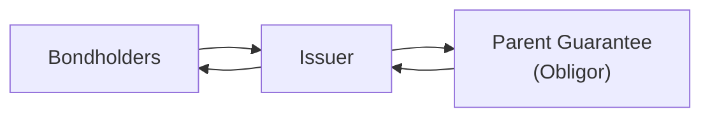

## Introduction
You know, sometimes when I think about the corporate bond market, I remember a deal I was once browsing—just sort of casually, on a Sunday afternoon (yes, some of us live and breathe this stuff). The issuer, a mid-sized manufacturing firm, had inserted these rock-solid guarantees from its parent and a slate of super-strong covenants. As I dug deeper, I realized how those extra layers of security—letter of credit (LOC), bond insurance, plus a thorough list of do’s and don’ts—hugely influenced the bond’s yield and investor confidence.  

That little “casual read” reminded me that credit enhancements and covenants can truly make or break the perceived risk of a corporate debt issuance. If you’re preparing for the CFA exam (and especially if you’re at Level III, tackling advanced portfolio management topics), understanding how these enhancements and covenants shape bond risk and return is huge. Let’s walk through the key concepts, highlight where they matter for real-world investing, and map out how you’ll likely see these on the exam.

## Why Credit Enhancements Matter
Credit enhancements are basically the icing on the cake for bond investors—except, it’s more than just icing, right? It’s a protective layer that can significantly lower the default risk from the investor’s perspective. Enhancements come in many shapes and sizes:  
• Guarantees from a stronger parent company.  
• Third-party bond insurance or surety bonds.  
• Letters of credit (LOC) issued by a reputable financial institution.  
• Overcollateralization, where the value of pledged collateral exceeds the bond’s par value.  

Increasingly, in structured products (like asset-backed securities), we see forms of credit enhancement such as senior-subordinated structures, reserve accounts, or excess spread. But for corporate debt specifically, the “big four” remain guarantees, LOCs, insurance, and overcollateralization.

### How Enhancements Affect Bond Pricing and Yields
Credit rating agencies often view robust credit enhancements favorably, allowing the issuer to achieve a higher rating than it would have on a standalone basis. From an investor standpoint, that higher rating means lower perceived risk, which usually translates into tighter credit spreads and thus a lower yield. This is a trade-off because while the issuer pays more for the enhancement (e.g., an insurance premium or a bank fee for the LOC), it potentially lowers its financing costs through a reduced interest rate on the bond.  

On the flip side, if an issuer’s enhancements look shaky—maybe the insurer itself isn’t that creditworthy, or the parent guarantee is subject to complicated legal conditions—investors might question the true benefit. Always keep your eyes peeled for disclaimers or carve-outs in guarantee agreements.

## Common Types of Credit Enhancements
Below are some of the major forms you’ll come across. Each type has a unique place in the corporate financing puzzle.

### Letters of Credit (LOC)
A letter of credit is a promise from a bank (or other financial institution) to honor the issuer’s obligations if the issuer fails to pay. LOCs can be irrevocable (stronger from the investor’s viewpoint) or revocable (rarely seen in corporate bond deals because they offer less investor security).  

When analyzing LOC-backed bonds, make sure to examine the creditworthiness of the bank providing the LOC. If the bank is less stable, the letter of credit might not add much comfort to bondholders.

### Guarantees
Imagine you have a smaller entity issuing debt, but it’s backed up by a strong parent company’s guarantee. That guarantee is the parent’s formal pledge to cover payments if the subsidiary defaults. Sometimes, however, that pledge can be subject to conditions, so be alert. In cross-border contexts, you might see additional complexities if the guarantee spans multiple legal jurisdictions.  

Sometimes covenant packages will specifically mention that, for the bond to stay in good standing or for the covenant to remain valid, a guarantee from the parent must remain in force. If the guarantee is terminated, a technical default could be triggered.

### Bond Insurance
Bond insurance is a policy purchased by the issuer (or sometimes, at issuance, by an underwriting syndicate) that ensures bondholders will receive scheduled payments of principal and interest if the issuer defaults. The insurer effectively substitutes its credit rating for that of the issuer, which can help lower bond yields in the marketplace—provided the insurer is reputable and well-capitalized.

Back in the financial crisis, we all saw what happened when certain insurers overextended themselves. Once the insurer’s rating was cut, the “enhanced” rating hinged on that insurance lost much of its luster. That’s a big cautionary tale.

### Overcollateralization
Overcollateralization involves structuring a bond such that the collateral’s value exceeds the bond’s face amount. This is widespread in asset-backed securities but can also appear in corporate contexts—particularly for secured debt. Investors love the extra cushion because if the issuer defaults, there’s a higher likelihood that liquidating the collateral will make them whole (or at least partially whole).

## Understanding Covenants
Okay, so let’s pause for a second. Before diving into covenants, it’s worth pointing out that they aren’t a form of “insurance” or an “enhancement” in the typical sense. Instead, they’re protective clauses in the bond indenture that shape the issuer’s behavior or financial condition.  

Covenants can be broad and get surprisingly creative. The main idea? Restrict or require certain actions so that the issuer remains financially healthy and doesn’t overextend itself, which ultimately serves to protect bondholders.

### Affirmative vs. Negative Covenants
Perhaps the easiest way to dissect covenants is by splitting them into affirmative and negative.  

• Affirmative Covenants: These are “thou shalt” type clauses. For example, an issuer might be required to maintain a specific level of insurance coverage, file financial statements on time, or keep certain assets in good working condition. Affirmative covenants essentially prescribe what the borrower must do to stay creditworthy.  

• Negative Covenants: These are “thou shalt not” type clauses. Examples include:  
  – Limits on taking additional debt above a specified ratio.  
  – Restrictions on dividend payouts that might jeopardize cash flow.  
  – Prohibitions against disposing of critical assets or merging with another company without bondholder or trustee approval.  

The presence (and tightness) of these clauses can lower an investor’s risk profile, which typically narrows spreads. However, from the issuer’s perspective, stronger covenants can limit managerial flexibility and strategic freedom.

## Maintenance vs. Incurrence Covenants
There’s another essential distinction in covenant-land:

• Maintenance Covenants: These require the issuer to continuously meet or exceed certain metrics—like a maximum leverage ratio or a minimum interest coverage ratio—over the life of the bond. If the issuer’s leverage creeps above, say, 4× or 5×, or if its interest coverage ratio dips below 2.0×, it’s in default.  

• Incurrence Covenants: Instead of an ongoing requirement, an incurrence covenant only comes into play when the issuer takes a specific action—for instance, incurring a new round of debt, paying out large dividends, or doing major share buybacks. The covenant might say: “The issuer shall not incur additional indebtedness if net debt-to-EBITDA is greater than 3.0×.” If the issuer never tries to raise new debt, it never hits that covenant test.  

In the leveraged loan or high-yield bond world, you’ll often see incurrence covenants because these issuers prefer more operational breathing room—though from an investor’s vantage point, that can be riskier. Maintenance covenants offer more robust protection but can be too restrictive for growth-oriented companies that want to maintain financial flexibility.

## Covenant Examples and Their Impact

### Financial Metrics
A typical financial covenant could be expressed as follows (in KaTeX for clarity):


\text{Net Leverage Ratio} = \frac{\text{Total Debt} - \text{Cash}}{\text{EBITDA}}

Where “EBITDA” stands for Earnings Before Interest, Taxes, Depreciation, and Amortization. The maintenance covenant might require:

\text{Net Leverage Ratio} \leq 4.0

For incurrence contexts, it might say: “Issuer shall not incur new term loans if the Net Leverage Ratio exceeds 4.0× following issuance.”

### Equity Cure Rights
Sometimes an issuer’s owners can inject additional equity if the company is on the verge of breaching a covenant—known as an equity cure. This can “reset” the ratio, effectively preserving compliance. Bond indentures vary widely in how they handle cure rights (frequency, limitations on how many times a cure can be made, etc.).

### Cross-Default Provisions
A cross-default clause triggers a default if the issuer defaults on any other debt. This can protect investors by ensuring that if the issuer’s overall credit health deteriorates (and a default occurs on a different set of obligations), all creditors have the right to step in and protect their interests.

### Springing Liens
A springing lien allows unsecured bonds to become secured if certain negative triggers occur—like a rating downgrade or missed covenant test. It’s basically a plan-B for investors if the issuer’s credit profile worsens.

## Brief Python Example: Checking Covenant Compliance
Maybe you’re curious how a simple computational approach might look. Let’s say you have monthly financial data for a company’s leverage ratio and coverage ratio. You want to check if it breached any of its maintenance covenants over time:

```python
import pandas as pd

data = {
  'Month': ['Jan', 'Feb', 'Mar', 'Apr'],
  'LeverageRatio': [3.8, 4.1, 3.9, 4.2],
  'CoverageRatio': [2.6, 2.4, 2.5, 2.3]
}

df = pd.DataFrame(data)

max_leverage = 4.0
min_coverage = 2.5

df['Leverage_OK'] = df['LeverageRatio'] <= max_leverage
df['Coverage_OK'] = df['CoverageRatio'] >= min_coverage

df['In_Breach'] = ~(df['Leverage_OK'] & df['Coverage_OK'])

print(df)
```

This snippet checks whether the issuer’s monthly leverage ratio stays below 4.0 and coverage ratio remains above 2.5, then flags if there’s a breach. Even though it’s a tiny illustration, it showcases how finance professionals might operationalize covenant monitoring in a spreadsheet or programming environment.

## Using a Mermaid Diagram to Visualize a Guarantee Flow
Below is a simple flowchart showing how a parent company guarantee effectively channels bondholder claims:



In this simplified setup, if the Issuer can’t meet debt obligations, the obligations “flow” up to the Parent Guarantee entity, which then pays Bondholders.

## Balancing Protection vs. Flexibility
Stronger covenants and robust credit enhancements can reduce yield spreads by reassuring investors of lower default risk. But these protections can tie the issuer’s hands. If the issuer wants the freedom to pursue acquisitions, take on more debt, or pivot its strategy, it might resent highly restrictive covenants.  

Sometimes you’ll see negotiations that whittle down negative covenants if the issuer is an investment-grade credit with a stellar track record, or that loosen maintenance terms if the issuer’s fundamentals improve. In distressed or high-yield situations, investors may push for thick covenant packages. It’s always a balancing act.

## Real-World Case Studies
• High-Yield Issuer with Strong Covenants: A well-known private equity–owned retailer once issued high-yield bonds with a tight limit on additional borrowings: they couldn’t issue new debt unless net leverage stayed below 4.5×. The strong covenant package helped the bonds get a better rating than similar risk issuers with looser covenants, resulting in a narrower yield spread.

• Municipal Bond with Bond Insurance: A local government entity might purchase bond insurance from a top-rated insurer, aiming to bring its yield down. If the insurer’s credit rating later drops, though, the municipal bond’s yield may rise. Investors effectively realize the original credit enhancement lost some credibility.

• A Cross-Default Surprise: A mid-cap manufacturer had a small overseas subsidiary that defaulted on a trade credit arrangement. Thanks to a cross-default clause within the parent’s bond indenture, the parent’s lenders triggered a default notice. Although the parent ultimately renegotiated, it was a close call that hammered the issuer’s bond price in secondary markets.

## Best Practices in Covenant Negotiations
• Keep Financial Ratios Realistic: Avoid setting extremely high coverage ratios or extremely low leverage ceilings that are impossible to maintain in normal business cycles.  
• Understand Cure Rights: If equity cures are allowed, clarify how often, to what extent, and any limitations.  
• Clarify Material Definitions: Terms like “EBITDA” or “Extraordinary Items” might leave wiggle room. Make sure these are spelled out in detail to prevent “EBITDAX” or other creative definitions.  
• Cross-Border Considerations: If it’s a multinational deal, confirm how the local laws interpret and enforce structured guarantees or liens.

## Final Exam Tips
• Be prepared to see scenario-based item sets: The exam might give you a corporate bond’s set of covenants and credit enhancements, then ask how these features impact the bond’s yield, the issuer’s strategic plans, or the potential for technical default.  
• Evaluate the risk/reward trade-off: For instance, do more restrictive covenants necessarily lead to a higher rating or lower yield? Not always, but typically yes—if the covenants meaningfully reduce default risk.  
• Manage time wisely on constructed-response questions: In some cases, you’ll need to weigh the pros and cons of specific covenant types, or identify how certain credit enhancements (like a dubious letter of credit from a financially shaky bank) might not be as enhancing as it appears.  
• Don’t forget the legal dimension: If a parent company in a different jurisdiction is guaranteeing the bond, questions might revolve around whether or not that legal system reliably enforces the guarantee.  
• Use real-world logic in your answers: The exam expects you to see how these protective measures might break down under financial stress or changes in an issuer’s credit profile.

## References
• CFA Institute: Corporate Finance and Fixed Income – Comprehensive materials on covenants and structural enhancements.  
• Standard & Poor’s Covenant Quality research – Detailed insights into high-yield covenant structures and trends.  
• International Swaps and Derivatives Association (ISDA): https://www.isda.org – Industry best practices on documentation related to credit enhancements.  
• Moody’s & Fitch Ratings Methodologies – For in-depth rating considerations of credit enhancements and covenant strength.  
• Securities Industry and Financial Markets Association (SIFMA) – Market guidelines and educational resources on corporate bond issuance.  

---

## Test Your Knowledge: Credit Enhancements and Covenants



### Which of the following is a primary function of credit enhancements in corporate debt?

- [ ] To increase liquidity risk.
- [x] To reduce the perceived credit risk of the debt obligation.
- [ ] To primarily improve bond market liquidity via secondary trading platforms.
- [ ] To lengthen the maturity date of the bond.

> **Explanation:** Credit enhancements aim to reduce default or credit risk from an investor's perspective by providing additional security or support, such as guarantees or insurance.

### A negative covenant in a bond indenture is most likely to:

- [ ] Require the issuer to maintain a minimum interest coverage ratio.
- [x] Restrict the issuer from paying dividends above a specified level.
- [ ] Obligate the issuer to maintain adequate insurance coverage.
- [ ] Demand monthly financial statements to bondholders.

> **Explanation:** Negative covenants usually limit or restrict issuer actions—such as capping dividend payments—whereas affirmative covenants require the issuer to do something.

### Under an incurrence covenant, a bond issuer’s action is most restricted:

- [x] When the issuer decides to take on additional debt beyond a defined threshold.
- [ ] On an ongoing basis, regardless of corporate actions.
- [ ] Only if the issuer exits a line of business completely.
- [ ] Whenever it misses earnings guidance.

> **Explanation:** Incurrence covenants are triggered by certain actions—like issuing new debt. They do not apply continuously.

### Which statement best captures the distinction between a guarantee and bond insurance?

- [x] A guarantee is a promise from a third party (often a parent), while bond insurance is underwritten by an insurer offering coverage for default.
- [ ] Both are identical in legal form.
- [ ] Guarantees are exclusively issued by governments, while bond insurance is offered by private entities.
- [ ] Bond insurance only covers principal payment, but guarantees cover coupon payments as well.

> **Explanation:** A guarantee typically comes from a parent or affiliate, whereas bond insurance is provided by an insurance company and can cover both principal and interest.

### When evaluating Letters of Credit (LOC) as a credit enhancement, an analyst should primarily focus on:

- [x] The creditworthiness and financial strength of the LOC provider.
- [ ] The historical volatility of the issuing firm’s earnings.
- [ ] Potential changes in interest rates.
- [x] Additional fees the issuer will pay to maintain the LOC.

> **Explanation:** LOCs are only as good as the institution standing behind them, and fees/terms matter for the issuer.  

### A cross-default provision functions to:

- [x] Trigger a default on one bond issue if the issuer defaults on another debt instrument.
- [ ] Provide immediate liquidity to bondholders in case of missed coupon payments.
- [ ] Allow equity holders to inject capital in the event of a covenant breach.
- [ ] Restrict an issuer’s ability to pay dividends above a threshold.

> **Explanation:** Cross-default clauses link various debt obligations so that default under one triggers defaults under others, enhancing creditors’ protections.

### Maintenance covenants differ from incurrence covenants because:

- [x] Maintenance covenants require ongoing compliance with specific financial ratios.
- [ ] Maintenance covenants only apply when a new event occurs.
- [x] Incurrence covenants are tested at all times during the life of the bond.
- [ ] Incurrence covenants pertain to assets pledged as collateral.

> **Explanation:** Maintenance covenants are tested continuously (i.e., every quarter) to ensure certain ratios are met. Incurrence covenants only apply when the issuer takes specific actions, such as issuing new debt.

### Overcollateralization in a debt issue means:

- [x] The value of pledged collateral exceeds the par value of the bond.
- [ ] The issuer has partially insured the bond’s coupons.
- [ ] A third party is legally required to pay interest if the issuer defaults.
- [ ] The bond is exchangeable for equity shares of the issuing firm’s parent.

> **Explanation:** Overcollateralization ensures that the amount of collateral pledged is greater than the total principal amount, providing extra protection for creditors.

### Equity cure rights give bond issuers the option to:

- [x] Inject additional equity to remedy or prevent a financial covenant breach.
- [ ] Force bondholders to extend the maturity date.
- [ ] Convert the bond to preferred equity at a discount.
- [ ] Trigger immediate default if coverage ratios fall below a certain threshold.

> **Explanation:** Equity cure rights let the issuer’s owners infuse extra capital to fix deficiencies in key ratios, preventing default.

### True or False: Strong covenants always reduce the yield required by bondholders.

- [x] True
- [ ] False

> **Explanation:** Generally, stricter covenants lower credit risk, which can reduce the yield demanded by bondholders. While “always” might be a strong word, in the typical market context, more protection usually translates into narrower spreads.


