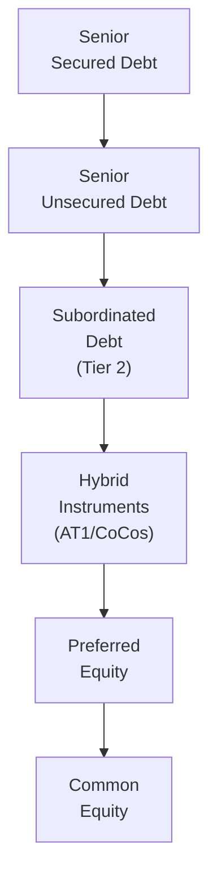

## Overview and Context

Hybrid corporate debt instruments sit in that interesting space between pure debt and pure equity, and they often carry unique features that can significantly influence both their risk-return profile and their role within an issuer’s capital structure. Sometimes, the concept feels a bit like, “Wait, is this a bond or a stock?” Well, it’s kind of both... partly. These securities include convertible bonds that can morph into equity, subordinated debt that ranks below most other obligations, and specialized “tiered” structures that financial institutions use to meet regulatory capital requirements. 

In this section, we’ll explore the essential features that classify a security as “hybrid,” delve into common types (convertible bonds, subordinated debt, and tiered instruments), evaluate how they’re valued and analyzed, and point out potential pitfalls. By the end, you’ll (hopefully) have a solid grasp of how to approach these securities—both from an issuer’s perspective and from that of an investor looking for extra yield or equity upside.

## Key Features of Hybrid Debt

### Convertible Bonds: Bond with an Equity Kicker

Convertible bonds are basically corporate bonds that can be exchanged—that is, converted—into the issuer’s equity shares at predetermined terms. You could almost think of it like buying a bond with a built-in call option on the company’s stock. The main attributes include:

- Conversion Ratio: This indicates how many shares investors get per bond upon conversion. For instance, a conversion ratio of 20 means each bond (with a par value, say, of USD 1,000) can convert into 20 shares.  
- Conversion Price: Implicitly tied to the conversion ratio. If the par value is 1,000 and the conversion ratio is 20, the implied conversion price per share is USD 50.  
- Conversion Premium: Represents how much higher this conversion price is than the current share price. Investors often pay that premium for the equity “optionality.”  
- Lower Coupon: Typically, these bonds offer a lower coupon rate compared to non-convertible bonds from the same issuer since investors receive that potential upside if the stock price rallies.

From an analysis standpoint, convertible bonds require you to keep one eye on credit risk and the other on equity risk. When the stock soars (and the bond is “in the money”), the price will likely reflect equity sensitivity. When the stock tanks, the price acts more like a straight bond (albeit with typically lower yield). 

#### How Convertibles Work in Practice

Let’s say you buy a convertible bond with a principal (par) of USD 1,000 and a conversion ratio of 25 shares. That means you can convert the bond into 25 shares at any time (subject to the issuance prospectus terms). If each share is trading at USD 40 initially, the implied conversion value is 25 × 40 = USD 1,000, which matches par. If the stock rises to USD 60, you can now convert your bond into 25 × 60 = USD 1,500 in stock. That’s the magic: your bond gave you a nice little equity kicker. And of course, if you decide you’d rather keep the bond, you still receive the coupon payments.

## Subordinated Debt: A Layer Below Senior Obligations

Subordinated debt ranks below senior debt but (usually) above equity in the capital structure. You might see these referred to as junior debt, but they’re basically the same idea—if the issuer goes into default, subordinated debtholders line up behind senior creditors. Not ideal, but in return, you typically get a higher yield.

Take banks as an example. They often issue subordinated notes designed to be recognized as part of their regulatory capital (like Tier 2 capital). In a winding-up scenario, subordinated debtholders might recover less, so rating agencies and investors scrutinize such bonds carefully. 

### Bail-In Capabilities

For certain regulated institutions (banks, insurers, etc.), subordinated debt can be forced to absorb losses before taxpayers or deposit insurance funds step in. This process is known as a “bail-in.” Essentially, regulators can partially (or fully) write down the principal of these instruments, or convert them into equity shares, to strengthen the issuer’s balance sheet in times of crisis.

## Tiered Instruments and Regulatory Capital

Financial institutions often structure capital in tiers (Tier 1, Tier 2, etc.) to comply with regulatory requirements established by authorities like the Basel Committee on Banking Supervision. 

- Tier 1 Capital: Historically included common equity and certain perpetual preferred securities with no maturity (or a very long maturity) and discretionary coupons.  
- Additional Tier 1 (AT1): Often includes contingent convertibles (CoCos) that automatically convert into equity or face a principal write-down if the issuer’s capital ratio falls below a specified trigger.  
- Tier 2 Capital: May include longer-dated subordinated bonds. Typically, these have fixed maturities and can be subject to partial amortization from a regulatory standpoint as they near maturity.  

These instruments often have specialized features, such as non-cumulative coupons (i.e., if a coupon is skipped, the issuer doesn’t owe it later), step-up rates on certain dates, and call features where the issuer can redeem them after a set number of years.

## Structural Diagram: Ranking in the Capital Structure

To visualize how subordinated and hybrid securities relate to senior bonds and equity, consider the following diagram:

Senior secured creditors hold the highest priority in a liquidation, while common equity is the most junior claim. Hybrids and subordinated bonds sit in the middle—above equity, but below senior obligations.

## Valuation and Analysis 

### Bond-Like Valuation Meets Equity Sensitivity

With hybrid debt, standard bond valuation techniques (present value of coupon and principal, credit risk spread analysis, etc.) are just the starting point. For a convertible bond, you also have to factor in the equity option component. One approach is to treat the security as the sum of:
1. A straight bond (discounted at an appropriate yield).
2. An embedded call option on the issuer’s stock.

From a discounting standpoint, analysts might use:
- The risk-free rate suitable for the bond’s maturity.  
- An appropriate credit spread, reflecting the issuer’s credit risk profile.  
- Equity volatility estimates, if the convertible’s embedded option is near or in the money.  

In the case of tiered instruments and CoCo bonds, you’d incorporate the probability (or at least the risk) that regulatory triggers could force a conversion or a principal write-down. That probability is certainly correlated with the issuer’s financial health, regulatory environment, and broader market conditions.

### Step-Up Coupons

Some hybrid instruments include a “step-up” feature. If an issuer chooses not to call the bond on a specified date, or if certain downgrade/credit events occur, the coupon might jump by a few basis points (for example, 50 bps or 100 bps). This step-up can compensate investors for increased risk or extended maturity. But it can also create complexities in modeling the expected future cash flows and deciding whether the bond is likely to be called.

### Accounting and Tax Considerations

Hybrid debt can be classified differently under IFRS versus US GAAP. Some convertibles may be accounted for partially as debt and partially as equity; that can lead to interesting ramifications for reported interest expense, leverage ratios, and equity. Tax-wise, coupons might be deductible for the company if the instruments are structured as debt, but not if they’re classified as equity. The heightened complexity often means issuers spend time (and money) orchestrating the best structure to meet corporate finance objectives.

## Risks and Protective Covenants

### Credit and Equity Risk

Convertible bondholders typically face the risk of a declining stock price, which dampens the convertible’s equity component. At the same time, they also face standard bond credit risk—that the issuer could default or face credit downgrades. For subordinated issues, the biggest risk is that in a “stressed” scenario, there might not be enough assets left after senior creditors are paid.

### Loss-Absorption Features

Many subordinated and tiered securities (particularly CoCos) include explicit conditions for principal write-down or forced conversion if regulatory capital levels (CET1 ratios, for instance) dip below a threshold. If that threshold is triggered, investors may see their bond investment turned into equity at a less-than-favorable conversion rate, or even see the bond’s principal vanish. That prospect is sometimes unnerving, to say the least.

### Call Dates and Extension Risk

Hybrids often carry call options for the issuer. There’s a risk that if the instrument remains in place despite expectations of a call, the investor might be locked into a lower coupon or higher interest-rate environment for longer than anticipated. Conversely, if the bond is called early, the investor must reinvest sooner, possibly at lower yields. This call structure can significantly affect pricing models.

## Practical Example: CoCo Bond During Crisis

Picture a mid-sized European bank that issues a CoCo bond with a 6% coupon, convertible to equity if the bank’s Common Equity Tier 1 ratio falls below 5.125%. If a sharp economic downturn drives losses in the bank’s loan portfolio, that ratio might sink below the trigger. The CoCos automatically convert, providing the issuer with a broader equity base and reducing its debt load in an urgent attempt to shore up solvency. As a CoCo holder, you’ve effectively become an involuntary equity investor—possibly at a price that’s unfavorable compared to the market. This is a prime example of that “bail-in” concept.

## Best Practices for Analysis

• Model the Bond and Embedded Options Separately: When analyzing convertibles, many investors use an option pricing model (like Black-Scholes) for the equity component, then discount the bond portion as a plain vanilla corporate bond.  

• Evaluate Triggers in CoCos or Bail-In Debt: Look at the specific solvency or capital triggers. Estimate the likelihood of crossing those thresholds based on forward-looking capital projections or stress tests.  

• Manage Extension Risk: For bonds with call features, try to anticipate the issuer’s likely call behavior, factoring in the shape of the yield curve, credit spreads, and coupon step-ups.  

• Consider Regulatory Changes: With Tier 1 or Tier 2 capital instruments, be mindful that regulators can evolve capital requirements or introduce new rules. 

## Common Pitfalls

• Overlooking Equity Volatility: Convertible bonds can be more sensitive to equity volatility than many new investors realize.  
• Mispricing in “Out of the Money” Convertibles: If the issuer’s stock is nowhere near the conversion price, the convertible might trade close to its bond floor. But if conditions change quickly, the embedded option could gain value.  
• Failing to Examine Contractual Loss-Absorption Features: CoCos and other bail-in securities can have different trigger levels and different ways they impose losses. Don’t just assume they’re all the same.  
• Neglecting Liquidity Differences: Some hybrid debt issues aren’t as actively traded as on-the-run senior bonds, leading to wider bid-ask spreads and less transparent price discovery.  

## References and Further Reading

- Maitland, T. V., “Convertible Securities: A Complete Guide to Investment and Corporate Financing Strategies.”  
- Basel Committee on Banking Supervision (BCBS) Publications:  
  https://www.bis.org/bcbs/  
- CFA Institute Articles on Hybrid Securities and Risk-Return Trade-Offs in Corporate Finance.  

## Final Exam Tips

• Understand the Key Drivers: Grasp how stock price movements, credit risk, capital structure rank, and regulatory triggers all influence hybrid bond pricing and returns.  
• Practice Valuation Scenarios: Work through example questions that integrate changing interest rates, stock prices, and potential credit downgrades.  
• Know Your Terms: Keep the definitions of “conversion ratio,” “conversion premium,” “bail-in,” and “step-up coupon” at your fingertips—these are prime exam material.  
• Focus on Risk Analysis: The exam loves scenario-based questions that ask you to evaluate what happens if the issuer’s credit rating changes, the issuer fails to call, or the equity price declines.  

## Test Your Knowledge: Hybrid Corporate Debt Quiz



### Understanding Conversion Ratio

- [ ] The conversion ratio is the total amount of principal an investor can recover in default.
- [ ] The conversion ratio is the yield advantage offered by the convertible bond over straight bonds.
- [x] The conversion ratio is the number of shares received upon conversion of a convertible bond.
- [ ] The conversion ratio is the price at which a bond can be redeemed at maturity.

> **Explanation:** The conversion ratio tells investors how many shares they would receive for each bond they own if they decide (or are required) to convert from debt to equity.

### Step-Up Coupons

- [ ] Step-up coupons always decrease the bond’s coupon rate after a certain date.
- [x] Step-up coupons may increase the coupon if the issuer does not call the bond.
- [ ] Step-up coupons are not permitted in hybrid bonds.
- [ ] Step-up coupons only apply if a convertible bond is out of the money.

> **Explanation:** A step-up coupon feature means the coupon rate may increase at specific times (e.g., if the issuer does not call the bond on the first call date) or upon certain credit events.

### Priority of Claims

- [ ] Subordinated debt ranks higher than senior secured debt.
- [ ] Common equity ranks above all forms of subordinated debt.
- [ ] Preferred equity is always senior to Tier 2 subordinated debt.
- [x] Subordinated debt ranks below senior unsecured debt but above equity.

> **Explanation:** In a corporate capital structure, senior creditors are paid first in liquidation, followed by subordinated creditors, then preferred equity, and lastly, common equity.

### Bail-In Feature

- [ ] Bail-in provisions protect subordinated bondholders from losses in a default.
- [ ] Bail-in provisions require equity investors to buy back the firm’s debt.
- [x] Bail-in provisions allow regulators to impose losses on certain bondholders to stabilize a failing institution.
- [ ] Bail-in provisions are illegal in most jurisdictions.

> **Explanation:** A bail-in feature (often found in bank subordinated debt or CoCos) can convert bonds into equity or write down principal to strengthen the issuer’s balance sheet.

### Convertible Bond Pricing

- [x] A convertible bond’s value is generally the sum of its straight bond value plus an equity option.
- [ ] A convertible bond is always priced the same as an equivalent straight bond.
- [x] A convertible bond’s price may rise with the issuer’s stock price.
- [ ] A convertible bond offers higher coupons than similar non-convertible bonds.

> **Explanation:** Convertible bonds trade like the combination of a plain vanilla bond and a call option on the issuer’s stock. Its market price responds to both credit conditions and equity price movements.

### Trigger in Contingent Convertibles (CoCos)

- [ ] The trigger is the final maturity date of a CoCo bond.
- [x] The trigger is often based on a regulatory capital ratio that, if breached, forces conversion or write-down.
- [ ] The trigger is the credit rating assigned by Moody’s or S&P.
- [ ] The trigger is a specific absolute share price of the issuer.

> **Explanation:** CoCo bonds rely on predefined solvency or capital-ratio thresholds. If the issuer’s financial metrics deteriorate below that threshold, the bonds automatically convert or partially write down.

### Subordinated Debt Yield Behavior

- [x] Subordinated debt typically carries higher yields than senior debt from the same issuer.
- [ ] Subordinated debt typically carries lower yields than senior debt from the same issuer.
- [x] Subordinated debt carries no default risk.
- [ ] Subordinated debt is risk-free if the issuer is an investment-grade company.

> **Explanation:** Subordinated debt usually compensates investors with higher yields because it has lower priority in a liquidation scenario and, thus, higher credit risk.

### Non-Cumulative Coupons

- [x] Missed coupon payments on certain hybrid instruments are not owed later.
- [ ] Non-cumulative coupons must be repaid double in the next coupon period.
- [ ] Non-cumulative coupons apply only to municipal bonds.
- [ ] Non-cumulative coupons automatically trigger forced conversion.

> **Explanation:** Some Tier 1 bank securities (e.g., certain perpetual preferreds) have non-cumulative coupons, meaning the issuer isn’t obliged to pay missed coupons at a later date.

### Conversion Premium

- [ ] Conversion premium is the lowest yield an investor is willing to accept.
- [x] Conversion premium is the amount by which the convertible bond’s implied conversion price exceeds the current stock price.
- [ ] Conversion premium is the principal amount of a convertible bond.
- [ ] Conversion premium equals the coupon rate differential between standard bonds and convertible bonds.

> **Explanation:** The conversion premium shows how much more expensive the conversion price is relative to the stock’s current price, reflecting the additional cost for the equity option privilege.

### Hybrid Securities and Credit Ratings: True or False

- [x] True
- [ ] False

> **Explanation:** Credit rating agencies generally assign lower ratings to subordinated or hybrid securities than to senior obligations from the same issuer. This is due to potential loss absorption, equity conversion, and subordination features.


