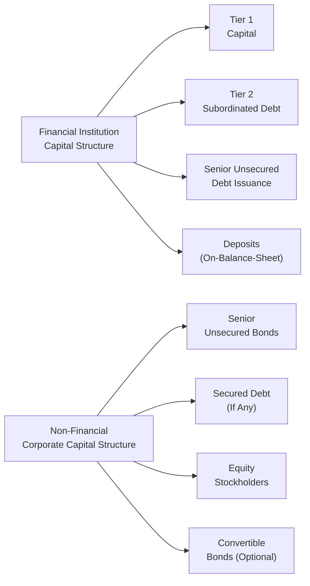

## Introduction

I remember once chatting with a colleague who specialized in analyzing bank bonds. We were both looking at corporate debt, yet the metrics we focused on felt totally different. I was more used to analyzing industrial manufacturing firms—focused on things like operating cash flows, factory expansions, or raw material costs—while my colleague talked about capital ratios, liquidity coverage, and something called Tier 1 subordinated debt. It was obvious that financial and non-financial companies issue bonds under vastly different constraints and market perceptions.

In this section, we’ll explore these differences in detail, weaving together a story of how financial institutions—like banks or insurance companies—raise debt in ways that satisfy regulatory requirements, and how non-financial companies—like technology giants or food manufacturers—issue bonds to finance projects, expansions, or working capital. We’ll look at the regulatory, structural, and credit analysis angles that underlie both segments of the corporate debt market.

## Structural Distinctions

One of the biggest differences between financial and non-financial corporate issuance lies in the bond structures available to each type of issuer. Financial institutions often tap specialized debt instruments like Tier 1 bonds or subordinated notes, largely driven by capital adequacy requirements. On the other hand, non-financial issuers might place more emphasis on project-specific financing or straightforward corporate bonds.

To visualize these distinctions, here’s a simplified Mermaid diagram illustrating how regulatory capital requirements influence a financial institution’s capital stack, compared to the capital structure of a typical non-financial corporate:

In broad strokes:
• Financial issuers must consider capital adequacy ratios (CAR) and maintain certain proportions of Tier 1, Tier 2, or even Tier 3 capital (in some older regulatory frameworks).  
• Non-financial corporates generally focus on whether a bond is secured or unsecured, and how it fits with other sources of financing such as equity or bank lines of credit.

## Regulatory Compliance and Capital Adequacy

Financial institutions are unique because of their regulatory oversight. Banks, for instance, are subject to capital adequacy frameworks such as Basel III, which sets requirements for minimum Tier 1 and Tier 2 capital. These rules aim to ensure banks have enough capital to safeguard depositors and maintain systemic stability. As a result, banks issue specific capital instruments—often subordinated bonds that can absorb losses in times of stress. Insurance companies have similar solvency requirements, especially in jurisdictions guided by Solvency II (in the EU) or analogous regulations elsewhere.

Non-financial firms, on the other hand, don’t usually face these capital-ratio constraints. Instead, they must ensure solvency through robust operational performance. They might employ a more balanced approach to debt issuance—one that prioritizes projects, acquisitions, or expansions rather than focusing on meeting regulatory capital thresholds. This difference naturally leads to variations in covenant structures and credit analysis.

## Credit Analysis Perspectives

Credit analysis has a different flavor depending on whether the issuer is a financial or non-financial entity:

• Financial Issuers  
  – Emphasis on capital ratios such as the Common Equity Tier 1 (CET1) ratio.  
  – Loan loss provisions and non-performing assets are key indicators for banks.  
  – Liquidity positions (e.g., the Liquidity Coverage Ratio, or LCR) are closely monitored to ensure short-term obligations can be met.  
  – Off-balance-sheet exposures like derivatives or credit guarantees can deeply affect risk profiles.  

• Non-Financial Issuers  
  – Focus on business risk profile, operating margins, and predictable cash flows.  
  – Competitive positioning, sector outlook, and free cash flow generation form the foundation of credit analysis.  
  – Capital expenditures (CapEx) and potential expansions or acquisitions shape the company’s debt-servicing capacity.  
  – Covenant restrictions often revolve around maintaining certain leverage ratios (Debt/EBITDA) or interest coverage ratios (EBIT/Interest Expense).

Let’s take a step back and bring in a light anecdote: if you’ve ever tried to look at bank financial statements next to, say, a steel manufacturer’s statements, you know it’s like reading two different languages. One statement is heavy on interest income, deposits, and loan loss reserves, while the other is all about products shipped, revenue from operations, and cost of raw materials. This difference runs all the way through to how their bonds get structured and priced in the marketplace.

## Risk Profiles and Market Perceptions

Financial issuers often operate under a heightened level of market scrutiny because the solvency of a bank can shift fast if there’s a negative run on deposits or if loan books deteriorate. When you combine that with regulatory oversight, you get bond spreads that can be more volatile in times of economic stress. If interest rate policy suddenly changes, banks feel the pinch on net interest margins, and any mismatch between assets and liabilities can quickly ripple through their balance sheets.

Non-financial corporate issuers are less exposed to monetary policy in such a direct sense. Instead, they’re more sensitive to changes in consumer demand, commodity price fluctuations, and supply chain issues. Think of an airline issuer: rising fuel costs and changes in traveler demand can drive their bond spreads up or down. Or a tech company might face volatility if the demand for devices falters or global competition heats up.

## Covenants and Control Provisions

The covenant structures for financial institutions differ greatly from those of industrial or service-based firms. Financial issuers might have to maintain specific capital adequacy levels or meet directives tied to regulatory compliance. There can also be cross-default triggers linked to other obligations or even to depositary conditions.

For non-financial corporates, covenants typically revolve around operating performance—sometimes restricting the payment of dividends if debt coverage ratios are breached, or limiting how many additional secured bonds can be issued. These covenants are designed to retain enough cash to service the debt and protect bondholders by monitoring the issuer’s leverage and other financial metrics.

## Interest Rate Risk Management

Financial institutions generally have specialized asset-liability management (ALM) departments. They juggle interest rate derivatives, hedge interest rate exposures, and optimize the maturity mismatch. For example, banks collect a lot of deposits (short-term) but might lend that money out in longer-term mortgages and business loans. That interest rate mismatch is carefully monitored.

Non-financial corporates also face interest rate risk, but it’s often related to big-ticket capital expenditures or expansions. The CFO might decide to lock in a fixed rate on new debt if they anticipate rising rates—especially for major projects that span multiple years. While these hedges can be sophisticated, they usually aren’t as elaborate as a bank’s ALM framework.

## Case Study: Bank vs. Manufacturing Giant

Imagine ABC Bank and XYZ Manufacturing preparing to issue bonds:

• ABC Bank:  
  – Needs to raise subordinated debt that qualifies as Tier 2 capital.  
  – Must comply with a minimum capital ratio under Basel III.  
  – Issues a 10-year Tier 2 note at a spread that reflects regulatory absorption features (in the event of severe losses, the note may convert to equity or be written down).  

• XYZ Manufacturing:  
  – Looking to finance a new production line for its expanding business.  
  – Issues a 7-year plain-vanilla corporate bond with fixed coupons to match the expected operational cash flow from the new facility.  
  – The covenant might require maintaining a Debt/EBITDA ratio below a certain threshold, ensuring that the manufacturing firm doesn’t become overleveraged.

## Glossary Highlights

• Capital Adequacy (CAR): Banks compare their available capital to their risk-weighted assets to ensure they can absorb losses.  
• Loan Loss Provision: Funds set aside for potential defaults in a bank’s lending portfolio.  
• On-Balance-Sheet Liabilities: For a bank, this commonly includes deposits. Non-financials often have simpler liabilities like trade payables or long-term debt.  
• Off-Balance-Sheet Exposures: Derivatives or letters of credit that may not appear prominently in standard balance sheet line items but can significantly impact risk.  
• Funding Profile: The mix of short-term vs. long-term financing. Deposits vs. wholesale funding for banks; corporate bonds, commercial paper, or bank loans for non-financials.  
• Liquidity Coverage Ratio (LCR): Requirement for banks to hold sufficient high-quality liquid assets to meet 30-day cash outflows.  
• Solvency Ratio: Reflects a company’s capacity to meet long-term obligations. For banks, it’s measured in part by CAR; for non-financials, it’s about debt-to-equity ratios and ongoing cash flow generation.  
• Business Risk Profile: Operational risks that a company faces, distinct from financial leverage. This is crucial for non-financial firms that rely on stable consumer demand or production processes.

## Best Practices and Potential Pitfalls

It’s easy to conflate the risk considerations for financial and non-financial corporates if you look only at their bond yields and forget all the behind-the-scenes mechanics. Here are a few pointers:

• Avoid using the same credit analysis template for both financial and non-financial issuers. They’ve got different sets of key metrics.  
• Stay alert to rapid shifts in market perception for financial institutions—especially when signs of a credit crunch or bank run appear.  
• For non-financial issuers, watch any major change in business strategy or acquisitions that could upend the existing debt service plan.  
• Regulators can significantly alter the profitability and risk profile of banks through changes in capital requirements.  
• Monetary policy changes can have an outsized effect on banks’ net interest margins but can also indirectly affect non-financials by changing consumer demand.

## Practical Financial Examples

1. During the 2008 financial crisis, large banks quickly felt pressure on their Tier 1 capital as mortgage-backed securities turned bad. Their bond spreads spiked, and many had to be recapitalized by government funds.  
2. Meanwhile, a global automaker during the same period saw bond spreads widen as car sales plummeted, but the focus was more on operational cash flow, inventory backlog, and the ability to launch new models—even though it, too, required government assistance in some cases.

## Additional Real-World Scenarios

• Low-Interest Rate Environments: Banks might see their net interest margin shrink, prompting them to issue more Tier 2 bonds to shore up regulatory capital. Non-financials might rush to lock in cheap borrowing costs.  
• Commodity Price Fluctuations: If a materials producer faces a surge in commodity prices, it might refinance existing debt or issue new bonds to ride out the disruption in operating cash flow.  
• Tighter Regulatory Requirements: A new regulation might require banks to hold more high-quality liquid assets, forcing them into costlier funding structures. Non-financials won’t be directly affected—but might see a cascade effect in stricter lending conditions from banks.

## Conclusion

Financial vs. non-financial corporate issuance can at first glance seem to produce similar instruments—bonds that pay interest over time. But once you dive into regulatory capital rules, credit analysis frameworks, and the triggers that move market perceptions, you see these two exist in whole different ecosystems. If you’re analyzing or investing in the bonds of a financial institution, pay close attention to capital adequacy, liquidity coverage, and deposit stability. If you’re scrutinizing non-financial corporate debt, keep your eye on business operations, free cash flow, and sector dynamics.

Above all, it’s crucial to remember that bonds are more than just yields—they’re a reflection of an issuer’s balance sheet realities, strategic decisions, and in the case of banks, broader systemic health. Staying nimble and informed will help you navigate these complexities in both financial and non-financial corporate debt markets.

## References and Further Reading

• Frederic S. Mishkin, “Banking and Financial Institutions.”  
• SEC Filings (10-K for US companies) to compare capital structures between financial and non-financial corporates: https://www.sec.gov/edgar  
• IMF Global Financial Stability Reports for macro-level analysis of financial sector issuance trends: https://www.imf.org/external/pubs/ft/gfsr  

---

## Assessing Your Understanding of Financial vs. Non-Financial Corporate Issuance



### Which feature primarily distinguishes financial issuers from non-financial issuers in the bond market?

- [ ] The requirement to pledge collateral for each bond.
- [ ] The complete exemption from regulatory oversight in all jurisdictions.
- [x] The need to meet certain capital adequacy or solvency regulations.
- [ ] The use of floating-rate notes in every issuance.

> **Explanation:** Financial institutions, such as banks, must comply with capital adequacy requirements set by regulators (e.g., Basel III). Non-financials don’t face these formal capital ratio mandates.

### What is often a key metric in assessing credit risk for a major bank issuer?

- [ ] Daily sales outstanding (DSO).
- [ ] Operating margin trends.
- [x] Tier 1 capital ratio.
- [ ] Raw material inventory levels.

> **Explanation:** For financial institutions, especially banks, Tier 1 capital ratio gauges the capital base relative to risk-weighted assets. Operating margin or inventory levels are typically more relevant for non-financial corporates.

### For non-financial corporates, which factor typically matters most in determining bond spreads?

- [x] Business risk profile and free cash flow.
- [ ] Regulatory capital ratio compliance.
- [ ] Liquidity Coverage Ratio.
- [ ] Mandatory deposit reserves at central banks.

> **Explanation:** Non-financials are evaluated based on operational and cash flow strength. They aren’t directly measured on capital adequacy or deposit-related regulations, which apply to financial institutions.

### Which of the following represents a specialized bond format typically used by financial institutions to meet regulatory requirements?

- [ ] Convertible bonds.
- [ ] Perpetual bonds with no call feature.
- [x] Tier 2 subordinated bonds.
- [ ] Medium-Term Notes (MTN) for short-term capital.

> **Explanation:** Tier 2 subordinated bonds (and similarly Tier 1 bonds) help banks fulfill capital adequacy requirements. Non-financials usually do not need such specialized regulatory capital instruments.

### What is the main driver of bond spread volatility for financial institutions during economic stress?

- [ ] Changes in commodity prices.
- [x] Rapid shifts in market perception of bank solvency.
- [ ] Factory closures or operational disruptions.
- [ ] Overinvestment in marketing campaigns.

> **Explanation:** Financial institutions can experience swift market sentiment reversals based on solvency fears or regulator actions. Commodity prices or factory closures typically affect non-financials more directly.

### Which of the following covenants is most common for non-financial corporates?

- [ ] Maintaining a minimum Tier 1 ratio.
- [ ] Cross-default triggers for deposit withdrawals.
- [ ] Compliance with global liquidity coverage rules.
- [x] Limitations on leverage or interest coverage thresholds.

> **Explanation:** Non-financial corporate covenants often set caps on leverage (e.g., Debt/EBITDA) or mandate minimum coverage ratios. The other options are more typical of bank issuers.

### Which of the following is a key off-balance-sheet exposure for a financial institution that might not appear in a manufacturing company’s statements?

- [x] Credit default swaps or complex derivatives.
- [ ] Capital leases for operating equipment.
- [ ] Accounts receivable factoring.
- [ ] Inventory write-down reserves.

> **Explanation:** Banks frequently manage derivative exposures, such as credit default swaps. Non-financial manufacturers do not usually maintain significant derivatives portfolios strictly for counterpart credit risk transfer.

### Why do financial institutions often have robust asset-liability management divisions?

- [x] They face significant maturity mismatches between deposits and loans.
- [ ] They are prohibited from holding any type of fixed-income securities.
- [ ] They never hedge interest rate exposure.
- [ ] They have unlimited regulatory forbearance.

> **Explanation:** Banks collect short-term deposits but often lend in longer-term loans, creating a mismatch. ALM helps manage interest rate risk and liquidity, which is a unique challenge in financial institutions.

### A key difference in bond structures between financial and non-financial issuers is:

- [ ] Only financial institutions can issue convertible bonds.
- [ ] Non-financials must always include sinking fund provisions.
- [ ] Financial institutions cannot issue senior debt.
- [x] Financial institutions sometimes issue subordinated debt that counts towards regulatory capital.

> **Explanation:** Financials may issue subordinated debt qualifying as Tier 1 or Tier 2 capital. Non-financials typically stick to senior debt, secured or unsecured, without such regulatory designations.

### Capital adequacy requirements apply to which of the following issuers?

- [x] True
- [ ] False

> **Explanation:** Capital adequacy (e.g., Basel III) is relevant for financial institutions like banks and certain insurance entities. Non-financial corporates do not face these specific requirements.


