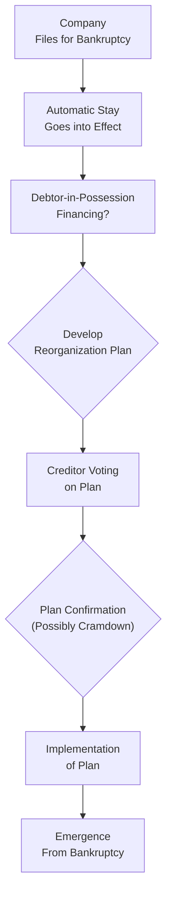

## Introduction

I’ll never forget the first time I ran into a Chapter 11 filing at a company I was analyzing. I sort of gulped, looked at the giant stack of court documents on my desk, and thought, “Wow, this is more complicated than I realized.” And, honestly, it was. Corporate bankruptcy and debt restructuring can be overwhelming—even for seasoned finance folks—because the process touches on corporate governance, legal frameworks, complex negotiations, and a swirl of creditor interests. But once you break down the steps, it’s not so bad. Really.

The purpose of this section is to walk you through the key concepts and typical processes involved in corporate bankruptcy and debt restructuring. We’ll start by contrasting two main approaches—reorganization and liquidation—then delve into how creditors assert their claims, how automatic stays and DIP financing work, and why some firms go the “informal” route rather than a full-blown court-supervised proceeding. By the end, you’ll get a sense of how each stakeholder might navigate these murky waters and what it all means for bondholders, equity holders, and everyone in between.

## Bankruptcy Frameworks around the World

While bankruptcy laws differ across jurisdictions, most systems revolve around two central paths:

• A reorganization approach, where the company seeks protection from creditors to restructure its obligations and (hopefully) continue operating.  
• A liquidation approach, where the company’s assets are sold off (sometimes at bargain prices) to repay creditors, and the corporate entity effectively ceases doing business.

If you’re in the United States, you’ve probably heard of Chapter 11 (reorganization) and Chapter 7 (liquidation). In the UK, there’s administration (roughly analogous to Chapter 11). Meanwhile, in Canada, you might see the Companies’ Creditors Arrangement Act (CCAA). Regardless of the labels, the overarching rationale is largely the same: to give financially distressed companies a formal path to resolving their debt load, whether that’s restructuring or winding down for good.

## Reorganization vs. Liquidation

### Reorganization

Reorganization entails creating a plan—often called a Reorganization Plan—to modify the company’s capital structure in a way that allows operations to continue. It might extend debt maturities, reduce coupon rates, or even convert part of the debt into equity (we often call that a debt-for-equity swap). In many jurisdictions, the court places an Automatic Stay on debt collection efforts. This is basically a “pause button” preventing creditors from seizing assets or demanding immediate repayment. The idea is to give the firm breathing space to figure out a plan that maximizes overall value.

If creditors and the company’s management can’t voluntarily agree (that’s the dream scenario), there can be something known as a “cramdown.” Courts might force certain dissenting creditors to accept a plan if it’s reasonable and meets specific legal criteria. Think of it as the court saying: “Look, we have to keep this business going, and this plan is fair enough—so you can’t block it.”

When all is said and done and the reorganization is approved, some companies may adopt “Fresh Start Accounting.” Under these rules, the reorganized company effectively resets its balance sheet at fair values, giving it, well, a fresh start.

### Liquidation

Not all bankrupt companies survive. Sometimes the best option is to liquidate—that is, sell off the assets piece by piece to repay creditors. In U.S. parlance, that’s Chapter 7 bankruptcy. For bondholders and other unsecured creditors, liquidation often yields less than face value, which is a sobering reminder that bond investing always carries default risk.

Investors often measure the company’s Liquidation Value—an estimate of what its assets would fetch in a quick sale. Liquidation Value usually runs below the going-concern value because you’re forced to sell quickly, often at distressed prices. If you suspect liquidation is likely, you can’t simply assume you’ll be made whole on your bonds, no matter the original credit rating.

## Priority of Claims

Bankruptcy is a fight over a shrinking pie, so who gets paid and in what order really matters. The capital structure normally has a “waterfall” priority:

1. Secured creditors (with specific collateral backing their loans).  
2. Unsecured creditors (e.g., bondholders who don’t have collateral).  
3. Subordinated creditors (those specifically ranked below other creditors).  
4. Equity holders (the owners of the firm).

Under normal circumstances, equity is last in line. In many reorganizations, equity holders might get wiped out or see serious dilution. Meanwhile, secured creditors usually have the safest claim, because they can rely on their collateral. That said, even secured creditors face haircuts in certain scenarios. A “Haircut” is just a nice way of saying you’re forced to take less than you were promised—like being owed $100 but only receiving $70.

## Automatic Stay

The Automatic Stay is a critical feature in many formal bankruptcies. Essentially, once a bankruptcy proceeding begins, creditors can’t enforce or collect on their debts without court permission. Ever had someone repeatedly knocking on your door for payment? Now imagine the court says, “Stop knocking temporarily. Let’s figure this out.” The stay gives the company precious time to develop a strategy. Without it, you could have a free-for-all, with creditors racing to grab assets as quickly as possible.

## DIP Financing (Debtor-in-Possession)

Now, if a company is truly strapped for cash, how can it keep the lights on while it’s in bankruptcy? This is where DIP Financing comes in. A lender might offer new credit to the bankrupt company, typically at very favorable priority status—super-priority, we call it—so that no one else can outrank the DIP lender’s claim. Why would a lender do this? Usually, it’s loaded with conditions, but if successful, it can be quite profitable because DIP lenders often earn higher rates and robust collateral protections. It’s a lifeline that can help distressed firms buy time during reorganization.

## Formal vs. Informal Restructuring

### Formal (Court-Supervised)

Formal restructuring is where you have a full-blown legal process under some bankruptcy code. Many times, this includes:

• Filing for insolvency or bankruptcy protection with the court.  
• A thorough review of claims and a verification process to ensure each creditor’s claim is valid.  
• Potential formation of creditor committees (e.g., a committee for unsecured creditors) to negotiate on behalf of larger creditor groups.  
• The reorganization plan or liquidation plan, culminating in either the emergence of a new capital structure or a dissolution of the company.

### Informal (Out-of-Court)

An out-of-court restructuring is a more flexible, less public approach. Companies sometimes opt for a “workout” arrangement with key creditors to achieve extended maturities, lower interest rates, or partial debt forgiveness. This route avoids the stigma and complexity of going to court, but it demands that all the major players cooperate. If many creditors hold out or refuse to compromise, an informal restructuring might fail, forcing a formal filing.

A popular variant is the Pre-Packaged Bankruptcy (“Pre-Pack”), where most of the big creditors have already agreed on the restructuring plan prior to the official filing. The moment the company files, the plan is ready for a quick approval, saving both time and legal expenses.

## Debt Restructuring Tools

When we talk about “debt restructuring,” you’ll see a handful of go-to tools companies and creditors use:

• Maturity Extension: Creditors agree to push out the debt’s due date, giving the firm more time to improve cash flows.  
• Coupon Reduction: Lenders or bondholders accept a lower coupon rate, easing the company’s immediate interest burden.  
• Principal Write-Down: Sometimes called a “haircut.” The amount owed is permanently reduced to reflect current economic realities.  
• Debt-for-Equity Swap: Creditors trade some (or all) of their debt for an ownership stake. This can drastically reduce fixed obligations and possibly let creditors share in any eventual upside if the reorganized company recovers.

## Negotiations and Creditor Committees

Anyone who’s ever tried to plan a family reunion knows that bigger groups often mean bigger complications. Creditor negotiation is no different—some folks will be quick to compromise, while others dig in. That’s why creditors often form committees. A committee’s mandate is to represent various creditor classes in negotiations. An unsecured creditors’ committee is especially common in U.S. Chapter 11 proceedings, for example. Their job is to protect the interests of that creditor group, ensuring no unscrupulous deals slide through.

Legitimate financial disclosures are crucial here. After all, how can creditors decide whether to accept 50 cents on the dollar if they’re not sure whether the company’s balance sheet is accurate or if certain assets are undervalued? That’s why professional valuations, balanced governance, and transparent reporting can make or break a restructuring.

## Practical Example

Let’s take a hypothetical scenario: WhaleCo is a mid-sized manufacturing firm that borrowed heavily to expand its factory network. Unfortunately, a demand slump hit, and WhaleCo found itself unable to meet debt obligations. After consulting with a turnaround specialist, WhaleCo determines that an informal deal with its major bondholders might work. Here’s the approach:

• WhaleCo requests a “standstill agreement” from creditors for 120 days—meaning creditors promise not to escalate collections as WhaleCo tries to find a solution.  
• A group of large bondholders form a bondholder committee.  
• WhaleCo’s CFO presents a plan showing that if coupon rates get cut by 1.5% and maturities extend by three years, the firm can stay afloat.  
• The bondholder committee demands an equity sweetener. WhaleCo proposes converting 20% of outstanding bond principal into new shares of stock.  
• The parties weigh the “what if” scenario of formal bankruptcy and realize forced liquidation could mean bigger losses. They ultimately strike a deal.  

In this case, WhaleCo avoids bankruptcy, investors see partial recovery (plus potential upside from the new stock positions), and a crisis is averted.

## Common Pitfalls and Strategies for Success

• Pitfall: Underestimating the complexity. Because bankruptcy laws are multi-layered, ignoring legal nuances can cause delays or cost overruns.  
• Pitfall: Poor communication. Holding back vital financial data fosters distrust among creditors and can torpedo negotiations.  
• Strategy: Early Engagement. If distress is on the horizon, it’s often best for management to engage creditors proactively. Surprises rarely improve outcomes.  
• Strategy: Evaluate DIP Financing Early. For severely illiquid companies, DIP financing can keep the lights on. Just be mindful of the super-priority it grants the new lenders.  
• Strategy: Hire Experienced Professionals. Restructuring lawyers, financial advisors, and valuation specialists help you navigate the labyrinth of rules and negotiations.

## Diagram: Simplified Bankruptcy Process

Below is a simplified diagram (using Mermaid) of how a typical bankruptcy might unfold—especially relevant for reorganizations:

• Once the company files, an automatic stay halts creditor collection.  
• The company might seek DIP financing to maintain operations.  
• Management drafts a reorganization plan, which creditors then vote on.  
• The court may confirm the plan—even forcing some holdouts to accept (cramdown)—if certain legal tests are met.  
• Upon plan implementation, the strategic changes take effect, and the firm can exit bankruptcy with a new, leaner capital structure.

## Summary

Bankruptcy can look pretty scary on the surface, but it’s essentially a structured way to figure out who gets paid what (and when) in a worst-case scenario. For bondholders and other creditors, it highlights the importance of understanding the priority of claims and the real risk of default. For companies, it underscores the importance of prudent capital management, transparent governance, and constructive engagement with stakeholders during times of financial distress. In some cases, the business emerges more resilient than before—albeit with some new owners and a trimmed-down balance sheet.

## Final Exam Tips

• Familiarize yourself with local legal frameworks: Terms like “Chapter 11,” “Chapter 7,” “administration,” or “CCAA” can appear in scenario-based questions, so be sure you understand the principles behind them.  
• Priority of claims is a top-tested topic: You absolutely need to know the waterfall structure.  
• Debt restructuring techniques often show up as short-answer questions: Extend maturity, reduce coupons, or convert debt to equity? Be prepared to explain the pros and cons.  
• Watch out for subtle distinctions: For instance, DIP financing’s super-priority status or the effect of an automatic stay on existing lenders.  
• Ethics and disclosure: The CFA Institute Code and Standards emphasize fair dealing and full disclosure—particularly relevant when dealing with multiple creditor classes.

## References and Further Reading

• Altman, E. I. (Various Editions). “Bankruptcy and Distressed Restructurings.”  
• Official U.S. Courts Website: <https://www.uscourts.gov/>  
• Turnaround Management Association: <https://turnaround.org/>  
• CFA Institute Level I Curriculum (Fixed Income).  

## Bankruptcy Processes and Debt Restructuring: Quiz



### When is a liquidation approach typically chosen over a reorganization approach?

- [x] When a firm’s going-concern value is lower than the expected liquidation proceeds.  
- [ ] When unsecured creditors are willing to accept a cramdown.  
- [ ] When DIP financing is unavailable.  
- [ ] When the automatic stay is in effect.  

> **Explanation:** Liquidation is generally pursued if the going-concern value is so low that liquidation yields a higher net recovery for creditors.

### Which best describes a “haircut” during the restructuring process?

- [ ] A new DIP financing facility that places existing creditors at a disadvantage.  
- [x] A reduction in the principal or interest owed to creditors.  
- [ ] An arrangement where debt is exchanged for equity.  
- [ ] A release of secured collateral by creditors.  

> **Explanation:** A "haircut" refers to creditors accepting less than the full amount owed, either in principal or interest.

### Under U.S. bankruptcy legislation, which of the following is a key characteristic of Chapter 11 proceedings?

- [ ] Mandatory liquidation with net proceeds distributed to creditors.  
- [ ] Immediate repayment of unsecured claims.  
- [x] Reorganization under court supervision.  
- [ ] Strict prohibition on DIP financing.  

> **Explanation:** Chapter 11 is associated with reorganization, allowing the firm to operate while restructuring.

### What is the primary purpose of an automatic stay in bankruptcy?

- [x] To pause creditor collection efforts and protect the debtor’s assets.  
- [ ] To require creditors to immediately accept a cramdown arrangement.  
- [ ] To ensure the liquidation process starts quickly.  
- [ ] To convert all senior debt to equity.  

> **Explanation:** The automatic stay is designed to prevent creditors from pursuing claims while the firm works on a reorganization plan.

### What is one advantage of an out-of-court restructuring compared to a formal (court-supervised) bankruptcy?

- [x] It can be faster, cheaper, and less public.  
- [ ] It forces all creditors to accept the new repayment plan.  
- [x] It typically includes fresh start accounting on the balance sheet.  
- [ ] It guarantees higher recoveries to subordinated creditors.  

> **Explanation:** Out-of-court restructurings can be more flexible and less expensive, but they require voluntary agreement and do not guarantee higher recoveries.

### Which statement about secured creditors is true in most bankruptcy jurisdictions?

- [x] They generally have priority claims on the assets pledged as collateral.  
- [ ] They are always paid last in liquidation.  
- [ ] They are subordinate to unsecured creditor claims.  
- [ ] They have no voting rights on reorganization plans.  

> **Explanation:** Secured creditors are paid first up to the value of their collateral, ahead of unsecured creditors.

### Which of the following is true about DIP (Debtor-in-Possession) financing?

- [ ] It is only available after the plan of reorganization has been confirmed.  
- [x] It takes priority over most existing unsecured debt.  
- [x] It requires no court approval under Chapter 11.  
- [ ] It always pays back existing equity holders before DIP lenders.  

> **Explanation:** DIP financing holds super-priority status, ranking above most other unsecured debt, but it does require court approval in U.S. bankruptcy proceedings.

### A company's creditors have formed a committee during bankruptcy proceedings. This committee is most likely:

- [x] A representative group of creditors working together on restructuring negotiations.  
- [ ] A permanent oversight body from the bankruptcy court.  
- [ ] A team of external auditors verifying the firm’s financial statements.  
- [ ] A private equity consortium planning to buy the firm’s assets in liquidation.  

> **Explanation:** Creditor committees represent the interests of a certain class of creditors and help negotiate with the debtor.

### What is a “pre-packaged” bankruptcy?

- [x] A reorganization plan already approved by major creditors prior to the formal filing.  
- [ ] A plan mandated by the court without any input from creditors.  
- [ ] A fast-track liquidation scenario.  
- [ ] A scenario in which equity holders are always made whole.  

> **Explanation:** “Pre-packs” are completed faster because the big stakeholders agreed on the restructuring plan before filing.

### True or False: Priority of claims in bankruptcy always guarantees that unsecured creditors will receive par value of their debt before equity holders.

- [x] True  
- [ ] False  

> **Explanation:** Unsecured creditors must be paid before any equity distribution. However, they are not guaranteed par value; they just rank ahead of equity in the waterfall.


