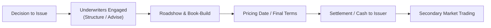

## Overview

Corporate bonds play an essential role in global capital markets, providing firms with a means to raise long-term debt for expansions, acquisitions, or general capital needs. In contrast to equity, issuing bonds allows companies to retain control while paying periodic interest to investors. Yet, the path from deciding to issue a bond to seeing it actively trade in the secondary market can be quite a journey—one that involves underwriters, regulatory documentation, roadshows, book-builds, and thorough prospect analysis, among other steps.

Honestly, when I first tried to wrap my head around corporate bond issuance as a new analyst, I felt like I was drowning in a hundred steps: legal documents here, price negotiations there, marketing to investors, final settlement… you name it. But once you break it down into stages, you realize it’s more like a systematic flow, from the idea of raising funds to analyzing how well the new bond meets investor needs and the issuer’s long-term plans.

Below, we walk through the core stages of corporate bond issuance, discuss what underwriters do, and explore how prospective bondholders often evaluate these deals. We’ll also highlight how the bond’s lifecycle is not entirely predictable—market sentiment, credit rating changes, and shifts in generational trends can make a corporate bond’s journey as fascinating as it is essential for funding. We’ll keep it slightly informal, so don’t be surprised if we slip in a few “ums” or personal experiences to keep it real.

## Preliminary Considerations: Assessing the Need and Timing

Before a corporation ever picks up the phone to call its investment bank, it has to figure out its funding needs and whether issuing a bond right now makes sense. Maybe the company’s planning a big expansion overseas, or perhaps it wants to refinance an existing, higher-rate bond that’s nearing maturity. Sometimes, corporations want a war chest for strategic acquisitions—just in case a juicy buyout opportunity appears.

During this early planning stage, treasurers and CFOs gauge:

• Current interest rate environment: Are rates favorable enough to lock in a decent coupon?  
• Corporatestrategy: Will the debt-financed project generate sufficient cash flows to service the bond?  
• Market conditions: Is market sentiment supportive of new issues in the company’s sector (for example, consumer goods might do well at certain times compared to energy or tech)?  

In practice, a CFO might say something like, “We’ve got a large capital project in the pipeline and want to keep the shareholders happy by not diluting equity—so let’s raise debt.” That’s the typical impetus for launching the next steps.

## Underwriting and Structuring the Deal

Once the decision is made, the issuer usually appoints one or more underwriters—usually investment banks—to guide the bond issuance process. Think of underwriters as the architects and contractors of a house project: they help structure the offering, propose an appropriate coupon, maturity, and any special features like call options or floating rates. They also handle the nitty-gritty: regulatory filings, credit rating discussions, and drafting the offering memorandum or prospectus.

Underwriters also help the issuer decide the bond’s size. For instance, the corporation might think it needs USD 300 million, but the underwriters might suggest that strong demand exists for up to USD 500 million at a slightly lower yield. Or the underwriters might advise limiting the size to avoid diluting existing bonds in the secondary market.

### Offering Memorandum vs. Prospectus

• Offering Memorandum (private placements): Used when the issuance targets a limited group of qualified or institutional investors under certain regulatory exemptions.  
• Prospectus (public offering): A more comprehensive document that must meet rigorous disclosure requirements from regulators (e.g., the SEC in the United States).  

Both documents outline risk factors, the firm’s capital structure, financial statements, the intended use of proceeds, and general disclaimers about forward-looking statements. Under IFRS or US GAAP, these documents will also indicate how the newly issued bonds might be treated in the company’s financial statements—whether as simple liabilities or if there’s any special accounting for convertible or hybrid features.

## Roadshow and Book-Build: Marketing the Deal

Now for the fun part. You may have heard of the “roadshow”—where underwriters and company executives literally (or virtually these days) travel around meeting potential investors. They present the story of the company, outline the bond features, and share why it might be a solid investment. It’s a bit like trying to sell your house: you want to highlight what’s great about it and address any concerns up front.

You might see big institutional players—pension funds, insurance firms, hedge funds—come to these meetings or dial in. The management team fields a flurry of questions: “How do you plan to use the proceeds?” or “Could you please clarify your contingency plan if revenue growth slows?” By the end of the roadshow, the underwriters have a clearer sense of investor demand and price sensitivities.

### Book-Build

During the book-build:

1. Underwriters gather “indications of interest” from potential investors at various yield or spread levels.  
2. They compile these orders into a “book,” analyzing how many bonds can be allocated and at what yield.  
3. Once supply (the size of the bond) is matched with demand (the aggregated orders), the final yield (i.e., price) is determined.  

This is a crucial step in the pipeline. If the demand is oversubscribed—meaning orders exceed the supply—the underwriter might tighten (lower) the yield or increase the issuance size to accommodate strong interest.

## Pricing, Settlement, and Listing

After the roadshow and book-build, underwriters and the corporate issuer set the definitive coupon rate, yield, and issue price:

• Pricing Date: The primary day on which the final terms are locked in, often reflecting the latest market interest rates and credit spreads.  
• Settlement Date: Typically a few days later, when investors pay for the bonds and the issuer delivers the securities in electronic form (commonly through clearing systems like DTC, Euroclear, or Clearstream).

On the balance sheet, the corporation records the bond as a liability and recognizes the corresponding cash proceeds. Under IFRS or US GAAP, any initial issuance costs might be capitalized and amortized over the life of the bond to align with revenue recognition standards. The details vary, so watch out for disclaimers in the issuance documents.

### A Quick Visual: Bond Issuance Lifecycle

Below is a Mermaid flowchart to illustrate the typical timeline:



Each step feeds into the next in a fairly linear (but occasionally iterative) process. In real life, you might have sudden re-pricing if markets shift violently (for example, a central bank announcement stirring rates).

## Secondary Market Trading and Post-Issuance Considerations

Once the bond is issued, the story doesn’t end—now it trades in the secondary market. It could be over-the-counter (OTC), where buyers and sellers complete trades via broker-dealers or electronic trading platforms. Liquidity can vary widely: well-known issuers with large issuance sizes might see robust trading volumes, while lesser-known or smaller issues can get a bit quiet.

There’s this sense of “did the bond live up to expectations?” If the corporation experiences financial turbulence—maybe it misses earnings or faces a lawsuit—its bond price can drop, and yields can rise. On the other hand, if the company outperforms and becomes a stronger credit, the bond price can climb. Even changes in interest rates or macroeconomic factors (like inflation expectations) can shift bond yields and prices dramatically.

Market makers help with liquidity by showing both bid and ask prices, but they typically rely on spreads to make a profit. Even in volatile market conditions (say, a sudden meltdown in a particular sector), they strive to provide quotes—but the spread can widen significantly, revealing the risk they’re taking on.

## Prospect Analysis: Evaluating Corporate Bond Issues

Now let’s zoom in on the bond from the investor’s perspective. Prospect analysis is fundamentally about investigating:

• The issuer’s financial health: revenue stability, profit margins, leverage, and liquidity.  
• The bond’s structural features: call provisions, sinking funds, or negative covenants.  
• The industry outlook: Does the issuer operate in a cyclical sector? Are they subject to commodity price swings, or is it more stable, like consumer staples?  
• The broader market environment: interest rate trends, investor appetite for risk, and comparable yields in the market.  

Just last year, a colleague of mine was analyzing a corporate bond prospect. She spent a week dissecting the issuer’s strategy to pivot into a new product line. Everything looked fine—until she noticed that about 70% of projected revenue was reliant on a single distribution channel. That concentration risk changed her entire view of the bond. She still ended up recommending it—albeit only up to a modest allocation—after adjusting the risk premium she demanded.

Speaking of risk premiums, keep in mind that corporate bonds typically trade at a spread over benchmark government bonds. The spread compensates for credit risk, liquidity risk, and other factors. Investors who do thorough prospect analysis assess whether that spread is worth the risk.

## Real-World Example: TechCo’s New Issue

Consider a mid-sized technology firm, TechCo, that needed USD 200 million to fund a major R&D project. The CFO approached three investment banks to underwrite the deal. After thorough consideration, a single lead underwriter was selected to structure a 5-year, 5.00% coupon note. Investor demand turned out to be oversubscribed. Book-building indicated that at a 4.90% yield, the order book reached nearly USD 400 million. TechCo and the underwriter then increased the issue size to USD 250 million. By the pricing date, the final yield was 4.85%. Settlement took place T+3 days, and TechCo used the net proceeds to ramp up research in artificial intelligence. 

Fast forward a year: interest rates had fallen, and TechCo’s financial results were ahead of projections. The bond’s yield in the secondary market dropped, raising its price. Investors who bought the notes at issuance and sold them at that point realized a healthy capital gain, in addition to the coupon received.

## Shelf Registration: Issuing Bonds Over Time

For companies anticipating multiple bond issuances, shelf registration can be a time-saver. It’s a pre-approval from a regulatory body (like the SEC) to issue a certain total amount of debt (or equity) over a specified period—commonly two to three years. Then, each subsequent “takedown” from the shelf simply updates the prospectus, rather than creating it from scratch.

## Key Steps in Prospect Analysis

1. Read the Prospectus/Offering Memorandum Thoroughly: Check for disclaimers, risk factors, capital distribution, and usage of proceeds.  
2. Assess Capital Structure: How much existing debt does the company have? Where does the new bond rank in the priority waterfall?  
3. Evaluate Covenants: Negative covenants (e.g., restricting further high-level indebtedness) can be crucial in protecting bondholders. Affirmative covenants (like maintaining insurance or certain financial ratios) likewise matter.  
4. Perform Credit Analysis: Look at coverage ratios (e.g., EBIT/Interest), leverage ratios (Total Debt/EBITDA), and profit margins. Has the issuer historically managed debt responsibly?  
5. Analyze the Industry and Market Environment: Is the sector booming or are revenues cyclical? Confirm that the bond’s spread is appropriate given the sector’s volatility.  
6. Compare to Peers: Do similarly rated bonds in the same industry trade at narrower or wider spreads? This helps you see if the offering might be mispriced.  

## Using Python for Simple Bond Yield Calculations (Optional Illustration)

Here’s a quick Python snippet that demonstrates how you might calculate a bond’s price given a yield, coupon rate, maturity, and frequency of payments. This is, of course, overly simplified—just to illustrate how straightforward bond pricing can be if you’re comfortable coding:

```python
import math

def bond_price(face_value, coupon_rate, yield_rate, years_to_maturity, payments_per_year=2):
    """
    Calculate the price of a plain vanilla bond using standard discounting of cash flows.
    """
    coupon_payment = face_value * coupon_rate / payments_per_year
    total_payments = int(years_to_maturity * payments_per_year)
    price = 0.0
    
    for t in range(1, total_payments + 1):
        price += coupon_payment / ((1 + yield_rate/payments_per_year)**t)
        
    price += face_value / ((1 + yield_rate/payments_per_year)**total_payments)
    return price

price_example = bond_price(face_value=1000, coupon_rate=0.05, yield_rate=0.0485, years_to_maturity=5)
print(f"Calculated Bond Price: {price_example:.2f}")
```

Note: This snippet doesn’t address special features (calls, floats, etc.), but it can be expanded for more complex scenarios (like embedded options or step-up coupons).

## Potential Pitfalls and Best Practices

• Overestimating demand: Issuers sometimes overestimate the market’s appetite for their bonds. This can result in under-subscription and forced adjustments in pricing.  
• Market volatility: A sudden shift in interest rates or a market shock can derail a planned issuance. Companies often monitor macroeconomic events (e.g., central bank announcements) to pick their issuance window.  
• Hidden covenants: Some covenants can appear harmless but may restrict the issuer’s strategic maneuvers, causing friction down the line if the issuer wants to take on new debt or spin off assets.  
• Inadequate due diligence: Investors who skip a detailed credit analysis or ignore disclaimers in the prospectus risk investing in a bond misaligned with their risk tolerance.

## Exam Relevance and Preparing for Questions

Readers preparing for exams—whether it’s the final levels of the CFA Program or other advanced finance qualifications—should focus on how each stage interrelates. You might encounter sample questions on:

• How to evaluate the creditworthiness of the issuer.  
• The role of underwriters and how the book-build process influences the final yield.  
• The difference between an offering memorandum and a prospectus.  
• Key covenant structures and their impact on bond risk.  
• Implications of an oversubscribed vs. undersubscribed offering.  

In essay-type questions, you could be asked to propose whether a corporation should issue a bond now or wait, based on market conditions. Item sets might ask you to interpret how a bond’s price changes if the issuer’s credit rating is downgraded. Make sure you’re comfortable reading a stripped-down prospectus excerpt and analyzing it for potential red flags or favorable features.

## References and Further Reading

• U.S. Securities and Exchange Commission (SEC) “Fast Answers: Prospectus” – Official guidance on public sales of securities.  
• Rosenbaum, J., & Pearl, J. “Investment Banking: Valuation, Leveraged Buyouts, and Mergers & Acquisitions” – A practical guide to underwriting processes.  
• Corporate Finance Institute (CFI) – Modules on bond issuance steps and best practices: https://corporatefinanceinstitute.com  
• Chapter 2.5 of this text for insights on ESG bonds and unique structures that might apply in corporate debt issuance.  
• Chapter 3.1 for more details on the primary bond market and underwriting.  
• IFRS 9 and ASC 470 (US GAAP) for guidelines on accounting for debt instruments.

Anyway, that’s the big picture. Once you grasp this lifecycle, it’s much easier to appreciate the synergy between a corporation’s financing strategies, the nuanced marketing involved, and how investors weigh risk vs. reward. Remember: you don’t have to be perfect at every step—just methodically understand the workflow and focus on the fundamentals.

---

## Test Your Knowledge: Corporate Bond Issuance Lifecycles Quiz



### Which document is typically required for a public bond issuance regulated by a securities commission?

- [ ] Offering Memorandum
- [x] Prospectus
- [ ] Company Articles of Incorporation
- [ ] Subscription Agreement

> **Explanation:** A prospectus is required for public offerings to ensure full disclosure of risks, financials, and use of proceeds.

### Which best describes “book-building” during a corporate bond issuance?

- [ ] It is a process of revising legal documents of the issuer’s charter.
- [ ] It is the official filing process with the securities regulator.
- [x] It is when underwriters collect investor demand and price indications for the bond.
- [ ] It is the process of investor negotiations to waive bond covenants.

> **Explanation:** Book-building is the process by which underwriters solicit investor demand to determine the final bond price and yield.

### A “roadshow” is primarily used to:

- [ ] File bond issuance paperwork with regulators.
- [ ] Secure insurance coverage for the bond.
- [x] Market the bond to potential investors and gauge demand.
- [ ] Change the bond’s maturity date.

> **Explanation:** A roadshow is a series of presentations and meetings to promote the bond and assess investor appetite.

### When is the bond issuer most likely to record the liability on its balance sheet?

- [ ] Immediately once the CFO proposes the bond issuance.
- [ ] At the moment the company receives a credit rating from an agency.
- [x] On the settlement date when proceeds are received.
- [ ] When the underwriters finalize the prospectus.

> **Explanation:** Issuers record the bond upon receiving the proceeds, which typically happens on the settlement date.

### In assessing a bond’s prospect analysis, which factor is least relevant?

- [ ] The issuer’s leverage ratio.
- [ ] Covenants restricting further indebtedness.
- [x] The personal spending habits of the CFO.
- [ ] The industry’s competitive landscape.

> **Explanation:** Personal spending habits of the CFO are not a key financial factor in corporate bond analysis. Far more relevant are leverage, covenants, and industry conditions.

### What does it usually mean if the issuance order book is oversubscribed?

- [x] Investors are demanding more bonds than the issuer wants to sell.
- [ ] The issuance fails to gather enough investor interest.
- [ ] The bond’s coupon rate is dropped by regulators.
- [ ] The bond must be issued at a deep discount.

> **Explanation:** Oversubscription means demand exceeds supply, often leading to a lower yield or increased issuance size.

### Which of the following is a typical reason for a corporation to pursue shelf registration?

- [x] To issue multiple tranches of debt over time without filing a new prospectus each time.
- [ ] To convert existing shares into bonds.
- [ ] To avoid legal responsibilities for future bond issuances.
- [ ] To automatically achieve a higher credit rating.

> **Explanation:** Shelf registration allows an issuer to raise capital in increments without repeating the full regulatory approval process.

### Which approach does IFRS generally require for bond issuance costs?

- [ ] Immediately expense all costs.
- [ ] Record them as stock-based compensation.
- [x] Capitalize and amortize them over the life of the bond.
- [ ] Include them as intangible assets without amortization.

> **Explanation:** Under IFRS (and similarly under US GAAP), issuance costs are generally capitalized and amortized over the bond’s term.

### How does a negative covenant protect bondholders?

- [x] By restricting certain actions of the issuer that may harm creditor interests.
- [ ] By guaranteeing a minimum stock price.
- [ ] By providing the issuer freedom to issue unlimited additional debt.
- [ ] By committing the issuer to pay dividends.

> **Explanation:** Negative covenants limit what the issuer can do—like incurring more debt or disposing of assets—thus helping protect existing bondholders.

### Investors typically compare a corporate bond’s yield against:

- [x] A benchmark government bond’s yield plus a credit spread.
- [ ] U.S. Treasury bills’ discount rate only.
- [ ] Equity indexes such as the S&P 500.
- [ ] Average personal loan interest rates.

> **Explanation:** Corporate bonds are usually quoted at a spread over comparable maturity government bonds, reflecting credit and other risks.


