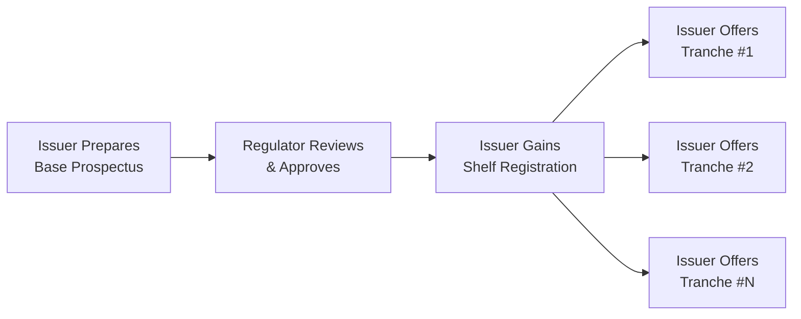
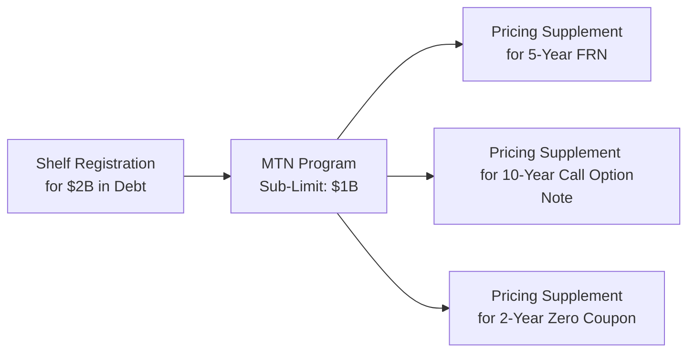

## Introduction

Sometimes people think that issuing corporate bonds is this big, one-off event, like a grand opening ribbon-cutting ceremony. You line everything up, gather officials, and do it all at once. But in real life, things can be much more nuanced. Maybe market conditions aren’t always so perfect. Or maybe you only need some capital today and more capital six months from now. Shelf registration and Medium-Term Notes (MTNs) were basically invented to address exactly these kinds of situations. In short, they help corporations manage their funding needs rapidly and flexibly. 

In this section, we’ll explore:
• How shelf registration works and why it’s beneficial for many issuers.  
• What Medium-Term Notes (MTNs) are, how they differ from regular corporate bonds, and why they’re favored by a variety of investors.  
• The regulatory background that underpins these programs (think SEC Rule 415 in the US and similar rules abroad).  
• Practical examples, best practices, and potential pitfalls when structuring or investing in these products.  

I still remember the first time I saw an MTN program in action: the issuing company released a small $50 million piece, practically under the radar, and folks in the market barely noticed. Months later, they tapped the same program for $200 million more. This flexible ability to “tap” the market can be truly powerful.

## Rationale for Shelf Registration

### Why Shelf Registration Takes Center Stage

Shelf registration is like having a pre-approved “shelf” of securities waiting to be sold. Under regulations such as SEC Rule 415 (in the US), a corporation (or even a government entity in certain cases) can initially register a large pool of securities—bonds, notes, or even equities—without having to go through the entire regulatory filing process each time. Instead, each time the issuer wants to sell a “tranche” of these securities, the issuer can simply file a shorter, updated document (often called a drawdown prospectus or supplement). 

Why is this arrangement so useful? Primarily because it saves time and issuance costs. You don’t have to do the full dance of regulatory and legal approvals for every single new offering. And that’s crucial in fast-moving markets (or when you’re juggling corporate treasury deadlines). As a result, many large companies prefer to register $1 billion or more in debt securities and then issue portions of it whenever conditions are favorable—or whenever they need a quick funding top-up.

### Key Benefits

• Speed to Market. Possibly the biggest advantage, allowing issuers to react quickly to interest rate movements, investor demand, or strategic financing needs.  
• Cost Efficiency. Legal, auditing, and underwriting fees can be consolidated into one big process rather than repeated over multiple smaller filings.  
• Brand Consistency. Because the program is already established, investors grow familiar with the standard base prospectus. Any new issuance is an easy read for them—detailed changes appear only in the supplement.  
• Flexibility of Tranches. Issuers can vary maturities, coupons, or currencies within the large shelf limit, customizing each offering to suit specific demand pockets.  

### How Investors Benefit

From the investor’s side, shelf registration can be appealing, too. Each time a new tranche is issued, investors get a simpler “term sheet” or “supplemental prospectus” that zeroes in on the important details—coupon, maturity, embedded options, and so on. Plus, they can often pick and choose from multiple such tranches over months or years, building a more dynamic allocation if they believe the issuer’s credit profile remains stable or improving.

## Key Steps in Shelf Registration

Although the process tends to vary by jurisdiction, a typical shelf registration might include the following steps:

1. Issuer Prepares a Base Prospectus: This is a comprehensive document that outlines the company’s fundamental financials, risk factors, business model, governance, etc.  
2. Regulatory Submission: The issuer files this base prospectus with the relevant market regulator (in the U.S., that’s the SEC).  
3. Approval and On-The-Shelf Status: Once approved, the issuer is free to issue securities up to a stated aggregate amount within a specified time.  
4. Tranche Issuance (via Drawdown Prospectus): For each new offering under the shelf, the issuer releases a shorter, updated disclosure focusing on the deal’s specifics (e.g., size, terms, rating updates).  
5. Ongoing Reporting: The issuer must keep the regulator and investors updated with any material changes to its business or financial condition.

In many cases, the availability of “automatic shelf registration” applies to larger, well-established firms that meet certain market capitalization or listing criteria. For smaller or newer companies, the process can be more stringent, requiring more frequent updates.  

Here’s a simple diagram illustrating how the shelf registration process works in broad strokes:

The key takeaway is that once you’ve got that base prospectus approved, subsequent offerings become much more fluid and less time-consuming.

## Medium-Term Notes (MTNs) – A Flexible Funding Channel

### Defining MTNs

Despite the name “medium-term,” these notes can have maturities ranging from 9 months to 30 years (or beyond sometimes). Historically, they were introduced to fill a maturity gap between short-term commercial paper and long-term corporate bonds, but the market quickly evolved into something more flexible and wide-ranging.

An MTN program allows issuers to offer debt securities on a continuous or periodic basis, often through one or more dealers. That means the company can effectively offer new notes to the market every week, every month, or whenever it sees fit, under the same overarching documentation framework. It’s like having a “standing menu” of possible debt instruments that can be customized for each investor’s preference.

### Contrast with Standard Corporate Bonds

Ordinary corporate bonds are typically issued all at once (like one big chunk of $500 million with a fixed coupon, a single maturity date, and fixed covenants). MTNs, by contrast, might be offered in smaller increments over time. Even the coupon structures can vary—a portion of an MTN program might feature floating rates, while another portion might come with fixed rates or even an embedded call or put option.  

Plus, the distribution mechanics differ. Standard bond deals often rely on an underwriting syndicate that markets the entire issuance on a single day or a short marketing window. MTNs can be sold in dribs and drabs—or large lumps—depending on investor appetite at any given moment, which is precisely why they’re so flexible for issuers.

### MTN Program Documentation

At the heart of an MTN program lies a base prospectus (similar to a shelf registration document) that describes the issuer’s financial standing, overall risk factors, and the broader structural terms under which notes may be issued. Each individual sale then uses a short “pricing supplement” or “term sheet,” specifying:

• Maturity date.  
• Coupon type (fixed, floating, zero-coupon, structured).  
• Currency (domestic, euro, or even exotic local currencies).  
• Optionality (call features, put features, currency conversions, etc.).  
• Any special covenants or credit enhancements.

Attaching many different variations is quite common. So you might see an issuer come out with a 2-year floating-rate note and, a week later, a 10-year fixed-rate note as part of the same MTN program.

## The Mechanics of Continuous Offering

While the shelf registration concept focuses on pre-approval for a lump sum of securities, the MTN concept focuses on ongoing sale of notes, often in smaller pieces, over an extended period. Sometimes the two go hand in hand. In some jurisdictions (like the United States), you can have a shelf registration on file, which then covers an MTN program. That synergy allows the issuer to issue tranches on short notice, each with a simple pricing supplement referencing the base prospectus.

Here’s a simplified diagram to show how an MTN program might function within a shelf registration:

Once approved, the issuer can keep issuing new notes under the same “umbrella.” Investors gain the benefit of consistent documentation and a streamlined due diligence process.

## Advantages of MTNs for Issuers and Investors

### Issuers

1. Customization. Each tranche can be sculpted to match investor preferences in maturity, coupon, or structure.  
2. Market Timing. The issuer can wait for favorable rates or strong investor demand and then tap the market.  
3. Lower Costs Over Time. Spreading out the costs of issuance across multiple tranches can be more economical than launching multiple standalone bond issues.  

### Investors

1. Diverse Offerings. A single issuer’s MTN program might generate notes with different maturities, currencies, or embedded features over time, allowing for targeted exposure.  
2. Possible Yield Pickup. In some cases, these notes might offer a yield premium relative to standard benchmark bonds.  
3. Ongoing Liquidity Opportunities. Because issuance is continuous, investors keen on the issuer’s credit can buy at multiple points in time.

## Regulatory Considerations and Rule 415

For U.S. issuers, SEC Rule 415 is the central piece of regulation that allows “shelf registration.” The rule aims to reduce the friction associated with repeated offerings, particularly for well-seasoned issuers. However, it also demands that the issuer maintain up-to-date disclosures. If there are any material changes (like a merger, major litigation, or a shift in credit ratings), the issuer has to amend its shelf documents so investors aren’t flying blind.

Overseas, other major markets have their own versions of shelf-like rules, often with similar goals: to facilitate capital raising while maintaining robust investor protections. In Europe, for instance, many issuers rely on a base prospectus approach under the Prospectus Regulation, especially for Euro MTN programs.

## Real-World Examples of Shelf Registration and MTNs

1. Global Corporate Conglomerate Inc. might register up to $5 billion in debt securities. They issue an initial $500 million 5-year bond right away to refinance existing debt. Six months later, seeing that interest rates have dropped, they decide to tap the shelf again for $300 million in 10-year notes. Then, a year after that, they might issue $200 million in floating-rate notes. All of it references the same base prospectus and remains under the $5 billion limit.

2. Fintech Growth Holdings might set up a $2 billion MTN program with a 3-year shelf life. They start by offering $50 million of 3-year floating-rate paper to a handful of institutional clients. If demand is high, the dealer can approach them to issue more, or they can wait a month and then sell another $100 million 7-year note to a different set of investors. This approach can help them build relationships with a wide array of bond purchasers over time, and they can even alter currency denominations if they see overseas demand (e.g., a few notes denominated in euro or yen).

## Risk Management and Investor Concerns

From an investor’s perspective, it might be easy to assume that because the issuer has a shelf or a respectable MTN program, everything’s safe. But remember, the underlying credit risk remains the same, so standard due diligence is key. Don’t gloss over those rating changes or the possibility that an issuer’s fundamentals have deteriorated since the original base prospectus was approved.

Potential areas that deserve extra attention:

• Credit Risk: The issuer’s financial health can change quickly, and each tranche is typically pari passu with other senior debt, so make sure you track leverage, coverage ratios, and rating agency commentary.  
• Liquidity in the Secondary Market: Sometimes these individually placed MTNs can be less liquid than standard corporate benchmark bonds. Always confirm whether the dealer maintains a secondary market.  
• Documentation Changes: Keep an eye out for any new or amended covenants that could affect your position if you buy a later tranche versus an earlier one.  

## Integrating Shelf-Registered and MTN Issuances into Corporate Capital Structure

### Coordinating with Existing Debt Obligations

Companies often have multiple layers in their capital stack, including bank loans, commercial paper lines, previously issued bonds, and so on. When introducing or expanding a shelf or MTN program, a good treasury team has to check whether any existing covenants restrict additional debt issuance or if the new notes might trigger cross-default provisions.

### Managing Interest Rate Risk

Issuers frequently use interest rate derivatives (like swaps) to transform the coupon characteristics of their debt. For instance, a company might prefer to issue floating-rate MTNs if short rates look attractive, and then swap half of them to fixed to maintain a steady blended interest cost. If the shelf program is large, each new issuance’s coupon and maturity can be fine-tuned in line with the firm’s broader interest rate exposure.

### Balancing Investor Appetite

I once heard a corporate treasurer describe an MTN program as “speed dating with bond investors”: you can meet a bunch of them, see who’s most interested in certain maturities, and close deals on quite short notice. This matches well with the finance function’s desire to build a diversified investor base. Rather than relying on a single, large underwriting in one day, the company can engage with distinct pockets of demand over time.

## Potential Pitfalls, Common Mistakes, and Best Practices

• Overlooking Documentation Updates. If an issuer forgets to update the shelf documentation after a significant corporate event, it can face regulatory scrutiny and potentially damage its reputation with investors.  
• underestimating Investor Demand. If the company is too conservative when setting the shelf size or the sub-limit for an MTN program, it may run out of “headroom” right when market conditions are ideal. That can lead to lost opportunities or the need to file again (which slows everything down).  
• Failing to Market Properly. Even with a shelf or an MTN program, investor education and relationship-building are crucial. Just because you can issue quickly doesn’t mean investors will buy blindly. Some marketing effort is essential to maintain a steady appetite.  
• Liquidity Issues for Complex Tranches. If you create a highly customized structure for a handful of investors, your resale market might be thin. As an issuer, you have to weigh that illiquidity premium against potential ongoing costs.  
• Inconsistent Pricing Supplements. Always ensure that each new pricing supplement or term sheet is accurate, consistent, and easily understood by the target investor population.  

## Exam Relevance and Strategies for CFA Candidates

Even though this is a specialized topic in corporate finance and fixed income, CFA exam questions can definitely appear on shelf registrations, continuous offerings, or MTN features. You might be asked:

• To compare and contrast the advantages of shelf registration vs. a regular debt offering.  
• To identify how an MTN program can address interest rate risk.  
• To discuss the impact on liquidity or credit rating of issuing multiple smaller tranches.  

A typical question could show a scenario about an issuer setting up a $2 billion shelf facility and then tapping it at various times. You may need to explain how that approach benefits the issuer in terms of timing, cost, or diversification. You could also get a question on pitfalls or how an investor interprets the base prospectus vs. a drawdown supplement.  

One tip: If the question references “Rule 415,” that’s usually a direct clue about shelf registration. If it references continuous offerings and frequent updates to a “base prospectus,” you’re almost certainly dealing with an MTN scenario.

## Conclusion

Shelf registration and Medium-Term Notes (MTNs) represent two potent tools in a corporate treasurer’s toolkit. Shelf registration streamlines the overall regulatory burden for issuing securities multiple times. MTNs provide an avenue for flexible, sometimes customized, note issuance—allowing corporations to adapt to changing interest rates, investor appetite, or strategic cash needs.

In practice, large companies often combine both. They file a shelf registration so everything is teed up with the regulator, and they establish an MTN program to issue specific tranches as and when beneficial. This combination can significantly reduce costs, improve strategic agility, and help foster long-term relationships with a diverse set of fixed-income investors.

Ultimately, for investors, these offerings can be a way to access more varied maturity profiles, gain exposure to interesting coupon structures, and often pick up incremental yield. But as always in fixed income, careful credit analysis and attention to each tranche’s specific terms remain essential.

Be sure to keep an eye on updates to global regulations: the frameworks around shelf registration and MTNs continue to evolve, especially as digital innovations (and tokenized securities) gain traction. So if you’re looking at a corporate debt issuance plan—whether from inside the firm or as an external investor—understanding shelf registration and MTNs is vital for navigating modern fixed-income markets.

## References and Further Reading

• U.S. Securities and Exchange Commission (SEC): Rule 415 – Shelf Offerings (https://www.sec.gov/rules)  
• International Capital Market Association (ICMA): MTN Program Guidelines (https://www.icmagroup.org)  
• CFA Institute Program Curriculum – Corporate Financing Modules  
• Various corporate case studies on the use of shelf registrations in normal and volatile market conditions  

---

## Test Your Knowledge: Shelf Registration and MTN Programs



### Which of the following is most closely associated with Rule 415 in the U.S.?

- [ ] Medium-Term Notes
- [x] Shelf registration
- [ ] Commercial paper issuance
- [ ] Project finance issuance

> **Explanation:** SEC Rule 415 in the U.S. enables shelf registration, which allows issuers to register a large pool of securities and offer them in increments over time.

### A key advantage of shelf registration is:

- [ ] Preventing credit rating agencies from revising a bond’s rating.
- [x] Allowing issuers to quickly tap the market when conditions are favorable.
- [ ] Guaranteeing a lower coupon rate for the issuer.
- [ ] Eliminating the need for rating agency involvement.

> **Explanation:** By using a shelf registration, an issuer can speed up the issuance process and reduce administrative burdens, allowing it to act quickly when market conditions improve.

### Which of the following best describes Medium-Term Notes (MTNs)?

- [ ] Single-issue bonds with fixed coupons and fixed maturities.
- [x] Debt instruments offered through a continuous or periodic program with varied maturities and coupons.
- [ ] Exclusively short-term notes with maturities under one year.
- [ ] Debt instruments that can never be offered to institutional investors.

> **Explanation:** MTNs can be issued in different maturities, currencies, and structures over time, typically under a continuous program.

### One way issuers reduce the cost of issuing multiple tranches of securities over a given period is by:

- [ ] Obtaining multiple credit ratings for each tranche.
- [ ] Negotiating each offering with the regulator from scratch.
- [x] Filing a single base prospectus and using short supplements for each tranche.
- [ ] Offering the bonds only in private placements.

> **Explanation:** Filing a base prospectus (part of a shelf registration or MTN program) and then issuing supplements for new tranches is one of the main cost- and time-saving features of these structures.

### What is the primary difference between a typical corporate bond issuance and an MTN program?

- [x] MTNs are often issued continuously in smaller amounts, while typical corporate bonds are a one-time large offering.
- [ ] MTNs always have call provisions, while typical corporate bonds do not.
- [ ] MTN programs can only be used by sovereign issuers.
- [ ] MTNs must be denominated in U.S. dollars, corporate bonds can be in multiple currencies.

> **Explanation:** MTNs are known for their incremental, flexible issuance approach, in contrast to a single, large corporate bond deal.

### If an issuer wants to create a variety of potential maturities and coupon structures under one overarching legal framework, they would most likely:

- [x] Establish an MTN program.
- [ ] Rely on private placement rules.
- [ ] Only issue zero-coupon bonds.
- [ ] Use a commercial paper program.

> **Explanation:** MTN programs provide the flexibility to issue multiple structures and maturities under one set of documents.

### Which of the following is considered a primary risk for investors in shelf-registered offerings?

- [x] The issuer’s credit condition can change materially after the base prospectus is approved.
- [ ] The SEC sets coupon rates, which might be uncompetitive.
- [ ] Shelf-registered notes always have inferior liquidity.
- [ ] The issuer is prohibited from providing updated financials.

> **Explanation:** Investors need to conduct ongoing credit analysis because changes in the issuer’s credit quality may not be immediately apparent from the original base prospectus.

### What does a pricing supplement typically include?

- [ ] A comprehensive overview of the issuer’s corporate history.
- [ ] An automatic guarantee that ratings cannot change.
- [x] Key details like maturity, coupon, and any unique structural features of a specific tranche.
- [ ] Revisions to the entire legal framework of the base prospectus.

> **Explanation:** The pricing supplement is a concise document that covers the unique aspects of the new tranche, such as interest rate and maturity, building on the base prospectus.

### Why might an issuer choose to launch an MTN program instead of issuing a single large bond?

- [x] To adapt issuance sizes and structures to changing investor demand over time.
- [ ] To avoid regulatory oversight entirely.
- [ ] To lock in a single maturity that never changes.
- [ ] To ensure that underwriters receive higher fees.

> **Explanation:** The flexibility in timing, sizes, and structures is a core advantage for issuers using MTN programs.

### True or False: A shelf registration can allow an issuer to issue both equity and debt securities under the same filing.

- [x] True
- [ ] False

> **Explanation:** Many shelf filings allow issuers to register multiple types of securities (equity, debt, warrants, etc.) all at once, provided they meet the relevant regulatory requirements.


