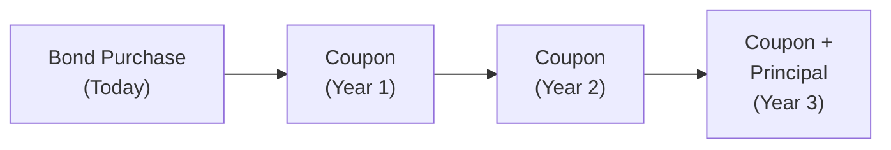

## Introduction
When I first heard about the time value of money, I remember thinking, “Wait, so a dollar today really is different from a dollar tomorrow?” And I’m sure I wasn’t alone in that initial reaction. But as soon as we enter the realm of bond pricing, we quickly see how crucial it is to measure precisely how future cash flows are worth in today’s dollars—because that’s exactly how a bond’s price gets determined in the market. 

Put simply, the present value (PV) concept states that $1,000 received a year from now is worth less than $1,000 received today, because you could invest today’s $1,000 and earn interest over that year. And in the context of bond valuation, you’re dealing not just with one future sum, but with a series of coupon payments plus a lump-sum principal repayment at maturity. 

In what follows, we’ll explain the big ideas and practical steps behind present value calculations and how they inform bond pricing, particularly when coupons come in neat regular intervals—or occasionally in messy, stepped, or delayed schedules!

## The Time Value of Money in Bond Valuation
Time value of money is the backbone of bond pricing. The price of a bond is—no big secret—the sum of the present values of every expected payment, which includes periodic coupons (if any) plus the ultimate repayment of principal at maturity. Each cash flow is discounted back to today using a yield or required rate of return (also known as a discount rate). 

Why does it matter? Well, if the required yield goes up, that means future cash flows get discounted more heavily, shrinking their present values—and pushing the bond’s price downward. Conversely, if yields drift lower, the discount factor is smaller, and hey, your bond’s price edges upward.

## Key Present Value Building Blocks
Before we jump into the bond-specific details, let’s clarify the primary formulas behind the present value of a single future sum and an annuity (or a stream of equal amounts).

- Present Value of a Single Sum:

  Let’s say you’ll receive a lump sum \\( \text{FV} \\) in \\( n \\) years, and your discount rate per year is \\( r \\). The present value is:

  
  \text{PV} = \frac{\text{FV}}{(1 + r)^n}.
  

  If the interest rate is compounded \\( m \\) times per year, the formula expands to:

  
  \text{PV} = \frac{\text{FV}}{\left(1 + \frac{r}{m}\right)^{n \times m}}.
  

- Present Value of an Annuity:

  Imagine receiving a level coupon \\( C \\) every period for \\( n \\) periods, discounted at a per-period rate \\( r \\). The present value is:

  
  \text{PV}_{\text{annuity}} = C \times \frac{1 - (1+r)^{-n}}{r}.
  

  Adjust the rate \\( r \\) to reflect whatever compounding frequency you have—like \\( \frac{r}{2} \\) for semiannual, \\( \frac{r}{4} \\) for quarterly, or even more frequent intervals.

These two formulas, sometimes with small tweaks for timing or compounding frequency, are at the heart of the bond valuation process.

## Different Compounding Conventions
Compounding convention just means how often interest is effectively added to the principal:

• Annual Compounding: The discount rate applies once per year.  
• Semiannual: Common in U.S. bond markets—your coupon rate might be stated annually, but coupons arrive in two equal installments.  
• Quarterly or Monthly: Some floating-rate notes or short-term instruments might pay more frequently.  
• Continuous Compounding: A more theoretical approach used in advanced analytics—interest is added an infinite number of times, leading to the formula \\( \text{PV} = \text{FV} \times e^{-rt} \\).

The more frequently interest compounds, the bigger the difference from a simple annual compounding. For standard coupon bonds, semiannual compounding is typical, which means discounting each semiannual cash flow with the appropriate half-year discount factor.

## Rearranging the Present Value Equation
Another essential skill (and a popular exam question angle) is solving for variables other than the present value. Let’s say you know the price of a bond (the sum of discounted coupon payments plus principal), and you want to find its yield \\( r \\). That’s basically solving:


\text{Bond Price} = \sum_{t=1}^{n} \frac{C_t}{(1 + r)^t} + \frac{\text{Principal}}{(1 + r)^n}.


Rearranging for \\( r \\) is often done using numerical iteration (or your exam-approved financial calculator or basic Python code). Similarly, if you want to solve for the number of periods \\( n \\) given the bond’s price, coupon structure, and yield, you might have to use a combination of logs and iteration. These are practical tasks in a typical CFA exam context, especially if you’re evaluating different bonds to see which yields the highest return relative to price.

## Special Cases and Irregular Cash Flows
While standard bonds have fixed coupons and a straightforward final redemption, some bonds have step-up coupons, delayed start dates, or other embedded features. The principle remains the same: discount each flow back individually. So if a bond starts disbursing coupons only after, say, a 2-year deferral, then simply discount each relevant coupon or redemption amount from the time it is actually paid:


\text{Bond Price} = \frac{C_{t_1}}{(1 + r)^{t_1}} + \frac{C_{t_2}}{(1 + r)^{t_2}} + \cdots + \frac{C_{t_k} + \text{Principal}}{(1 + r)^{t_k}}.


It’s easy to slip up if you’re expecting consistent coupon timings. Always verify the precise schedule in the bond’s offering documents or indenture.  

## Practical Example
Let’s run a simple (but hopefully clarifying) example. Suppose you have a 3-year bond with an annual coupon rate of 5% (on a \$1,000 par value) and your required yield is 4% (annual compounding). How do you find the bond’s price?

1. Each year’s coupon is \$50 (that’s 5% of \$1,000).  
2. At maturity in year 3, you also get your \$1,000 principal back.

Hence, your cash flows are:

• \$50 in 1 year,  
• \$50 in 2 years,  
• \$1,050 in 3 years (that’s coupon + principal).

The present value of each:


\text{PV of } \$50 \text{ in 1 year} = \frac{50}{(1+0.04)^1} = \$48.08,


\text{PV of } \$50 \text{ in 2 years} = \frac{50}{(1+0.04)^2} = \$46.23,


\text{PV of } \$1,050 \text{ in 3 years} = \frac{1050}{(1+0.04)^3} \approx \$933.01.


Sum these up:


\text{Bond Price} \approx 48.08 + 46.23 + 933.01 = \$1{,}027.32.


Because the required yield (4%) is below the coupon (5%), it’s no surprise that the bond values above par.

## A Visual Overview
Below is a simple Mermaid diagram illustrating the flow of bond cash flows across time, showing how each coupon plus principal redemption gets discounted back to the present:

At each arrow, we discount the cash flow by dividing by \\((1 + r)^t\\). Summing them all yields the value of the bond at issuance.

## Implications Under IFRS and US GAAP
From an accounting standpoint, IFRS and US GAAP both require the effective interest method for amortizing any discount or premium on a bond’s carrying value over time. That effective interest rate is basically the internal rate of return (yield) at issuance. On the exam, the key is grasping that the discount rate used for accounting consistently tracks how the bond’s book value evolves on the balance sheet, aligning with the present value of future cash flows at that rate.

## Best Practices and Pitfalls
• Double-check your compounding periods. If the market quotes yields on a semiannual basis, discount each half-year coupon accordingly.  
• Watch out for delayed or stepped coupons. Don’t assume standard intervals if the bond documentation states otherwise.  
• Use the correct day count conventions if your exam question references them (e.g., 30/360 or actual/360).  
• If the question is about yield, remember you may need to iterate (e.g., with a financial calculator function like IRR or a solver in Excel/Python).  

## A Quick Personal Reflection
I can still recall my early confusion over why we “divide by \\((1+r)^n\\)” to get the present value. It felt a bit weird. But honestly, it’s the pure logic of how interest compounds, except we’re looking in reverse. Once that clicked, everything else about bond valuation made a lot more sense. Because if you can see a bond simply as a bundle of future money, and you know how money should grow at a certain rate, it’s straightforward to shrink that future sum back into present terms.

## Exam Tips
Time value of money often appears in both conceptual and numerical questions. You might be asked to:  
• Compute a bond’s price from a given yield.  
• Compute a bond’s yield given its price.  
• Estimate the number of periods until maturity if you know coupon, yield, and price.  
• Evaluate a specialized bond with unusual coupon patterns.  

Be sure to keep your basics in order—especially the difference between annual and semiannual discounting—and practice plenty of numeric examples until you can easily punch them out under time pressure.

## References and Further Reading
- Fabozzi, Frank J. “Bond Markets, Analysis, and Strategies.” (Pearson).  
- CFA Institute Level I Curriculum, “Quantitative Methods” — Time Value of Money.  
- Investopedia entry on “Present Value” <https://www.investopedia.com/terms/p/presentvalue.asp>.

## Practice Questions: Present Value Concepts and Calculation Methods



### Which statement best describes the fundamental principle behind bond valuation?

- [x] A bond’s price is the sum of the present values of its future cash flows.
- [ ] A bond’s price is always equal to its par value.
- [ ] A bond’s price is determined solely by its coupon rate.
- [ ] A bond’s price remains fixed if the coupon rate is changed.

> **Explanation:** Bond valuation is based on discounting each future coupon and the redemption amount back to the present using a market yield.  

### When annual compounding is used, which formula is correct for finding the present value of a lump sum to be received in n years?

- [ ] PV = FV × (1 + r)ⁿ
- [x] PV = FV / (1 + r)ⁿ
- [ ] PV = (1 + r)ⁿ / FV
- [ ] PV = FV × (1 - r)ⁿ

> **Explanation:** Dividing by (1 + r) raised to the power of n is the standard for discounting with annual compounding.  

### An investor is evaluating a bond with semiannual coupons and an annual coupon rate of 6%. If the yield per semiannual period is 3%, what is the appropriate discount rate for each coupon payment?

- [ ] 12%
- [x] 3%
- [ ] 6%
- [ ] 1.5%

> **Explanation:** For semiannual coupons, you use the yield per half-year, which is 3% in this example.  

### You buy a 4-year bond with annual coupons of 5% on a \$1,000 face value. If you just paid \$960, approximately what is your annual yield (assume annual compounding)?

- [ ] Exactly 5%, since that is the coupon rate.
- [ ] 2.5%, half the coupon rate.
- [x] Greater than 5%.
- [ ] Less than 5%.

> **Explanation:** Because the bond is priced at \$960, which is below par, its yield must be higher than 5%.  

### If you know the price of a particular bond and the bond’s fixed coupons, but want to compute the yield, which method is commonly used?

- [ ] Direct algebraic rearrangement of a linear equation.
- [ ] No method; it’s not possible to find yield from price.
- [ ] Simple ratio of coupon to face value.
- [x] Iterative numerical procedures or a financial calculator’s IRR function.

> **Explanation:** Yield is found by iterating to solve the non-linear present value equation.  

### Which of the following best defines continuous compounding?

- [ ] Interest is accumulated once per period.
- [ ] Interest is not compounded at all.
- [x] Interest is added instantaneously at every moment in time.
- [ ] Interest rates remain zero over time.

> **Explanation:** Continuous compounding treats the compounding frequency as infinitely large.  

### If a bond has a stepped coupon that increases every year, how is it typically valued?

- [ ] Use the initial coupon only to discount all future payments.
- [x] Discount each future coupon based on its unique amount and timing.
- [ ] Ignore coupon changes and only consider principal redemption.
- [ ] The bond is essentially impossible to value.

> **Explanation:** You must treat each coupon individually, applying the same discount rate but catering to different coupon amounts and times.  

### A \$1,000 par bond has a 10% annual coupon. If your required yield is 8%, will the bond trade at:

- [ ] Par.
- [x] A premium.
- [ ] A discount.
- [ ] Book value.

> **Explanation:** If the coupon rate (10%) is higher than the yield (8%), the bond is worth more than its par amount.  

### Under IFRS or US GAAP, which concept is used to amortize bond discounts or premiums over time?

- [x] Effective interest method
- [ ] Straight-line discount method
- [ ] Dividends distribution
- [ ] Mark to market revaluation daily

> **Explanation:** Both IFRS and US GAAP typically require the effective interest method based on the bond’s yield at issuance.  

### A decrease in the discount rate applied to future cash flows will do what to the present value?

- [x] Increase the present value
- [ ] Decrease the present value
- [ ] Have no effect
- [ ] Lower future yield

> **Explanation:** Lower discount rates reduce the denominator, raising the overall present value.  


