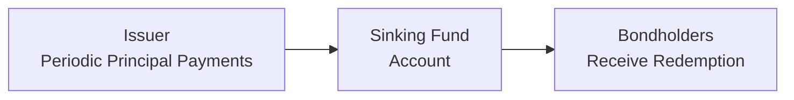

## Understanding Sinking Fund Provisions

It’s funny—my first brush with sinking fund provisions was as a newbie analyst, and I remember thinking, “Wait, the issuer is already preparing to pay it off?” If you’ve ever felt that confusion, trust me, you’re not alone. A sinking fund is basically a mechanism requiring the issuer to systematically “sink” some money into a separate account (or redeem a portion of the outstanding debt) at set intervals prior to the bond’s final maturity. It’s meant to assure bondholders that principal is being retired periodically, reducing the pile that remains at final maturity.

Sinking fund provisions typically appear in the bond indenture, which is the legal agreement setting out all the terms and conditions for the bond. The key idea is that, instead of making one massive bullet payment at the end, the company or issuer regularly redeems (or pre-pays) portions of the bond. This can help reduce default risk. However, like many good things in finance, there’s a catch: if rates fall and the issuer can redeem at a set (“call-like”) price, you might face reinvestment risk. Let’s walk through the main features, credit implications, and the typical pricing approach for sinking fund bonds so that by the end, you’ll be able to evaluate this structure in your sleep—or at least on the CFA exam.

## Sinking Fund Structures and Types

Sinking funds can be structured in different ways. Each approach carries unique benefits and drawbacks:

• Mandatory Sinking Fund: The issuer must redeem a specified portion of the bonds each year (or on each specified date) until maturity. That means the issuer has no choice—there’s a binding requirement to amortize principal over time.  
• Optional Sinking Fund: Allows the issuer to redeem more than the mandatory minimum—yes, it’s optional for the issuer, and usually triggered when interest rates decline, so the issuer can retire expensive debt faster.  
• Accelerated Sinking Fund: A feature that lets the issuer retire larger portions ahead of schedule if certain conditions are met.  

These classifications matter because they help investors gauge how frequently principal might be returned prematurely. If you’re holding a sinking fund bond when rates have fallen significantly, the issuer may accelerate redemptions. Crudely put, you might get your money back earlier than expected and need to find a new home for it—potentially at a lower yield.

## How Sinking Funds Affect Default Risk

At a high level, sinking fund provisions enhance the credit quality perception of the bond. Since a portion of principal gets retired periodically, there’s a smaller total principal amount outstanding over time, and that reduces the probability of a large payment default at maturity. In distressed scenarios, the smaller final balloon payment is typically easier to refinance or repay. Also, some trustees or rating agencies view a sinking fund as a partial credit enhancement.

You could think of it this way: if you have to repay a friend a big sum in three years, you might struggle to come up with the full lump sum. But if you systematically pay parts of that sum every few months, your friend (the lender) is more comfortable that you’ll honor your obligations. Similarly, rating agencies can look upon sinking fund provisions favorably, sometimes leading to a slight bump in credit ratings versus a comparable bond without a sinking fund.

## Call-Like Risk and Reinvestment Implications

Okay, so far so good: sinking funds reduce the chance of default. But from an investor’s vantage point, there’s another side. Many sinking fund provisions specify a sinking fund price (or redemption price) that is typically near par or slightly above par. This can behave like a call option embedded in the bond. If market interest rates drop below the bond’s coupon rate, the issuer can redeem the bond early at that sinking fund price, effectively limiting the bond’s price appreciation potential. This is somewhat analogous to call risk.

When an issuer redeems the bond prematurely, you—the investor—get your principal back sooner than planned and face reinvestment risk. You might have been expecting to earn that sweet coupon for another five or ten years. Instead, you now have to reinvest at the current lower rates, which can be a bummer if you were counting on that stable, higher coupon income.

So, is a sinking fund always a good or bad thing? The answer, not surprisingly, is “it depends.” If your primary concern is credit risk, a sinking fund is often beneficial. If you’re worried about reinvestment risk in a falling rate environment, the embedded call-like feature can be unfavorable.

## Sinking Fund Schedules in the Indenture

Because these provisions can get complicated, it’s crucial to examine the sinking fund schedule. This schedule details:

• How many bonds (or how much principal) must be redeemed each year.  
• The redemption dates and redemption price for each round of redemption.  
• Whether there are mandatory and/or optional components in the schedule.  
• How a potential “lottery” or “reduction draw” might be conducted if only a portion of the bonds are selected for redemption at each sinking fund date.

You can think of the sinking fund schedule as an amortization schedule for your mortgage, except it’s the bond issuer who’s paying down principal in parts. This is especially relevant for analyzing future cash flows. Let’s see a simple conceptual diagram to illustrate how a sinking fund might flow:

Under many indentures, an external trustee manages the sinking fund account, ensuring that the issuer makes these periodic payments. When redemption time comes, the trustee randomly selects bonds (or uses some other formula) for redemption if the entire issue is not being fully called at once.

## Pricing Sinking Fund Bonds

Traditionally, bond pricing is the present value (PV) of future coupon payments plus the PV of the final principal repayment. With a sinking fund, though, you effectively have multiple principal redemptions (some portion each year) rather than one single bullet maturity. That calls for an adaptation of standard pricing techniques.

At the core, the bond’s price can be viewed as the sum of the discounted values of each expected cash flow (coupons + principal repayments). But you also need to account for the embedded call feature. The actual approach can involve:

• Modeling each redemption date as an optional redemption.  
• Calculating expected redemption amounts and the probability that the issuer will elect or be forced to redeem.  
• Incorporating interest rate scenarios to see whether early redemption is likely to occur.

In more advanced bond valuation models, analysts treat the sinking fund redemptions as “scheduled principal payments” plus “early call exercises” if the issuer wants to retire more principal at or near par. This can be somewhat like a “coupon bond plus an embedded short call option” from the investor’s perspective.

### A Simple Example

Let’s say a company issues a 10-year, 6% coupon bond with a face value of $1,000. The sinking fund schedule says that starting at year 5, the issuer must redeem 10% of the outstanding principal each year until final maturity at year 10. That means the final bullet repayment at year 10 accounts for the remainder of principal.

If you were to price this bond, you’d discount each coupon payment and each portion of principal repayment. So, for years 1–4, you just have coupon payments. Starting in year 5, you have coupons plus a principal redemption of 10% of the outstanding principal. If your discount rate is, say, 5%, you would do a PV of all coupons plus the partial redemptions in years 5–10. Then sum it up to get the total present value.

However, if there’s an additional feature that the bond can be redeemed at par once interest rates fall to 4.5% or something similar, you’d need to incorporate the possibility that the issuer redeems earlier at par. This could cap the bond’s price upside at or near $1,000. In real-world calculations, you’d typically build or buy a model that accounts for the “option” which the issuer has to call the bond in line with the sinking fund provisions.

## Credit Considerations and Investor Perspective

Because sinking funds systematically reduce the total principal outstanding, credit risk is generally lower. Over time, you’re exposed to less principal at risk if the issuer’s financial position deteriorates. This advantage often translates into a narrower credit spread compared to an otherwise similar non-sinking fund bond.

However, from your vantage point as an investor, it’s crucial to keep in mind:

• If interest rates rise, the sinking fund schedule may not be triggered voluntarily by the issuer—so you might not see early redemptions at all, which means you face the typical interest rate risk of any bond.  
• If interest rates fall sharply, the issuer might step up redemptions (especially with any optional or accelerated sinking fund clauses), so you’ll receive principal earlier—when reinvestment opportunities might be less attractive.  
• The bond can trade in the secondary market at a premium, but that premium is limited if there’s a strong likelihood of early redemption at par.  

In a credit analysis framework, rating agencies often mention sinking funds as a credit-positive feature because it addresses part of the balloon-payment risk. Moody’s, for example, in their methodology documents, underscores that a properly funded sinking fund can stabilize an issuer’s debt profile. That said, if the issuer’s sinking fund obligations are large relative to cash on hand (or predictable operating cash flow), it actually might become a source of short-term liquidity stress. So ironically, the very feature that is supposed to reduce long-term default risk might ramp up near-term pressure on the issuer’s cash flow.

## Reinvestment Risk in Practice

Reinvestment risk is one of those concepts that can seem academic until you experience it personally. Imagine you locked in a 7% coupon when yields in the market were around 6%. Your bond is performing well—you're collecting a higher-than-market coupon. Suddenly, the issuer chooses to meet (or exceed) the sinking fund requirement and redeems 50% of your position right when market yields have dropped to 4%. Wow, nice for the issuer’s cost of capital, but not so great for you. You’ll find it tough to reinvest that principal at a similar yield.

Of course, this is precisely why some investors, especially insurance companies or pension funds, like to hold a diversified set of securities. They accept that certain bonds might come with call or sinking fund features and plan accordingly for the reinvestment of funds in different interest rate environments.

## Best Practices for Analyzing Sinking Fund Bonds

When analyzing a sinking fund bond for inclusion in a portfolio—or if you’re tackling exam questions—here are some best practices and typical pitfalls to look out for:

• Read the Fine Print: The devil is always in the details—especially for the redemption schedule. Check if the sinking fund is mandatory, optional, or accelerated.  
• Model Different Rate Scenarios: Use scenario analysis to see how early redemptions might affect yield.  
• Watch the Provision Price: If the sinking fund redemption price is set at par (or 100), keep in mind that once the bond’s fair value surpasses par in a declining rate environment, the call-like feature can get exercised.  
• Assess Liquidity Risk for the Issuer: While it may benefit you that principal is paid down over time, confirm that the issuer’s liquidity can handle periodic principal payments without straining other obligations.  
• Consider the Probability of Partial Calls: If a fraction of the total issue is redeemed each year on a lottery basis, you might only lose a portion of your holdings at redemption.  
• Evaluate Credit Spreads: Because sinking fund bonds typically have somewhat lower default risk, the credit spread over Treasuries might be smaller. Make sure you’re being compensated for the call-like risk, though.  

## A Quick Case Study

Picture a mid-sized utility company named GreenEdge Power that issues a 20-year bond at a coupon rate of 5.5%. Fast-forward five years, and rates have drifted downward to 4.0%. GreenEdge Power’s mandatory sinking fund schedule starts at year 10, but they also have an optional sinking fund redemption starting at year 7. Observing the yield environment, Treasury yields are at 3.5%, and comparable corporate bonds with similar credit ratings carry yields of about 4.0–4.1%. GreenEdge’s bond trades near 101.5 in the secondary market.

Because the bond is trading above par, the issuer can potentially call a portion of the bonds at 100 using the optional sinking fund once year 7 hits. This is a sweet deal for GreenEdge—they can refinance at a lower rate. As an investor, you might see your position partially redeemed. While you might be pleased if you purchased the bond at a discount originally, you now face the question: “Where do I put my money next?” That’s the essence of reinvestment risk. Meanwhile, the mandatory schedule from year 10 onward stands ready to retire the rest of the principal in annual increments, which is credit friendly but also shortens the expected maturity from your perspective.

## Common Mistakes and Pitfalls

• Ignoring the Embedded Option: One major pitfall is applying a standard yield-to-maturity calculation as if it were a plain-vanilla bullet bond. The presence of a call-like redemption feature alters your effective yield.  
• Overlooking the Lottery Draw: If the sinking fund redemption is random, it can create partial calls on your position. Some exam questions try to trick you by ignoring the fact that not every bondholder necessarily loses the entire holding at once.  
• Underestimating Liquidity Constraints: Sometimes, an issuer on shaky ground might struggle to meet sinking fund commitments. If an issuer fails to fund the sinking fund around redemption time, that’s obviously a huge credit negative.  

## IFRS, US GAAP, and Accounting Nuances

From an accounting standpoint, IFRS and US GAAP both allow issuers to reflect sinking fund provisions in their debt amortization schedules. The sinking fund is typically recognized as a noncurrent liability until it becomes payable within the next 12 months, at which point it transitions to current liability status. Investors often analyze footnotes to see if these funds are indeed “segregated” assets maintained with a trustee, which can affect how secure the redemption actually is. 

On the portfolio side, if you’re an institutional investor, you might treat sinking fund redemptions similarly to partial principal paydowns. Under IFRS 9 or ASC 320/ASC 470 in US GAAP, the classification and measurement can vary depending on whether the bond is held to maturity or classified as available-for-sale (AFS). Typically, the main effect is on timing of interest recognition and classification in the statement of cash flows, but from a risk management perspective, you want to ensure your portfolio’s projected cash flows line up with your liabilities.

## Exam Tips for CFA Candidates

Sinking fund provisions can appear in both item set and constructed-response questions. Here are a few ways they’ve been tested:

• They might ask you to value a bond that has sinking fund features, testing your ability to compute partial principal redemptions.  
• They could present a scenario where interest rates have fallen, and ask how it affects the bond’s price or yield.  
• They might test your knowledge of credit risk implications: “How does the presence of a sinking fund affect the probability of default?”  
• They might throw in a question about reinvestment risk or call-like features, wanting you to discuss the tradeoff.  

Remember to be thorough in your answers. If a question specifically references a sinking fund schedule, be sure to mention how it impacts the cash flow structure and pricing. If they ask about the bond’s credit rating advantage, highlight that mandatory redemptions reduce overall risk yet also create potential reinvestment constraints.

## Final Thoughts

Sinking fund provisions are a powerful illustration of the interplay between credit risk, reinvestment risk, and the embedded options that come with many bond structures. They can help reduce the likelihood of default while simultaneously capping an investor’s upside if interest rates plummet. In real life—and on the CFA exam—you’ll want to weigh both sides. Ask yourself: “Do I value the lower credit risk more, or am I worried about losing future coupon cash flows in a falling rate environment?” That trade-off essentially defines the risk and return profile of a sinking fund bond.

Let’s wrap this up with a quick analogy: sinking funds are like slowly paying off your mortgage. It’s comforting for your lender if you reduce your principal every year. But if your mortgage contract gives you the option to pay it all off early at face value, you’ll probably do it when interest rates drop so you can refinance at a cheaper rate—beneficial for you, but possibly annoying for your lender if they were enjoying above-market interest. That’s basically how it feels to hold a bond with a sinking fund from the investor’s perspective.

Keep these considerations in mind, practice modeling partial redemptions, and you’ll be ready to handle any sinking fund question that crops up. Good luck on the exam!

---

## Practical Advice for the Exam

• Carefully read any schedule or indenture excerpt given in a question. The exam often hides key info in footnotes.  
• Be ready to explain, briefly but precisely, how partial or optional redemptions can alter yield.  
• Watch out for the interplay between default risk reduction and reinvestment risk.  
• Master the fundamental formula for bond valuation and adapt it for partial principal redemptions.  
• Know the definitions: “Mandatory Sinking Fund,” “Optional/Accelerated Sinking Fund,” and “Call Provision.”  
• Always consider the effect on a bond’s price if rates fall below the coupon rate.

---

## References  
- Peterson, P. “Analysis of Capital Structure and Bond Features.” Journal of Applied Finance, 11(2).  
- Moody’s (2024). “Methodology on Sinking Fund Bonds and Credit Considerations.” https://www.moodys.com  
- CFA Institute Level I Curriculum, “Bond Redemption Provisions.”  

---

## Test Your Knowledge: Sinking Fund Provisions Quiz



### Which of the following best describes a sinking fund provision?  
- [ ] A provision allowing the issuer to pay higher coupons if their credit rating falls  
- [ ] A schedule that provides for interest rate resets based on market conditions  
- [x] A requirement that the issuer retire a portion of the bond’s principal at specified intervals  
- [ ] An arrangement where the issuer pays a lump sum only at final maturity  

> **Explanation:** A sinking fund provision involves periodic redemption of a portion of the bond’s principal, effectively reducing the total outstanding amount before final maturity.

### Which of the following is a key reason that sinking fund provisions can be viewed as a positive credit feature?  
- [x] They reduce the likelihood of a large one-time principal repayment event  
- [ ] They eliminate interest rate volatility for the issuer  
- [ ] They guarantee that the bond price will not fall below par value  
- [ ] They allow the issuer to pay interest only at maturity  

> **Explanation:** By systematically reducing the outstanding principal, the issuer is less likely to face a massive balloon payment at maturity, thus lowering default risk.

### In a declining interest rate environment, why might a sinking fund provision be disadvantageous for bondholders?  
- [ ] It ensures that the bond’s price will rise significantly above par  
- [x] It may result in early redemptions at a set sinking fund price, increasing reinvestment risk  
- [ ] It forces bondholders to accept lower coupon payments over time  
- [ ] It changes coupon payments to floating rates  

> **Explanation:** When rates fall, the issuer can redeem portions of the bond earlier at the pre-agreed sinking fund price (often near par), forcing bondholders to reinvest at lower rates.

### Which statement is correct regarding mandatory vs. optional sinking fund provisions?  
- [x] Mandatory provisions require a fixed principal redemption schedule, while optional provisions allow the issuer to exceed that schedule if desired  
- [ ] Mandatory provisions reduce reinvestment risk for bondholders  
- [ ] Mandatory provisions eliminate partial calls  
- [ ] Optional provisions are never exercised in a declining interest rate environment  

> **Explanation:** A mandatory provision obliges the issuer to redeem a specific portion of principal, while an optional provision grants flexibility to retire more than the minimum.

### In examining a bond’s sinking fund schedule, an analyst should primarily look for:  
- [x] The timing and amount of principal payments that must be redeemed  
- [x] Whether redemptions are made mandatory or optional  
- [ ] The identity of the trustee’s board of directors  
- [ ] The exact method of setting the coupon rate on the redemption date  

> **Explanation:** The schedule specifies the principal amounts retired and whether redemption is mandatory or optional. Both factors greatly influence cash flows and risk.

### If a bond's sinking fund price is set at par (100) and the market price of the bond rises to 105 due to falling interest rates, which outcome is most likely?  
- [x] The issuer may choose to redeem the bonds at 100, limiting further price appreciation  
- [ ] The issuer will pay 105 to redeem the bonds in the open market  
- [ ] The investor can force the issuer to buy back at 105  
- [ ] There is no risk of early redemption  

> **Explanation:** If the bond is trading above par, the issuer can redeem at the cheaper par value if the contract allows, essentially capping the bond's price appreciation.

### Which of the following best describes the reinvestment risk associated with sinking fund provisions?  
- [x] Bondholders might receive principal earlier than expected and be forced to invest at lower yields  
- [ ] Issuers can delay principal payments indefinitely  
- [ ] The bond price is guaranteed never to drop below par value  
- [ ] Bondholders never actually receive principal payments  

> **Explanation:** Because the issuer can call or redeem principal in a low-interest-rate environment, investors may have to reinvest at prevailing lower yields.

### How can a sinking fund provision influence the credit spread of a bond?  
- [x] By lowering default risk, it may narrow the credit spread relative to a comparable non-sinking fund bond  
- [ ] It always increases the credit spread to compensate for reinvestment risk  
- [ ] It eliminates the spread over Treasury bonds entirely  
- [ ] It has no effect on credit spreads  

> **Explanation:** The market often prices lower default risk via a narrower credit spread for sinking fund bonds, although other parameters (e.g., reinvestment risk) also factor in.

### In a lottery-based redemption for a sinking fund, which of the following might occur?  
- [x] Only a fraction of bondholders have their positions called each period  
- [ ] All bondholders’ positions are redeemed at once  
- [ ] The issuer has no obligation to pay principal until maturity  
- [ ] The trustee must buy the bonds exclusively on the open market  

> **Explanation:** With lottery-based selection, the issuer redeems only some bonds each period, distributing the early redemption among bondholders randomly.

### True or False: One advantage of sinking fund provisions for the issuer is the flexibility to potentially refinance debt at lower rates if interest rates decline.  
- [x] True  
- [ ] False  

> **Explanation:** The issuer can redeem bonds at or near par under a sinking fund provision, which effectively lets the issuer refinance. This is beneficial in a falling rate environment.


