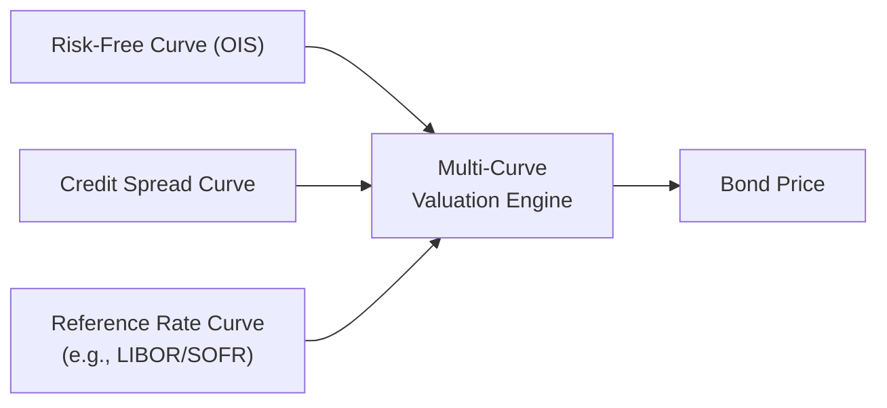

## Introduction

So, quick confession: the first time I heard someone talk about multi-curve pricing, I thought it was something out of a sci-fi movie—some weird parallel-universe concept. But it’s not (though, sometimes, it feels that way). In the past, bond valuation was generally done using a single reference curve, often built from a handful of standard instruments—like government bonds or LIBOR-based swaps—and we’d discount all future cash flows with some version of that curve. But here’s the deal: after the 2008 financial crisis, the world of interest rates changed. Suddenly, the difference between what was truly risk-free and what was “sort-of risk-free” became enormous, especially in distressed market conditions. And that’s where multi-curve frameworks came in—because, well, life is complicated, and so is bond valuation.

A multi-curve environment basically means you’re not relying on one single yield curve to discount all cash flows. You might see an Overnight Indexed Swap (OIS) curve for risk-free discounting, a separate forward curve for projecting floating rate coupon resets, plus a credit spread curve to acknowledge that, yes, corporate issuers are riskier than Uncle Sam. The result is a more “realistic” valuation, or so we hope. Let’s dive in.

## Foundations of Multi-Curve Pricing

### Why More than One Curve?

Imagine you have a friend who always estimates travel time based on how fast they drive on empty highways. That’s fine if you’re always on empty roads, but in reality, there’s traffic, detours, and speed limits. Similarly, single-curve discounting assumes a tidy, frictionless market environment where all financing rates are the same. Not so realistic.

A multi-curve approach accounts for different rates in real-world scenarios:
• A “risk-free” base rate or near-risk-free rate (such as an OIS curve).  
• A reference rate curve if the bond has floating coupons (e.g., LIBOR or SOFR forward curves).  
• A credit spread curve (where applicable) to reflect default or credit risk.

By layering these separate curves, each specialized for its distinct purpose, valuations become more robust, especially during market stress.

### OIS Discounting vs. Traditional LIBOR Curves

There’s been a big shift away from LIBOR-based discounting to so-called OIS discounting. Many of us recall that in the pre-2008 era, LIBOR was often treated as a proxy for the risk-free rate in discounting derivatives and sometimes even floating-rate bonds. Post-crisis, however, we realized LIBOR is more about interbank credit risk, and it’s not a pure measure of a risk-free rate. OIS swaps (linked to overnight rates, like Fed Funds in the US, EONIA in the Eurozone, SONIA in the UK, or SOFR for newer USD-based transactions) became the go-to measure for discounting because they reflect minimal credit and liquidity risk.

Now, you might be thinking, “Well, which curve do we use for forward projections if not LIBOR anymore?” Typically, the legacy approach used the same LIBOR curve for both (1) projecting forward rates to get future coupon cash flows, and (2) discounting those cash flows back to present. Under the multi-curve model, we might use one curve (e.g., a forward LIBOR or SOFR curve) for projecting floating coupon payments and another (e.g., an OIS or risk-free curve) for discounting. The difference can be subtle but can also have a real impact on valuation.

## Building Blocks: Different Curves for Different Needs

### Risk-Free (OIS) Curve

Let’s start with the simplest of the bunch. The Overnight Indexed Swap curve attempts to capture the most basic funding rate in the system. Here’s the logic: if I enter an OIS, I exchange a fixed rate for the compounded overnight rate over the term of the swap. Because overnight rates include minimal credit risk, the resulting fixed OIS rate is viewed as close to “risk-free” as it gets in practice. Hence, discounting with an OIS curve is often considered the standard approach for collateralized trades and, increasingly, for many bond valuations where the short-term risk-free rate is relevant.

### Credit Spread Curve

If the bond is from a corporate issuer that’s not AAA or if it’s from a municipal issuer with a particular rating, then you’ll see an additional credit spread. This spread, by the way, can vary by maturity—sometimes the market quotes a “curve” of credit spreads. For example, you might see a 50-basis-point spread for 2-year debt, 60 basis points for 5-year, and 80 for 10-year. Each point along that spread curve tries to represent the risk premium that investors demand for holding that credit exposure over a specific horizon.

When we talk about multi-curve discounting for corporate or any non-sovereign or “risky” issuer, we can treat the risk-free curve (or the OIS-based discount factors) as the foundation, then add the credit spread (appropriately mapped across maturities) to shift discount rates upward, giving us the yield curve that might better reflect the bond’s actual cost of funding.

### Forward Curves (LIBOR or SOFR)

Floating-rate notes (FRNs) are priced by projecting future coupon cash flows based on a reference rate and then discounting those projected cash flows. If the reference rate is, say, 3-month USD LIBOR (though it’s being phased out), or 3-month SOFR, you need a forward curve to figure out the expected coupon resets. Here’s the catch: this forward curve might not be the same as your discounting curve. So, if you want to be consistent with market practices:
• Use a forward curve for the reference rate to project coupon amounts.  
• Use an OIS curve (plus any relevant credit spread) to discount those amounts to present value.

### Collateralized vs. Uncollateralized Positions

In derivatives markets, or for some specialized bond transactions with collateral agreements, it’s common to discount future cash flows at the collateral rate. If you’re posting daily collateral pegged to SOFR or Fed Funds (in the US context), that means the risk of your counterparty defaulting before tomorrow’s close is, in theory, minimal. So, OIS discounting is the correct approach. In uncollateralized trades—situations where there is no daily margin or trust mechs—credit risk is higher, implying you might add an extra spread over OIS.

## Multi-Curve Construction Methods

Okay, so how do you actually build multiple curves in practice? We typically rely on bootstrapping from market quotes for swaps, government bonds, or deposit rates at different maturities and then stitch these points together. If that sounds complicated—well, it can be, but the principle is similar to the single-curve approach. The difference is that for each curve, you’re using a specialized market-based instrument set that best reflects the interest rate environment for that curve’s use case.

Below is a simple illustration of how different yield curves feed into the general multi-curve valuation engine:



• Step 1: Collect OIS or government rates at various maturities and bootstrap a risk-free curve.  
• Step 2: Gather market spreads for the issuer’s credit rating or sector. Create a credit curve.  
• Step 3: For floating-rate instruments, build or use the existing forward curve that’s consistent with the reference index.  
• Step 4: Combine them in a multi-curve valuation process, matching the correct discount rates to each cash flow.

## Valuing a Bond Under the Multi-Curve Framework

### Fixed-Rate Bond Example

Let’s say you have a corporate bond with a 5-year maturity, paying a 3% annual coupon. The bond has a credit rating leading to a credit spread that starts at 100 basis points at the short end and grows to 120 basis points at 5 years. Meanwhile, your base OIS curve at the relevant maturities is around 2% at the front end, rising to 2.5% at 5 years. In a simplified sense, your discount rates become:

• Year 1 discount rate = OIS(1 year) + credit spread(1 year) = 2.0% + 1.0% = 3.0%  
• Year 2 discount rate = OIS(2 year) + credit spread(2 year) = 2.1% + 1.0% = 3.1%  
• …  
• Year 5 discount rate = OIS(5 year) + credit spread(5 year) = 2.5% + 1.2% = 3.7%

You can thus discount each coupon and principal repayment at these slightly different yields (and the discount factors derived from them) to get a more accurate present value. This might be done on a continuously compounded basis or using discrete compounding, depending on market convention.

### Floating-Rate Note (FRN) Example

Now, consider a 3-year floating-rate note paying 3-month SOFR + 50 basis points, reset quarterly. You might do the following:

1. Project the coupon for each quarter using the forward SOFR curve.  
2. Discount each quarterly cash flow (coupon, plus the final principal at maturity) using your OIS discount factors.  
   – If the FRN is not heavily collateralized, you might add a portion of a credit spread, or you might treat it as a lower risk instrument if it’s a top-rated issuer.  

So you see the difference: the forward curve determines how large the coupon will be, while the OIS or risk-free + credit approach determines how heavily you discount that coupon. If you’ve never done it before, it can seem like a lot of math, but it’s fairly standard in practice.

Below is a short Python snippet illustrating a simplified discount factor calculation using a multi-curve approach:

```python
import math

def discount_factor(annual_rate, t):
    # Simple annual compounding for demonstration
    return 1 / ((1 + annual_rate)**t)

ois_rates = [0.02, 0.0225, 0.025]     # OIS yields for years 1, 2, 3
credit_spreads = [0.01, 0.012, 0.015] # credit spreads for years 1, 2, 3

discount_factors = []
for i in range(3):
    combined_rate = ois_rates[i] + credit_spreads[i]
    df = discount_factor(combined_rate, i+1)
    discount_factors.append(df)

print("Yearly discount factors:", discount_factors)
```

This code lumps the OIS rate and the credit spread together for a single discount rate per year. In real life, you’d do something more precise, perhaps building daily or monthly discount factors. But it gives you a flavor of how we handle multi-curve discounting.

## Practical Considerations and Challenges

1. Data Integrity: You need reliable market quotes for OIS, for credit spreads, for the forward rate curve—sometimes that data can be incomplete or illiquid for certain maturities.  
2. Collateral Agreements: If a bond (or derivative) is collateralized, you definitely want OIS discounting. If it’s not, you might see a wide range of practices.  
3. IFRS vs. US GAAP: Under IFRS 9, entities generally measure debt instruments at amortized cost or fair value. However, if you’re measuring at fair value, you should incorporate the market’s discount rates, which often includes multi-curve logic. Meanwhile, US GAAP (ASC 820) also emphasizes market participants’ assumptions, effectively pushing in the same direction for fair value measurement.  
4. LIBOR Transition: It can be cumbersome transitioning from older LIBOR-based curves to new reference rates like SOFR or SONIA. Contracts referencing LIBOR must adopt fallback rates or get renegotiated.  
5. Complexity and Cost: Maintaining multiple curves takes more computational muscle and requires more complex systems. For smaller institutions, this can be a real challenge.  
6. Model Risk: Each curve building method has assumptions. If your bootstrapping or interpolation is off, the final discount factors might be inaccurate.  
7. Market Liquidity: During a crisis, liquidity in certain segments (e.g., credit markets) can vanish, leading to erratic quotes and wild movements in the credit spread curve, if you can even find quotes.

## Best Practices

• Keep curves updated with high-frequency market data.  
• Validate your curve construction methodology regularly—especially if your final valuations are used for financial statements or regulatory capital.  
• Use scenario testing to see how bond values shift if credit spreads widen or narrow.  
• Document your approach carefully, especially under IFRS 9 or ASC 820, so regulators and auditors can understand your discount rates.  
• Monitor ongoing regulatory changes and guidelines (ISDA, Basel III/IV, etc.), as they can affect discounting conventions.

## Exam Relevance and Tips

In a CFA® Level I context, you’re typically introduced to the concept of discounting with different curves. You might see item sets or multiple-choice questions examining your understanding of why a multi-curve approach is used, how it compares to single-curve discounting, and how OIS discounting differs from LIBOR discounting.

List of common pitfalls on exam questions:
• Confusing the curve used for projecting future coupon or floating rates with the curve used for discounting.  
• Forgetting to add the credit spread for non-sovereign bonds.  
• Mixing up compounding conventions or day-count conventions.  
• Missing how collateral agreements force you into OIS discounting assumptions.

I still remember a mock exam question—years back—where the correct discounting curve was OIS (because the bond was effectively collateralized daily), but the distractor answer used the same forward LIBOR curve for discounting. That question tripped up so many of us. So watch out!

## Recommended Readings

• Andersen, L. & Piterbarg, V. (2010). “Interest Rate Modeling.” Atlantic Financial Press.  
• ISDA guidelines on multi-curve frameworks (https://www.isda.org/).  
• CFA Institute Level I Curriculum, “Fixed Income Advanced Topics.”  
• Official IRS and IFRS documentation on fair value measurement, specifically IFRS 13 and ASC 820.  

## Conclusion

Multi-curve bond valuation isn’t just some fancy academic notion; it’s now standard market practice. By using separate curves for risk-free discounting, credit spreads, and reference rate projections, bond valuations reflect the complexities of real-world financing conditions far better than relying on a single curve. Yes, it’s more complicated. Yes, you might occasionally feel like you need a team of PhD quants just to read the yield curve. But trust me, the accuracy and reliability you gain in assessing bond risk and return is worth it.

Keep in mind: The essence of a multi-curve approach lies in matching each layer of risk with the right curve. Next time you see a bond that’s quoting a yield far above Treasuries, you’ll have that mental model: it’s the risk-free part plus some spread for credit and liquidity. Once you get the hang of it, multi-curve valuation feels like a natural reflection of how markets actually price risk, not some bizarre parallel universe.

---

## Test Your Knowledge: Multi-Curve Bond Valuation Quiz



### Which statement best describes the term “multi-curve environment”?
- [ ] Using a single reference rate curve to price all instruments
- [x] Using multiple yield curves for discounting and projection of cash flows
- [ ] Using the same credit and reference rate curves for all maturities
- [ ] Using OIS-based discounting only for floating-rate notes

> **Explanation:** A multi-curve environment generally means different curves are used for discounting, projecting reference rates, and modeling credit spreads.

### Why did OIS discounting become more prevalent after the 2008 financial crisis?
- [ ] OIS rates are always lower than LIBOR rates 
- [ ] Market participants lost interest in adjustable rates 
- [ ] Collateralized positions were eliminated post-crisis 
- [x] Regulators and market practices shifted to “risk-free” overnight rates for discounting

> **Explanation:** Post-crisis, the realization of LIBOR-specific credit risk made OIS-based discounting the preferred method, especially for collateralized derivatives.

### What is the main difference between the credit spread curve and the risk-free curve?
- [x] The credit spread curve reflects default and credit risk premiums, while the risk-free curve does not
- [ ] The credit spread curve is always higher by a fixed amount
- [ ] The risk-free curve is only used for uncollateralized exposures
- [ ] The two curves are never used together in bond valuation

> **Explanation:** The credit spread curve adds a premium to reflect issuer-specific or credit-sector risk, while the risk-free curve attempts to capture minimal default risk.

### Which curve is typically used to project coupon payments for a floating-rate note?
- [ ] OIS curve
- [x] The forward reference rate curve, such as LIBOR (legacy) or SOFR
- [ ] The credit spread curve
- [ ] The government bond curve

> **Explanation:** Coupon amounts on floating-rate notes are based on the reference forward curve to reflect expected rates.

### In a collateralized transaction, why is OIS discounting appropriate?
- [x] The collateral significantly reduces counterparty risk, so near-risk-free discounting is justified
- [ ] The OIS rate exactly matches the credit spread of the issuer
- [ ] OIS rates are lower than all market rates, so it inflates bond valuations
- [ ] OIS discounting is optional and rarely used in practice

> **Explanation:** In collateralized transactions, daily posting of collateral reduces counterparty risk to near zero, which makes discounting at OIS rates a market-consistent choice.

### What is a practical challenge of maintaining a multi-curve valuation framework?
- [ ] It is straightforward and cheap to maintain multiple yield curves
- [ ] All market data updates automatically across all curves
- [x] It requires collecting and cleaning a large amount of market data for each curve
- [ ] Market regulators prohibit firms from using multiple yield curves

> **Explanation:** Constructing and updating multiple curves demands significant data and frequent updates, which can be both complex and resource-intensive.

### Which regulatory standard emphasizes the use of market participant assumptions for fair value measurement?
- [x] IFRS 13 / ASC 820
- [ ] International Bond Pricing Code
- [ ] Basel I
- [ ] Volcker Rule

> **Explanation:** IFRS 13 and ASC 820 both specify that fair value should reflect how market participants would trade, often requiring multi-curve discounting.

### Under a multi-curve approach, what is the typical process for pricing a fixed-rate corporate bond?
- [x] Add relevant credit spread to the risk-free curve for discounting all coupon and principal flows
- [ ] Use only an OIS curve for discounting
- [ ] Use a single LIBOR curve for coupon projection and discounting
- [ ] Ignore credit spreads since coupons are fixed

> **Explanation:** Corporate bond valuations apply the issuer’s credit spread to a base risk-free curve to arrive at the discount rates for all cash flows.

### When valuing a floating-rate bond, the forward curve is used for:
- [ ] Discounting each future cash flow
- [x] Projecting future coupon payments
- [ ] Assigning credit spreads to each payment
- [ ] Determining the final principal repayment

> **Explanation:** The forward reference rate curve projects the coupon resets. A separate discount curve (often OIS + credit spread) is used to discount those projected amounts.

### A negative basis between the spread implied by the credit curve and the actual bond yield can indicate:
- [x] Market dislocation or liquidity issues
- [ ] A perfect alignment between reference rate and discount rate
- [ ] No arbitrage opportunities
- [ ] That OIS discounting is unnecessary

> **Explanation:** A negative or unusual basis can signal market dislocations, liquidity constraints, or mispricing relative to theoretical fair values.


