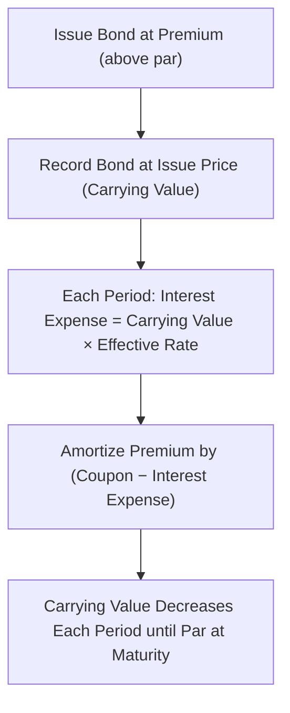

## Introduction
I still remember the first time I tried to reconcile bond carrying values between IFRS and US GAAP—my boss and I spent hours re-tracing our calculations to figure out why our discount amortization numbers didn’t line up. Turns out, we were mixing up some classification details. After that, I realized—understanding premium and discount amortization can spare us lots of confusion and time.

When bonds are issued or purchased, they can come at par, at a premium (above par), or at a discount (below par). Both IFRS and US GAAP require systematic amortization of that premium or discount over the bond’s lifetime. This amortization ensures the bond’s carrying value converges to par at maturity. Although both frameworks largely rely on the effective interest rate method for amortization, there can be differences in classification and potential reclassification rules. Let’s dig into the finer details.

## The Effective Interest Rate Method
Whether you’re dealing with IFRS or US GAAP, the starting point for measuring interest expense (for issuers) or interest income (for investors) is the effective interest rate method. In essence:

• The effective interest rate (EIR) is the market yield at the time the bond was issued (or purchased).  
• Each accounting period, the bond’s book (carrying) value is multiplied by the EIR to determine its interest expense (or interest income).  
• The amortization of premium or discount is the difference between the actual coupon payment and the interest expense (or interest income).

Mathematically, if we let:

• P₀ = the initial proceeds (issue price if you’re the issuer, or purchase price if you’re the investor),  
• r = the effective interest rate (annual),  
• CV₍t₎ = the carrying value at the beginning of period t,  
• C = coupon payment in cash (if any),  

then the interest expense (or interest income) in period t is  
(1)  Interest Expense₍t₎ = CV₍t−1₎ × r  

The amortization of premium or discount for period t would be:  
(2)  Amortization₍t₎ = Interest Expense₍t₎ − C  

• If Amortization₍t₎ is positive, you’re amortizing a discount (increases the bond’s carrying value).  
• If Amortization₍t₎ is negative, you’re amortizing a premium (lowers the bond’s carrying value).  

## IFRS vs. US GAAP Classifications
The main difference between these two frameworks isn’t how interest is calculated—it’s where the bond sits on the balance sheet and the possibility of shifting it between categories.

### IFRS Classification
Under IFRS 9, debt instruments (like bonds) can be classified in one of three main ways:

• Amortized Cost: If certain conditions (business model and contractual cash flow) are met. The bond stays on the books at amortized cost using the effective interest method.  
• Fair Value Through Other Comprehensive Income (FVOCI): If the business model involves collecting contractual cash flows and possibly selling the instrument.  
• Fair Value Through Profit or Loss (FVTPL): If it doesn’t meet the criteria for the other two categories, or if an irrevocable election is made at inception to measure it at fair value with changes recognized in profit or loss.

Reclassifications under IFRS can happen if the business model changes (though this is expected to be rare). When reclassification does occur, it’s prospective: future measurements change, but there’s no restatement of prior periods.

### US GAAP Classification
Under US GAAP (ASC 320 for debt securities):

• Held-to-Maturity (HTM): Where there is an intent and ability to hold the bond until maturity. The instrument is accounted for at amortized cost using the effective interest method, similar to IFRS’s “amortized cost” category.  
• Trading Securities: Carried at fair value with changes in fair value reported in the income statement (similar to IFRS’s FVTPL).  
• Available-for-Sale (AFS): Carried at fair value, with changes in fair value recorded in other comprehensive income (OCI). The effective interest method is still used to record interest and amortize premiums or discounts.

Under US GAAP, reclassifications among these categories are also possible but more restrictive. For instance, reclassifications out of held-to-maturity are typically discouraged and can trigger “tainting” of the rest of the portfolio.

## How Premium and Discount Amortization Works in Practice

The periodic journal entries for issuers typically look like this:

• Record interest expense (Income Statement) = carrying value × EIR.  
• Decrease (or increase) the bond’s carrying value by the difference between interest expense and the coupon payment.  

For example, if an issuing company sells a bond for $1,050 (premium) with a par value of $1,000 and 8% annual coupon, and the yield at issuance is 6%, then:

• The coupon payment each year is $80 (8% × $1,000).  
• The first period’s interest expense is $63 (6% × $1,050).  
• The premium amortization in the first period is $17 = $80 − $63.  

So the carrying value of the bond after the first coupon payment is $1,033 ($1,050 − $17). Over time, the bond’s carrying value converges to par ($1,000) at maturity.

On the investor side, you’d see the same arithmetic, but from an interest income perspective.

## Illustrative Example

Let’s do a more detailed numeric example with a discount bond. Suppose the bond has:

• Face value = $1,000  
• Annual coupon = 8% (paid at year-end)  
• Maturity = 5 years  
• Price at issuance = $920 (i.e., a $80 discount)  
• Yield = 10% (effective interest rate)

Initial carrying value is $920 at issuance. We can build a short amortization schedule:

Year 1:  
• Interest expense = $920 × 10% = $92  
• Coupon = $1,000 × 8% = $80  
• Amortization of discount = $92 − $80 = $12  
• Carrying Value end of Year 1 = $920 + $12 = $932  

Year 2:  
• Interest expense = $932 × 10% = $93.20  
• Coupon = $80  
• Amortization of discount = $93.20 − $80 = $13.20  
• Carrying Value end of Year 2 = $932 + $13.20 = $945.20  

And so on, until by the end we approach $1,000 carrying value at maturity. 

Sometimes, you’ll see minor rounding differences in real-life schedules, but the principle stays the same: discount means you gradually “write up” the bond’s carrying value so that it lands at par on the maturity date.

## Reclassification Under IFRS vs. US GAAP
Reclassification is a pretty big deal if, for instance, your original investment strategy changes from collecting coupons to actively trading the bond. IFRS 9 says reclassification is expected to be an extraordinary event. If it does occur, it takes effect going forward—but there is no “re-do” of historical numbers. Under US GAAP, reclassifications among HTM, AFS, and Trading have stricter guidelines. For example, to move from HTM to AFS, you need a legitimate justification—otherwise, the entire HTM portfolio can be called into question.

## Diagram: Bond Carrying Value Evolution
Below is a simplified Mermaid diagram showing how a bond’s carrying value evolves under the effective interest method. We’ll imagine we’re the issuer dealing with a premium bond:

The same logic applies for discount bonds, only you’d see that carrying value rise over time rather than fall.

## Best Practices and Pitfalls
1. Always confirm the initial yield at issuance. Using the wrong yield leads to incorrect interest expense or interest income.  
2. Keep an eye on classification: if your bond is measured at FVTPL (or Trading under US GAAP), then unrealized gains or losses go through the income statement each period—premium/discount amortization is still conceptually there, but overshadowed by fair value changes.  
3. Watch out for potential reclassifications. Under IFRS 9, reclassification can happen if your business model changes. US GAAP, on the other hand, is quite firm on HTM classification. A single attempt at reclassification might “taint” your entire HTM portfolio if not adequately justified.  
4. Check for partial redemptions or bond retirements. If an issuer redeems some portion of the bond early, the carrying value needs to be adjusted and any resultant gain or loss recognized accordingly.  
5. For convertible bonds or bonds with embedded options: premium/discount amortization is straightforward for the host contract, but you’ll also need to consider the effect of splitting out the equity or derivative component if required.  

## A Quick Personal Anecdote
One of my former mentors always told me: “Let the effective yield do the talking.” When I was new, I tried to track each coupon separately, ignoring that the bond’s carrying value was changing each period. You can guess how messy that got. Once I embraced the effective interest rate method, everything stayed consistent, and I could see how the premium or discount was unwinding over time. 

## Key Takeaways
• Both IFRS and US GAAP use the effective interest rate method to systematically amortize the bond’s premium or discount.  
• Differences mainly arise from how bonds are classified and whether (and when) reclassification is allowed.  
• Under IFRS, classification depends on the business model and contractual cash flows (Amortized Cost, FVOCI, or FVTPL). Under US GAAP, we have HTM, AFS, and Trading.  
• Premium bonds have coupons that exceed interest expense, which reduces carrying value over time. Discount bonds have coupons that fall short, so carrying value ramps up toward par.  
• For exam success, hint: keep your amortization schedules detailed and consistent, and be mindful of classification categories.  

## References
• IFRS 9 Financial Instruments standard (https://www.ifrs.org/)  
• US GAAP ASC 320 (Investments—Debt Securities) (https://asc.fasb.org/)  
• CFA Institute Level I Curriculum, “Financial Statement Analysis” – Long-Term Liabilities  

## Test Your Knowledge: Bond Accounting under IFRS and US GAAP



### Which of the following correctly describes the effective interest rate method?

- [ ] It uses a constant dollar amount of interest each period.
- [ ] It always results in an even split of interest expense.
- [x] It computes interest based on the carrying value times the yield at issuance.
- [ ] It disregards any changes in carrying value over time.

> **Explanation:** The effective interest rate method multiplies the carrying value of the bond at the beginning of the period by the effective yield at issuance, ensuring that the portion of expense attributed to the premium or discount recognition is systematically applied.

### Under IFRS 9, when is a bond classified at amortized cost?

- [x] When the business model is to hold the bond to collect contractual cash flows and the bond’s terms fit a “principal and interest” profile.
- [ ] When it is actively traded on a daily basis.
- [ ] When management decides to measure all bonds at fair value, regardless of conditions.
- [ ] When reclassification of the bond no longer generates any gains or losses.

> **Explanation:** IFRS 9 allows classification at amortized cost if the bond’s cash flows are solely principal and interest, and the business model involves holding it to collect these cash flows.

### Under US GAAP, which bond classification typically requires reporting unrealized gains and losses in net income?

- [ ] Held-to-Maturity (HTM)
- [ ] Available-for-Sale (AFS)
- [x] Trading
- [ ] Par Value Method

> **Explanation:** Trading securities are measured at fair value with changes in fair value recognized in net income under US GAAP. AFS, by contrast, measures changes in fair value in other comprehensive income (OCI).

### A bond is issued at a premium. Which statement best describes the amortization effect using the effective interest method?

- [ ] The carrying value increases each period.
- [x] Interest expense is lower than the coupon, causing the carrying value to decrease.
- [ ] Interest expense is equal to the coupon, leading to no change in the carrying value.
- [ ] The carrying value stays constant until reclassification.

> **Explanation:** When the bond is issued at a premium, its coupon exceeds the effective interest calculated on the carrying amount. Therefore, the carrying amount decreases each period until par value is reached at maturity.

### How does IFRS handle reclassifications between measurement categories?

- [ ] They are prohibited under any circumstances.
- [x] They are allowed if the business model changes, but must be applied prospectively.
- [ ] They require restatement of all past period financial statements.
- [ ] They only happen when net income is at risk of decreasing too much.

> **Explanation:** IFRS 9 states that reclassification is possible when a business model changes, but such reclassifications are rare and prospective. Past statements are not restated.

### Under US GAAP, which category requires the use of the effective interest rate method but reports unrealized gains or losses in other comprehensive income (OCI)?

- [ ] Trading Securities
- [x] Available-for-Sale Securities
- [ ] Held-to-Maturity Securities
- [ ] None, as only IFRS 9 uses FVOCI

> **Explanation:** Under US GAAP, AFS securities use the effective interest rate method for interest recognition but report fair value changes in OCI.

### In an amortization table for a discount bond, which statement is accurate?

- [x] The interest expense each period is the bond’s carrying value times the market yield, and the carrying value gradually increases.
- [ ] The coupon payment always exceeds the interest expense.
- [ ] The interest expense is the coupon payment, which decreases the carrying value.
- [ ] There is no coupon payment recognized until the end of maturity.

> **Explanation:** With a discount bond, interest expense calculated using the yield on the carrying value is higher than the coupon, so the difference increases the carrying value until maturity.

### When comparing IFRS vs. US GAAP, which of the following is a general difference in bond accounting?

- [ ] IFRS disallows premium amortization entirely.
- [ ] US GAAP disallows discount amortization.
- [x] IFRS 9 can allow reclassification to or from different measurement categories if the business model changes, whereas US GAAP is more restrictive.
- [ ] Premium or discount amortization is optional under IFRS.

> **Explanation:** IFRS 9 indeed supports certain reclassifications when the business model changes. US GAAP demands stricter conditions, especially for HTM securities, where reclassifications are strongly discouraged.

### Which is least likely to be a pitfall of bond accounting?

- [ ] Mixing up the yield at issuance with a later market yield.
- [ ] Incorrectly classifying a bond under IFRS 9 categories.
- [ ] Forgetting to adjust carrying value after partial redemption.
- [x] Recording interest expense precisely equal to the coupon in a discount bond scenario.

> **Explanation:** In discount scenarios, interest expense is generally higher than the coupon, so equating them is clearly incorrect, making it an actual pitfall, not something that is “least likely.” 

### True or False: Under both IFRS and US GAAP, the same fundamental principle applies that premium or discount on a bond must be amortized over the bond’s life.

- [x] True
- [ ] False

> **Explanation:** Although classification can differ, both frameworks require systematic amortization of any premium or discount over the instrument’s life using the effective interest method in most cases.


