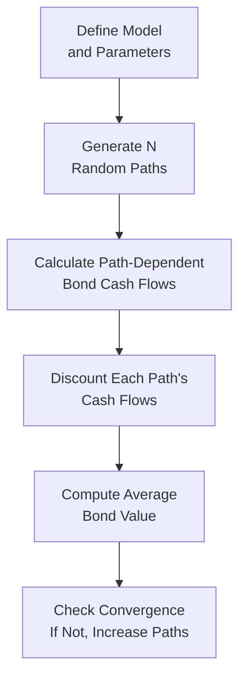

## Introduction
Monte Carlo simulation sometimes feels like one of those fancy math things that only large banks or rocket scientists use. But the truth is, it’s a super practical method for pricing bonds—especially those with complexities like embedded options, path-dependent cash flows, or rate-sensitive prepayment features. In many sections of this curriculum, we’ve talked about the importance of understanding interest rate risk, call and put features (see also Option-Adjusted Spread discussions in other parts of this volume), and how prepayments can dramatically affect a bond’s value. Monte Carlo simulation gives us a way to handle all these uncertainties in a structured (yet, ironically, random) approach.

Sure, the math behind it can look intimidating. But, in essence, Monte Carlo is just about generating a bunch of different possible future scenarios and then seeing how our bond might behave under each scenario. By averaging all those outcomes, we get a sense of the bond’s expected fair value in today’s market. This is especially powerful when the security is path-dependent—like a mortgage-backed security (MBS) whose cash flows can change based on how interest rates evolve over time.

## Why Use Monte Carlo for Bond Pricing?
Traditional bond pricing techniques (see 6.1 Present Value Concepts and Calculation Methods) typically assume a single yield or a small set of yield curves. But real-life interest rates bounce around all over the place, influenced by inflation expectations, central bank policies (see Chapter 4 for more on government/central bank actions), supply and demand for credit, and even market sentiment. 

In securities such as callable bonds, the decision to call the bond (redeem it early) depends on the path that interest rates took before we even reach the call date. The same idea applies to mortgage-backed securities, where prepayments can surge if rates drop enough to incentivize homeowners to refinance. In each case, the sequence of interest rates (the path) through time shapes the bond’s cash-flow profile and thus its value.

Monte Carlo simulation is tailor-made for these scenarios:
• It explicitly models the random nature of interest rates.  
• It captures path-dependent features (calls, puts, prepayments).  
• It allows flexibility in modeling scenario-specific assumptions (e.g., negative rates, liquidity stress).  

## Foundations of Monte Carlo Simulation
Monte Carlo simulation mixes probability theory with repeated random sampling to estimate outcomes of a stochastic (i.e., random) process. Let’s walk through the essential elements:

Stochastic Process  
A bond’s future cash flows are often tied to how future interest rates behave. We make assumptions about how rates evolve using a “stochastic process,” such as the Cox-Ingersoll-Ross (CIR) or Hull-White model. In practice, the choice of model can affect how we generate yield curves, how we calibrate them, and how we interpret bond valuations.

Random Number Generation  
The heart of Monte Carlo is random sampling from distributions—for interest rates, inflation levels, default intensities, etc. Typically, these random draws come from a Normal distribution or some variant, but negative rate environments can require (paradoxically) transformations that ensure we can simulate rates near or below zero.

Sampling and Convergence  
Because each new simulation path is a piece of random “noise,” we need enough paths so that our estimate of the bond's value “converges” (i.e., doesn’t bounce around wildly as we add more paths). Typically, tens of thousands of paths might be used for a standard bond with embedded options. In some exotic cases, we can surpass hundreds of thousands or even millions of paths.

Variance Reduction Techniques  
Running a million random paths can be expensive and time-consuming (trust me, I once tried to do it on a low-powered laptop—it took forever). Variance reduction techniques—like antithetic variates or quasi-random sequences (e.g., Sobol sequences)—reduce the noise and speed up convergence.

## Step-by-Step Monte Carlo Approach for Bond Pricing
The process of using Monte Carlo simulation to price a bond can generally be broken down into the following steps:

1. Model Setup  
   • Choose an interest rate model (e.g., Hull-White, CIR).  
   • Determine relevant parameters (long-term mean, volatility, mean reversion rate).  
   • Identify any embedded options or path-dependent features.  

2. Calibration  
   • Calibrate the chosen model to current market data, such as the current yield curve or implied volatilities from interest rate options.  
   • Adjust parameters until your simulated rates are consistent with observed market prices for standard instruments (like treasuries, swaptions, or futures).  

3. Generate Interest Rate Paths  
   • For each simulation path, create a sequence of interest rates over the life of the bond (e.g., monthly or quarterly steps).  
   • Incorporate potential negative rates if relevant, especially when dealing with markets (like some European sectors) that have historically witnessed sub-zero yields.  

4. Determine Bond Cash Flows  
   • For each interest rate path, figure out the bond’s cash flows.  
   • If the bond has a call feature, see whether the issuer would call it given the prevailing rates.  
   • If it’s an MBS, model prepayments under each path (often using dynamic prepayment functions that respond to interest rate changes).  

5. Discount the Cash Flows  
   • Convert each series of projected cash flows into present values using the simulated rates along that path (or, in more advanced frameworks, a term-structure discount approach).  
   • Sum these present values for the path to get the bond’s path-specific price.  

6. Average Across Paths  
   • Combine the results from all simulations by averaging (or taking the expected value) of these path-specific prices.  
   • This average is your Monte Carlo estimate of the bond’s fair value.  

7. Assess Convergence and Accuracy  
   • Check that your results stabilize as you add more paths.  
   • If not, consider more paths or use variance reduction to improve efficiency.  

Here’s a simple notional mathematical representation in KaTeX:

\text{Bond Price} \approx \frac{1}{N} \sum_{i=1}^{N} \left( \sum_{t=1}^{T} \frac{CF_{t}^{(i)}}{(1 + r_{t}^{(i)})^{t}} \right),

where \\( N \\) is the number of simulation paths, \\( CF_{t}^{(i)} \\) is the cash flow in period \\( t \\) under path \\( i \\), and \\( r_{t}^{(i)} \\) is the relevant discount rate from the simulated yield curve under path \\( i \\).

## Visualizing the Process
Let’s outline a basic flow of a Monte Carlo simulation for bond pricing in a diagram. It might go something like this:



## Handling Path-Dependence
Sometimes we encounter bonds—like Mortgage-Backed Securities or callable corporate bonds—where cash flows depend on how interest rates evolved up to that point in time (prepayment or call decisions). That’s exactly where Monte Carlo shines:

• MBS Pricing  
  Mortgage-backed securities require modeling homeowners’ decisions to prepay. These decisions hinge on interest rate paths (if rates drop significantly relative to the mortgage coupon, more homeowners refinance). Thus, you can’t get away with a single yield scenario; you need an entire set of possibilities.  

• Callable Bonds  
  Issuers will call a bond when it’s in their best financial interest, typically when the cost of refinancing is lower than the coupon they’re paying. Once again, it depends on the path interest rates took leading up to the call date.  

## Practical Example in Python (Very Simplified)
Below is a short snippet (in an extremely simplified style) illustrating how one could set up a basic Monte Carlo run for a callable bond. In the real world, you’d incorporate more sophisticated modeling and calibration, but this is just to show the mechanics:

```python
import numpy as np

num_paths = 10000
time_steps = 12  # Suppose 1 year, monthly steps
current_rate = 0.02
volatility = 0.01
coupon = 0.03
face_value = 1000
strike_rate = 0.015  # Call will be exercised if new rates are below this

np.random.seed(42)  # For reproducibility

discounted_values = np.zeros(num_paths)

for i in range(num_paths):
    rates = [current_rate]
    for t in range(time_steps):
        # Simple random walk in rates (very naive)
        dr = volatility * np.random.randn()
        new_rate = rates[-1] + dr
        if new_rate < 0:
            new_rate = 0  # floor at 0 for simplicity
        rates.append(new_rate)
    
    # Evaluate the bond's cash flows under that path
    # Let's do an extremely simplified call: if at any time new_rate < strike_rate, it's called
    called = False
    present_value = 0.0
    for t, simulated_rate in enumerate(rates[1:], 1):
        dt = 1.0 / 12  # monthly
        discount_factor = 1 / ((1 + simulated_rate)**(t*dt))
        
        if (not called) and (simulated_rate < strike_rate):
            # Called at time t
            present_value += face_value * discount_factor
            called = True
        elif not called:
            # Pay monthly coupon
            present_value += (coupon * face_value / 12) * discount_factor
            
    discounted_values[i] = present_value

bond_price_estimate = np.mean(discounted_values)
print(f"Estimated Bond Price: {bond_price_estimate:.2f}")
```

Of course, actual industry models would incorporate many more nuances—modern prepayment functions, more advanced short-rate or forward-rate sampling, option-adjusted spread calculations, etc.

## Advanced Considerations
### Option-Adjusted Spread (OAS)
You’ll see OAS come up quite a bit when dealing with bonds that have embedded options. OAS is the constant spread added to each forward rate so that the model’s theoretical price matches the market price. Monte Carlo can be used to “back out” this spread, providing a measure of relative value across different bonds.

### Negative Rate Environments
With the possibility (albeit unusual in some markets) of negative short-term or even negative long-term rates, your model must allow for rates dipping below zero—or have a workaround. A minor tweak in a typical model might do the trick, or you may choose a model that’s specifically suitable for negative rates (like some shift extensions of the Hull-White model).

### Model Calibration
Calibration ensures that your interest rate (or any other) model lines up with observable market data. This might mean matching current yield curves, implied volatilities from swaptions, or historical rate moves. If your calibration is off, your Monte Carlo result can be systematically biased.

### Variance Reduction
• Antithetic Variates: For every path, you use an “inverse” random draw, which can cancel out some randomness and improve convergence.  
• Low-Discrepancy Sequences: Instead of purely random draws, these sequences (like Sobol, Halton) can systematically sample the distribution, also helping speed up convergence.

## Linkages to Other Concepts
• For deeper dives into discounting and yield calculations, Chapter 6.2 and 6.7 are excellent complements.  
• When modeling default in more advanced credit-sensitive securitizations, see Chapter 9 on Credit Risk and how it can intersect with interest rate simulations.  
• Risk management concepts from Chapter 8 are integral to building the stress scenarios used in your Monte Carlo model, especially for scenario analysis.  
• Hedge strategies involving interest rate derivatives (also in Chapter 8) can be layered into or tested by your Monte Carlo framework.

## Best Practices and Pitfalls
1. Sensitivity Testing: Always test how the bond’s simulated price changes if you tweak model parameters.  
2. Proper Parametrization: Path-dependent securities can be extremely sensitive to even small changes in volatility or prepayment assumptions.  
3. Overcoming Performance Bottlenecks: While more paths yield better estimates, keep an eye on computational cost. Parallel processing (e.g., GPU computing) can help.  
4. Data Availability: Garbage in, garbage out. If your calibration data is unreliable, your results will be, too.  
5. Understanding Embedded Options: Make sure you (or your software) have a robust logic for deciding when and how an embedded call or put is exercised.  

## Final Exam Tips
• Monte Carlo Time Constraints: On the CFA exam, you won’t be asked to program a full simulation. However, you might see conceptual questions on how a security’s path-dependence influences the choice of a Monte Carlo approach over simpler methods.  
• Distinguish Key Rate Movements: If a question references rate moves or calls exercises, highlight path-dependence in your explanation.  
• Remember OAS: Be ready to explain the difference between nominal spread, Z-spread, and OAS, especially in the context of embedded options.  
• Calibration vs. Implementation: Don’t mix them up. Calibration is ensuring your model represents market conditions, while the actual simulation is applying that model to compute the bond price.  
• Keep It Organized: The typical exam question might ask you to walk through the steps or identify the advantages/disadvantages of Monte Carlo simulation. Following the step-by-step logic in your answer is a surefire way to score well.  

## References for Further Study
• Glasserman, P., Monte Carlo Methods in Financial Engineering, Springer.  
• Hull, J., Options, Futures, and Other Derivatives, Pearson.  
• CFA Institute Level I Curriculum, Fixed Income Risk Modeling.  

## Test Your Knowledge of Monte Carlo Simulation for Bond Pricing



### 1. Which of the following is generally the primary rationale for using Monte Carlo simulation in bond pricing?

- [ ] It simplifies all credit modeling.  
- [x] It captures path-dependent features of interest rates and cash flows.  
- [ ] It guarantees the elimination of negative rate scenarios.  
- [ ] It always converges in fewer than 100 paths.  

> **Explanation:** Monte Carlo simulation is especially chosen for pricing when path-dependent features (like calls, puts, or prepayments) require a large sample of varied interest rate scenarios.

### 2. In a typical Monte Carlo setup for an MBS, which factor most directly influences prepayment rates along each path?

- [ ] Credit spread transitions over time.  
- [ ] Equity market performance.  
- [x] Interest rate movements over time.  
- [ ] The issuer’s current net income.  

> **Explanation:** Mortgage prepayment behavior is usually driven by interest rate movements (i.e., homeowners refinance if rates drop enough).  

### 3. What best describes the process of “calibration” in a Monte Carlo bond pricing model?

- [x] Adjusting model parameters so that the model fits observed market data.  
- [ ] Running enough paths to ensure numerical stability.  
- [ ] Using sample means to approximate default probabilities.  
- [ ] Converting foreign bond coupons to domestic currency.  

> **Explanation:** Calibration aligns the model (and its parameters) with real market information, ensuring simulated outputs match up with actual prices or implied volatilities.

### 4. Suppose an issuer has a callable bond. How does a path of declining interest rates most likely affect the Monte Carlo simulation outcome?

- [x] It increases the likelihood of an early call, reducing the bond’s price.  
- [ ] It reduces the likelihood of prepayment.  
- [ ] It has no impact on call decisions.  
- [ ] It nearly always makes the bond price go up.  

> **Explanation:** If rates decline, issuers generally want to refinance at a lower rate, exercising the call option earlier and hence capping potential bond price gains for investors.

### 5. Which variance reduction technique pairs each random draw with its “inverse” draw?

- [x] Antithetic variates  
- [ ] Quasi-sequences  
- [ ] Delta-hedged pairs  
- [ ] Equal weighting of paths  

> **Explanation:** In antithetic variates, for every random draw x, we also use –x in another path, helping reduce variance in the average approximation.

### 6. In Monte Carlo simulation, what does “convergence” specifically indicate?

- [ ] The number of embedded options has decreased.  
- [ ] Risk has been fully eliminated.  
- [x] Adding more simulation paths no longer changes the final price estimate significantly.  
- [ ] The yield curve has flattened.  

> **Explanation:** Convergence refers to the situation where further simulations do not meaningfully alter the estimated fair value, indicating sufficient path sampling.

### 7. If you observe that your Monte Carlo valuation is much higher than the market price, which step should you consider revisiting?

- [x] Model calibration  
- [ ] Random seed selection  
- [ ] Variance reduction  
- [ ] Time step discretization  

> **Explanation:** A discrepancy between simulated and market prices often points to an issue with calibration or input assumptions.

### 8. A major practical challenge in performing Monte Carlo simulations for large institutional portfolios is:

- [ ] Inability to handle negative rates.  
- [ ] Lack of interest in bond valuations.  
- [ ] The method’s inability to account for default risk.  
- [x] High computational cost due to large path counts.  

> **Explanation:** Typically, scaling to many bonds and large path counts can be computationally intensive, motivating the use of variance reduction or parallel computing.

### 9. Why can standard single-yield discounting (no simulation) be insufficient for callable bonds?

- [ ] It only allows for negative rates.  
- [x] It doesn’t capture how the path of rates influences the call decision.  
- [ ] It overstates reinvestment risk.  
- [ ] It assumes default is guaranteed.  

> **Explanation:** A single-yield approach can’t address the path-dependent call feature, where the decision to call depends on how rates evolve over time.

### 10. When using Monte Carlo simulation in a negative interest rate environment, which statement is most accurate?

- [x] The underlying interest rate model must be carefully adapted to allow for sub-zero yields.  
- [ ] Negative rates cannot appear in any Monte Carlo model.  
- [ ] Negative rates drive immediate bond defaults.  
- [ ] The simulation simply dissolves.  

> **Explanation:** Many short-rate models require modifications (or different calibrations) to handle negative yields, ensuring realistic assumptions for advanced markets.


