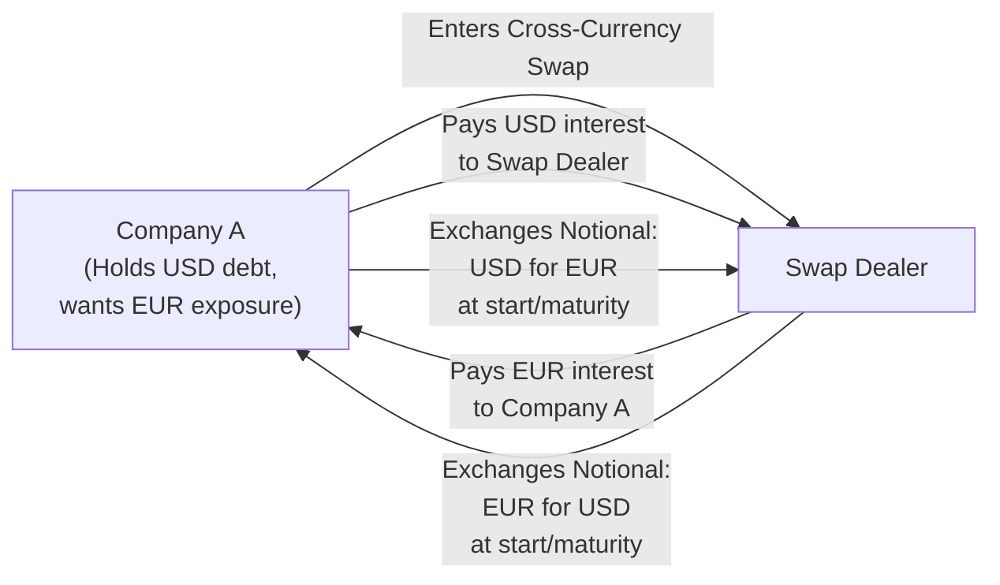

## Introduction
Have you ever stumbled upon a foreign-currency bond and thought, “Hmm, I love the yield, but I’m really not dying to take on the FX risk—maybe there’s a way to hedge it?” Cross-currency swaps are a neat solution for exactly that scenario. They allow issuers or investors to exchange payments from one currency to another, effectively transforming the currency profile of their asset or liability. At their core, these swaps can help hedge away some or all of your currency risk, or even let you gain synthetic exposure to new interest rate environments. But, well, watch out for basis risk, because that can sometimes sneak up on you.

Below, we’ll explore how cross-currency swaps work, their typical uses, and the implications for bond valuation. We’ll also see how a seemingly simple question, like “Which currency do I want to hold?” can lead us down a more complex path when considering credit factors, swap mechanics, and basis spreads.

## Basic Mechanics of Cross-Currency Swaps
A cross-currency swap is a contract between two parties to exchange principal and interest payments denominated in different currencies. The typical structure involves:

• Initial exchange of notional principal in each currency (sometimes the principals are “exchanged on paper,” meaning no funds move at the outset, but you agree to net out the final settlement).  
• Periodic exchange of interest payments during the life of the swap. You might receive floating-rate payments in one currency and pay fixed in another, or vice versa.  
• Final exchange of notional amounts at maturity.

Unlike an interest rate swap, you’re not just exchanging interest payments; you’re also addressing currency conversions. Practically, this means you can take a liability in one currency (like paying USD interest) and transform it into a liability in another (like paying EUR interest). Or if you’re an investor, you can turn your foreign-currency bond investment into synthetic domestic exposure.  

The swap details—like the notional amounts, fixed vs. floating rates, and the relevant payment schedules—are governed by an ISDA Master Agreement. This standardized documentation sets out the legal framework, credit support annexes, and so forth.

Here’s a simple flowchart illustrating the basic idea:



## Role in Hedging Foreign Exchange Risk
Let’s say you’re a European investor holding a U.S. dollar bond. If you do nothing, you’ll be exposed to movements in the USD/EUR exchange rate. That might be okay if you’re bullish on the dollar, but if you only love the coupon and don’t want currency risk, you could use a cross-currency swap to synthetically convert your USD bond into EUR.  

In practice, you’d do something like:  
• Receive USD from your bond.  
• Enter into a cross-currency swap: you pay USD (the interest you receive from the bond) and receive EUR.  
• Now your effective yield is based on the EUR interest you collect from the swap.  

Cross-currency swaps let you transform the payoff profile of your investment into your home currency. Or, from an issuer’s perspective, if you can issue a bond cheaply in EUR but you actually need USD for your business, you might use a cross-currency swap to transform your EUR obligation into a USD obligation at a potentially lower all-in financing cost.

## Impact on Bond Valuation
When valuing a foreign-currency bond from the perspective of your domestic currency, there are two main approaches:  

• Discounting each foreign-currency cash flow at the appropriate yield curve, then converting each discounted cash flow into your domestic currency using forward FX rates.  
• Using an implied swap curve to directly derive discount factors in your domestic currency for those cash flows, effectively “locking in” the currency exchange via a cross-currency swap structure.

### Implied Swap Curve
In many markets, the easiest way to find out what the forward exchange rates might be is to look at an implied swap curve—basically the data from cross-currency swaps themselves. These swaps can tell you what the market expects for currency exchange in the future, adjusted by interest rates and credit spreads. So if you want to discount a foreign-currency bond cash flow in your local currency, you can use the relevant cross-currency swap rates to get the discount factor.

### Cross-Currency Basis Spreads
One quirk is something we call the “cross-currency basis spread.” That’s the extra premium or discount you pay (or receive) when swapping one currency for another, on top of the interest rate differential. Sometimes, market demand might drive the cost of funding in a certain currency higher or lower relative to reference interest rates. This can manifest as a basis spread on cross-currency swaps. If you forget to include it in your analysis, you’ll wind up with mismatched valuations for seemingly identical bonds denominated in different currencies.

Maybe you’ve heard folks exclaim in frustration: “Why am I paying an extra 10 basis points to swap from USD to EUR if interest rates are already 2% higher in the U.S.?” That difference can reflect credit risk, supply-demand imbalances, or broader liquidity conditions.  

As a result, the cross-currency basis spread can be a big deal in your bond valuation puzzle: two identical bonds (in credit and maturity terms) might trade differently solely because of the cost inherent in converting one currency into another.

## Example of Converting Cash Flows
In a typical textbook scenario, you might convert each bond cash flow to your domestic currency using forward exchange rates. Under the assumption of covered interest parity, the forward rates can be found using a formula like:


F_{T} = S_{0} \times \frac{(1 + i_{\text{domestic}})^T}{(1 + i_{\text{foreign}})^T}


where:  
• \\( F_{T} \\) is the forward exchange rate for maturity \\( T \\).  
• \\( S_{0} \\) is the current spot rate (domestic per foreign).  
• \\( i_{\text{domestic}} \\) is the domestic interest rate.  
• \\( i_{\text{foreign}} \\) is the foreign interest rate.  
• \\( T \\) is the time to maturity (in years or fraction thereof).

Once you have forward rates, simply multiply your foreign-currency bond’s projected cash flow by these forward exchange rates to get the domestic currency amounts at each future date. Then discount each amount back to present value at your domestic yield curve. Or you might skip the step of individually converting by referencing the implied cross-currency swap discount factors—whatever’s more convenient or more standard in your market.

Here’s a tiny Python snippet that demonstrates how you might compute a forward FX rate under a simplified assumption of covered interest parity:

```python
import math

def forward_fx_rate(spot_rate, r_domestic, r_foreign, time):
    # Using the basic CIP formula: F = S * ((1 + r_domestic)^time / (1 + r_foreign)^time)
    return spot_rate * ((1 + r_domestic)**time / (1 + r_foreign)**time)

spot_rate = 1.20  # Suppose we have 1.20 USD per EUR as the spot rate
r_usd = 0.03      # 3% USD interest rate
r_eur = 0.01      # 1% EUR interest rate
time_in_years = 1

fwd = forward_fx_rate(spot_rate, r_usd, r_eur, time_in_years)
print(f"1-year forward rate (USD/EUR): {fwd:.4f}")
```

In reality, the forward rates you see in the market might also incorporate credit risk, cross-currency basis spreads, and other nuances. But the fundamental concept remains: if you want to hedge a foreign bond’s currency risk or re-denominate it, you’re essentially dealing with cross-currency swaps, whether directly or indirectly.

## Key Considerations and Mismatches
• Benchmark Mismatch: What if your bond pays coupons based on 3-month LIBOR (or its modern replacement) but your swap references 6-month EURIBOR? You might face some residual basis risk because the floating rates don’t match exactly.  
• Credit Risk: Cross-currency swaps introduce counterparty risk. If the swap counterparty defaults, you might lose your hedge just when you need it most. ISDA Master Agreements and collateral arrangements (credit support annexes) help mitigate that, but it’s never zero risk.  
• Legal and Tax Frameworks: Different jurisdictions treat swaps differently. Some require withholding taxes on cross-border payments. Others treat swaps as unique financial instruments with special accounting or regulatory constraints.  
• Market Liquidity: Certain cross-currency swaps can be more or less liquid than others. That can drive transaction costs and might limit your ability to close out or roll the swap.  

These considerations essentially make the real-life application a bit more complicated than the neat formulas might suggest.

## Why Cross-Currency Basis Spreads Arise
Let’s say you’re a Japanese institution that needs USD for a short-term investment (like buying U.S. Treasuries). But you only have JPY denominated liabilities or assets. In a perfect world, you’d just swap your JPY for USD at the going interest rate differential, no problem. But if there’s a huge wave of Japanese investors all doing the same thing at the same time, that demand for USD can outstrip supply in the swap market. The result: you’ll pay an additional premium—i.e., a wider USD-JPY basis.

Thus, cross-currency basis spreads often reflect supply-demand imbalances, credit conditions, or even regulatory constraints (like capital or liquidity rules for banks). From a bond valuation perspective, if you forget to factor that basis spread into your analysis, you might end up significantly mispricing foreign-currency bonds relative to your domestic market.

## Putting It All Together in Bond Valuation
When you see a bond denominated in a foreign currency, you can ask, “What if I wanted to hedge out the currency risk—how would that change the effective yield or cost?” The answers typically come from cross-currency swaps, forward FX markets, and the shape of both countries’ yield curves. Summing up:

• Determine the bond’s cash flows in the foreign currency.  
• Use forward FX rates or cross-currency swap implied rates to convert those flows into domestic currency or discount them.  
• Factor in the cross-currency basis spread, which might differ across swap maturities.  
• Reassess your net yield or net cost after the swap. This final figure is your “all-in hedged yield,” which can be compared to domestic investment alternatives.  

## Personal Anecdote
I recall early in my career, one of my colleagues had recommended a snazzy-looking high-yield bond in an emerging market currency. He said, “Hey, we’re getting 10% yield—this is amazing!” But we quickly realized that the cross-currency swap market for that currency was ridiculously expensive. After factoring in the cost of hedging, that 10% quickly shriveled down to something like 4%. Not nearly as impressive once the cross-currency basis decided to jump in and ruin the party.

## Exam Relevance
From a CFA exam perspective, cross-currency swaps often show up in item-set questions or constructed-response problems where you must illustrate how to hedge foreign exchange risk or compute the yield on a foreign bond once hedged back to the investor’s home currency. You may get a scenario where you’re given:

• Spot exchange rates, interest rates in two or more currencies, and a bond’s cash flows.  
• Cross-currency swap quotes (including a basis spread).  
• Potential mismatch or basis risk details (like references to different floating-rate benchmarks).

You’ll need to piece together the net outcome: “What’s the final yield or net present value (NPV) in the home currency once we implement the swap?”

Common pitfalls include forgetting to handle the principal exchanges at both the start and maturity, ignoring the basis spread, or mixing up which side of the swap you’re on (are you paying or receiving the foreign currency?). Another tricky point is the credit risk dimension—cross-currency swaps might require additional margin postings (collateral) under certain threshold conditions, which can affect your total return.

## Final Tips for the Exam
• Always keep track of the direction of cash flows in a cross-currency swap. Drawing a timeline or a quick flow diagram can save your sanity.  
• Factor in cross-currency basis spreads if they are provided, as exam questions may specifically test how that spread affects the final hedged yield.  
• Label your equations clearly, especially for forward FX rates or discount factors.  
• If you have to show your calculations, write out each forward rate or swap discount factor step by step so you don’t lose partial credit.  
• Double-check you’re consistent about which currency is “domestic” and which is “foreign,” or you could invert an exchange rate. Mistakes here are quite common and can flip the solution.

## References
• Choudhry, M. “Fixed Income Markets: Instruments, Applications, Mathematics.” (Wiley).  
• Bank for International Settlements, “Statistics on Cross-currency Swaps.” https://www.bis.org/  
• CFA Institute Level I Curriculum. “Currency Management in Fixed Income.”  

## Practice Questions: Cross-Currency Swap Mastery Quiz



### Which of the following best describes a cross-currency swap?

- [x] An agreement to exchange both principal and interest payments in different currencies.
- [ ] A swap where two parties exchange only interest payments in the same currency.
- [ ] A credit default swap that references two currencies.
- [ ] A swap that pays a single currency basis spread throughout its term.

> **Explanation:** Cross-currency swaps involve exchanging both principal and interest obligations denominated in different currencies.

### When performing a valuation of a foreign-currency bond using the domestic investor’s perspective, which of these elements is MOST critical?

- [ ] Using only the domestic yield curve to discount future cash flows in foreign currency.
- [x] Converting the foreign-currency cash flows into domestic currency at forward rates or via implied swap curves.
- [ ] Ignoring interest rate differentials between the two currencies.
- [ ] Using only the foreign yield curve regardless of hedging considerations.

> **Explanation:** To get a consistent valuation, you must convert or discount the foreign-currency cash flows back into domestic currency appropriately, generally through forward FX rates or cross-currency swap implied rates.

### In a standard cross-currency swap where one party pays fixed USD and receives fixed EUR, which of the following represents a typical flow at maturity?

- [x] Exchange of the USD notional for the EUR notional plus any final interest payments.
- [ ] No exchange of principal because only interest payments are swapped.
- [ ] Exchange of only the difference in tuition rates.
- [ ] Exchange of floating rates in both currencies minus the notional.

> **Explanation:** Cross-currency swaps typically involve exchanging notional amounts at the start and the end, along with the unpaid interest amounts.

### Which of the following best explains why cross-currency basis spreads arise in the market?

- [ ] They are strictly due to government intervention in FX markets.
- [x] Differences in supply and demand for funding in specific currencies, as well as credit and risk constraints.
- [ ] They are fixed by regulation and do not vary over time.
- [ ] They only arise in emerging markets.

> **Explanation:** Cross-currency basis spreads are primarily driven by supply-demand imbalances, credit considerations, and market liquidity constraints.

### An investor owns a EUR-denominated bond but wants exposure to USD interest rates. Which swap position would achieve this objective?

- [x] Entering a cross-currency swap to pay EUR and receive USD interest.
- [ ] Entering a currency forward contract to buy EUR forward.
- [ ] Entering an interest rate swap in EUR.
- [ ] Buying U.S. Treasury futures.

> **Explanation:** To convert the exposure from EUR to USD, the investor needs to pay out EUR (the bond’s underlying currency) and receive USD in a cross-currency swap.

### What is one of the main advantages of relying on cross-currency swap curves for discounting foreign bond cash flows?

- [ ] They eliminate all currency risk altogether.
- [ ] They provide a simplified, single-currency yield approach for ignoring credit risk.
- [x] They incorporate market participants’ expectations for currency exchange and interest differentials, helping to reflect real hedging costs.
- [ ] They replace the need for central bank interest rate data.

> **Explanation:** The implied rates from cross-currency swap markets reflect market-based views on interest rates and exchange rates, thus helping to include real-world hedging costs and currency expectations.

### Why might the notional amounts in a cross-currency swap differ if the swap reference currencies trade at significantly different exchange rates?

- [x] Each side’s notional is typically set in its respective currency, so the nominal amounts reflect the required exchange at inception.
- [ ] Regulators require that notional amounts always match exactly in all swaps.
- [ ] A smaller notional in the higher-value currency is legally prohibited.
- [ ] Notional amounts always match exactly one-to-one in all cross-currency swaps.

> **Explanation:** Each party’s notional is denominated in its local currency (e.g., EUR vs. USD), so they differ to reflect the actual exchange rates and principal amounts being exchanged.

### What is a key credit risk consideration in cross-currency swaps?

- [ ] Both parties are entirely risk-free because rates are determined by the market.
- [x] Counterparty risk can arise if one party defaults, leaving the other exposed to unhedged currency risk.
- [ ] There is no need for collateral since only interest payments are at risk.
- [ ] Margin calls do not apply to cross-currency swaps.

> **Explanation:** Cross-currency swaps expose participants to the default risk of their counterparties. If the counterparty fails, the hedging arrangement can collapse, potentially leaving the investor with the original FX exposure.

### If a USD-based investor uses a cross-currency swap to hedge a bond denominated in GBP, which mismatch risk is MOST likely to arise if the swap references a shorter floating benchmark?

- [x] Basis risk due to variations between the bond’s coupon benchmark and the swap’s floating index.
- [ ] No mismatch at all because both are denominated in GBP.
- [ ] CHAPS settlement risk because it is a GBP bond.
- [ ] Counterparty risk is eliminated by the mismatch in benchmarks.

> **Explanation:** If the bond references one index (e.g., 6-month GBP LIBOR) and the swap references a different tenor (e.g., 3-month SONIA), you can face mismatched coupon resets or basis risk that isn’t fully hedged.

### True or False: A cross-currency swap can be structured so that no principal is exchanged at the beginning, but principal is still exchanged at maturity.

- [x] True
- [ ] False

> **Explanation:** Some cross-currency swaps are structured with a “notional exchange” only at maturity (or, in certain cases, no actual movement of principal except on paper). This is still considered a valid cross-currency swap arrangement.


