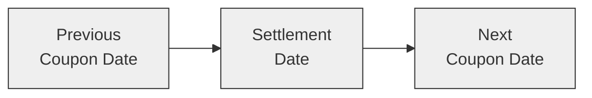

## Introduction
Day count conventions might sound mundane, but they can make all the difference between a small price discrepancy and a big headache. If you’ve ever had to explain to a client (or maybe your boss) why a bond’s accrued interest was off by a few dollars, you know exactly how crucial these conventions can be. In this section, we dive deep into a range of day count conventions—sometimes referred to as “quotient-of-days” conventions—used for calculating accrued interest and yield. Along the way, we’ll look at real-world examples, talk about pitfalls, and highlight best practices to help you avoid confusion in your daily work with fixed-income instruments.

Organizations such as the International Capital Market Association (ICMA) and the International Swaps and Derivatives Association (ISDA) publish definitions that guide day count conventions in government, corporate, and derivative markets. As you progress through your CFA studies and eventually manage or monitor bond portfolios, you’ll realize that day count conventions aren’t just an academic curiosity; they can affect settlement calculations, overall portfolio returns, and even how you hedge interest rate exposures in derivatives. Let’s see why.

## Core Concepts of Day Count Conventions
A day count convention determines how we measure the fraction of a year that applies to any given interest accrual period. Conceptually, if you’re holding a bond that pays semiannually, you need to know how many days have elapsed from the last coupon date to the settlement date, and how many days there are in a full coupon period (or a full year). Having the correct fraction of the year is essential for determining accrued interest, discount factors, and yield calculations.

### 30/360 (Bond Basis)
One of the most common conventions in U.S. corporate bonds is 30/360, sometimes called Bond Basis. Under 30/360, each month is treated as if it always has 30 days, and each year is 360 days. That means:
• All months are assumed to have 30 days.  
• The year is assumed to have 12 × 30 = 360 days.  

If you’re used to thinking in actual calendar days, 30/360 can feel pretty abstract. The logic behind it is historical: it provides a simplified fraction-of-year calculation that was easier to compute by hand or on older systems. But watch out for subtle differences. For instance, some versions of 30/360 might treat end-of-month differently for February. So read the fine print to avoid any accidental confusion.

#### Example Using 30/360
Let’s say a U.S. corporate bond has a coupon payment every six months on the 15th of January and July, and you’re settling on March 1. According to 30/360, the number of days from January 15 to March 1 is 16 days in January (from 15th to 30th) plus 30 days for February (counted as a full 30 under this rule), plus 1 day for March 1 (sometimes you exclude or include this day, depending on the exact 30/360 variant). The fraction of the year is then daysElapsed / 360. It’s a convention that can produce minor discrepancies relative to counting every calendar day, but it’s widely accepted in certain bond markets.

### Actual/365 (Fixed)
In some Commonwealth markets—like the UK—there’s a preference for Actual/365 (Fixed). This method:
• Counts the actual number of days that accumulate between the coupon date and the settlement date.  
• Divides by a fixed 365 days to get the fraction of the year.  

You might have seen Actual/365 in a treasury environment or for acknowledging certain legal definitions tied to British government bonds. It’s straightforward: you literally count each day since the last coupon, then divide by 365. Keep in mind that leap years don’t alter the denominator—it remains 365.

### Actual/360
Actual/360 is often used for money market instruments, including T-bills, commercial paper, and many floating-rate notes. The approach:
• Counts the actual number of days in the accrual period.  
• Divides by 360.  

Even though it compresses a real 365-day year into 360, it’s recognized globally in short-dated interest rate calculations. It can also appear in interest rate swaps tied to LIBOR or its replacements, due to the legacy money market conventions. If you’re analyzing a U.S. Treasury floating-rate note or certain Eurodollar instruments, chances are you’ll see Actual/360.

### Actual/Actual (ICMA/ISDA)
Actual/Actual, also known as ACT/ACT, tries to be the most precise. There are nuances, like Actual/Actual ICMA (commonly used for international bonds) and Actual/Actual ISDA (often used for derivatives). Both count every single day in the period and measure it as a fraction of the actual number of days in the full coupon period or year.

Comparing Actual/Actual to 30/360 can get interesting:
• Over a half-year coupon period, 30/360 will typically produce a fraction of 0.5, but Actual/Actual might produce something like 0.5082 if the actual calendar days are high (such as covering February, which might expand or contract the actual day count).
• Government bonds often rely on Actual/Actual (ICMA) to reflect the true calendar timeline.

This variation can be important when calculating T-bond accrued interest or determining the correct yield on a Gilt (UK government bond). Meanwhile, derivatives might rely on Actual/Actual (ISDA), which is spelled out in detail in ISDA definitions—trust me, that’s some bedtime reading for the truly dedicated.

## Effects on Accrued Interest
Accrued interest is the interest that the seller of a bond is entitled to receive up until the settlement date (when the buyer takes ownership). The formula typically looks like:

Accrued Interest = (Annual Coupon Payment) × (Day Count Fraction)

But the Day Count Fraction depends on the chosen convention. If you pick a different day count convention from the one the bond’s market uses, you may end up with a mismatch. In actual trading, you rarely get to “choose” a convention. The bond indenture or the applicable market standard typically dictates which one to apply.

### Settlement Amount Computation
When you buy a bond, you often pay the “clean price” plus accrued interest. The difference between the “clean price” and “dirty price” is precisely the accrued interest. For a typical corporate bond under 30/360:
• Dirty Price = Clean Price + Accrued Interest(30/360).  
• Accrued interest is computed from the previous coupon date to the settlement date based on the fraction of time served according to 30/360.  

In a market using Actual/Actual, you do the same calculation but you switch out the fraction-of-year for the Actual/Actual measure. If you incorrectly used 30/360 in a market that demands Actual/365(Fixed), be prepared for a tiny discrepancy in your final settlement amount.

#### Quick Personal Anecdote
I once had a situation where a client pointed out a 2-basis-point difference in yield between my numbers and Bloomberg’s. After a bit of cross-checking, it turned out I’d used 30/360 for a bond that was quoting on Actual/Actual. It was a bit embarrassing but taught me a valuable lesson: always confirm the correct day count method, especially when dealing with cross-border instruments or specialized markets.

## Pricing and Yield Implications
The day count convention also influences:
• Annualized yield computations.  
• Discount factors used in fixed-income analytics.  
• Embedded option valuation or OAS calculations, because these often rely on short rate models that assume a particular day basis.  

For instance, you might see a bond that yields 3.90% under an Actual/365 measure, yet 3.93% under Actual/360. The yield difference might look small, but over large notional amounts or heavy portfolio exposures, it can add up.

### Mismatching in Floating vs. Discounting
A common snag arises when a floating-rate note (FRN) is on one day count basis (like Actual/360), while your discounting or risk model uses something else (like Actual/365). Over a coupon period, the difference might not be dramatic, but in advanced interest rate swap hedges—especially if those swaps are referencing a different day count basis—tiny mismatches can compound. Traders who rely on exact replication strategies or who want to eliminate basis risk must ensure they’re consistent with the correct day counts in each leg of a swap.

## Role of Day Count in Derivatives
In Chapter 8, we tackle interest rate risk more specifically. But let’s take a quick peek here. In an interest rate swap, you typically exchange floating-rate payments for fixed-rate payments. The floating side might use Actual/360 if it references a money market index (e.g., the old USD LIBOR or SOFR-based calculations). Meanwhile, the fixed side can have a separate day count, like 30/360 or Actual/365. Although the swap contract explicitly defines which basis to use for each leg, the same problem can occur if you try to discount swap cash flows with a curve that uses a different day count methodology.

It’s also crucial for instruments like cross-currency swaps, where each currency leg can have distinct day count norms. For example, a U.S. dollar leg might come with Actual/360, whereas a British pound leg might use Actual/365. A mismatch in day counts without proper alignment in discount factors can create inaccurate valuations.

## Stub Periods and Irregular Coupons
Let’s say a bond is issued with an irregular coupon schedule, often called a stub period, which might occur when the issuer wants the coupon dates to align with the fiscal year. You might have a first coupon that isn’t a neat 6-month or 3-month fraction. Over that stub period, day count conventions are especially sensitive, because we measure everything from the bond’s issuance date to the first coupon date. Something like Actual/Actual might be the fairest representation, whereas 30/360 might over- or under-count by a few days, giving slightly different accrued interest numbers.  

## Common Pitfalls
• Using the wrong day count. It’s easy to forget which approach is standard for a particular bond or market.  
• Not adjusting for weekend or end-of-month quirks. Some 30/360 variants have tricky rules about the 31st of a month or what if February ends on the 28th or 29th.  
• Overlooking the difference between Actual/Actual ICMA and Actual/Actual ISDA. They’re both “Actual/Actual,” but each has unique definitions for how to handle leap years, coupon frequency, and so on.  
• Failing to match discounting basis with accrual basis. When dealing with more complex derivatives, not aligning the day count in your discount curve with that of your instrument can cause small but chronic valuation errors.

## Practical Calculation Example
Here’s a quick Python snippet that calculates day count fractions under a few common conventions. Feel free to adapt it for your own analyses (always with caution—these are simplified examples, not production-level code!).

```python
import datetime

def day_count_fraction(start_date, end_date, convention="30/360"):
    # Basic approach, for illustration only
    if convention == "30/360":
        # 30/360 US method
        d1 = min(start_date.day, 30)
        d2 = min(end_date.day, 30)
        days1 = (start_date.year * 360) + (start_date.month - 1)*30 + d1
        days2 = (end_date.year * 360) + (end_date.month - 1)*30 + d2
        return (days2 - days1) / 360.0
    elif convention == "ACT/365":
        delta = (end_date - start_date).days
        return delta / 365.0
    elif convention == "ACT/360":
        delta = (end_date - start_date).days
        return delta / 360.0
    else:
        # Simplistic version of Actual/Actual
        delta = (end_date - start_date).days
        # Approx: we won't break watch into coupon periods
        return delta / 365.0  # This would be a very naive approach

start = datetime.date(2025, 1, 15)
end   = datetime.date(2025, 3, 1)

print("30/360 fraction:", day_count_fraction(start, end, "30/360"))
print("ACT/365 fraction:", day_count_fraction(start, end, "ACT/365"))
print("ACT/360 fraction:", day_count_fraction(start, end, "ACT/360"))
```

You’ll see the differences in day count fractions for these few lines of code. In actual practice, you may need more advanced logic to handle leap years and special day count definitions from your local regulator or from global standardizing bodies.

## Mermaid Diagram: Timeline of Accrued Interest
The following diagram shows the timeline from the last coupon date to settlement:



• A to B: Accrued interest accumulates.  
• B to C: Buyer accrues interest going forward.  

Depending on day count convention, the fraction of the coupon allocated to the seller (the portion from A to B) can vary slightly.

## Best Practices for CFA Candidates and Professionals
• Always check the bond’s prospectus or the local market standard. For instance, U.S. corporate bonds tend to use 30/360, while U.S. Treasuries often rely on Actual/365 for certain segments of the curve.  
• Document your day count assumptions in any financial model so you can quickly troubleshoot if a result seems off.  
• When building or analyzing multi-currency or multi-product portfolios, stay consistent about day count selection or at least be aware of how different assets might be using different conventions.  
• Pay extra attention to derivatives. If you’re matching or hedging a bond with an interest rate swap, confirm that the day count for the fixed leg or floating leg matches the bond (or at least that you account for any mismatch).

## Regulatory and Accounting Interplay
Under IFRS 9 or US GAAP, financial instruments must be disclosed with details on how interest is recognized. Although the day count convention is not always spelled out in the official financial statements, the method of interest accrual used for effective interest rate calculations will be consistent with the bond’s specified or market-standard day count. Any difference could lead to an incorrect reporting of interest income or yield. For portfolio managers, ensuring each bond’s accrual is aligned with official IFRS or GAAP policy is part of internal controls and compliance.

## Conclusion and Final Exam Tips
Day count conventions may seem small, but they’re vital in ensuring accurate accruals and yields—especially in a high-stakes environment like the bond market. Perhaps the next time you confront a mismatch, you’ll recall that it’s not just about “counting days” but about counting them according to a recognized system that all parties agree upon.

From an exam perspective, be prepared to:
• Compare the day count fraction under various conventions.  
• Calculate accrued interest quickly for both an actual-based method and a 30/360 method.  
• Identify how yield changes when you shift from one convention to another.  
• Recognize the typical day count used by specific markets (e.g., money market vs. corporate vs. government).  

While final exam questions might only ask for a straightforward calculation, you should also understand conceptual pitfalls, like how day count mismatches can affect valuations, derivatives hedging motions, and portfolio returns. Good luck!

## References and Further Reading
• ICMA Rule Book on day count conventions: https://www.icmagroup.org/  
• ISDA definitions for interest rate day counts: https://www.isda.org/  
• CFA Institute Level I Curriculum, “Accrued Interest and Day Count.”  
• IFRS 9 and US GAAP guidance for financial instruments.  
• Fabozzi, F. J., “Bond Markets, Analysis, and Strategies,” for thorough coverage of bond math.  

## Day Count Conventions and Accrued Interest Quiz



### Which day count convention assumes each month has 30 days and each year has 360 days? 
- [ ] Actual/365 (Fixed)
- [x] 30/360
- [ ] Actual/360
- [ ] Actual/Actual (ICMA)
> **Explanation:** The 30/360 convention treats each month as though it has 30 days (even February) and the year as 360 days, a method often used for U.S. corporate bonds.

### If a market uses Actual/365 (Fixed), which of the following statements is most accurate?
- [ ] The day count fraction is always the same each month.
- [ ] Leap years are not accounted for; you always add one extra day to February.
- [ ] You treat each year as 360 days for yield purposes.
- [x] The actual days between coupon and settlement are divided by 365.
> **Explanation:** With Actual/365 (Fixed), you count every calendar day between the relevant dates and divide by 365.

### Which day count convention is commonly used for money market instruments and references a 360-day year?
- [ ] Actual/Actual (ISDA)
- [ ] Actual/365 (Fixed)
- [x] Actual/360
- [ ] 30/360
> **Explanation:** Actual/360 is standard in many short-term instruments, including T-bills and commercial paper, where the exact number of days is counted but divided by 360.

### In the context of bond pricing, accrued interest is typically calculated as:
- [x] (Annual coupon payment) × (Day count fraction from last coupon to settlement)
- [ ] (Clean price) × (Yield) ÷ (Day count fraction)
- [ ] (Dirty price) − (Yield × Settlement days)
- [ ] (Face value) ÷ (Day count fraction)
> **Explanation:** Accrued interest is the pro-rated portion of the bond’s annual coupon for the period from the last coupon date to (but not including) the settlement date.

### Which day count convention is often used for government bonds and attempts to capture the real, actual number of days in the period?
- [ ] 30/360
- [ ] Actual/360
- [ ] Actual/365 (Fixed)
- [x] Actual/Actual (ICMA)
> **Explanation:** Government bonds commonly use Actual/Actual (ICMA), which factors in the true number of days in the accrued period and in the year.

### A mismatch in day count conventions when discounting floating-rate payments typically leads to:
- [ ] Massive differences in bond principal
- [ ] Complete breakdown in risk modeling
- [x] Minor but notable valuation differences
- [ ] No difference at all, as day count never matters
> **Explanation:** Using a different day count on a floating-rate note versus the discount curve can cause small but potentially important valuation discrepancies, especially in active trading or hedging contexts.

### If you’ve inadvertently used 30/360 for a bond that actually trades under Actual/Actual (ISDA), which of the following is the most likely outcome?
- [ ] The bond’s accrued interest will never change.
- [x] Your calculated settlement amount or yield may be slightly off.
- [ ] You’ll exactly match market quotes at all times.
- [ ] This only matters for equity valuations, not fixed income.
> **Explanation:** By applying the wrong day count, your version of accrued interest or annualized yield will differ from actual market conventions, typically resulting in a small difference from the official settlement or market-quoted yield.

### Which of the following best describes the “stub period” in bond payments?
- [x] A partial coupon period that occurs due to an irregular start or end date.
- [ ] The period when a bond is in default and no interest accrues.
- [ ] A time frame when bonds switch from fixed to floating rates.
- [ ] The first full coupon period of exactly six months.
> **Explanation:** A stub period is any short (or long) partial period at the beginning or end of a bond’s life when coupon payments do not align perfectly with standard intervals.

### Day count conventions matter because they affect:
- [x] Accrued interest, settlement amounts, and yield computations.
- [ ] Equity dividends the most.
- [ ] Only the bond’s face value at maturity.
- [ ] The cost of a currency exchange rate in a forward contract.
> **Explanation:** Different day counts can alter accrued interest calculations, dirty prices, and yield annualization, making them vital considerations in bond pricing, derivatives, and settlement processes.

### True or False: Actual/Actual can have different definitions under ICMA vs. ISDA.
- [x] True
- [ ] False
> **Explanation:** Although both are referred to as Actual/Actual, each organization defines day count details slightly differently, which can produce minor variations in accrued interest and yield calculations.


