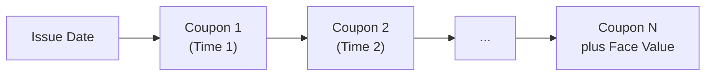

## Introduction and Core Concepts

So, you’ve probably heard a million times that "the yield on a bond is everything." Well, that’s mostly true: yields capture the discounted future cash flows, reflect an investor’s required return, and help us compare different bonds’ attractiveness. In the real world, yields also help us gauge how interest rates, inflation expectations, and issuer risk can impact a portfolio. In other words, they’re kind of a big deal.

We’ll explore the heavy-hitter, Yield-to-Maturity (YTM), and then dig into the other yield measures such as current yield, yield-to-call (YTC), yield-to-put, and yield-to-worst. Understanding each measure’s quirks can mean the difference between constructing a robust fixed-income portfolio or forgetting to consider those sneaky call features. Along the way, I’ll toss in a few stories, slightly casual references, and maybe a swirl of advanced nuances to keep it relevant for those stepping up to the next stage in their investment careers.

## Yield-to-Maturity: The Backbone of Bond Valuation

Yield-to-Maturity (YTM) is often described as the bond’s internal rate of return (IRR) when held to maturity, assuming all coupon payments are reinvested at the same rate. It’s a central concept for evaluating how a bond—be it government, corporate, or municipal—compares relative to other investments. In portfolio management, YTM is essential for everything from analyzing expected returns to calibrating the overall interest rate risk in a multi-asset portfolio.

### Formula and Cash Flow Representation

To find the YTM on a bond, solve for the discount rate r that sets the present value (PV) of the bond’s future cash flows (coupons and principal) equal to its market price (P).

In simple (semiannual coupon) terms, you solve:


P = \sum_{t=1}^{2N} \frac{C/2}{(1 + r/2)^t} + \frac{FV}{(1 + r/2)^{2N}}


• P = Current bond price  
• C = Annual coupon payment  
• FV = Par or face value  
• r = YTM (annual)  
• N = Number of years to maturity  

We typically use iterative numerical methods (like a financial calculator or Excel) to solve for r because there’s no closed-form formula for YTM.  

Below is a small diagram showing conceptually the bond’s coupon payments and final redemption:

Each node in the chart represents a cash flow point. YTM is the single interest rate that equates the present value of these periodic cash flows plus the lump sum redemption at maturity to the bond’s current price.

### Assumptions and Usage

• Reinvestment Assumption: YTM calculations assume that interim coupons are reinvested at the same yield, which might be unrealistic if interest rates change.  
• Holding to Maturity: YTM’s name says it all—you’re assumed to keep the bond until it matures. If you sell early, your actual return could deviate significantly.  
• Credit and Market Conditions: YTM ignores the possibility of default or rating changes—important in practical credit analysis.  

Even with these caveats, YTM remains a powerful measure. In performance attribution and scenario analysis, YTM provides a baseline measure for how a bond will perform over its lifespan in a stable rate environment.  

Occasionally, portfolio managers will compare the YTM to the yield they need to meet liabilities—particularly relevant in Liability-Driven Investing (LDI). If a pension fund manager needs, say, 5% on average to meet future obligations, they’ll look at a portfolio’s aggregate YTM and measure how that lines up with their required return.

## Current Yield: The Quick Glance Approach

Current yield is sometimes the first measure you see in market quotations—it’s simply:


\text{Current Yield} = \frac{\text{Annual Coupon Payment}}{\text{Bond Price}}


No fancy discounting. No complicated assumptions about reinvestment. However, it doesn’t capture capital gains or losses that occur if you hold a bond to maturity (especially for premium or discount bonds). If you’re looking at a bond priced well below par, that’s often because its coupon rate is too low compared to the market interest rates. This discount implies a potential capital gain if the bond is held to maturity. Current yield conveniently glosses over that. In practice, it’s a quick gauge—like checking the top-line figure on a corporate earnings statement—but not the entire story.

## Other Yield Measures: Beyond the Basics

### Yield-to-Call (YTC)

Many corporate and municipal bonds have an embedded call feature allowing the issuer to redeem the bond early (often to refinance at a lower rate). Yield-to-call (YTC) factors in this possible earlier redemption. Instead of using maturity, you plug in the call date, and instead of face value, you use the call price:


P = \sum_{t=1}^{k} \frac{C}{(1 + r_C)^t} + \frac{\text{Call Price}}{(1 + r_C)^k}


• k = Number of years (or coupon periods) until the first call date  
• Call Price = Price at which the issuer can redeem the bond (often par or slightly above par)  
• \\( r_C \\) = the yield-to-call  

A bond’s actual price will reflect the probability that it will be called. If rates drop, the issuer is more likely to call the bond to reissue at lower rates. In that scenario, the investor’s potential upside is capped—you likely won't get those huge capital gains from bullish interest-rate moves if the bond is called away from you.

### Yield-to-Put

Yield-to-put is analogous to YTC, except it applies when bondholders have the right to “put” (or sell back) the bond to the issuer at a specified price and date. This yield measure is calculated using the put date and put price as the final cash flow. If interest rates shoot up, the bond’s price might drop, and that put option can protect the investor from further declines by letting them redeem the bond early.

### Yield-to-Worst

Ever heard the expression “Plan for the worst, hope for the best”? That’s yield-to-worst in a nutshell. You take all the possible call or put schedules and compute the yield for each scenario. Whichever yield is the lowest is your yield-to-worst. Fixed-income analysts often quote yield-to-worst as a conservative gauge of what you might realistically earn, especially on bonds loaded with embedded options.

### Nominal vs. Effective Annual Yields

One subtlety that can confuse novices—especially if you’re analyzing a bond that pays coupons semiannually or quarterly—relates to nominal yields vs. effective yields.

• Nominal Yield: Simply annualizes the periodic rate without compounding. For instance, if you have a 6% annual coupon paid semiannually, the nominal yield from that perspective is 6%, but effectively you receive 3% × 2 = 6% per year if compounding is ignored.  
• Effective Annual Yield (EAY): Considers compounding. Using the same example, if you reinvest each 3% coupon at some interest rate, your effective yield might be slightly higher than 6%, depending on the reinvestment rate.

For many advanced analyses—like scenario-based portfolio modeling or comparing returns across bonds paying at different frequencies—focusing on effective yields can be more accurate.

## Discount vs. Premium Bonds: A Quick Recap

If a bond’s coupon rate is lower than the market yield, the bond will be priced at a discount—below par value—to equate investors’ required yield. Conversely, if the coupon rate is higher than the market yield, the bond trades at a premium—above par value.

In discount bonds:
- YTM > Current Yield > Coupon Rate

In premium bonds:
- Coupon Rate > Current Yield > YTM

This relationship matters in portfolio construction. Premium bonds might provide higher coupon income but generally lower upside on price appreciation (and even the possibility of negative convexity if callable). Discount bonds might have higher potential capital appreciation but pay less in coupons.  

## Yield Measures in Money Markets

Money market instruments—like Treasury bills or commercial paper—often use distinct quotation methods such as bank discount yield or bond equivalent yield (BEY). A T-bill might be quoted on a bank discount basis, which often makes the yield look smaller compared to a bond-equivalent yield for the same instrument. This is partly because the discount yield calculation uses par in the denominator and annualizes over a 360-day year. Portfolio managers typically convert yields to a common basis (an “apples-to-apples” approach) when comparing short-term instruments with standard coupon bonds.

## Integration in Portfolio Management

Why do professional investors need to master these yield definitions?

• Asset-Liability Matching: A portfolio manager handling pension or insurance liabilities might opt for bonds whose YTM lines up with the forward curve of required payments.  
• Callable vs. Non-Callable Exposure: If a portfolio is stuffed with callable bonds, monitoring yield-to-call and yield-to-worst becomes crucial for managing interest rate risk and potential negative convexity.  
• Tactical Allocation: In a rising rate environment, short-duration discount bonds might come into favor for lower price sensitivity and potential discount narrowing.  
• Risk Factor Budgeting: Recognizing yield measures helps break down how a bond might respond to changes in rates, credit spreads, and optionality.  

At advanced levels—for instance, analyzing portfolio sensitivity to shifting yield curves—professionals often focus on the volatility of yields rather than just a single static figure. Tools like key rate durations and scenario analyses help predict how changes in the shape of the curve might impact yields across the portfolio.

## A Personal Take on Yield Surprises

I once held a premium municipal bond (with a 5% coupon) back when interest rates were hovering around 3%. Looked great. Who doesn’t like the extra coupon? But guess what: the issuer promptly announced it might call the bond at par a couple of years before maturity. Suddenly, that 5% yield started looking more like a 3.2% yield-to-call scenario. Moral of the story? Always factor in the possibility of early redemption and measure your yield to call (and yield-to-worst), especially when the coupon is well above the current market yield.

## Diagrams and Tables

Let’s illustrate the concept of comparing multiple yield measures on the same bond. Imagine a 10-year coupon bond at par with a 4% coupon. Let’s say it has a call in 5 years at 102% of par (i.e., call price = 1,020 per 1,000 face value). Then the yield figures might look something like this:

| Measure         | Calculation Assumption                      | Hypothetical Yield |
|-----------------|---------------------------------------------|--------------------|
| Current Yield   | 4% coupon / market price                    | ~4.00% (if at par) |
| YTM             | 10-year horizon, final redemption at par    | ~4.00%             |
| YTC             | 5-year horizon, call redemption at 102      | ~3.70%             |
| Yield-to-Worst  | Min(YTM, YTC, ...)                          | ~3.70%             |

In this scenario, the yield-to-worst is the yield-to-call (3.70%). If interest rates stay at or below 4%, the issuer might choose to call the issue in 5 years and refinance. You might have purchased it thinking, “Hey, I’ll get 4% over the next 10 years,” but if you only earn 3.70% over 5 years, that difference can significantly impact your portfolio’s income generation.

## Best Practices and Pitfalls

• Always compare yields on a consistent compounding basis.  
• For callable bonds, check potential call dates carefully—sometimes there are multiple calls.  
• In your analyses, stress test (or scenario test) for changes in interest rates and credit spreads to see if early redemption is likely.  
• Don’t ignore yield measures in money market instruments—conversions can be tricky.  
• Watch out for misunderstood “current yield.” Some novices conflate it with YTM and make poor investment decisions if the bond is trading far off par.  

## Exam Tips and Strategies

• Be comfortable converting nominal yields to effective annual yields (EAY) for consistency.  
• When you see a question about yield-to-call or yield-to-put, always identify the correct date and price to discount. Don’t default to par value or maturity date.  
• Exam questions often include partial data—like a call date that’s 2 or 3 years from now, or multiple call schedules. If so, compute the yield for each scenario to determine yield-to-worst.  
• For short-term instruments (less than a year), be sure you know how to reconcile discount yield, simple interest yield, and bond equivalent yield. The exam might test your skill in “true price discovery” across different yield conventions.  
• Many item set questions revolve around analyzing whether an investor has overlooked an embedded option risk—like ignoring yield-to-put. Show you can apply each yield measure to confirm how that feature changes the bond’s risk-reward.  

## Conclusion

Yield measures aren’t just academic curiosities. They sit at the heart of fixed-income valuation and significantly influence bond trading, portfolio construction, and risk management decisions. Whether you’re a buy-and-hold investor trying to meet future liabilities or a tactical trader looking to hedge interest rate risk, precisely understanding each yield measure—especially YTM, yield-to-call, yield-to-put, and yield-to-worst—is crucial. And remember: context matters. A bond’s price, coupons, embedded options, and reinvestment assumptions all shape the true yield you’ll earn.  

---

## References and Further Reading

• Bodie, Z., Kane, A., & Marcus, A. (Various Editions). “Investments.” McGraw-Hill.  
• CFA Institute Level I Curriculum, Fixed Income: “Yield Measures” and “Term Structure” sections.  
• “Bloomberg Training Programs on Bond Yield Analytics.”  
• Fabozzi, F. (Various Editions). “Fixed Income Mathematics.”  

---

## Test Your Knowledge: Yield Measures and Bond Valuation



### Which measure accounts for the earliest possible redemption of a callable bond?

- [x] Yield-to-Call (YTC)
- [ ] Yield-to-Put
- [ ] Current Yield
- [ ] Discount Yield

> **Explanation:** Yield-to-call incorporates the first call date and the call price. It is the discount rate that equates the present value of all expected coupon payments until the call date and the call redemption amount to the bond’s current price.

### Suppose a bond has a 4% annual coupon rate and trades at par. Which is generally correct for a premium bond?

- [ ] Current Yield > Coupon Rate
- [x] Coupon Rate > Current Yield > Yield-to-Maturity
- [ ] Yield-to-Maturity > Coupon Rate > Current Yield
- [ ] Yield-to-Maturity = Current Yield = Coupon Rate

> **Explanation:** For a premium bond (price above par), the coupon rate is above the bond’s required yield. Therefore, the coupon rate exceeds the current yield, which in turn exceeds the yield-to-maturity.

### If a bond’s coupon payments are made semiannually and you quote its yield without compounding, you’re using:

- [ ] Effective Annual Yield (EAY)
- [x] Nominal Yield (Annual Percentage Rate)
- [ ] Yield-to-Worst
- [ ] Bond Equivalent Yield

> **Explanation:** When we simply double the semiannual yield without considering compounding, that’s the nominal (annualized) yield.

### Yield-to-worst for a callable and putable bond is best described as:

- [ ] Lowest of yield-to-maturity or yield-to-call
- [ ] Highest of yield-to-maturity, yield-to-call, or yield-to-put
- [x] Lowest of all possible yield scenarios, including call or put
- [ ] Average yield across all call and put scenarios

> **Explanation:** Yield-to-worst picks the minimum of all possible yields (to maturity, call, or put).

### You hold a bond trading below par due to a coupon rate lower than current market rates. Which relationship is most accurate?

- [ ] Coupon Rate > Current Yield > YTM
- [x] YTM > Current Yield > Coupon Rate
- [ ] YTM = Current Yield
- [ ] None of the above

> **Explanation:** If the bond is at a discount, the yield-to-maturity is the highest figure, the current yield is intermediate, and the coupon rate is the lowest.

### A short-term U.S. Treasury bill quoted on a discount basis will generally:

- [x] Have a lower quoted yield than its bond-equivalent yield
- [ ] Match exactly the bond-equivalent yield
- [ ] Be higher than its bond-equivalent yield
- [ ] Not require any yield conversion

> **Explanation:** T-bills are often quoted on a bank discount yield basis, calculated off face value on a 360-day year. This typically understates the yield compared to the bond-equivalent yield.

### Which of the following assumptions does yield-to-maturity make?

- [x] All coupons can be reinvested at the yield-to-maturity
- [ ] The bond will be put at the next available date
- [x] The bond is held until maturity
- [ ] The bond’s yield is unaffected by credit risk

> **Explanation:** YTM has two main assumptions: (1) coupons are reinvested at the same yield, and (2) the bond is held until maturity. YTM doesn’t incorporate the possibility of early redemption unless you’re specifically looking at a call or put feature.

### Which statement best describes the difference between current yield and yield-to-maturity?

- [x] Current yield ignores capital gains or losses, while YTM includes them
- [ ] Current yield always exceeds YTM
- [ ] Current yield is a measure of holding period return
- [ ] YTM is always equal to current yield if the bond is trading at par

> **Explanation:** Current yield simply divides the annual coupon by price; it does not account for the time value of money or any capital appreciation or depreciation from par.

### A bond has a call feature with multiple call dates. Yield-to-worst is determined by:

- [x] Calculating the YTC for each call date and comparing them with YTM
- [ ] Calculating yield only for the final call date
- [ ] Averaging yield-to-first-call and yield-to-maturity
- [ ] Substituting a zero reinvestment rate for call coupons

> **Explanation:** To find yield-to-worst, analysts compute yield-to-each-call date (and yield-to-maturity if not called) and take the minimum of those yields.

### True or False: An investor can safely assume that the nominal yield is always the same as the effective annual yield.

- [ ] True
- [x] False

> **Explanation:** Nominal yield (APR) does not account for compounding within the year, while effective annual yield incorporates compounding. They are only equal if compounding is annual (or effectively zero).


