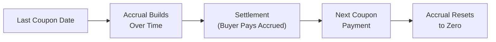

## Introduction and Core Concepts

Let’s be honest: bond quotes can be a bit tricky. The first time I tried to figure out why the price I saw on my trade ticket didn’t match the price I saw online, I got really confused. You know, that “am I missing something here?” kind of moment. The short answer is that it often comes down to accrued interest and the difference between the full (or dirty) price and the clean price. That’s what we’ll focus on in this section.

Accrued interest is basically the interest you’ve earned (but haven’t yet received) if you hold a bond over a partial coupon period. If you sell the bond before a coupon payment date, you’ve accrued some interest that a future buyer will eventually enjoy. The buyer compensates you for that portion by paying the bond’s clean price plus accrued interest. Altogether, that sum is known as the dirty (or full) price.

Below, we’ll walk through the logic, show you how to calculate accrued interest, and highlight how different day-count conventions can affect your numbers. Let’s jump right in and explore these crucial concepts.

## Clean Price vs. Full Price (Dirty Price)

In the bond market, the price we typically see quoted is the “clean price.” This is the bond’s value ignoring any accrued interest. However, in practice, the actual amount you pay or receive at settlement (i.e., the exchange of cash for the bond) includes both the clean price and accrued interest.

• Clean Price:  
  – Excludes accrued interest.  
  – Often reported in financial media or displayed on dealer screens.  

• Full (Dirty) Price:  
  – Equals the clean price + accrued interest.  
  – The actual cash amount exchanged at bond settlement.  

Why do we use two different prices? Historically, quoting the value of a bond “clean” (i.e., ignoring interim interest earned) makes it easier to compare multiple bonds. Accrued interest depends on the timing of the transaction, so ignoring it for quoted prices simplifies day-to-day comparisons. But from a practical standpoint, you typically care about the full price you end up paying.

## Accrued Interest and Day-Count Conventions

Accrued interest is the additional payment to the seller for the interest that has built up since the last coupon payment date. Calculating it is straightforward in concept but can be tricky in practice because bonds use different day-count conventions. Let’s try to break it down step by step.

### General Formula for Accrued Interest

If you’re looking for a neat formula, one approach is:


\text{Accrued Interest} = \text{Coupon Payment per Period} \times 
\frac{\text{Days Since Last Coupon}}{\text{Days in the Coupon Period}}


The fraction accounts for “how far” we are into the coupon period. However, “Days Since Last Coupon” and “Days in the Coupon Period” might be calculated differently depending on the bond’s day-count convention.  

### Day-Count Conventions

A “day-count convention” tells us how to count days and how to define what a “year” is. Below are some common ones:

• 30/360 (Bond Basis):  
  – Assumes each month has 30 days.  
  – Assumes a 360-day year.  
  – Commonly used in the U.S. corporate bond market.  

• Actual/Actual (ICMA or ISDA):  
  – Uses the actual number of days elapsed.  
  – Uses the actual number of days in the year (365 or 366 if leap year; sometimes 360 for certain calculations).  
  – Often used for government bonds and treasury-type securities.  

• Actual/360:  
  – Uses actual days elapsed.  
  – Defines a year as 360 days.  
  – Often used for money market instruments.  

• Actual/365 (Fixed):  
  – Uses actual days elapsed and a 365-day year.  
  – Frequently used for certain sterling-denominated bonds.  

If we want to be consistent, we match the day-count convention used by the bond’s indenture (or local market convention). Getting the day-count right is critical because it affects the fraction of the coupon the seller is owed.

## Putting It Together: Clean Price and Full Price Calculation

Let’s step through what you might see when buying a bond between coupon dates.

1. Find the quoted (clean) price of the bond.  
2. Determine the accrued interest by:  
   a. Figuring out how many days have passed since the last coupon date.  
   b. Figuring out the total length of the coupon period (in days).  
   c. Computing the proportion of coupon interest earned based on the day-count convention.  
3. Add the accrued interest to the clean price.  

Then you pay the full (dirty) price at settlement. Let’s illustrate with a short example.

## Example Calculation

Suppose we have a semiannual bond with an annual coupon rate of 6% on a face value of $1,000. That means each coupon is $30 every six months. Let’s assume:

• Last coupon date was 50 days ago.  
• We’re dealing with a 180-day coupon period.  
• Day-count convention is Actual/Actual, and it perfectly aligns with 180 days for the coupon period.  

So that fraction is:
  
Days Elapsed / Days in Period = 50 / 180 = 0.2777 (approximately).

Annual coupon = 6% of $1,000 = $60  
Semiannual coupon = $60 / 2 = $30

Accrued Interest = $30 × (50 / 180) = $8.33

If the bond’s clean price is quoted at $980, then:

Full (Dirty) Price = Clean Price + Accrued Interest  
= 980 + 8.33  
= $988.33

So, if you’re the buyer, you actually pay $988.33 at settlement, even though the “quoted” or screen price is just $980. Meanwhile, the seller is effectively compensated for the fact that they held the bond for 50 days and “earned” that fraction of the coupon.

## Visual Timeline of Accrued Interest

Sometimes it helps to see it visually. Here’s a little Mermaid diagram illustrating how accrued interest builds up from one coupon date to the next and how it resets upon payment.



Between the last coupon date (A) and the settlement date (C), the seller accrues interest. By the next coupon date (D), the new holder will collect interest since settlement, effectively picking up from zero again.

## Other Practical Considerations

• Ex-Dividend Period: Bonds also have an ex-dividend period, typically a few days before the coupon payment date. If you sell your bond during this ex-dividend period, the buyer won’t be entitled to the upcoming coupon. Market quotes and accrued interest calculations can shift accordingly.

• Payment Frequency Variations: Not all bonds pay semiannually; some pay annual coupons, quarterly, or monthly. The same accrued interest principles apply; just adjust the fraction of the elapsed coupon period.

• Global Market Differences: In some markets, day-count conventions differ for government bonds versus corporate bonds. Always confirm the local standard.

• Quoting Discrepancies: News outlets, online portals, or data providers might show a “dirty” price instead of a clean price. Make sure to check or recalculate if there’s any doubt.

## Common Pitfalls and Overlooked Details

• Forgetting the Day Count: It can be easy to simply divide the number of days by the total length in calendar days. That might not always align with the bond’s official convention. Double-check the bond prospectus!

• Confusing Quoted vs. Settlement Price: If you’re trying to reproduce the exact cash settlement in an example and you only use the quoted price from a news source, you might be missing a chunk of the story (i.e., accrued interest).

• Overlooking Leap Years: An Actual/Actual method that includes a leap year can slightly shift the fraction used for accrued interest. This might not break a trade but can alter the final calculation.

• Negotiating Price Instead of Yield: In some advanced discussions, trades are negotiated based on yield rather than price. Always keep in mind how yield translates into a clean price, and then don’t forget to add accrued interest.

## Strategies for Exam Success

On the CFA exam or in real-world contexts, be prepared to:

• Perform quick time-based calculations of accrued interest.  
• Convert between clean and dirty prices.  
• Correctly apply the day-count convention.  
• Address differences in coupon payment frequency.  

An effective approach is to try out example calculations with different day-count conventions. Doing these repeatedly can help you avoid silly mistakes. Also, watch for those scenario-based problems that might shift details like “what if the bond is annual” or “what if the next coupon is in 45 days instead of 60 days.”

## Brief Python Example

Just to highlight how you might automate a quick check of accrued interest, here’s a short Python snippet using a simplistic approach (assuming Actual/Actual for demonstration).

```python

def accrued_interest(face_value, annual_coupon_rate, days_elapsed, total_days_period):
    coupon_per_period = (face_value * annual_coupon_rate) / 2  # semiannual
    fraction_elapsed = days_elapsed / total_days_period
    return coupon_per_period * fraction_elapsed

face_value = 1000
annual_rate = 0.06
days_elapsed = 50
days_in_period = 180

AI = accrued_interest(face_value, annual_rate, days_elapsed, days_in_period)
print(f"Accrued Interest: ${AI:.2f}")
```

That code, if run, would spit out $8.33, matching the earlier example. This can be handy if you’re analyzing a bunch of bonds and want to avoid manual calculations.

## Exam Tips and Final Thoughts

• Make sure you know how to handle different coupon frequencies (annual, semiannual, quarterly).  
• Practice with various day-count conventions to avoid mechanical errors.  
• Carefully interpret “quoted price” in any question: if you see “clean,” you still need to add accrued interest for the “full” price.  
• Keep track of settlement dates; sometimes the exam question can mention T+2 or T+3, and that might shift your day count.  
• Look out for leaps in logic or leaps in years (pun intended).  

When studying for the exam, don’t skip practicing accrued interest. It might feel easy in isolation, but it’s a detail that can slip you up when combined with yield calculations, yield-to-call, or embedded options. In a stressful exam setting, that small detail might snag you if you’re not careful.

## References

- Tuckman, B. “Fixed Income Securities: Tools for Today’s Markets.” (Wiley)  
- CFA Institute Level I Curriculum, “Fixed-Income: Pricing and Valuation.”  
- International Capital Market Association (ICMA), “Market Conventions”  

---

## Test Your Knowledge: Accrued Interest and Dirty Price Essentials



### If you see a bond quoted in the market at 100.25 and you know that the bond pays coupons semiannually, which price does that 100.25 most likely represent?

- [x] The clean price
- [ ] The dirty price
- [ ] The full price including accrued interest
- [ ] The price net of fees and accrued interest

> **Explanation:** Market quotes are almost always given in clean terms, excluding accrued interest.

### Which of the following best describes accrued interest?

- [ ] A penalty for trading the bond before maturity
- [ ] The amount the bondholder pays to the issuer for early redemption
- [x] The interest earned since the last coupon payment but not yet received
- [ ] The difference between face value and current market price

> **Explanation:** Accrued interest represents the portion of interest that has built up since the last coupon was paid.

### When calculating accrued interest for a corporate bond using a 30/360 day-count convention, how do we typically count days?

- [x] Each month is assumed to have 30 days, and the year has 360 days
- [ ] Each month is assumed to have the actual number of days, but the year has 360 days
- [ ] Each month is assumed to have 31 days, except February
- [ ] Each day is counted exactly, resulting in 365 or 366 days in a year

> **Explanation:** Under 30/360, each month is treated as having 30 days, and the entire year is treated as 360 days long.

### A bond with an annual coupon rate of 8% on a $1,000 face value is trading between coupon dates. The next coupon payment is 45 days away, and the bond pays semiannually. Assuming a 90-day coupon period and that 45 days have elapsed since the last coupon, what is the accrued interest?

- [ ] $0
- [x] $10
- [ ] $20
- [ ] $40

> **Explanation:** The semiannual coupon is 0.08 × $1,000 / 2 = $40. Half of the coupon period (45 of 90 days) has elapsed, so accrued interest is 0.5 × $40 = $20 if 45 days have elapsed. However, note that if 45 days remain until the next coupon, that means 45 days have elapsed, so 45/90 = 0.5. Thus accrued interest is $40 × 0.5 = $20. (Be sure to read carefully whether 45 days have passed or 45 days remain. If we interpret “45 days away from next coupon,” that means 45 days remain, so 45 days have passed in a 90-day period. Accrued interest is $20. If you see a different interpretation, re-check how the question is phrased.)

### Which of the following is true regarding unexpected leap years when using the Actual/Actual convention for accrued interest?

- [x] They can slightly change the fraction used to calculate accrued interest
- [ ] They have no impact whatsoever on accrued interest
- [ ] They make daily calculations redundant
- [ ] They reduce the coupon rate

> **Explanation:** Under Actual/Actual, you literally count the days, so a leap year adds an extra day that changes fractions if your coupon spans February 29.

### How does accrued interest factor into the total transaction amount when settling a bond?

- [ ] It is excluded from both the quoted price and final payment
- [ ] It is subtracted from the quoted price
- [x] It is added to the quoted price to arrive at the final settlement amount
- [ ] It replaces the quoted price entirely

> **Explanation:** The total the buyer pays equals the clean price (the quote) plus accrued interest.

### Under a T+2 settlement convention, if you buy a bond on Monday (with no holidays in between), which day is generally your official settlement date?

- [ ] Monday
- [x] Wednesday
- [ ] Friday
- [ ] Thursday

> **Explanation:** T+2 means two business days after the trade date. So from Monday, count Tuesday (T+1) and Wednesday (T+2).

### You buy a 10% annual coupon bond (paid semiannually) with a face value of $1,000 using an Actual/Actual day-count convention. If 70 days have passed in a 180-day period, what fraction do you use to compute accrued interest?

- [ ] 1/2
- [x] 70/180
- [ ] 180/70
- [ ] 70/365

> **Explanation:** We divide the actual days elapsed by the total days in the coupon period.

### How do bond markets typically quote bond prices?

- [x] As clean prices that exclude accrued interest
- [ ] As dirty prices that include accrued interest
- [ ] As real prices accounting for inflation
- [ ] Net of any transaction fees

> **Explanation:** Bond market conventions typically quote bonds using their clean prices.

### A buyer pays a clean price of $980 for a bond plus $10 of accrued interest at settlement. Which statement is true?

- [x] The buyer’s total amount paid is $990 (the dirty price)
- [ ] The buyer owes $980 total because $10 is deducted
- [ ] The total payment is $970 if the bond is quoted at a discount
- [ ] The seller is responsible for returning the accrued interest

> **Explanation:** Adding the $10 of accrued interest to the clean price results in a total (dirty) price of $990.


