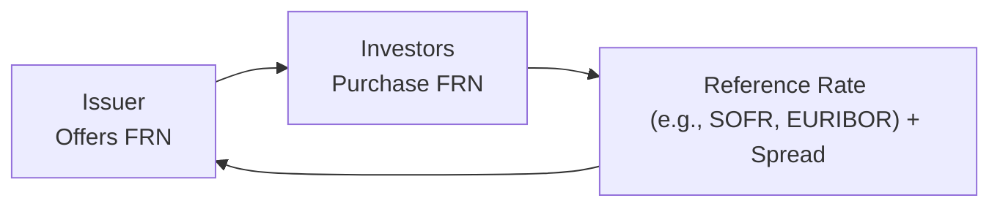

## Setting the Stage: The Nature of Floating-Rate Instruments

Maybe you’ve heard of floating-rate notes (FRNs) and immediately thought, “Wait, isn’t a bond a bond?” Well, not necessarily. FRNs don’t behave like traditional fixed-coupon bonds. Instead, their coupon payments reset periodically based on some benchmark interest rate—like SOFR (Secured Overnight Financing Rate) in the United States or EURIBOR for euro-denominated notes—plus a spread that compensates for the issuer’s credit risk. In other words, an FRN’s coupon floats along with the broader interest rate environment.

Why is this approach useful? Imagine you’re an investor worried about rising interest rates. With a fixed-rate bond, you’re locked into an older (and possibly lower) coupon, and its market value drops if rates climb. But if you own a floater, your coupon eventually resets higher, so the bond’s price typically hovers closer to par (especially around reset dates). This price stability can be attractive. However, there’s always a flip side—when rates go down, your coupon also declines.

## Key Features of FRNs

FRNs typically quote their coupon payments as:

Coupon = Reference Rate + Spread

If the spread is, say, 1%, and your reference rate is 3%, then the coupon for that period is 4%. On the next reset date, if the reference rate has moved to 2.8%, the new coupon resets to 3.8%, and so forth. 

Some FRNs include embedded features like caps and floors, which set maximum or minimum coupon rates. We sometimes call these quasi-floating notes or structured floaters, because they behave differently if rates move beyond (or below) certain thresholds.

Below is a simple flowchart showing the relationship between the issuer, the investors, and the reference rate:



### The LIBOR to SOFR Transition

For decades, LIBOR (London Interbank Offered Rate) was the go-to reference for floating rates. But after a series of scandals and changes in interbank lending markets, regulators and market participants chose new risk-free rates (RFRs) such as SOFR in the U.S., SONIA in the U.K., SARON in Switzerland, TONAR in Japan, and €STR in the Eurozone. 

From an exam perspective—and a real-world perspective—understanding the transition to these new bases is crucial. The mechanics of paying “reference rate + spread” remain, but with a slightly different underlying reference curve. In practice, the new RFRs are usually overnight rates, which require compounding or averaging mechanisms to arrive at the daily-floating coupon resets. Keep an eye on any special rounding or day-count conventions associated with these new rates.

## Valuation of Floating-Rate Notes

One of the biggest perks of an FRN is that, on reset dates, its price typically converges toward par if the issuer’s credit risk hasn’t materially changed. Why does that happen? Because the coupon is about to be linked to the current market rate. Here’s a brief theoretical formula for FRN value:

Let:
• rᵣ = reference rate for the upcoming period,  
• s = credit spread,  
• m = number of periods per year,  
• N = number of remaining coupon periods.

Then, at reset, the coupon for the next period is (rᵣ + s)/m × par. The FRN’s value is basically the present value of that floating coupon stream plus the redemption value (usually par) at maturity. If we’re exactly on a reset date, the next coupon rate is set to the market rate plus spread, so the FRN’s price should be close to par (neglecting any changes in credit quality).

Outside of reset dates, the value deviates slightly depending on how the reference rate moves versus the last determination date. Also, the spread can change if market perceptions of credit risk or liquidity shift significantly.

## Money Market Instruments and Their Yields

Alright, so FRNs are interesting, but what about money market instruments like Treasury bills (T-bills) or commercial paper (CP)? Well, money market securities generally have maturities of one year or less and often quote yields differently from standard bond conventions. Two common yield measures you’ll see in money markets are:

1. Bank discount yield (BDY)  
2. Bond equivalent yield (BEY)

### Bank Discount Yield

For T-bills, yields are often quoted on a bank discount basis. The formula is a bit old school, but still widely used:


\text{Bank Discount Yield (BDY)} = \frac{\text{D}}{\text{F}} \times \frac{360}{\text{t}}


Where:  
• D = the dollar discount (Face Value − Price)  
• F = face value (a.k.a. par value)  
• t = the number of days to maturity  

The 360 convention might look strange, but it’s a historically common basis for quoting short-term instruments. Importantly, the discount yield underestimates the “true” yield that investors get, because it’s annualizing the discount from face value rather than the actual price you paid.

### Bond Equivalent Yield

Sometimes we want to compare a short-term instrument to a standard coupon bond yield. That’s where the bond equivalent yield (BEY) comes in. For a T-bill, the BEY can be calculated as:


\text{BEY} = \left(\frac{\text{F} - \text{P}}{\text{P}}\right)
\times \frac{365}{\text{t}}


Where:  
• F = face value  
• P = purchase price  
• t = number of days to maturity  

The difference is that we’re annualizing based on price, not face value, and using a 365-day year. This yield often provides a more accurate comparison with coupon-paying bonds. Many money market professionals also use an Actual/360 day-count to remain consistent within the short-term environment—but from an exam standpoint, you’ll see a variety of day-counts explained.

### Relationship Between BDY and BEY

Consider you bought a 200-day T-bill at a price of 98% of par ($1,000). So, you pay $980 for a $1,000 face value. Your discount (D) is $20, and your face value (F) is $1,000. Let’s do a quick calculation:

1) BDY:


\text{BDY} = \frac{D}{F} \times \frac{360}{t}
= \frac{20}{1,000} \times \frac{360}{200}
= 0.02 \times 1.8
= 3.6\%


2) BEY (using 365 days):


\text{BEY} 
= \left(\frac{1,000 - 980}{980}\right) 
\times \frac{365}{200}
= \frac{20}{980} \times 1.825
= 2.0408\% \times 1.825
\approx 3.73\%


Notice how the BEY is slightly higher, reflecting the yield on your actual purchase price, rather than the face value discount approach of BDY.

## Day-Count Conventions

Day-count conventions can be confusing. You might see Actual/360 in money market deals vs. 30/360 or Actual/Actual in longer-term bond markets. These minor details matter for calculating accrued interest and yields. For example, a floating-rate note might use Actual/360 for the floating coupon, while a standard corporate bond might use 30/360 for fixed coupons. If you’re comparing yields, be sure all yields are placed on a consistent basis.

## Reinvestment Risk in Floaters

At first glance, you might think floaters have minimal interest rate risk, which is partially true (their price is less volatile). However, they come with reinvestment risk. Why? Because as each coupon resets, you’re always “rolling” your coupon payments at the new market rate. If rates fall dramatically, your next coupon is going to be smaller. Alternatively, if you were counting on earning a particularly high coupon that you initially locked in during a high-rate environment, that advantage disappears once the floating rate resets lower.

## Practical Look at Floating-Rate Systems

In my first encounter with a floating-rate note, I was working on a short-term funding desk, and I remember thinking it was such a “set it and forget it” type of investment. We got a margin over LIBOR, and every three months, the coupon just changed. But ironically, “set it and forget it” can be an oversimplification because you still have to pay attention to the bank’s credit risk (the spread might widen if the issuer’s perceived credit health deteriorates), and you also have to watch for changes in the reference rate’s volatility (particularly with the new RFRs).

## Common Pitfalls and Best Practices

• Ignoring Spread Changes: Even if the index (SOFR, EURIBOR) remains stable, a bond’s spread can change due to shifts in credit conditions.  
• Misapplying Day-Count Conventions: You might miscalculate yields if you ignore the correct day-count basis.  
• Confusing Discount Yield with Investment Yield: With money market instruments, it’s easy to conflate the bank discount yield with the actual return you receive based on purchase price.  
• Overlooking Reinvestment Risk: Floaters can reduce interest rate (price) risk, but coupon rates can still be a moving target.

## Worked Example (Python Snippet)

Here’s a short Python snippet showing how you might calculate both discount yield and bond equivalent yield for a T-bill:

```python
face_value = 1000
price = 980
days_to_maturity = 200

discount = face_value - price
bdy = (discount / face_value) * (360 / days_to_maturity)

bey = ((face_value - price) / price) * (365 / days_to_maturity)

print("BDY:", round(bdy * 100, 2), "%")
print("BEY:", round(bey * 100, 2), "%")
```

Running this snippet would output approximately:  
• BDY: 3.60%  
• BEY: 3.73%

## Final Exam Tips

• Know the formulas. Don’t just memorize them—understand why BDY and BEY differ. On the exam, you may need to convert from one yield measure to another.  
• Floating Rate Concepts: Recognize how an FRN’s price is closely tied to par near reset dates. Be prepared to discuss the effect of changing spreads and credit risk.  
• Reference Rates: Keep updated on the LIBOR to SOFR transition. You may see a question about modeling a coupon rate using overnight rates vs. term rates.  
• Day-Count Conventions: Expect a question or two about how different day counts affect coupon payments or yield calculations.  
• Reinvestment Risk: Exam questions often test your ability to identify and compare risk. Floaters carry less market price risk but more reinvestment risk, especially if the reference rate declines.

## References

• Choudhry, M. “The Money Markets Handbook.” (Wiley).  
• CFA Institute Level I Curriculum, “Floating-Rate Securities and Money Markets.”  
• Federal Reserve Bank, SOFR (https://www.newyorkfed.org/markets/sofr).  

---

## Mastering Floating-Rate Instruments and Money Market Yields: Practice Questions



### 1. Which of the following best describes why a floating-rate note’s price tends to remain closer to par around reset dates?

- [x] The coupon is about to reset to reflect current market rates.
- [ ] The spread to the reference rate usually remains fixed forever.
- [ ] The issuer automatically redeems the note at par on the reset date.
- [ ] The note’s reference rate rarely changes.

> **Explanation:** Because the coupon of an FRN resets to the current reference rate plus a fixed spread, the note’s coupon is more in line with prevailing interest rates. Hence, its price tends to revert toward par on reset dates.

### 2. An FRN is quoted at three-month EURIBOR plus 50 basis points. Which of the following factors is the primary driver behind changes in its coupon payment?

- [ ] The credit rating of the issuer changes every day.
- [ ] The spread changes daily based on supply and demand.
- [x] The reference rate (i.e., EURIBOR) changes at the reset date.
- [ ] The principal amount increases with each coupon period.

> **Explanation:** The coupon payment for an FRN depends primarily on the movement of the reference rate. Although the spread may change for newly issued notes, the existing note’s spread is typically fixed in the indenture.

### 3. Which day-count convention is most commonly applied to money market instruments in the US?

- [ ] 30/360
- [ ] Actual/Actual
- [ ] 28/360
- [x] Actual/360

> **Explanation:** Money market instruments in the US commonly use the Actual/360 convention, while corporate bonds frequently use 30/360 or Actual/Actual.

### 4. Which best explains the difference between a bond equivalent yield (BEY) and a bank discount yield (BDY) for a T-bill?

- [ ] BDY tends to be higher because it uses price instead of face value as the base.
- [ ] BEY is always lower because it compounds interest monthly.
- [x] BEY annualizes using the purchase price, whereas BDY annualizes using face value.
- [ ] BEY was discontinued when short-term rates became negative.

> **Explanation:** BDY uses face value as the base for calculating the yield, whereas BEY uses the purchase price. Consequently, BEY is typically a more accurate representation of the return to the investor.

### 5. A 180-day T-bill has a face value of $100,000 and sells at a price of $98,500. Calculate the bank discount yield assuming a 360-day basis.

- [x] 3.00%
- [ ] 3.04%
- [ ] 1.50%
- [ ] 6.08%

> **Explanation:** 
> Discount = 100,000 - 98,500 = 1,500  
> BDY = (1,500 / 100,000) × (360 / 180) = 0.015 × 2 = 3.00%.

### 6. Which of the following is the main advantage of floaters over fixed-rate bonds during periods of rising interest rates?

- [x] Floaters adjust their coupon to rising market rates, partly mitigating interest rate risk.
- [ ] Floaters’ market price is inversely related to interest rate movements.
- [ ] Floaters are typically redeemed immediately when rates rise.
- [ ] Floaters are zero-coupon notes that never pay interest.

> **Explanation:** Since their coupon resets periodically, floaters adjust to an environment of rising rates, helping to maintain their price near par.

### 7. For a short-term corporate note quoted on a discount basis, if you want to compare it directly to a coupon bond, you would most likely convert its yield to which metric?

- [ ] Nominal yield
- [x] Bond equivalent yield
- [ ] Current yield
- [ ] Dividend yield

> **Explanation:** The bond equivalent yield (BEY) is the appropriate measure to convert a discount yield to a coupon-bond-comparable yield.

### 8. What is the primary disadvantage of a floating-rate note in a declining interest rate environment?

- [ ] The spread becomes negative.
- [ ] The note’s value is fixed at par.
- [x] The coupon resets lower, decreasing cash flows going forward.
- [ ] The issuer must refinance at lower rates early.

> **Explanation:** With floaters, if reference rates decline, coupon payments will also decline, thus reducing the investor’s cash flow.

### 9. In a money market, why might a buyer seek out the bond equivalent yield measure instead of relying on the discount yield measure?

- [x] To compare the true annualized yield on the actual purchase price to other bond investments.
- [ ] To factor in bond coupons normally withdrawn from T-bills.
- [ ] To ensure the highest yield is locked in for the next reset.
- [ ] To incorporate monthly compounding on the removal date.

> **Explanation:** A money market investor often wants to compare yields on a common basis (purchase price) to see if the short-term instrument competes well with standard bond yields.

### 10. For a floating-rate note, is there typically more interest rate (price) risk or reinvestment risk?

- [x] Reinvestment risk
- [ ] Interest rate (price) risk

> **Explanation:** The coupon on a floater resets with interest rates, so price risk is lower. However, there is more reinvestment risk, because coupon rates fluctuate over time along with market rates.


