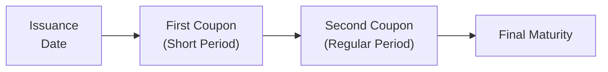

## Introduction

I remember this one time—back when I was still cutting my teeth in fixed income trading—my boss handed me a pricing request for a new corporate bond issuance. It all seemed straightforward at first: coupon, maturity, yield, you know, the usual suspects. But then I realized the first coupon payment was scheduled only four months from issuance, rather than the standard six (semiannual). “Um…where do I even start?” I muttered under my breath. Turns out, that bond had what we call an irregular coupon period, specifically a "short first coupon." And it threw me off for a minute.

Irregular coupon periods essentially mean that a bond’s coupon flows don’t follow the standard interval (e.g., semiannual or annual). The bond might have a first coupon date that arrives earlier or later than usual, or it might have an off-cycle payment near maturity. Such irregularities can come from quirky issuance calendars, newly launched bond programs, or special conditions laid out in the indenture. Regardless of the reason, pricing them requires extra care. This section walks you through how to handle short first coupons, long first coupons, and other off-cycle scenarios, emphasizing partial-period adjustments, day count details, and the math of discounting. By the end, you’ll see that these oddities aren’t that scary—just a few more steps in your valuation workflow.

## Understanding Irregular Coupon Periods

An irregular coupon period—often called an odd or stub period—occurs when at least one coupon does not align with typical spacing. Normally, a semiannual coupon might have exactly six months between each payment. But in an irregular setup, you might see something like four months from issuance until the first coupon (a short first coupon) or eight months (a long first coupon). After that special initial (or final) period, the bond usually reverts to a regular schedule.

• Short first coupon: The initial payment covers fewer days than standard, so holders receive a smaller-than-usual coupon.  
• Long first coupon: The initial payment covers more days than standard, resulting in a larger-than-usual coupon.  
• Off-cycle payment: Sometimes a bond’s last payment may be a stub period—shorter or longer than the standard interval—before redemption.

Bonds with irregular coupons arise in the marketplace for various reasons. For instance, an issuer might want a bond to begin paying coupons on a certain date to align with the fiscal year, or a new product might have to squeeze into an established coupon schedule. Although these details are typically spelled out in the bond’s prospectus or offering documents, it falls on investors and analysts to handle the day count and discounting properly.

## Key Reasons for Irregular Coupons

• New Issuances: A freshly minted bond might have a partial period from its launch date until the first scheduled coupon date.  
• Corporate Restructuring: An issuer might realign coupon payments post-merger or post-spin-off, resulting in a bridging “short period.”  
• Regulatory Requirements: Some governments mandate that a coupon aligns with a fiscal quarter-end, forcing an off-cycle opening.  
• Liability Management: Extended or shortened coupon periods can arise if the issuer restructures timing or merges outstanding bonds.

## Day Count Conventions and Accrued Interest

We can’t talk about irregular coupon periods without venturing into day count conventions. If you’ve already previewed 6.16 Day Count Conventions and Their Effects on Accrued Interest, you know day count is crucial for accurate interest calculations, especially during partial periods. Common day count conventions include:

• 30/360 or 30/360 US: Assumes each month has 30 days, and a year has 360 days.  
• Actual/Actual (ICMA or ISDA): Uses the actual number of days between dates and the actual number of days in the year.  
• Actual/365 Fixed: Counts actual days but uses a 365-day year.  
• Actual/360: Counts actual days using a 360-day year.

When you see a short first coupon, you calculate how many days have elapsed since issuance to the coupon date under the specified day count rule, then apply that fraction to the nominal coupon rate. For a long coupon, do the same but realize the fraction might exceed the usual 0.5 of a year (if semiannual), leading to a bigger payment.

Accrued interest can also get tricky. When you’re valuing an irregular bond mid-cycle—say, you’re buying it after issuance but before the first coupon—the accrued interest portion might be comparatively low (for a short first coupon) or high (for a long first coupon).

## Valuation Approach: Partial Period Discounting

At the end of the day, the fundamental approach to bond valuation doesn’t magically change. We still take the present value of all future cash flows (coupon + principal). The difference is that each coupon’s timing might not be in neat 0.5 or 1.0 annual increments. Instead:

1. Identify Each Coupon Date and Amount:  
   • The short or long first coupon might be pro-rated by the fraction of the year it spans.  
   • Consult offering documents to confirm the exact payment schedule.

2. Determine Discount Factors for Each Irregular Payment:  
   • If you’re using a yield-to-maturity approach, you need to match the partial period to your compounding convention (semiannual, annual, etc.).  
   • Alternatively, you can discount each cash flow by a relevant zero-coupon (spot) rate for that specific date.

3. Accumulate Present Value of All Cash Flows:  
   • Sum up the discounted coupon payments plus the discounted redemption value.  
   • If you’re calculating “dirty price,” you add accrued interest to get the total invoice price.  
   • If you need a “clean price,” you skip the accrued interest portion.

4. Double-Check the Yield Calculation:  
   • The yield you derive from the bond’s market price might need an “odd first coupon” formula. Some software systems or spreadsheet add-ins have specific yield functions for these scenarios (known as “true yield method” or “odd coupon yield method”).

### Mathematical Notation

Let’s spell out a typical approach for a short or long first coupon. Assume we have:

• \\( C \\) = the annual nominal coupon amount for a standard period (in currency terms, not in percent).  
• \\( f_1 \\) = fraction of the year covered by the first coupon.  
• \\( r \\) = yield (annualized), consistent with the compounding convention.  
• \\( P \\) = bond price (present value of all future cash flows).

For the first coupon payment:


\text{Coupon}_1 = C \times f_1


Then you discount it back to the present using \\( (1 + r)^{f_1} \\) or the appropriate factor. If the subsequent coupons align with standard intervals (like each six-month block afterward is exactly 0.5 years), you’d then have:


P = \frac{C \times f_1}{(1 + r)^{f_1}} + \sum_{t=2}^{N} \frac{C \times \text{(standard fraction)}}{(1 + r)^{t-\alpha}} 
+ \frac{\text{Face Value}}{(1 + r)^{N-\beta}}


where \\(\alpha\\) and \\(\beta\\) adjust the exponent to match the uneven timeline. In practice, you might see custom exponents for each coupon date matched to the actual number of days from settlement.

## Irregular Payment Timeline Diagram

Below is a simple timeline representation of a bond with a short first coupon. Notice how the first interval is only four months, while subsequent coupons each span a standard six-month period.



In some cases, you might see the reverse: a long first period. The overarching logic is the same—just adjust for the fraction of the year that the coupon covers.

## Practical Example: Short First Coupon

Let’s walk through a simplified numeric example, just to illustrate. Suppose:

• A 5-year bond with a face value of \$1,000.  
• Annual coupon rate of 6% (paid semiannually, i.e., nominal coupon = \$60/year).  
• First coupon arrives in 4 months (instead of the usual 6).  
• The yield (semiannual compounding) is 5% per year, or 2.5% per half-year.  

Short first coupon fraction \\( f_1 \\) = \\( \frac{4}{12} = 0.3333 \\).  
So, first coupon payment = \\( \$60 \times 0.3333 = \$20 \\) (instead of the regular \$30 for a six-month coupon).

Discount factor for the first coupon = \\( \frac{1}{(1 + 0.025)^{0.3333}} \\).  
Subsequent coupons revert to \$30 every 6 months. Each of those gets discounted by the appropriate power of \\( (1 + 0.025) \\). Finally, \$1,000 is redeemed at maturity (along with the last coupon). Summing all these present values yields the bond’s price. The key difference is that the exponent for the first payment is 0.3333 of a half-year.

## Python Snippet for Pricing

If you’re a coding enthusiast, here’s a quick Python snippet that captures the logic of discounting an irregular first coupon:

```python
import math

def price_short_first_coupon(par, annual_coupon_rate, first_period_fraction, annual_yield, 
                             freq, maturity_periods):
    """
    par: Face value of the bond
    annual_coupon_rate: e.g. 6% = 0.06
    first_period_fraction: fraction of year for the first coupon (e.g. 4/12)
    annual_yield: annual yield in decimal form
    freq: number of coupon payments per year (e.g. 2 for semiannual)
    maturity_periods: total number of coupon payments over the bond's life 
                      (excluding the irregular first part if it's off-schedule)
    """
    # Convert annual yield to per-period
    period_yield = annual_yield / freq
    
    # First coupon in partial period
    first_coupon = par * annual_coupon_rate * first_period_fraction
    price = first_coupon / ((1 + period_yield) ** (first_period_fraction * freq))
    
    # Standard coupon amount
    standard_coupon = (par * annual_coupon_rate) / freq
    
    # Discount regular coupons
    for t in range(1, maturity_periods + 1):
        price += standard_coupon / ((1 + period_yield) ** t)
    
    # Discount final redemption
    price += par / ((1 + period_yield) ** maturity_periods)
    
    return price

bond_price = price_short_first_coupon(
    par=1000,
    annual_coupon_rate=0.06,
    first_period_fraction=4/12,
    annual_yield=0.05,
    freq=2,
    maturity_periods=9  # For 5 total years, we have 10 semiannual periods, but first is partial
)

print(f"Estimated bond price = ${bond_price:.2f}")
```

This approach is fairly basic—real-world software or financial calculators often have built-in routines for odd coupon bonds, which do all these steps in the background.

## Long First Coupon or Final Stub Period

A long first coupon is simply the short coupon concept in reverse: the fraction \\( f_1 \\) might be larger (e.g., 8 months out of 12). The bigger coupon is offset by being discounted over a longer fraction. Meanwhile, a final stub period—if the issuer decides to redeem earlier than a regular schedule—requires the same partial approach at the tail end of the bond’s life.

## Potential Pitfalls and Best Practices

• Mistakes in Fractional Period: Using 0.5 or 0.25 out of habit rather than the exact fraction of days. This can lead to pricing and yield calculation errors.  
• Day Count Convention Oversight: Not verifying whether it’s Actual/Actual or 30/360 can distort accrued interest.  
• Inconsistent Discounting: Some might discount the first coupon as if it were a regular period—an easy slip.  
• Overlooking Accrued Interest Adjustments: In irregular contexts, accrued interest might not be as intuitive.  
• Software Settings: Many spreadsheet functions (like Excel's YIELD function) have parameters for “oddfirstperiod” or “oddlastperiod.” Double-check your inputs.

## Real-World Anecdote

I still recall a conversation with a colleague who forgot to specify the short first coupon in her bond pricing model. She originally assumed standard six-month intervals, so the model projected a coupon of \$30 for the first payment. When the actual coupon ended up being \$20, her client flagged the discrepancy. She had that “Oops” moment and had to revise the entire yield analysis. Moral of the story: read the bond prospectus carefully and ensure your model settings match reality!

## Exam Relevance and Study Tips

In the CFA context, exam questions on irregular coupons often test your attention to detail. You might see a question requiring you to compute the price or yield of a bond with a four-month first coupon, or maybe a final three-month stub. Make sure you:

• Carefully note the specified day count convention.  
• Calculate the fraction of the year for the short or long coupon.  
• Apply consistent discounting to each discrete cash flow.  
• Recognize how accrued interest is affected if the transaction occurs within that partial period.

Also remember that you might be asked to interpret or recast an “odd coupon yield” into an effective annual yield or bond-equivalent yield. Sometimes the exam might provide partial-year discount factors, or you might need to compute them yourself.

## References and Further Exploration

• Sylla, R. & Homer, S. “A History of Interest Rates.” (Wiley). Offers a fascinating look at historical coupon conventions.  
• Corporate Bond Offering Documents. Real-life examples of how issuers handle first and final periods.  
• CFA Institute Level I Curriculum, “Fixed Income” reading on Standard Yield Calculations and Day Counts.  
• Chapter 6.16 of this Volume: “Day Count Conventions and Their Effects on Accrued Interest.”  

Feel free to explore specialized fixed-income calculation tools or advanced spreadsheet add-ins. Many are specifically designed to handle off-cycle coupons so you don’t have to reinvent the wheel every time you face an irregular bond.

---------------------

## Test Your Knowledge: Valuation of Bonds with Irregular Coupon Periods



### For a newly issued bond with a short first coupon period, which of the following steps is most crucial for accurate valuation?

- [ ] Using a simple average of previous coupon rates.
- [x] Determining the exact fraction of the coupon period and discounting accordingly.
- [ ] Applying an annual coupon rate without adjusting for timing.
- [ ] Ignoring accrued interest since the first coupon is always paid in full.

> **Explanation:** You must accurately measure the fraction of the coupon period (e.g., four months out of six) and then discount the resulting partial payment correctly.

### Which day count convention is often used for irregular coupon bonds to reflect the actual number of days between coupons?

- [ ] 30/360
- [ ] 30E/360
- [x] Actual/Actual
- [ ] Actual/365

> **Explanation:** Irregular coupon periods commonly use Actual/Actual (ICMA or ISDA) because it accommodates the exact number of days between coupon dates, especially important when dealing with unusual intervals.

### When calculating a bond’s “clean price” during an irregular coupon period, which of the following statements is correct?

- [x] The clean price does not include accrued interest for the partial period.
- [ ] The clean price includes partial accrued interest.
- [ ] The dirty price includes no accrued interest.
- [ ] Accrued interest is always waived for short coupons.

> **Explanation:** By definition, the clean price excludes accrued interest, which must be separately calculated—especially important in partial coupon periods.

### Suppose a bond pays its first coupon in 4 months rather than 6. The fraction of the period is assumed to be 4/12. If the annual coupon is 8% on a par value of $1,000 (semiannual), what is the approximate first coupon payment?

- [ ] $80
- [ ] $40
- [x] $26.67
- [ ] $53.33

> **Explanation:** Annual coupon = 8% × \$1,000 = \$80. Semiannual standard = \$80/2 = \$40. But with a four-month fraction, \$40 × (4/6) = \$26.67.

### In an irregular coupon situation, which factor most significantly impacts the present value of the first coupon payment?

- [x] The partial exponent used in discounting.
- [ ] The tax treatment of coupon payments.
- [x] The bond’s credit rating.
- [ ] The frequency of second and subsequent coupons.

> **Explanation:** The partial exponent ensures we discount over the actual fraction of the year. Credit rating also indirectly matters by influencing the yield. The question states two correct answers: the partial exponent (direct factor) and credit rating (overall yield).

### An 8-month first coupon will typically result in:

- [x] A coupon payment larger than the standard coupon.
- [ ] A coupon payment smaller than the standard coupon.
- [ ] The same coupon payment but earlier.
- [ ] No difference in the discounting factor.

> **Explanation:** An 8-month first coupon means more days accrue before payment, so the absolute coupon payment is higher than if it were a 6-month standard coupon.

### Which of the following best describes a potential pitfall when valuing irregular coupon bonds?

- [x] Failing to adjust the discount period for the short or long coupon.
- [ ] Using the standard coupon rate for accrued interest.
- [x] Applying the day count convention for each coupon consistently.
- [ ] Setting the yield to zero for the stub period.

> **Explanation:** You need to properly adjust discount periods for partial times and ensure consistent day count application. Failing in either aspect leads to incorrect valuation.

### A stub period near the end of a bond’s life is often referred to as:

- [x] A final short coupon.
- [ ] A pro rata redemption.
- [ ] A conversion period.
- [ ] An extension option.

> **Explanation:** A final stub period is effectively a short coupon window before redemption, often called a final short coupon.

### If a bond's first coupon is a "long" period of 9 months, but you mistakenly treat it as a standard 6-month period, what outcome is most likely?

- [x] You’d underestimate the first coupon cash flow and undervalue the bond.
- [ ] You’d overstate the bond’s yield-to-maturity by a large margin.
- [ ] You’d get the price perfectly right if the yield is low.
- [ ] You’d lose any accrued interest benefits from the short period.

> **Explanation:** Treating a 9-month coupon as if it were 6 months results in a lower coupon amount than reality, causing you to underestimate the bond’s intrinsic value.

### True or False: For irregular coupon bonds, the “true yield” method accounts for partial periods, whereas a standard yield method might misuse fixed intervals.

- [x] True
- [ ] False

> **Explanation:** The “true yield” method (or odd coupon yield method) ensures each cash flow is aligned with its actual fraction of the year.


