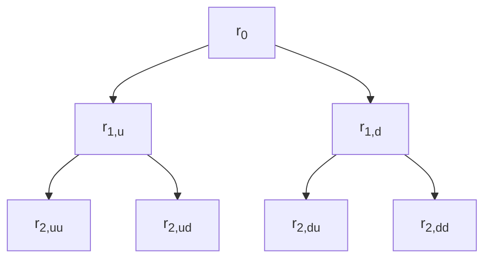
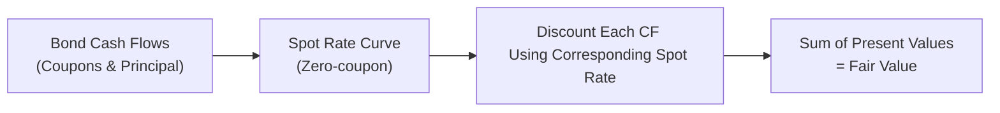

## Introduction

So, you know how sometimes valuing a bond with just a single yield-to-maturity (YTM) can feel a bit too one-dimensional? I remember the first time I ran into a scenario where the yield curve wasn’t flat—my standard YTM-based calculation just didn’t seem to capture the nuances. That’s where yield curve models come in. Instead of using a single rate to discount all future cash flows, we can refine our bond valuations by matching each coupon and principal repayment to the appropriate spot rate, or by using more intricate interest rate models that capture the dynamic nature of interest rates over time.

This section discusses how to take a more precise approach, focusing on spot rates, forward rates, and short-rate models such as Ho-Lee, Vasicek, and Cox-Ingersoll-Ross (CIR). We’ll explore both the theoretical framework and some real-world scenarios so you’ll be able to see exactly how yield curve models can make a difference in practice.

## Why Use Spot and Forward Rates Instead of a Single Yield?

You might be wondering: “What’s wrong with just using YTM?” Well, the concept of YTM basically collapses all a bond’s individual future cash flows into a single implied discount rate. While that’s handy for quick calculations, the real world typically has yield curves of various shapes (normal, flat, inverted, humped—you name it). Each point on this curve represents a different cost of money for different maturities. By ignoring that structure, a single yield might underestimate or overestimate certain coupon payments.

When you discount an earlier coupon at a shorter-dated spot rate (which might be lower if the curve is upward sloping, or higher if the curve is inverted), you’re using a discount factor that’s more accurate than blanket-applying, say, a 5% YTM to every payment. Over the life of the bond, these differences can meaningfully alter your valuation, especially if we’re talking about long-dated instruments or bonds with significant time between coupon payments.

## Bootstrapping and Constructing Spot Rate Curves

To apply spot rates, you first need a spot rate curve. That typically involves bootstrapping from actively traded bonds (often government securities, since they’re considered risk-free for practical purposes, at least in the local context). Let’s outline how that might work in a super-simplified format:

1. Identify the price and coupon of a short-term, zero-coupon or near-zero-coupon bond. From that, directly obtain the spot rate for the earliest maturity.
2. Move on to the next maturity bond. Use the previously established spot rate(s) from Step 1 to solve for the new rate at this second maturity.
3. Repeat until you’ve identified unique spot rates for all relevant maturities.

In practice, you might prefer to strip coupon bonds into zero-coupon “pieces,” known as bond strips. But the gist is the same: you’re extracting zero-coupon yields from instruments that have known market prices and known cash flows.

Once you have these spot rates, you can discount each future cash flow of a bond back to present value with the correct rate.

## Forward Rates and Their Role

Forward rates tell us the implied interest rate for a future period based on today’s yield curve. They can help with:

• Forecasting future bond yields or short-term interest rates.  
• Pricing forward-starting swaps, forward rate agreements, or other derivatives.  
• Decomposing complex transactions into simpler, forward-based views.

Mathematically, forward rates link two adjacent spot rates. For instance, if you know the 1-year spot rate (S₁) and the 2-year spot rate (S₂), you can solve for the 1-year forward rate that starts at the end of Year 1. Traders and portfolio managers often use forward rates when constructing scenario analyses—asking “If the curve remains the same, what does that say about short-term rates 6 months or 1 year from now?”

## Yield Curve Models: Ho-Lee, Vasicek, and CIR

In addition to just taking a snapshot of spot rates from the market, many practitioners rely on short-rate models to simulate how interest rates evolve over time, typically for:

• Valuing interest rate derivatives (e.g., interest rate swaps, bond options).  
• Stress-testing portfolios under various rate scenarios.  
• Performing scenario analyses for interest rate–sensitive assets.  

### Ho-Lee Model

The Ho-Lee model is a relatively straightforward short-rate model. It assumes the short rate follows a process with normally distributed changes, and it can be calibrated to match the initial yield curve. Practically, that means you pick parameters so that when you generate a big set of possible short-rate paths, you end up with a distribution consistent with today’s curve.  

• Pros: Simple, easy to implement, widely used for basic interest rate derivatives.  
• Cons: You can end up with negative interest rates pretty easily (even though that was considered “abnormal” historically, some markets have indeed experienced negative rates).

### Vasicek Model

The Vasicek model introduces mean reversion, assuming that over time, the short rate tends to pull back to a long-term average level. Its dynamics are something like:

r(t) = a( b – r(t) ) dt + σ dW<sub>t</sub>

where a is the speed of mean reversion, b is the long-term mean, and σ is the volatility. The model’s big attraction is that it tries to reflect the empirical observation that interest rates don’t just wander off to infinity but hover around certain ranges, especially in stable monetary environments.

### Cox-Ingersoll-Ross (CIR) Model

The CIR model also features mean reversion, but it ensures that interest rates stay nonnegative by making volatility a function of the square root of the rate:

dr(t) = a( b – r(t) ) dt + σ √r(t) dW<sub>t</sub>

It’s a bit more complex mathematically. However, it’s more realistic in that it rarely, if ever, drifts below zero (though in some extreme calibrations it could approach zero). Many advanced bond valuation systems use some variant of CIR (or multi-factor extension) because they like how it handles rate dynamics under various economic regimes.

Below is a simple diagram illustrating how a short-rate model can evolve over time in a binomial tree fashion:



Time unfolds downward (TB stands for top-to-bottom). Each branch from one period to the next shows potential up or down movements in the short rate. Different models (Ho-Lee, Vasicek, CIR) specify how r<sub>t</sub> evolves from node to node.

## Putting It All Together for Bond Valuation

Once you’ve got:

• A set of spot rates for each coupon date,  
• Or an interest rate model that can produce a lattice (tree) of future rates,  

you can discount each bond cash flow at the relevant rate. The fair value (V) is simply:

V = Σ [ C<sub>t</sub> / (1 + S<sub>t</sub>)<sup>t</sup> ]

…where C<sub>t</sub> is the coupon (or principal + coupon) on date t, and S<sub>t</sub> is the t-maturity spot rate. If you’re using a short-rate lattice, you’d compute the present value by working backward from the final cash flows to the present, applying the appropriate path probabilities.

Let’s draw a quick conceptual flow of discounting each cash flow by its matched spot rate:



## An Illustrative Example

Let’s do a simplified numeric example. Suppose you have a 2-year annual coupon bond paying 5% on a face value of $1,000 (so the coupon is $50 each year). The bond matures in 2 years. You’ve derived these annualized spot rates:

• S<sub>1</sub> = 4%  
• S<sub>2</sub> = 5%  

Your bond’s cash flows are:
• At t=1: $50  
• At t=2: $1050 (the final coupon plus principal)

The present value, discounting each flow at its own spot rate, is:

PV at t=0 = 50 / (1 + 4%) + 1050 / (1 + 5%)<sup>2</sup>

= 50 / 1.04 + 1050 / 1.05<sup>2</sup>  
= 48.08 + 952.38  
= $1,000.46 (approx.)

If you used a single YTM of 4.5%, for instance, you might get a slightly different number. That difference can matter, especially for large durations or complex coupon schedules.

## The Impact of Yield Curve Shape

Whether the curve is upward sloping, downward sloping, or otherwise can shape the discount factor you apply to each coupon. For example:

• Normal (Upward-Sloping) Curve: Long-term rates are higher than short-term rates, so discounting far-off cash flows requires a larger discount factor.  
• Inverted Curve: The near-term rates are higher than longer-term rates, flipping the discounting intensities.  
• Flat Curve: All spot rates are (more or less) the same, which ironically is the scenario where your single YTM approach might align fairly well with spot rate valuation.  

The shape of the curve also impacts forward rates, so, if the curve is steep, you’ll see higher implied forward rates in the future. That can shift your bond valuations if you run multi-year scenarios.

## Practical Applications

1. Corporate Bonds: For credit bonds, you add a credit spread to the risk-free yield curve to get a credit-adjusted yield curve. Each coupon is still discounted by a distinct rate, but you’ve tacked on some risk premium.  
2. Floating-Rate Notes: You might use forward LIBOR (now transitioning to SOFR or other rates) to forecast the next coupon reset.  
3. Fixed-Income Derivatives: Pricing interest rate swaps or bond futures accurately often requires you to consider multiple rates, not just a single YTM.  
4. Securitization: Mortgage-backed securities or asset-backed securities have multiple cash flow tranches, each requiring discounting at different discount rates that reflect the (often complicated) timing of principal and interest payments.

## Common Challenges and Best Practices

• Data Availability: Bootstrapping spot rates requires a robust set of reliable bond price quotes. If your market is illiquid, that can complicate or distort your yield curve.  
• Model Calibration: If you use a short-rate model, calibrating it to reflect current market conditions (and to produce realistic future dynamics) takes some skill.  
• Negative Rates: Yes, we’ve seen negative policy rates in some regions. If your model can produce negative short rates, you need to decide if that’s acceptable or not. Some models (like CIR) resist negative rates, so that’s appealing in those contexts.  
• Implementation Complexity: Using a short-rate lattice is more computationally heavy than a single YTM approach. However, it does allow for path-dependent analyses, which is crucial in certain derivative and structured product valuations.  

A personal tip: get comfortable with how your chosen model (or yield curve) reacts to changes in the macro environment. For instance, during a recession, you might see the yield curve flatten or invert, which can drastically change the discount factors for your bond’s distant coupon payments. Keeping an eye on policy announcements and the economic outlook can help you adjust your curve assumptions before you run into any big surprises.

## Quick Python Snippet to Illustrate (Optional)

Sometimes I like to quickly show how a short script can handle spot-rate-based valuations. Here’s a pseudocode/Python snippet:

```python
import math

cash_flows = [(1, 50), (2, 1050)]

def bond_value(cash_flows, spot_rates):
    # spot_rates is a dictionary of {time: rate}
    pv = 0.0
    for (t, cf) in cash_flows:
        # discount each CF with (1 + spot)^t
        pv += cf / ((1 + spot_rates[t]) ** t)
    return pv

spot_rates = {1: 0.04, 2: 0.05}
value = bond_value(cash_flows, spot_rates)
print("Bond Value = ", round(value, 2))  # Should be around 1000.46
```

This snippet is obviously simplified. In reality, you might source your spot rates from an automatic bootstrapping routine or a market data feed.

## Conclusion

Bond valuation using yield curve models is a step up in precision compared to a single yield-to-maturity approach. By matching discount rates to the unique timing of each coupon or by utilizing sophisticated models of interest rate evolution, you can capture the nuances of real-world yield curves far more effectively. Whether you’re doing day-to-day trading, building a fixed-income portfolio or studying for an exam, understanding these techniques is essential. It’s all about acknowledging that time is not static, and each future payment warrants its own perspective on what the cost of money might be.

Just remember: the yield curve is not always stable nor predictable. That’s why trusting a robust model (and calibrating it properly) is vital, and it’s also why you come back to check your assumptions whenever the market shifts.

## Key Terms (Glossary)

• Yield Curve: A graphical depiction of the yield for bonds of the same credit quality but different maturities.  
• Spot Rate: The yield on a zero-coupon bond maturing at a specific date in the future.  
• Forward Rate: The rate implied by current zero-coupon yields for a future period.  
• Ho-Lee Model: A short-rate model that assumes normally distributed changes in the short rate.  
• Vasicek Model: A single-factor interest rate model with mean reversion.  
• Credit-Adjusted Yield Curve: A curve that reflects the credit risk premium on top of the risk-free curve.  
• Bootstrapping: A method to derive spot rates from observed coupon bond prices.  
• Zero-Coupon Yield Curve: A curve constructed from zero-coupon bonds or strip securities.

## References and Further Reading

• Hull, J. “Options, Futures, and Other Derivatives.” (Pearson) – introduction to interest rate models.  
• CFA Institute Level I Curriculum, “Term Structure and Yield Curve Analysis.”  
• BIS papers on yield curve construction for sovereign debt markets (https://www.bis.org/).

---------------------------------------------------------------------------------------------------

## Test Your Understanding of Bond Valuation Using Yield Curve Models



### Which of the following best describes the reason for using spot rates instead of a single yield-to-maturity?

- [ ] It simplifies the bond valuation process.
- [x] It more accurately captures differences in interest rates at various maturities.
- [ ] It eliminates the need for bootstrapping.
- [ ] It prevents bond prices from fluctuating.

> **Explanation:** A single yield-to-maturity blends all future cash flows into one discount rate. Spot rates match each specific cash flow date, improving accuracy when the yield curve is not flat.

### When constructing a zero-coupon yield curve via bootstrapping, which of the following data sets is most commonly used?

- [ ] Only high-yield corporate bonds.
- [ ] Preferred stock dividends.
- [x] A set of liquid government securities.
- [ ] Currency forward contracts.

> **Explanation:** Bootstrapping typically starts with risk-free or close to risk-free government bonds to generate a clean zero-coupon yield curve.

### In the Ho-Lee model, what assumption is made about changes in the short rate?

- [ ] They remain constant over time.
- [x] They are normally distributed.
- [ ] They never fall below zero.
- [ ] They follow a mean-reverting process.

> **Explanation:** The Ho-Lee model assumes normally distributed shifts in the short rate. Negative rates can occur under this assumption.

### What is the primary feature that distinguishes the CIR model from the Vasicek model?

- [x] Volatility is proportional to the square root of the rate in the CIR model.
- [ ] Vasicek disallows negative interest rates.
- [ ] CIR has no mean reversion component.
- [ ] Vasicek maintains a constant short rate over time.

> **Explanation:** CIR’s volatility term is √r(t), helping keep rates above zero and including mean reversion, whereas Vasicek has a constant volatility term.

### Which statement is true about forward rates?

- [x] Forward rates are implied by the current zero-coupon yield curve for future periods.
- [ ] Forward rates are only used for short-term treasury bills.
- [x] Forward rates help in pricing forward swaps and FRAs.
- [ ] Forward rates are randomly generated and have no relation to spot rates.

> **Explanation:** Forward rates can be derived from spot rates and are critical in pricing forward-based instruments; they’re not random but implied by existing yield curves.

### For a 2-year bond, which of the following discount approaches leads to the most accurate fair value under most market conditions?

- [ ] Dividing cash flows by (1 + YTM)<sup>2</sup>.
- [x] Discounting each cash flow by its respective spot rate.
- [ ] Using only the 2-year treasury yield.
- [ ] Using a random forward rate for the second year.

> **Explanation:** The standard practice for precision is to use each period’s spot rate for discounting.

### Suppose you’re using a short-rate lattice (tree) model. What step is essential in determining the present value of future bond cash flows?

- [x] Working backward from the final cash flows to the initial node.
- [ ] Only discounting the principal and ignoring coupons.
- [x] Matching each coupon to a single yield-to-maturity.
- [ ] Applying the same rate to all nodes in the tree.

> **Explanation:** In short-rate models, one typically calculates the bond’s PV by backward induction, starting from known final cash flows and discounting at each subsequent node.

### Which of the following best defines “credit-adjusted yield curve”?

- [ ] A curve that accounts for prepayment penalties.
- [x] One that includes a credit spread on top of the risk-free yield curve.
- [ ] A yield curve constructed solely from AAA corporate bonds.
- [ ] A yield curve for only Euro-denominated government debt.

> **Explanation:** A credit-adjusted yield curve adds a spread to reflect credit risk above the risk-free baseline.

### Which is the biggest limitation of single-factor short-rate models like Vasicek or CIR?

- [x] They do not capture different factors affecting the yield curve shape (e.g., parallel vs. non-parallel shifts).
- [ ] They prohibit the possibility of negative interest rates in all scenarios.
- [ ] They require constant reinvestment assumptions for defaulted bonds.
- [ ] They rely on multiple, unobservable risk drivers.

> **Explanation:** Single-factor short-rate models only allow one source of uncertainty in the term structure. They can’t fully model parallel and non-parallel shifts simultaneously.

### True or False: The Ho-Lee model fully ensures that interest rates will never become negative.

- [ ] True
- [x] False

> **Explanation:** The Ho-Lee model allows for normally distributed shifts in short rates, which can go negative if the distribution falls below zero.


