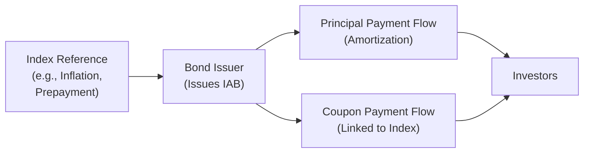

## Introduction

Sometimes, you bump into a bond that doesn’t just sit quietly, paying coupon after coupon until maturity. Instead, it changes its principal repayments along the way, linked to some reference index—perhaps an inflation gauge, or maybe a mortgage prepayment rate. That, in a nutshell, is an index-amortizing bond (IAB). The first time I encountered an IAB, I remember scratching my head, thinking, “Wait, so the interest portion is recalculated how often?” Let’s unravel this step by step. In this section, we’ll dive into how these bonds work and how to perform yield calculations that accurately reflect their dynamic repayment structures.

## Key Concepts of Index-Amortizing Bonds

Index-amortizing bonds (IABs) are a specialized type of amortizing security, meaning they return principal to you periodically rather than paying it all at maturity. But there’s a twist: These principal paydowns (and sometimes the coupons) rely on changes in a reference index. That index could be tied to prepayment speeds (in the case of mortgage-related bonds), inflation rates (CPI adjustments), or potentially other market variables.

• Amortizing Security: A bond that repays principal in installments over its life.  
• Reference Index: The economic or market indicator used to determine changes in the bond’s payment schedule (e.g., inflation rate, mortgage prepayment rate, or even commodity price indices).  
• Embedded Floors/Caps: Some IABs protect investors by placing lower limits (floors) or upper limits (caps) on how payment amounts can vary with the index.  

Under typical circumstances, an IAB’s coupon might be floating (or reset) based on the index, and the principal amortization schedule shifts if, let’s say, prepayments come in faster or slower than expected. This is especially common in mortgage-backed structures, where the speed of homeowner prepayments drives the timeline. With inflation-linked structures, principal might get adjusted upward or downward based on changes in an inflation gauge, altering future coupon amounts as well.

## Payment Mechanics and Scenario Analysis

IABs can get quite intricate. If the index tracks mortgage prepayments, you’re effectively dealing with uncertain principal flows: the faster the prepayments, the quicker you get principal back. If the index is the CPI (inflation measure), then your principal might be adjusted to keep pace with rising prices—sometimes beneficial, sometimes less so if inflation is low or negative. Anyway, it’s essential to model these future cash flows under different possible index paths.

The scenario analysis typically follows this sequence:

• Choose multiple trajectories for the underlying index (e.g., baseline, high, and low scenarios).  
• Estimate the expected schedule of principal repayments under each index path.  
• Calculate coupon amounts you’d receive, given that the notional (remaining principal) might be changing.  
• Discount these projected cash flows back to the present to find the bond’s theoretical price.  
• Back out the yield, given that theoretical price.  

It almost feels like you’re constructing a mini-mortgage model or inflation model for each scenario. The yield you arrive at will reflect not just interest rate risk but also the risk that your principal might come back sooner or later than expected.

### Visual Representation of IAB Cash Flows

Here’s a basic flowchart to show how index changes can feed into an IAB’s payment structure:

The bond issuer sets periodic payments and coupon amounts based on the reference index. Investors receive both principal and interest in a schedule that is not set in stone but instead flexes over time.

## Steps in Calculating Yields

In principle, you can treat an IAB’s yield calculation like any other bond—discounting expected cash flows at the yield (or internal rate of return) and solving for that yield. But the trick lies in generating realistic forecasts of those cash flows. Let’s break it down:

### 1. Lay Out the Projected Payment Schedule
Determine the starting principal, coupon rate formula, and period. If the bond is indexed to prepayment speed, you’ll need a model for projected prepayment (like PSA speeds in mortgage-backed securities). For inflation-indexed structures, you’d use inflation forecasts for each period to get the adjusted principal.

### 2. Model Changes in Coupon and Principal
As the principal amortizes, your interest payments for subsequent periods will usually shrink, especially if that coupon is a percentage of the outstanding principal. If there’s an interest rate floor or cap, make sure you incorporate those constraints.

### 3. Plug in Possible Index Paths
Perform scenario analysis with different index assumptions. For instance, you might assume a sudden spike in inflation, or a moderate cycle, or a deflationary environment (possibly hitting a floor scenario).

### 4. Discount Cash Flows to the Present
You can discount back either using a single discount rate (trial yield) to solve for the IRR or, more complexly, using a multi-curve framework if you want to separate the risk-free rates from credit spreads and so forth. For an exam scenario at the CFA Level III, you could see item set questions that ask you to do partial calculations under one or two index scenarios.

Mathematically, for each scenario s (where s ranges over different index states):


P_0 = \sum_{t=1}^{T_s} \frac{C_{t,s} + A_{t,s}}{(1 + y)^t},


where:  
• \\( C_{t,s} \\) = coupon payment at time \\( t \\) under scenario \\( s \\).  
• \\( A_{t,s} \\) = principal (amortization) repaid at time \\( t \\) under scenario \\( s \\).  
• \\( T_s \\) = final horizon for scenario \\( s \\).  
• \\( y \\) = yield (the same required yield used across all periods, though in practice you might refine this further).  

Of course, in an exam or real-life setting, you’d either have an iterative method or a spreadsheet to find \\( y \\) such that \\( P_0 \\) matches the bond’s market price.

### 5. Reconcile Across Multiple Scenarios
If you have multiple equally likely index paths, you might average the present values from each scenario (weighted by their probability) to arrive at a single “expected fair price.” Then, from that expected fair price, you solve for the yield. In a more advanced setting, you might produce a distribution of yields and pick a point estimate from that distribution.

## Example Walk-Through

Let’s say you have a 5-year IAB tied to an inflation index. The bond starts with $1,000 principal, a coupon of (real rate + inflation rate), paid semiannually, with principal repayable in structured increments that adjust for inflation. For simplicity, assume:  
• A baseline inflation scenario of 2% per year.  
• A high-inflation scenario of 5% per year.  
• A low-inflation scenario of 0% per year.

Under each scenario, you’d forecast how the principal steps up or stays flat. Then recast the coupon payments accordingly. This is typically laid out in a table:

| Period | Inflation% | Principal at Period Start | Principal Repayment | Remaining Principal | Coupon Payment |
|--------|------------|---------------------------|---------------------|---------------------|---------------|
| 1      | 2%         | 1,000                    | 100                 | 900                 | (Rate * 1,000)|
| 2      | 2%         | 900+(infl.adj)           | X                   | ...                 | ...           |
| ...    | ...        | ...                       | ...                 | ...                 | ...           |

You do that for each scenario, discount each stream back at your trial yield, and then iterate until the price matches the market price. That iterative process yields the effective yield for an index-amortizing bond under your baseline scenario. If you want a more thorough analysis, you’d do the same under the high- and low-inflation paths.

## Interest Rate Risk versus Principal Repayment Risk

We typically talk about interest rate risk for plain-vanilla bonds. With IABs, you slice and dice it further:

• Interest Rate Risk: The usual concern that changes in market yields will affect the bond’s components.  
• Index Movement Risk: The risk that referencing an external index can accelerate or decelerate principal repayments (or adjust coupon payments) in ways that differ from your expectation.  
• Reinvestment Risk: If principal returns happen more quickly, you might need to reinvest these sums at a different (potentially lower) rate.  

In mortgage-related IABs, prepayment speeds create significant variability in your effective duration or average life. For inflation-indexed structures, unexpected inflation or disinflation can drastically alter the bond’s total return.

## Caps, Floors, and Their Impact on Yield

Caps limit how high the principal or coupon payment adjustments can go, providing the issuer with an advantage if the underlying index soars but limiting investors’ upside. Floors do the opposite, ensuring that if the index plummets or goes negative (in the case of inflation or interest rates), investors still have a minimum payment. From a yield perspective, caps and floors modify the cash flow distribution:

• A cap effectively truncates the top end of the bond’s return potential.  
• A floor protects the bond from suffering extremely low coupons or principal adjustments.

When computing yield, these embedded optionalities typically require either a binomial-tree or Monte Carlo simulation approach to incorporate all possible index paths subject to the constraints.

## Best Practices and Common Pitfalls

• Always confirm the nature of the index used: Understand exactly how it’s calculated, published, and how often the bond resets.  
• Don’t ignore reinvestment assumptions: Pockets of early principal payments can alter total returns if you can’t reinvest at a comparable rate.  
• Watch out for floors/caps: They might seem like a minor detail, but they can significantly change your expected payoffs.  
• Avoid “one-scenario-only” illusions: You definitely want to do multiple scenario analyses (especially in an exam context). The real yield is best understood by looking at possible divergence in index paths.  

In my early days, I once priced an inflation-indexed amortizing bond using a single baseline inflation path, only to see that my projected yield was off once the actual inflation soared. Lesson learned—always do scenario analysis.

## Regulatory Considerations and Reporting

International Financial Reporting Standards (IFRS) or US GAAP might treat interest income recognition differently for floating or index-linked streams. If the bond is held on balance sheet, you’ll have to account for principal paydowns carefully, ensuring you reflect the effective interest method properly. Some jurisdictions also require special risk disclosures for investments in IABs, highlighting the potential volatility in cash flows.

## Exam Relevance

For CFA Level III exam candidates, you might see an item set or constructed response question that requires partial scenario analysis:

• They may present a table of possible index values over time.  
• You’ll be asked to compute cash flows, discount them, and find the yield—or show how the yield changes if prepayment or inflation assumptions shift.  
• You might also get questions about how an IAB’s yield compares to a standard amortizing bond with fixed schedule.

Common pitfalls include forgetting to apply the index adjustments for the coupon calculation or ignoring reinvestment risk. Also, exam questions could test your understanding of how floors and caps reshape cash flows. Managing your time will be critical: focus on the steps methodically and confirm you’re applying the correct index-based changes in each period.

## Additional Perspectives in Portfolio Management

An IAB can serve as either an asset with built-in inflation protection or a prepayment hedge, depending on the reference index. Some portfolio managers use IABs to hedge specific liabilities that are also index-linked (like pension obligations tied to inflation). The key is matching (or at least partially mitigating) the uncertain timing and amount of cash flows between the bond and the liabilities. If you anticipate certain changes in the index—say, a significant inflation spike or an unexpected slowdown in prepayments—an IAB might become either a risk or an opportunity in your broader multi-asset portfolio.

## Conclusion

Index-amortizing bonds offer a unique blend of interest-plus-principal payments that evolve with an underlying index. From mortgage prepayment speeds to inflation adjustments, these features demand a more dynamic approach to modeling cash flows and yields. While it might feel daunting, the process is quite accessible once you break it down: project the cash flows (under multiple paths), discount them to find a present value, and solve for the yield. Along the way, keep an eye on embedded features like caps and floors, because they can transform your bond’s payoff profile in sometimes surprising ways.

After all this, you’re hopefully more comfortable with the idea that an IAB is just an amortizing security on index-driven steroids. With the right scenario analysis tools, you’ll be well-equipped to price these instruments and interpret their yields in a real-world portfolio context.

## References

• Fabozzi, F. “Handbook of Mortgage-Backed Securities.” (Wiley)  
• IMF Working Paper on inflation-linked securities (https://www.imf.org)  
• CFA Institute Level I Curriculum, “Complex Bond Structures”  
• CFA Institute, “Code of Ethics and Standards of Professional Conduct”  

---

## Test Your Knowledge: Index-Amortizing Bond Yields Quiz



### Which of the following statements best describes an index-amortizing bond (IAB)?

- [ ] It is a bond that pays only interest until a lump sum at maturity.
- [x] It is a bond where the principal repayment schedule is determined by a reference index.
- [ ] It is a zero-coupon bond that accumulates interest but does not amortize.
- [ ] It is a perpetual bond with no principal repayment schedule.

> **Explanation:** An IAB’s principal repayment is tied to a reference index—such as inflation, mortgage prepayment rates, or other metrics—differentiating it from standard amortizing or bullet bonds.

### When modeling the yield on an IAB linked to mortgage prepayment rates, which additional risk is most relevant?

- [x] Prepayment risk.
- [ ] Conversion risk.
- [ ] Forced conversion risk.
- [ ] Marginal tax rate risk.

> **Explanation:** Mortgage prepayment risk directly affects principal repayment timing and thus heavily influences both the cash flow structure and yield of the IAB.

### If an IAB has a built-in floor on its reference rate, how does this impact investors?

- [x] It protects the coupon from falling below a stipulated minimum.
- [ ] It prevents the principal from fully amortizing before maturity.
- [ ] It raises the bond’s default risk.
- [ ] It eliminates scenario analysis requirements.

> **Explanation:** A floor ensures that the coupon will not drop beneath a certain level, offering a downside cushion to investors’ returns.

### In computing an IAB’s yield, which of the following statements is most accurate?

- [ ] You only need partial discounting because principal repays at maturity.
- [ ] Reinvestment assumptions are irrelevant for IABs.
- [ ] The yield is identical to the yield on a standard bullet bond of the same maturity.
- [x] You must discount each projected principal and coupon payment at a rate that equates price to future cash flows.

> **Explanation:** Like standard bonds, you discount all future cash flows—coupons plus principal repayment—to the present. However, the scheduling of those cash flows depends on the reference index.

### Consider an inflation-indexed IAB. Which scenario would most likely reduce the bond's cash flows?

- [x] A deflationary scenario below the floor level (if no floor is present).
- [x] A scenario where inflation is lower than expected but above zero (if no floor is present).
- [ ] A scenario where the bond issuer defaults.
- [ ] A scenario where the reference index becomes negative, but the bond has a strong cap.

> **Explanation:** If inflation is lower than projected (or if deflation occurs and there is no floor), the principal adjustments and coupons can be smaller, reducing overall cash flows. (This question is tricky because more than one scenario can reduce cash flows, but deflation or lower inflation stands out in an inflation-indexed context.)

### Which yield calculation approach is commonly applied to incorporate potential fluctuations in the reference index?

- [x] Scenario analysis and/or Monte Carlo simulation.
- [ ] Simple yield to maturity ignoring index variations.
- [ ] Weighted average cost of capital (WACC) approach.
- [ ] Net present value of perpetuity formula only.

> **Explanation:** Scenario analysis or Monte Carlo simulation typically measures the variability in principal repayment schedules across different index paths.

### Which risk factor primarily distinguishes an IAB from a standard fixed-coupon, non-amortizing bond?

- [x] The risk of changing principal repayment schedules.
- [ ] The coupon reinvestment risk at maturity.
- [x] The availability of tax shields for the issuer.
- [ ] The bond fails to meet IFRS reporting standards.

> **Explanation:** IABs are distinguished by the uncertainty of their principal repayment schedule, which depends on the underlying index.

### A certain IAB is tied to a commodity price index and pays down principal faster as the commodity price rises. In which scenario is your reinvestment risk most likely to increase?

- [x] If commodity prices spike early, causing higher-than-anticipated principal paydowns.
- [ ] If commodity prices remain flat for a prolonged period.
- [ ] If commodity prices drop significantly.
- [ ] If the bond defaults but remains legal tender.

> **Explanation:** Higher commodity prices can trigger accelerated principal repayment, forcing the investor to reinvest those proceeds at potentially lower rates, thus increasing reinvestment risk.

### Which of the following would best mitigate an investor’s uncertainty about final principal repayment amounts for an IAB?

- [x] Purchasing an IAB with an embedded principal payment floor.
- [ ] Relying on internal rate of return (IRR) ignoring the index fluctuations.
- [ ] Avoiding discounting future coupon flows.
- [ ] Prohibiting the sale of the bond in the secondary market.

> **Explanation:** A principal payment floor minimizes the risk that principal payments fall below a certain threshold, helping stabilize the minimum amount of repayment.

### True or False: In an IAB, the index typically affects coupons but not principal redemption amounts.

- [ ] True
- [x] False

> **Explanation:** By definition, an index-amortizing bond recalculates its principal repayment schedule (and possibly coupons) based on a reference index, so principal redemption amounts are directly affected.


