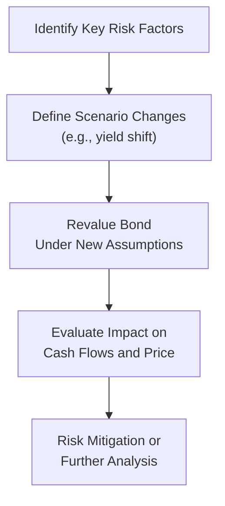

## Overview

If there’s one thing I learned early in my career as a budding bond analyst, it’s that bonds can be surprisingly sensitive to a wide variety of market shifts. I remember feeling a bit overconfident in my first fixed-income project. Then, a sudden rate hike caught me off guard, and I spent a weekend (yes, an entire weekend) recalculating my spreadsheets. Ever since, I've been a huge fan of systematically applying sensitivity analysis to bond cash flows—anticipating possible market scenarios and seeing how bond prices, coupon schedules, and eventual returns might evolve.

Sensitivity analysis is how investors and risk managers gauge potential outcomes if certain market conditions (like interest rates, credit spreads, or embedded option triggers) change. We frequently pair this with scenario analysis and stress testing. In scenario analysis, we tweak one or more risk factors—maybe a modest shift in the yield curve plus a widening of corporate spreads. With stress testing, we take things to another level: we imagine extreme, yet plausible, crises and see how bond values could hold up in those harsh conditions. 

Below, we’ll dig deep into the “why,” “what,” and “how” of sensitivity analysis for bond cash flows, culminating with real-world examples, a few cautionary tales, and practical exam tips.

## Understanding Sensitivity Analysis

Bond cash flow sensitivity refers to how the cash flows—and consequently the bond's price—change in response to certain factors. Common risk factors include:

• Yield curve shifts (parallel or non-parallel).  
• Credit spread movements.  
• Embedded option exercise (calls, puts, or other features).  
• Prepayment behavior in mortgage-backed or asset-backed securities.  
• Overall macroeconomic variables (inflation jumps, GDP surprises, etc.).  

When these variables shift, the bond’s expected periodic coupons, principal repayment schedule, or discount rate might fluctuate. Sometimes a small move in one factor, such as a 25-basis-point increase in the benchmark interest rate, can meaningfully affect the present value of future cash flows. In more complex instruments (like mortgage-backed securities), a slight change in prepayment assumptions can drastically alter the bond’s maturity profile.

## Scenario Analysis vs. Stress Testing

Scenario analysis involves exploring a variety of plausible “what-if” conditions:

• Mild interest rate hikes (+50 bps) or cuts (–50 bps).  
• Modest widening or tightening of credit spreads.  
• Specific triggers that could cause call options to be exercised.  

Often, these scenarios are systematic. For instance, an analyst might create a table of yield changes from –100 basis points (bps) to +200 bps in increments of 50 bps. Then, for each yield shift, the bond’s price is recalculated. Similarly, for corporate bonds, the analyst may adjust the credit spread by a few dozen basis points to gauge the effect on price.

Stress testing takes scenario analysis to the extreme. We assume large, sometimes very large, shocks: a severe recession, a liquidity freeze, or a major geopolitical event. Stress testing typically approximates conditions that are unlikely but not impossible. It helps us see if a bond’s downside risk is manageable. For instance:

• A 300-bps parallel yield curve shift upward.  
• A significant widening of credit spreads (e.g., from 200 bps to 800 bps).  
• Rapid prepayments or drastically lower prepayments that change future cash flow timing.  

This approach, though sobering, provides valuable insight into the “tail risk” of a portfolio.

The diagram above provides a simplified look at scenario analysis. We first select relevant risk factors (e.g., yield changes, spread shifts, etc.), then define changes. Next, we revalue the bond under these new assumptions and evaluate the risk implications. Finally, we either mitigate risk (perhaps by hedging or adjusting our positions) or investigate further.

## Measuring Price Sensitivity

Bonds have well-known quantitative tools to measure their sensitivity to interest rates. These metrics help us quickly see how the bond’s price might shift for small changes in yields.

Duration  
Duration is essentially a weighted average of the times until each cash flow is received, with weights reflecting the present value of each cash flow. More precisely, Macaulay Duration is calculated as:


\displaystyle
\text{Macaulay Duration} \;=\;\frac{\sum_{t=1}^{T} \bigl(t \times CF_t \bigr)/(1+y)^t}{\sum_{t=1}^{T} \bigl(CF_t\bigr)/(1+y)^t}


where \\(CF_t\\) is the cash flow at time \\(t\\), \\(y\\) is the yield per period, and \\(T\\) is the number of periods until maturity.

Modified Duration refines Macaulay Duration to estimate the percentage change in price for a 1% change in yield:


\text{Modified Duration} = \frac{\text{Macaulay Duration}}{1 + y}


Effective Duration is used when a bond has embedded options. By considering possible changes in cash flows (due to call, put, or prepayment features), effective duration tries to capture that optionality. If, for example, interest rates drop below the coupon rate of a callable bond, the likelihood of an early call rises, capping the bond’s price appreciation.

Convexity  
Duration only captures the linear (first-order) relationship between price and yield. But that relationship is curved, so we typically add convexity to refine our estimate of price changes when yields move more significantly. Positive convexity means that as yields drop, bond prices rise at an increasing rate.

Key Rate Durations  
Key rate duration breaks down duration by maturity points on the yield curve. Instead of a single number describing the bond’s sensitivity to a parallel shift, we measure sensitivity to shifting yields at each key maturity. This method is useful if we suspect the yield curve might flatten, steepen, or shift non-parallel. 

## Spread Risk and Credit Considerations

A bond’s sensitivity isn’t limited to yield curve changes alone. Credit spread movements also affect bond prices, especially for corporate or emerging market debt. When investors become more risk-averse, credit spreads can widen dramatically, causing price declines for risky bonds even if benchmark yields stay the same.

In scenario analysis, we might do something like:

• Slightly widen credit spreads by 20 bps for a mild scenario.  
• Significantly widen them by 100 bps for a stress scenario.  

In practice, an investment-grade bond with a 200-bp spread might jump to 300 or 400 bps in a market panic. This is huge for the bond’s expected price and yield, and ignoring it can lead to nasty surprises.

## Embedded Options: Additional Considerations

Bonds with call or put features, or even more exotic structures, require extra vigilance with sensitivity analysis. If interest rates decline, a callable bond’s price potential might be capped—since the issuer may choose to call the bond at par (or at a specified call price). Conversely, if interest rates rise, a putable bond’s holder might exercise the put right. These optional features alter the timing and magnitude of cash flows.

For a callable bond, scenario analysis should include an assumption that the call will be exercised once the bond’s price goes above the call price. Similarly, for a mortgage-backed security (MBS), you want to vary the prepayment speed assumptions under different interest rate scenarios, because homeowners refinance more in falling rate environments, which can speed up principal repayment.

That’s where the concept of “negative convexity” might come into play, especially for mortgage-backed securities and callable bonds. When interest rates drop, these instruments might not rise in price as quickly as an option-free bond (or they might even start losing value if prepayments or calls become extremely probable and you’re forced to reinvest at lower yields).

## Prepayment Risk in Mortgage-Backed Securities

Mortgage-backed securities (MBS) are particularly susceptible to changes in prepayment speeds. Small fluctuations in interest rates can cause large changes in how homeowners refinance their mortgages.  

• When rates go down: Prepayments tend to accelerate, which can reduce the bond’s average life (you get principal back sooner, often at par, limiting price upside).  
• When rates go up: Prepayments slow down, potentially lengthening the bond’s duration.  

Scenario analysis for MBS therefore includes both baseline and stressed prepayment assumptions. If your baseline assumption is, say, a 5% conditional prepayment rate (CPR), you might test 2% CPR and 10% CPR to cover a wide range of possible homeowner behaviors.

## Putting It All Together: Comparative Analysis

After running multiple scenarios—both moderate and stressed—it's wise to line up the results in a concise table or chart. Compare your bond’s price, yield to maturity (or yield to call), duration, convexity, and other key metrics under each scenario. If you see a scenario that dramatically reduces the bond’s value or significantly alters its cash flow timing, you’ve identified a major risk you need to understand and possibly hedge.

Maybe you discover that a modest 50-bps rate reduction triggers a 90% probability of call in a callable bond, effectively paying you out at par sooner than expected. That might not be a problem if you have other places to reinvest at a decent rate—however, it’s certainly a scenario you want to be prepared for. 

From an investment management perspective, the point isn’t to avoid risk entirely—because that’s basically impossible—but to ensure your portfolio’s risks are deliberate, measured, and consistent with your investment objectives.

## Common Pitfalls

• Using only parallel yield shifts: Real yield curves rarely shift in a perfect parallel fashion. Focusing solely on a parallel move can miss important slope or curvature changes.  
• Ignoring credit events: Even high-grade bonds can experience spread widening under stress. Don’t discount that risk.  
• Overlooking embedding calling features: This is huge. Called bonds can drastically shorten your investment horizon.  
• Not testing extremes: Stress testing should be truly stressful. A minor shift might fail to reveal tail risk.  
• Misinterpreting prepayment behavior: If you analyze mortgage-related bonds, you must handle prepayment assumptions carefully.

## Practical Example

Imagine you hold a 5-year corporate bond, currently priced at 98 (par is 100), featuring a 4% annual coupon. Its initial yield to maturity is around 4.50%. You suspect rates might either rise or fall by 1% over the next year, and credit spreads might widen by 50 bps in an economic downturn.

1. Baseline (No Change)  
   - Price: 98  
   - Yield to maturity: 4.50%

2. Scenario 1: +1% yield, +50 bps spread  
   - You recalculate the bond’s price with a 5.50% yield (assuming the spread to the benchmark also increased by 50 bps).  
   - Use your duration and convexity estimates (or a full revaluation approach) to find the bond might drop to an approximate price of 92.

3. Scenario 2: –1% yield, stable spread  
   - The yield heads to 3.50%.  
   - The bond’s price might rise to 102, as the lower discount rate increases the present value of future cash flows.  

Analyzing these outcomes helps you see the bond’s vulnerability to upward rate moves or spread widening. It also highlights the potential upside if rates move down. 

## Exam Application

CFA exams often ask how you’d employ scenario analysis and stress testing when gauging bond risk. You might see an item set describing a portfolio of callable corporates or mortgage-backed securities. The question might require you to quantify potential write-downs if credit spreads widen significantly or to comment on the effect of changing prepayment assumptions by a few percentage points.

In constructed-response format, you could be asked to outline steps for scenario analysis, interpret numeric results, or suggest suitable hedging strategies (e.g., interest rate swaps, short credit default swaps). Pay special attention to how embedded options impact effective duration and the shape of the price-yield curve.

Key exam tips:

• Master the definitions: Scenario analysis vs. stress testing, duration vs. convexity vs. key rate durations.  
• Be able to apply these concepts to real data sets and interpret the results quickly.  
• Understand how embedded options, credit risk, or prepayment risk modifies your approach.

## References

• Tuckman, B. & Serrat, A. “Fixed Income Securities.” (Wiley)  
• BIS, “Stress Testing Practices” for fixed-income portfolios (https://www.bis.org/)  
• CFA Institute Level I Curriculum, “Fixed Income Risk and Return.”  

## Test Your Knowledge: Sensitivity Analysis for Bond Cash Flows



### Which of the following best describes stress testing in bond analysis?

- [ ] A method of estimating price changes for small, incremental changes in yield.
- [ ] A technique used exclusively for analyzing callable bonds under moderate interest rate fluctuations.
- [x] A process of evaluating bond performance under extreme but plausible market conditions.
- [ ] A quick check of only parallel yield shifts in the yield curve.

> **Explanation:** Stress testing goes beyond moderate assumptions to explore extreme but realistic market scenarios (e.g., large yield shifts or credit spread jumps).

### A bond has positive convexity if:

- [x] Its price increases at an increasing rate as yields decrease.
- [ ] Its price remains unchanged when yields fluctuate slightly.
- [ ] It is callable in a declining interest rate environment.
- [ ] The bond's duration is longer than its maturity.

> **Explanation:** Positive convexity means the price-yield curve is curved such that price gains accelerate when yields fall, enhancing upside potential.

### Key rate duration is primarily used to:

- [ ] Estimate prepayment speed changes in MBS.
- [x] Measure price sensitivity to changes in yields at specific maturity segments.
- [ ] Approximate the bond’s default probability.
- [ ] Illustrate hedging strategies for currency risk.

> **Explanation:** Key rate duration localizes sensitivity at distinct points along the yield curve—useful if yield curve changes are expected to be non-parallel.

### In scenario analysis, adjusting both yield levels and credit spreads simultaneously helps analysts:

- [x] Capture how price might respond to real-world conditions where rates and spreads move together.
- [ ] Isolate the effect of interest rates while ignoring market credit conditions.
- [ ] Simplify the analysis by focusing on fewer variables.
- [ ] Ensure that the bond’s duration remains constant.

> **Explanation:** Rates and spreads often change together in the real market, so modifying both variables offers a more realistic picture of potential bond price outcomes.

### Which of the following is a common pitfall when performing scenario analysis?

- [x] Considering only parallel shifts in the yield curve.
- [ ] Testing both moderate and extreme shifts in spreads.
- [ ] Incorporating realistic prepayment assumptions in MBS.
- [ ] Applying varying macroeconomic variables to corporate bonds.

> **Explanation:** Relying solely on parallel yield shifts can miss other changes such as steepening, flattening, or hump-shaped movements in the yield curve.

### When a callable bond is analyzed under a falling rate scenario:

- [ ] The probability of call generally decreases.
- [x] The probability of call typically increases, limiting the bond’s price appreciation.
- [ ] There is no change in cash flow timing.
- [ ] The bond's spread risk is immediately eliminated.

> **Explanation:** As rates drop below the coupon rate, issuers are more likely to call the bond, effectively capping its price near the call price.

### A mortgage-backed security’s effective duration will likely change most significantly when:

- [ ] Coupon rates remain constant.
- [ ] There is no refinancing activity.
- [x] Prepayment assumptions suddenly shift due to rate movements.
- [ ] Market liquidity improves, but interest rates are stable.

> **Explanation:** MBS durations are especially sensitive to prepayment patterns, which vary with interest rates.

### Negative convexity is frequently associated with:

- [ ] High-yield bonds.
- [ ] Zero-coupon bonds.
- [x] Mortgage-backed securities and callable bonds.
- [ ] Treasury Inflation-Protected Securities (TIPS).

> **Explanation:** Negative convexity typically arises when embedded options cause bond cash flows to be refinanced or called away as rates decline.

### Credit spread risk arises because:

- [x] A bond’s yield over a benchmark can widen, causing price to fall even if the benchmark yield is unchanged.
- [ ] Government bond yields always move in the opposite direction of corporate bond yields.
- [ ] Yield spreads limit a bond’s upside potential in a falling rate environment.
- [ ] Spread tightening always indicates a weaker bond market.

> **Explanation:** If credit spreads widen, it increases the yield demanded by investors. This reduces the bond’s price regardless of the underlying benchmark yield movement.

### In stress testing, one might assume a simultaneous 300-bps increase in interest rates and a doubling of credit spreads. True or False?

- [x] True
- [ ] False

> **Explanation:** Stress testing contemplates extreme scenarios, which can indeed include a large increase in interest rates coupled with a significant spread widening.


