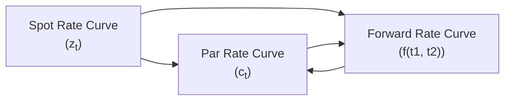

## Introduction

Have you ever tried comparing bonds with different coupons and maturities and thought, “Um, how do I fairly price each cash flow when interest rates keep changing?” If so, you’re already halfway into the riddle of spot rates, par rates, and forward rates. These concepts define how we read and interpret the term structure of interest rates, meaning how interest rates vary across different maturities. In a sense, they’re the backstage crew making sure every bond’s price lines up with underlying market conditions, without any illusions or magic tricks.

In this section, we’ll check out three important pieces of the bond valuation puzzle:

• Spot rates: The yields on zero-coupon bonds for each maturity.  
• Par rates: The yields that make a coupon-paying bond trade at par.  
• Forward rates: The implied future yields you can back out from current market rates.

If you fully grasp these ideas, you’ll unlock a deeper understanding of how bond prices are determined, how yield curves are constructed, and how you can hedge or speculate on interest rates that haven’t even shown up yet.

## Spot Rates

Spot rates are one of those bedrock concepts in fixed income—like the foundation of a building. Formally, a spot rate is the yield (typically expressed as an annualized rate) on a zero-coupon bond that matures at a specific time in the future. Because zero-coupon bonds have no interim coupon payments, their pricing is straightforward: each is worth its single lump-sum payment at maturity, discounted back to today at the bond’s spot rate.

It might help to think about a three-year zero-coupon bond that pays you 1,000 at maturity three years from now. If the market’s demanded spot rate for a three-year maturity is, say, 6%, that bond’s current price (PV) is:

(1)  
PV = 1,000 / (1 + 0.06)^3

That’s it—no coupons, no reinvestment assumptions, no fuss. Because spot rates vary by maturity, you’ll see them plotted against time to form the spot yield curve. This curve tells us how the market is pricing the pure time value of money across different horizons.  

### Bootstrapping and the Spot Rate Curve

In reality, we often don’t have a bunch of liquid zero-coupon bonds for every single maturity. Instead, we turn to “bootstrapping,” which is basically a method of deriving spot rates from a combination of coupon-bond yield data and any zero-coupon data that might exist for shorter maturities. We start with short-maturity instruments (often T-bills or on-the-run Treasuries) to pin down the near-end of the curve. Then we move on to coupon bonds with progressively longer maturities, systematically using each bond’s price and known spot rates for preceding cash-flow dates to lock in the next unknown spot rate.

In an exam scenario, you’ll often see a small table with a 1-year T-bill yield, a 2-year coupon bond yield, a 3-year coupon bond yield, etc. The test will ask you to find the spot rates. By carefully discounting individual coupons you can isolate that “just discovered” spot rate for each maturity. It’s a neat process—but watch out for arithmetic slip-ups and day-count conventions.

## Par Rates

Where spot rates are about zero-coupon bonds, par rates come into play for coupon-paying bonds that trade at par. In other words, the par rate is the coupon rate that makes the price of the bond exactly equal to its face value (often 100). The intuition is that investors will pay par for a fixed coupon bond if that coupon rate lines up with the prevailing interest rate environment. If the coupon is set too high relative to market yields, the bond trades above par. If the coupon is too low, the bond trades below par.

Imagine a brand-new 5-year bond that pays a coupon annually and is issued at par. The yield on that bond is the par rate for 5-year maturity. If the actual market rates shift, then newly issued 5-year bonds at that next point in time will reflect a revised par rate. That’s one reason you see waves of new issuance surge when market yields become more favorable to the issuer (or the borrower).

### Par Yield Curve vs. Spot Rate Curve

We can easily observe par yields in the market, as most coupon bonds are issued at or near par. That means the par yield curve is often used by practitioners who glance at broadly quoted benchmark yields for standard maturities (e.g., 2-year, 5-year, 10-year). However, each point on the par curve is a blend of multiple underlying spot rates, because the coupon bond’s price is a combination of multiple future cash flows. Consequently, if you want a more precise measure of discounting for each individual cash flow, you go back to the spot curve.

## Forward Rates

Let’s say you want to know the rate you’d lock in today for a one-year loan starting two years from now. That’s a forward rate, and it’s basically implied by the set of current spot rates. This forward rate concept is super handy if you’re trying to hedge future financing costs or you want to bet on how interest rates might move (cautiously, we hope).

A quick formula for a 1-year forward rate starting in year 1 is:

(2)  
f(1,2) = [(1 + z₂)² / (1 + z₁)] − 1  

Where:  
• z₁ is the 1-year spot rate, and  
• z₂ is the 2-year spot rate.

In words, this formula says: “The two-year investment return (1 + z₂)² can be broken into the product of a one-year return (1 + z₁) and a follow-up one-year return (1 + f(1,2)).” That second piece is the implied forward rate for the second year.  

### A Quick Python Example

Below is a short Python snippet illustrating how you might calculate a forward rate from spot rates:

```python
# 1-year spot rate: z1 = 5% (0.05)

z1 = 0.05
z2 = 0.06

# (1 + z2)^2 = (1 + z1) * (1 + f(1,2))

f_12 = ((1 + z2)**2 / (1 + z1)) - 1
print("Forward 1-year rate starting in year 1:", round(f_12*100, 2), "%")
```

If you run this, you might see something close to 7.01%, indicating that if you lock in a one-year loan starting a year from now, you’d expect to pay around 7.01% annually—assuming the market’s current 1-year and 2-year spot rates hold.

## Pricing Bonds Using Spot and Forward Rates

In principle, you can price a coupon bond using either the relevant spot rates for each payment date or the chain of forward rates that apply to each coupon period. If you use spot rates for each cash flow, you do something like this for a T-year bond with annual coupons:

(3)  
PV(bond) = ∑ [C / (1 + z_t)^t] + [FV / (1 + z_T)^T]

Where:  
• C is the annual coupon (in currency terms),  
• FV is the face value (often 1,000 or 100),  
• z_t is the t-year spot rate,  
• T is the bond’s total number of years to maturity.

Alternatively, you could rely on forward rates to discount each coupon, but you’d do it by chaining together the forward rates. Either approach should give you the same result under an arbitrage-free environment. In the real world, markets aren’t perfectly efficient, but for exam purposes, you can trust that consistent sets of spot, par, and forward rates produce the same bond prices.

## Applications

### Risk Management

One of the more powerful uses of forward rates is hedging. Suppose you’re worried about interest rates skyrocketing right when you plan to issue debt next year. Forward rates help you glean the market consensus, letting you lock in something via forward rate agreements (FRAs) or interest rate futures. That way, if rates climb, you’re protected. If they fall, well, you pay a bit more than the new market rate, but that’s the price of insurance.

### Portfolio Strategy

Spot and forward rates also let us piece together multi-period cash flows for immunization strategies and liability-driven investing (LDI). By matching the duration and covariance of your asset portfolio with the durations of your liabilities (e.g., pension obligations), you can manage interest rate risk more precisely. Forward curves can guide short-term tactical bets, like riding the yield curve (buying bonds on a steeper part of the curve and benefitting from both yield and potential price appreciation over time).

### Other Practical Examples

Sometimes, financial pros just want to see if they should refinance. If forward rates suggest rates are going even lower a year from now, you might hold off on prepaying a loan or issuing new debt. Conversely, if forward rates jump, it could be prudent to lock in your financing terms ASAP.

## Glossary

• Zero-Coupon Bond: A bond that pays no coupons and is issued (or traded) at a discount, with interest recognized as the difference between the discounted issue price and face value at maturity.

• Par Yield/Rate: The coupon rate that makes a bond’s price equal to its face (par) value.

• Spot Rate: The yield for a zero-coupon bond maturing at a specific date. Often used to discount an individual cash flow that occurs at that maturity.

• Forward Rate: The implied future interest rate for a specific period, derived from current spot (or par) rates.

• Discount Function: A set of discount factors from time t=0 to each relevant future date, used to price any set of cash flows.

• Bootstrap Method: A way to derive individual spot rates from a series of coupon bonds and possibly shorter-term zero-coupon instruments (like T-bills).

• Riding the Yield Curve (RID): A strategy where investors buy longer maturity bonds expected to see yield declines (or a flattening curve), resulting in capital gains as maturity shortens.

• Arbitrage-Free Valuation: The principle that two identical sets of cash flows must have the same price—otherwise you’d have a riskless profit (arbitrage), which the market quickly eliminates (at least in theory).

## Visualizing the Relationships

Below is a simple Mermaid diagram showing how spot rates, par rates, and forward rates interrelate:



This diagram implies that you can derive one curve from another through appropriate mathematical relationships—no single curve is entirely independent of the others.

## Practical Example: Deriving a 2-Year Spot Rate from a Par Rate

Let’s say you know the following:  
• 1-year spot rate is 4% (0.04).  
• 2-year par rate is 5% (0.05), with annual coupons.  

If a 2-year bond offers a 5% coupon and trades at par, the price is 100. How do you find the 2-year spot rate (z₂)?

Step 1: Discount the first coupon by the 1-year spot rate:  
C₁ = 5 (coupon)  
PV of first coupon = 5 / (1 + 0.04)

Step 2: The second coupon (plus principal redemption) must be discounted by z₂, the unknown. So you have:  
(5 + 100) / (1 + z₂)²

Step 3: Since the bond is at par, total PV = 100. Write:

(5 / 1.04) + ((5 + 100) / (1 + z₂)²) = 100

Step 4: Solve for z₂. If you can do the algebra or use a financial calculator, you’ll find z₂ is a bit over 5%. This difference between par rate and spot rate arises mainly because part of the bond’s cash flows arrive earlier (year 1) and are discounted at a different rate (the 1-year spot).

## Common Pitfalls

• Mixing up discounting methods: Using a par yield where a spot rate should go can cause inaccurate valuations.  
• Failing to align day-count conventions: Make sure you know if the exam is using actual/365 vs. 30/360 or some other convention.  
• Overlooking compounding frequencies: Spot rates might come in annual, semiannual, or even continuous compounding forms—be consistent!  
• Confusing forward rates with future spot rates: The implied forward rate is not guaranteed to be the actual future spot rate. It’s only what the current market environment implies.  

## Conclusion and Final Exam Tips

So, yeah, that’s spot rates, par rates, and forward rates in a nutshell. At first, it can feel like you’re juggling multiple ways of describing the same phenomenon, but each perspective offers unique insights for bond pricing and interest rate expectations.

For the exam, practice using bootstrapping to find spot rates from coupon-bond data, then computing forward rates. Be mindful of how to discount each coupon properly. If a question asks you to “arbitrage” between a zero-coupon bond and a coupon bond, they’re basically testing your ability to apply spot rates. Watch out for mistakes in matching the correct discount rate to each coupon. Finally, keep track of compounding conventions and day counts—exams love to see if you’re paying attention to those small, detail-laden nuances.

Best of luck, and remember: once these ideas click, everything from yield curve construction to bond portfolio management looks so much clearer.

## References

• Fabozzi, F. J. “Fixed Income Mathematics.” (Wiley)  
• CFA Institute. 2025 Level I Curriculum, Volume 6: Fixed Income.  
• Bank for International Settlements (BIS) Working Papers on term structure: https://www.bis.org/publ/work.htm  

## Test Your Knowledge: Spot Rates, Par Rates, and Forward Rates Quiz



### Which of the following best describes a spot rate?

- [ ] The rate that makes a coupon bond trade at par.
- [x] The yield on a zero-coupon bond for a specific maturity.
- [ ] The implied interest rate for a future period.
- [ ] The average of short-term interest rates over one year.

> **Explanation:** A spot rate is the yield on a zero-coupon bond that matures at a specific date. It ignores reinvestment risk and focuses on a single lump-sum payment.

### If a two-year bond with annual coupons trades at par with a 6% coupon rate, what does that 6% represent?

- [x] The par yield for two-year bonds.
- [ ] The spot rate for two-year zero-coupon bonds.
- [ ] The 1-year forward rate starting in Year 1.
- [ ] The discount rate used for each coupon.

> **Explanation:** A 6% coupon on a two-year bond trading at par is the par yield for that two-year maturity. The spot rate for the second year is generally different from 6%.

### Which of the following statements about forward rates is correct?

- [ ] They are always equal to future spot rates.
- [ ] They depend only on the current bond prices, not on maturity.
- [x] They reflect the market’s implied rates for borrowing or lending at future dates.
- [ ] They eliminate the need for spot and par rates.

> **Explanation:** Forward rates are derived from the current term structure and represent expectations for future interest rates, but they are not guaranteed to match the actual future spot rates.

### You have a 1-year spot rate of 4.5% and a 2-year spot rate of 5%. Using annual compounding, what is the implied 1-year forward rate starting 1 year from now?

- [ ] 10.00%
- [ ] 4.50%
- [ ] 5.00%
- [x] Approximately 5.50%

> **Explanation:** Using the formula (1 + z₂)² = (1 + z₁) * (1 + f(1,2)):  
> ⇒ (1.05)² / 1.045 − 1 ≈ 5.50%.

### Which yield curve is typically easiest to observe directly in the market?

- [x] The par yield curve.
- [ ] The spot rate curve.
- [ ] The forward rate curve.
- [ ] There is no difference in observability among the three.

> **Explanation:** Most coupon bonds are issued or quoted near par, making the par yield curve the most directly and frequently observed. Spot and forward curves usually require derivation.

### Why might forward rates be useful in risk management?

- [ ] They are legally binding rates that central banks enforce.
- [x] They allow hedging of future borrowing costs based on implied interest rates.
- [ ] They dictate which bond coupon an investor must accept in the future.
- [ ] They ensure a bond’s price equals its face value at maturity.

> **Explanation:** Forward rates are implied future rates based on today’s yield curve and give key insights for hedging future borrowings or exposures.

### When we use spot rates to price a coupon bond, how do we discount each coupon payment?

- [ ] We discount each coupon with the par yield at the bond’s issuance date.
- [x] We discount each coupon by the spot rate corresponding to its time to maturity.
- [ ] We use the forward rate applicable to the final coupon date for all coupons.
- [ ] We always discount the entire coupon stream at an average yield.

> **Explanation:** To price a coupon bond with spot rates, each individual cash flow is discounted by the zero-coupon rate for the exact maturity of that cash flow.

### Which of the following is most likely to be an outcome of misapplying forward rates in a bond valuation?

- [ ] An exact price match with quotes.
- [ ] Perfect alignment with the spot rates.
- [ ] Identical results to using par rates.
- [x] An arbitrage opportunity or a mispriced bond.

> **Explanation:** Using the wrong forward rates or mixing them up with spot or par rates can lead to mispriced bonds, potentially creating an arbitrage opportunity (in theory).

### Suppose the spot rate curve is upward sloping. Which statement is most accurate regarding forward rates?

- [x] Forward rates will generally be higher than the current short rate.
- [ ] Forward rates must always be negative.
- [ ] Forward rates are irrelevant if the curve is upward sloping.
- [ ] Forward rates will match all current spot rates exactly.

> **Explanation:** An upward sloping spot curve usually implies forward rates above the current short rate, reflecting higher implied rates in the future.

### True or False: The implied forward rate for a future period guarantees the actual borrowing cost you’ll face when that period arrives.

- [x] True
- [ ] False

> **Explanation:** Tricky question! This statement is commonly misunderstood. The correct interpretation is that forward rates are implied by current spot rates; they do NOT guarantee future borrowing costs—they merely reflect the market’s consensus or no-arbitrage condition at present. However, from a theoretical standpoint under specific no-arbitrage assumptions, one might say the forward rate “locks in” a cost. In practice, it doesn’t guarantee what the future spot rate will be; it only sets a pre-agreed rate if you enter a forward contract.  


