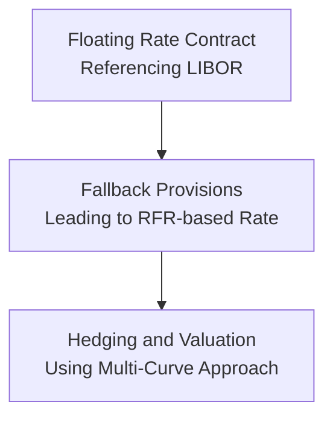

## Background and Motivation

If you’ve ever worked on a floating-rate note or an interest rate swap, you’ve probably heard about how large and important LIBOR (London Interbank Offered Rate) used to be. For decades, LIBOR was the central reference rate for countless financial contracts—mortgages, derivatives, corporate loans, you name it. But, as many of us discovered, LIBOR was eventually phased out because its determination wasn’t always based on actual transaction data, and regulators were concerned about structural vulnerabilities and manipulation risks.

The financial world collectively realized that we needed new, more reliable benchmarks. Enter the so-called “risk-free rates” (RFRs), such as SOFR (Secured Overnight Financing Rate) in the United States, SONIA (Sterling Overnight Index Average) in the UK, €STR (Euro Short-Term Rate) in the Eurozone, and a few others. Unlike LIBOR, which included some measure of bank credit risk and term premium, these RFRs are typically overnight rates that come directly from real, verifiable transactions.

But how do we go from a single benchmark rate to a system of multiple curves? That’s where a multi-curve framework comes in. It sounds a bit fancy, but let’s break it down step by step.

## Evolution from Single-Curve to Multi-Curve Approach

In the old days, many market practitioners used a single curve for both projecting future floating rates and discounting those cash flows to present value. That single curve was often based on LIBOR or a related interbank rate. However, as derivatives markets evolved, practitioners realized there was a noticeable discrepancy between the funding rate for collateralized transactions (like many swaps) and the unsecured borrowing rates embedded in LIBOR. This discrepancy became even bigger during periods of market stress.

Nowadays, it’s fairly standard practice to derive at least two different curves:

• An Overnight Rate Curve (often referred to as the OIS—Overnight Indexed Swap—curve) for discounting collateralized trades.  
• A Forward-Floating Curve for estimating the future coupons of a floating-rate instrument, which might include a credit-lending spread to reflect bank credit risk or other factors.

Now that LIBOR is being replaced, these differences in discounting versus projecting are even more pronounced. SOFR, €STR, SONIA, and similar new rates don’t, by themselves, include a built-in term premium (although some term-based versions exist). So the multi-curve approach has become central to accurate pricing in the post-LIBOR environment.

## Components of the Multi-Curve Framework

Let’s outline the major curves you might see in a typical multi-curve setup today:

Overnight Rate Curve  
• Used for discounting collateralized trades. In the U.S., for instance, SOFR is widely recognized as the underlying rate for overnight secure financing. This curve is often built from OIS instruments that reference SOFR (SOFR OIS).  

Forward-Looking Reference Curve  
• For many financial instruments, practitioners still want a forward term structure—especially for operational ease (think about corporations wanting to know exactly what their next reset payment will be). CME, for instance, has launched Term SOFR rates, which provide a projected version of overnight rates.  
• When a derivative or floating-rate note references a forward-looking rate, you’ll typically build a separate projection curve to price those future payments.  

Tenor-Specific Curves for Credit Risk Premium  
• Some instruments reflect the fact that not all banks or borrowers are risk-free. There might be additional credit spreads or term premiums for certain tenors. Historically, LIBOR had an embedded bank credit risk element, but with its discontinuation, some markets have introduced a credit adjustment spread to mimic that.  
• Because of that, you sometimes see more than two curves—one for discounting, one for the underlying RFR projection, and possibly a third for capturing any term risk premium or credit differential.  

Below is a simple diagram illustrating how a legacy LIBOR-related contract might move to a multi-curve framework with fallback provisions:

## Adapting Existing Contracts and New Issuance

One question that always comes up is: “I have an existing floating-rate note linked to LIBOR—what do I do now?” Well, hopefully your contract has fallback provisions. Fallback provisions lay out the process for transitioning to a new rate when LIBOR is unavailable or discontinued. This typically involves:

1. Replacing LIBOR with an RFR-based rate (e.g., SOFR).  
2. Adding a credit adjustment spread to reflect historical differences between LIBOR and the new rate (which is typically lower).  
3. Adjusting calculation methodologies (such as daily compounding in arrears) if that’s what your fallback prescribes.

On the derivatives side, the International Swaps and Derivatives Association (ISDA) published standardized fallback protocols. Most major market participants adhered to them, so existing swaps referencing LIBOR automatically switch to the relevant RFR plus a spread adjustment once LIBOR is officially discontinued.

For new issuances, many bonds and swaps now reference RFRs from the start, meaning fewer complications going forward. Nonetheless, you still need a robust multi-curve system under the hood, because discounting typically relies on that overnight collateral rate, while your note might pay a term-based coupon derived from the RFR plus a credit add-on.

## Practical Steps in Constructing a Multi-Curve Framework

Let’s describe how you might build these curves. This is a simplified overview, of course, but it’s still enough to understand the main points.

Gather Overnight Data  
Gather market quotes for overnight-indexed swaps based on your chosen RFR, like SOFR OIS for the USD market. These quotes—spanning various maturities—help you build the discount curve. Essentially, you’re solving for the zero-coupon rates or discount factors that match current OIS swap pricing.

Construct the Discount Curve  
From the overnight-indexed swaps, you bootstrap the discount factors for each maturity. This discount curve is what you’ll use to value collateralized trades and any other instruments that theoretically fund at or near the risk-free rate.

Build the Forward Curve  
For trades that still need a forward-looking rate, or for instruments referencing a credit-spread component, you’ll gather data from relevant market instruments (e.g., futures, forward rate agreements, or now, term RFR instruments if available). These instruments help pin down expected future rates beyond the overnight horizon.

Add Tenor-Specific Adjustments  
If your market has distinct term rates (like Term SOFR for 1-month, 3-month, or 6-month resets) or you need to incorporate a credit spread, you’ll build those into specialized curves. In essence, you might have a separate forward curve for each tenor.  

Reconcile the Curves  
Finally, you make sure all the curves work together. For instance, if you used to have a LIBOR curve for discounting and a LIBOR forward curve for projections, you now want a RFR discount curve plus a forward RFR curve, making sure any transition spreads or historical differentials are accounted for. You need to confirm that the curves are consistent with actual market quotes on new derivative products and any fallback conversion terms for legacy instruments.

## Hedging and Valuation under the New Paradigm

Once you’re in a multi-curve environment, your valuation and hedging approach changes slightly:

Collateralized Trades  
• For interest rate swaps collateralized by cash or high-quality securities, discounting is performed on the overnight curve. If your swap’s floating leg references Term SOFR, you’ll project the floating payments using a forward SOFR curve.  

Uncollateralized Trades  
• If you have uncollateralized exposures or you’re dealing with a product that doesn’t strictly rely on overnight RFR funding, you might need a different discount rate that reflects your cost of unsecured funding. In practice, many institutions still use the overnight curve as a base, applying an add-on to reflect uncollateralized credit risk.

Consistency is Key  
• The multi-curve architecture ensures that the pricing of derivatives, bond coupons, and any hedges referencing different underlying rates lines up in an arbitrage-free manner. If there’s a mismatch, you run the risk of basis risk or mispriced hedges.

Managing Basis Risk  
• When your floating asset references, say, SOFR, but your funding is pegged to a different RFR or credit-based rate, you may face basis risk. Effective hedging usually requires interest rate derivatives that perfectly match the underlying reference rate, or at least incorporate a basis swap that accounts for the difference.

## Potential Pitfalls and Common Challenges

It’s not always a smooth ride transitioning from LIBOR to a multi-curve approach. A few areas can trip you up:

System Updates  
• Many legacy systems were built around a single LIBOR-based curve. Updating everything—software, reporting tools, risk systems—to handle multiple curves can be lengthy and expensive.

Fallback Mismatches  
• While ISDA provides standard protocols for derivatives, certain loan agreements or bonds might have different fallback terms. Mismatched fallback assessment can lead to new forms of basis risk.

Limited Liquidity in Some RFR Products  
• While major currencies have relatively liquid OIS markets, some smaller currencies might not. Building robust curves in these markets can be tricky, especially if data points are sparse.

Operational Complexity  
• Daily compounding in arrears for SOFR (or other RFRs) can be operationally more complex than a forward-looking LIBOR with a known coupon at the start of each period.

Regulatory Scrutiny  
• Regulators expect proper governance and documentation around benchmark transitions. Market participants need to keep thorough records of how they handled fallback transitions, spread adjustments, and curve construction assumptions.

## Brief Example: Discounting a 3-Month SOFR Swap

Imagine you enter into a 3-month swap where you receive a fixed rate and pay a daily compounded SOFR. The notional is $10 million. The steps to value your position might look like this:

1. You’d gather OIS quotes for SOFR across the maturity spectrum to build your discount curve.  
2. For short maturity, you might just rely on the nearest OIS points plus any short-dated treasury-bill data.  
3. You’d then discount the fixed leg’s cash flows—assuming an agreed schedule—and do the same for the floating leg’s expected payments.  
4. Because the floating leg is SOFR-based, you project daily compounding for the next 3 months, or you might approximate with the best-forward estimate if you’re doing a mid-term valuation.  
5. The difference in present values (fixed leg minus floating leg) determines the swap’s fair value. With the multi-curve approach, you’re not mixing in a separate LIBOR-based curve anywhere; everything is consistent with the SOFR discounting environment.

## Best Practices for Implementation

1. Communicate Early and Often  
   • Talk with counterparties, clients, and internal stakeholders. Make sure they understand the changes to reference rates, fallback clauses, and how discount curves might shift portfolio valuations.

2. Maintain Thorough Documentation  
   • Keep a close record of how you bootstrapped each curve, the instruments you used, and the fallback spread methodology. This can help if you must defend assumptions later.

3. Simulate Different Scenarios  
   • Because RFR-based curves can behave differently in stress environments, run scenario analyses that test your portfolio under extreme rate moves or changes in liquidity.

4. Stay Current with Regulatory and Industry Updates  
   • Implementation best practices continue to evolve. The official sector RFR Working Groups (like the ARRC in the U.S.) frequently publish new guidance.

5. Test Hedging Strategies in a Multi-Curve Context  
   • If you’re hedging an RFR-based exposure with a variety of swaps, thoroughly check how your discounting assumptions align with the underlying trades.

## Conclusion

The phasing out of LIBOR has ushered in a new world where multiple curves are the norm. It can feel a bit daunting at first—maybe a bit like adjusting from a single-speed bicycle to a fancy multi-gear one. However, once you grasp the fundamentals, you’ll see that the multi-curve framework is actually more robust and transparent.

Sure, you have to keep track of an overnight discount curve, forward projection curves, potential credit spreads, and fallback provisions. But that’s quickly becoming standard practice in a post-LIBOR market. As you set up your systems and processes, remember that the ultimate goal is to achieve consistent, arbitrage-free valuations that reflect real-world financing conditions. The multi-curve approach gets you there.

## References

• Official Sector RFR Working Groups. (n.d.). Resources and best-practice guidelines. See the respective websites of the ARRC (https://www.newyorkfed.org/arrc), Bank of England, European Central Bank, and others.  
• ISDA. (n.d.). IBOR Fallback Protocol. Retrieved from https://www.isda.org.  
• CFA Institute. (2025). Fixed Income, 7th Edition.  
• Various regulatory publications on benchmark transitions in the U.S., UK, EU, and other jurisdictions.

## Test Your Knowledge: Multi-Curve Frameworks for LIBOR Replacements



### Which of the following best describes why a multi-curve approach became the standard for post-LIBOR valuation?

- [ ] Market participants demanded a single overnight rate to simplify calculations.
- [x] Different funding sources and collateral requirements prompted separate discount and projection curves.
- [ ] Regulators mandated only one curve be used, but institutions disregarded it.
- [ ] Banks primarily replaced collateralized discounting with unsecured discounting.

> **Explanation:** A multi-curve approach separates the discount rate for collateralized funding (overnight rate) from the projected rates for floating payment calculations. This distinction ensures more accurate, arbitrage-free pricing.

### How do fallback provisions most commonly handle the difference in credit risk between LIBOR and a new risk-free rate?

- [ ] They ignore the difference altogether.
- [ ] They use a fixed discount factor through maturity.
- [x] They include a spread adjustment to reflect historical rate differentials.
- [ ] They simply base it on the next available LIBOR tenor.

> **Explanation:** Fallbacks typically incorporate a spread adjustment to replicate the credit component embedded in LIBOR, as RFRs like SOFR do not include such credit risk.

### In constructing a discount curve for SOFR-based swaps, a practitioner will most likely rely on:

- [x] OIS quotes referencing SOFR.
- [ ] LIBOR forward rate agreements.
- [ ] Overnight corporate funding rates published by credit rating agencies.
- [ ] Retail mortgage rates.

> **Explanation:** OIS instruments tied to SOFR are the market standard for deriving discount rates in the new environment.

### Why might a financial institution build multiple forward curves even if they all reference SOFR?

- [ ] To approximate differences in the inflation rate.
- [ ] To satisfy multiple regulators requiring unique reporting structures.
- [ ] To hide actual funding costs from competitors.
- [x] To capture differences in tenors and credit spreads embedded in certain instruments.

> **Explanation:** Depending on the term structure or the addition of credit spreads for some instruments, financial institutions may need separate forward curves that reflect unique market conditions.

### A bank is hedging a 3-month Term SOFR note with an OIS SOFR swap. Which risk is most likely to remain?

- [ ] Duration risk.
- [ ] Market liquidity risk.
- [x] Basis risk.
- [ ] Forex risk.

> **Explanation:** Basis risk arises because one instrument references a term-based rate, while the other is a daily-compounded OIS. Minor discrepancies in these rates can cause imperfect hedging outcomes.

### Which of the following is a key challenge when transitioning legacy LIBOR contracts that lack robust fallback language?

- [x] Inconsistent or unclear approach to determining the new reference rate and spread.
- [ ] Immediate legal invalidation of the contract.
- [ ] Mandatory use of a near-zero rate.
- [ ] Automatic reversion to the original LIBOR for a year.

> **Explanation:** Without robust fallback provisions, it can be unclear which rate/spread combination is used, creating disputes or inefficiencies.

### An advantage of daily compounding in arrears for an RFR, such as SOFR, is:

- [x] It reflects a more current market interest rate environment.
- [ ] It simplifies operational processes for all participants.
- [x] It can be more representative of actual funding costs.
- [ ] It eliminates the need for any spread adjustments.

> **Explanation:** While daily compounding in arrears can be operationally complex, it better captures the current cost of funding. However, it does not automatically remove spread adjustments if credit differences exist.

### In a multi-curve framework, which curve is generally used for discounting collateralized interest rate swaps?

- [ ] The unsecured 3-month LIBOR curve.
- [x] The overnight-indexed swap (OIS) curve based on the chosen RFR.
- [ ] The corporate bond yield curve.
- [ ] The Fed funds futures curve.

> **Explanation:** Collateralized swaps are typically discounted at the overnight-collateral rate, which is defined by OIS instruments referencing the relevant RFR.

### Which factor prompted financial markets to move away from a single LIBOR-based curve to a multi-curve framework?

- [x] The realization that collateralized and unsecured funding rates were not identical.
- [ ] The desire to reduce the number of data points needed to build a curve.
- [ ] The introduction of fixed-rate swaps.
- [ ] Regulatory prohibition against any form of OIS discounting.

> **Explanation:** During the financial crisis, the gap between collateralized and unsecured funding rates became evident, encouraging separate discounting and forecasting curves.

### True or False: Under the multi-curve structure, the same curve is used for both discounting and forwarding floating cash flows in order to avoid having to manage basis risk.

- [x] True
- [ ] False

> **Explanation:** In practice, for a given derivative or bond referencing a particular RFR, you’ll typically use the relevant overnight curve (or OIS curve) for discounting collateralized trades and a forward curve for actual floating forecasts. However, both curves belong to the broader “multi-curve” setup so that valuations are consistent.  


