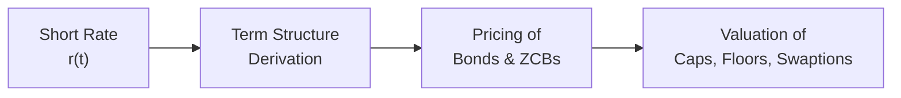

## Introduction
Short rate models are like the secret sauce that helps us understand, simulate, and price contingent claims on interest rates. By focusing on the instantaneous short rate (often denoted as r(t)), these models feed directly into the construction of a theoretical yield curve. You might say, “But why do we need these fancy models if we can just observe market bond yields?” Well, real-world yield curves only give us snapshots. For many risk management tasks—like hedging complex derivatives, performing scenario analyses, or forecasting bond prices under evolving market conditions—we need a dynamic framework. And that’s precisely where short rate models step in.

Early in my career, I remember being amazed at how a tiny tweak in the short rate drift parameter could send the entire simulated yield curve off in a different direction. It was both exciting and slightly terrifying to see how sensitive the term structure was to calibration choices. That’s the joy (and the challenge) of this field: a small parameter adjustment can dramatically shift long-run expectations and present values of future cash flows.

Two of the most popular short rate models are the Vasicek model and the Cox-Ingersoll-Ross (CIR) model. Both incorporate mean reversion—an intuitive phenomenon suggesting that rates don’t just wander off to infinity or negative infinity, but hover around some long-term level determined by broader macroeconomic forces and central bank policies. Below we’ll explore each model’s specification, discuss their practical uses, highlight limitations, and end with an integrated perspective on their role in term structure analysis.

## The Vasicek Short Rate Model
The Vasicek model is foundational in finance. It’s among the earliest attempts at introducing a mean-reverting stochastic process to interest rates, standing on the mathematical foundation of the Ornstein-Uhlenbeck process. The short rate dynamics under Vasicek typically look like this:

$$
dr(t) = a \bigl(b - r(t)\bigr)\,dt + \sigma\,dW(t),
$$

where:  
• \\(r(t)\\) is the short rate at time \\(t\\).  
• \\(a\\) is the speed of mean reversion.  
• \\(b\\) is the long-term (or “equilibrium”) level to which the short rate reverts.  
• \\(\sigma\\) is the volatility parameter.  
• \\(W(t)\\) is a standard Brownian motion.

### Key Characteristics
1. Mean Reversion: The term \\((b - r(t))\\) means the rate is always being “pulled” towards \\(b\\). If \\(r(t)\\) is above \\(b\\), the drift becomes negative so the rate moves downward, and vice versa.  
2. Normally Distributed Shocks: Because the diffusion part (\\(\sigma\,dW(t)\\)) is not state-dependent, the distribution of \\(dr(t)\\) is normal for each increment.  
3. Possible Negative Rates: The biggest quirk is that, for certain parameter combinations, the model can generate negative short rates—something that was traditionally considered undesirable. However, in a world that actually witnessed negative interest rates in some regions, the idea is less far-fetched than it used to be. Still, if you want to guarantee a floor, the Vasicek model doesn’t do it on its own.

### Analytical Bond Pricing
One perk of the Vasicek model is that it offers closed-form solutions for zero-coupon bond (ZCB) prices. By solving the relevant partial differential equation, you can find an expression for the bond price as a function of \\(r(t)\\), \\(a\\), \\(b\\), \\(\sigma\\), and time to maturity. The existence of a neat analytical solution has made the Vasicek model a mainstay in academic research and a baseline reference in practice.

### Practical Anecdote
Once, I tried calibrating a Vasicek model to a set of Treasury yields over a period that included a major market shock. The speed of mean reversion ended up extremely high in the calibration—almost implying the short rate was forcibly dragged to the long-run mean every few days. It was a good lesson in how outliers and unusual data can distort one’s parameter estimates.

## The CIR Short Rate Model
Developed by John Cox, Jonathan Ingersoll, and Stephen Ross, the CIR model is another staple in the short rate modeling universe. It’s spelled out as follows:

$$
dr(t) = a \bigl(b - r(t)\bigr)\,dt + \sigma \sqrt{r(t)}\,dW(t).
$$

### Key Characteristics
1. Mean Reversion: Same big idea—rates revert to \\(b\\). If the rate is above \\(b\\), it drifts downward; if it’s below \\(b\\), it gets pushed back up.  
2. Non-Negative Rates: Because the diffusion term is \\(\sigma \sqrt{r(t)}\\), the volatility shrinks as \\(r(t)\\) approaches zero. This feature greatly reduces the chance of wandering into negative territory.  
3. Volatility Flexibility: The model is sometimes said to exhibit “volatility proportional to the square root of the short rate,” meaning when \\(r(t)\\) is high, it’s more volatile, and when \\(r(t)\\) is low, it’s less volatile.

### Analytical Bond Pricing
Like Vasicek, the CIR framework also has closed-form solutions for zero-coupon bond prices. The math is more involved due to the square root in the diffusion term, but you still get a relatively straightforward formula (compared to, say, some more advanced multi-factor models).

### Practical Note
If you strongly believe rates should not go negative, or if you’re analyzing instruments that are highly sensitive to the short end of the curve, the CIR model often becomes a more natural choice than Vasicek. However, it can be trickier to calibrate because of that \\(\sqrt{r(t)}\\) volatility term, especially in prolonged low-rate environments. 

## Mean Reversion and Model Parameters
One of the key themes in both Vasicek and CIR is mean reversion. The idea is that interest rates might spike or plummet—but over time, they drift back toward some stable average. Let’s break down the main parameters:

• \\(a:\\) The speed of mean reversion. A larger \\(a\\) means the short rate moves more forcefully back to \\(b\\). A small \\(a\\) suggests more wandering around without quickly snapping back.  
• \\(b:\\) The long-run mean. Think of \\(b\\) as the central bank’s or the market’s “target” level for the short rate. Over a long horizon, the expected value of \\(r(t)\\) in both models stabilizes around \\(b\\).  
• \\(\sigma:\\) The volatility parameter. This controls how rapidly or significantly interest rates can deviate from that mean.  

### Economic Rationale
In reality, central banks use policy levers (like the fed funds rate in the U.S.) to keep interest rates near certain levels to achieve macroeconomic goals. Both Vasicek and CIR incorporate this logic. However, that doesn’t mean either model is bulletproof. If the economy is in a profound recession or a surprise inflation spike occurs, short rates could remain away from the “target” for an extended period.

### Modeling Yield Curves
Once you specify the short rate process, you can derive the price of zero-coupon bonds for different maturities. From those theoretical bond prices, you can back out a model-based yield curve. The shape and level of this yield curve will depend heavily on (1) the gap between the current short rate and \\(b\\), (2) the parameter estimates for \\(a\\) and \\(\sigma\\), and (3) how much time is left until maturity.

## Use Cases in Interest Rate Derivatives Pricing
Short rate models are heavily used in pricing interest rate derivatives, such as caps, floors, and swaptions:

• **Caps and Floors**: These are basically options on future interest rates. A cap is like insurance against rising short rates, while a floor protects against plummeting interest rates. By simulating future short rates under a model like Vasicek or CIR, you can compute the expected payoff of each caplet or floorlet and discount accordingly.  
• **Swaptions**: A swaption is the option to enter an interest rate swap in the future. Again, we rely on short rate simulations or closed-form solutions (if available) to compute expected payoffs.  
• **Scenario Analysis**: Portfolio managers often generate multiple yield curve scenarios to stress-test their bond or derivative positions. A short rate model can keep these scenarios internally consistent, so the simulated yield curves aren’t arbitrary.

### Diagram: Flow of Information in Short Rate Derivative Pricing

In the diagram above, the short rate \\(r(t)\\) drives the generation of a term structure (the yield curve). That yield curve in turn underpins the valuation of bonds and zero-coupon bonds, and ultimately flows into the pricing of more complex derivatives.

## Model Calibration and Implementation
Calibration is how we tailor the model to real-world data. Typically, we gather historical short rate data or a cross-section of bond yields:

### Steps in Calibration
1. **Choose Estimation Method**: Common approaches include maximum likelihood estimation, generalized method of moments (GMM), or even simpler regression-based fits.  
2. **Fit the Parameters**: Estimate \\(a\\), \\(b\\), \\(\sigma\\). In some cases, you might also do a cross-sectional calibration to market prices of bonds or derivatives, ensuring the model is consistent with current market conditions.  
3. **Check Goodness of Fit**: Evaluate whether the calibrated model yields an implied term structure that matches the actual curve.  
4. **Iterate**: Calibration might need to be repeated at regular intervals—especially if the market goes through big changes.  

### Common Pitfalls
• **Overfitting**: Focusing too heavily on a short window of data might produce unrealistic parameter estimates.  
• **Regime Shifts**: The economy may shift from a high-rate regime to a low-rate regime (or vice versa). A single set of parameters might not capture both environments well.  
• **Data Frequency**: Daily vs. weekly vs. monthly data can yield different volatility estimates.

## Limitations of Short Rate Models
Let’s be honest: no simple short rate model can capture every nuance of real-world yield curves. Here are some major critiques:

1. **Single-Factor Constraint**: Vasicek and CIR are one-factor models, implying there’s just one source of risk. In reality, yield curves frequently exhibit multiple degrees of freedom (e.g., parallel shift, slope change, curvature).  
2. **Constant Parameters**: Unless you allow for time-varying parameters, these models assume a single set of drift and volatility inputs for all market conditions. That’s not always realistic.  
3. **Negative Rates**: The Vasicek model can produce negative rates without additional constraints, which might be acceptable or not, depending on your perspective. CIR tries to solve this but can still approach zero in ways that might look unnatural if the market is used to significantly negative territory.  
4. **Calibration Sensitivity**: Real-life calibration can be unstable due to noise in historical data. Small shifts in data or changes in the estimation window can produce large swings in the parameter estimates.

## Practical Examples and Case Illustrations
### Example 1: Bond Valuation with Vasicek
Imagine we have a 2-year zero-coupon bond in a market where the current short rate is 3%. Suppose we calibrate a Vasicek model with \\(a = 0.5\\), \\(b = 4\%\\), and \\(\sigma = 1\%\\). We want to see how sensitive the bond price is to the speed of mean reversion, \\(a\\).

If we lower \\(a\\) to 0.1, the short rate takes longer to revert to 4%, implying the short rate might remain closer to 3% for much of the bond’s remaining life. This can produce a higher bond price (since the interest rate environment remains relatively low). Conversely, a large \\(a\\) might push rates closer to 4% quickly, leading to a lower bond price.

### Example 2: Pricing an Interest Rate Cap with CIR
Consider an interest rate cap with 6 monthly caplets, each referencing 3-month LIBOR (or its replacement). Under a CIR model, if we assume the short rate is 2%, \\(a = 0.3\\), \\(b = 3.5\%\\), and \\(\sigma = 2\%\\), we can simulate paths of future short rates. Because the square-root diffusion ensures the rate won’t drift below zero easily, if we suspect the macro environment is recovering from a recession, the drifting upward effect might dominate. That will drive the cost of the cap higher, as caplets are more likely to settle in-the-money when rates spike.

### Example 3: Scenario Analysis
A fixed-income portfolio manager wants to estimate potential losses if short rates surge from 1% to 5% within a year. Using a short rate model ensures the entire yield curve scenario is consistent with that spike in short rates. If you tried to do it by simply shifting the entire yield curve in an ad hoc manner, you might get unrealistic shapes that fail to reflect how different maturities typically respond to short rate movements.

## Conclusion and Best Practices
Short rate models bring academic rigor and analytical tractability to interest rate forecasting, bond valuation, and floating-rate derivative pricing. They rest on the notion of mean reversion, which resonates deeply with the macroeconomic reality of policy-driven interest rates. The Vasicek and CIR frameworks remain the go-to one-factor models:  
• Vasicek for easier calibration and closed-form solutions, albeit with the possibility of negative rates.  
• CIR for enforcing quasi-positivity and a volatility structure tied to the short rate level.

Still, be aware of limitations. For real-world tasks, risk practitioners often go beyond single-factor short rate models—embracing multi-factor or forward-rate models to capture more complex yield curve dynamics. For exam purposes, it’s essential to grasp the core mathematics of mean reversion, how bond prices are derived, and how to interpret each parameter’s economic significance. Keep an eye on calibration pitfalls and always consider how the chosen short rate model aligns with the actual rate environment you’re analyzing. 

If you want to see how these short rate models connect with building yield curves or analyzing parallel vs. non-parallel shifts, revisit earlier sections in Chapter 7 (like 7.1 spot rates vs. forward rates or 7.5 yield curve shapes) for context. And if you’re dealing with advanced derivatives, cross-reference Chapter 8 for interest rate risk and OAS topics, or Chapter 10 for structured products.

## References and Further Reading
• Cox, J., Ingersoll, J., Ross, S. (1985). “A Theory of the Term Structure of Interest Rates.” Econometrica.  
• Vasicek, O. (1977). “An Equilibrium Characterization of the Term Structure.” Journal of Financial Economics.  
• Brigo, D. & Mercurio, F. (2006). “Interest Rate Models—Theory and Practice.” 2nd ed.  
• Hull, J. (2022). “Options, Futures, and Other Derivatives.” 11th ed. Pearson.  
• CFA Institute (latest edition). “Fixed Income and Derivatives Readings,” CFA Program Curriculum.

## Test Your Knowledge: Short Rate Models Quiz



### Which of the following is a key distinguishing feature of the Vasicek model compared to the CIR model?

- [ ] It incorporates mean reversion in the short rate process.
- [ ] It enforces strictly non-negative interest rates.
- [x] It allows for the possibility of negative short rates due to its normal diffusion term.
- [ ] It completely ignores volatility in the short rate process.

> **Explanation:** The Vasicek model uses a constant volatility term, which means the short rate can drift below zero. CIR’s diffusion term is proportional to √r(t), limiting negative rates.

### When calibrating a CIR model, which parameter directly influences the risk of hitting near-zero interest rates?

- [ ] The speed of mean reversion (a).
- [ ] The long-run mean (b).
- [x] The volatility term (σ) that multiplies √r(t).
- [ ] The current short rate level alone.

> **Explanation:** The key driver is the parameter multiplying √r(t). A higher volatility parameter increases the chance of r(t) reaching very low values, but the square root form still helps keep rates from actually going negative.

### Assume the Vasicek model is specified as dr(t) = a(b – r(t)) dt + σ dW(t). If a is very large, what does that imply?

- [x] The short rate reverts very quickly to its long-run mean.
- [ ] The short rate does not revert at all.
- [ ] The volatility of the short rate must be zero.
- [ ] The short rate will definitely never go negative.

> **Explanation:** A large speed of mean reversion (a) means the rate will be pulled strongly toward b, but it does not eliminate the possibility of negative rates.

### In both Vasicek and CIR models, the parameter b represents:

- [ ] The parameter controlling volatility.
- [ ] The inverse of the speed of mean reversion.
- [x] The long-run level (or mean) to which r(t) converges.
- [ ] The discount factor used in bond pricing.

> **Explanation:** The parameter b indicates the long-term average around which the short rate mean-reverts in both models.

### Which of the following does NOT directly result from specifying a short rate model?

- [x] Determination of corporate bond credit spreads.
- [ ] Derivation of a theoretical term structure (yield curve).
- [ ] Pricing of interest rate caps and floors.
- [ ] Scenario analysis for stress testing interest rate movements.

> **Explanation:** Short rate models do not directly determine corporate credit spreads, which also involve default risk and other credit-related factors. They do help derive yield curves and price interest rate derivatives.

### One assumption in the CIR model is that:

- [ ] Interest rate changes follow an exponential distribution.
- [x] Volatility is proportional to the square root of the short rate.
- [ ] The market price of risk is always zero.
- [ ] Calibration is independent of the data frequency.

> **Explanation:** CIR’s hallmark is that the diffusion term is σ√r(t), making volatility proportional to the square root of the short rate.

### Which short rate process would you prefer if you fundamentally believe rates should never go negative?

- [x] CIR model.
- [ ] Vasicek model.
- [ ] Ornstein-Uhlenbeck model with negative drift only.
- [ ] A purely deterministic model with no volatility.

> **Explanation:** CIR’s square-root diffusion term is specifically intended to keep rates near or above zero, making it the model of choice in many non-negative rate contexts.

### During calibration, which of the following is a common pitfall?

- [ ] Having too large a data set to search for parameters.
- [x] Overfitting to a short historical sample, causing unstable estimates.
- [ ] Assuming the short rate model is the only factor driving credit spreads.
- [ ] Using both historical and cross-sectional data.

> **Explanation:** Overfitting a model to a small or unrepresentative data set can yield misleading parameter values and hamper predictive accuracy.

### True or False: In scenario analysis, short rate models help generate consistent yield curves across maturities for given short rate realizations.

- [x] True
- [ ] False

> **Explanation:** Short rate models produce an internally consistent term structure, ensuring that changes in the short rate process are systematically reflected across the yield curve.

### Which of the following makes the Vasicek model mathematically simpler than CIR?

- [x] The diffusion term is a constant, σ dW(t), rather than σ√r(t).
- [ ] The drift term is set to zero in the Vasicek model.
- [ ] The speed of mean reversion is always fixed at zero.
- [ ] The model does not require parameter calibration.

> **Explanation:** The Vasicek model’s constant diffusion term yields a simpler solution for bond prices and interest rate derivatives. CIR’s square-root factor adds complexity.




