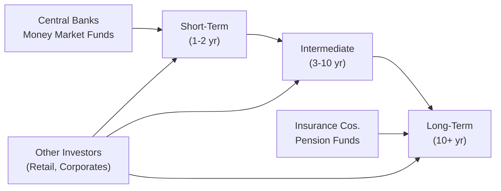

## Introduction and Overview

Segmentation in bond markets sometimes feels like visiting a huge farmers’ market—each stall sells something different, and each group of buyers raids distinct stalls for the items they need most. This analogy helps illustrate how different investor groups (or “clienteles”) naturally gravitate toward particular maturity ranges, effectively segmenting the yield curve. In practice, these segments can be relatively insulated from one another, dramatically influencing bond yields and pricing within each maturity “bucket.”

Segmentation occurs because each investor clientele has its own objectives, constraints, and regulatory or capital requirements that dictate the maturities it prefers. For example, short-term investors, such as money market funds, rarely buy 30-year bonds because they need to stay liquid. Meanwhile, pension funds require long-duration assets to match liabilities that stretch out for decades. This synergy (or, at times, tension) between supply and demand in each segment can lead to interesting and sometimes puzzling shapes in the yield curve.

In this section, we explore the Segmented Markets Theory and how it merges with the concept of Preferred Habitat Theory to shape a more nuanced picture of investor behavior. We also delve into real-world applications and illustrate the ways in which distinct investor clienteles create demand pressures and yield distortions across maturities.

## Core Concepts of Segmented Markets Theory

Segmented Markets Theory posits that the yield curve is effectively the result of multiple isolated bond “markets,” each representing a different maturity range. According to this theory, these segments are not perfectly interlinked. Instead, market participants typically confine themselves to relatively narrow bands of maturities or specific “habitats.” If this sounds a bit narrow, you’re right. Classical economic intuition might suggest that as soon as bonds in one segment become overpriced, investors would shift to cheaper alternatives in other maturities. However, the reality is often more nuanced.

Because of regulation, internal risk policies, or organizational mandates, institutions may not be able—or willing—to move out of their preferred maturity segment. This restricted investor movement leads to each segment developing its own localized supply-demand dynamics. Essentially, fewer participants cross those maturity boundaries. The result is that yields in the short end of the curve may be determined somewhat independently from yields in the long end, and everything in between is shaped by unique supply and demand forces.

### Drivers of Market Segmentation

• Regulatory Requirements: Some investors are restricted to short-term securities or must hold certain high-quality “liquid” instruments (e.g., commercial banks constrained by Basel III liquidity coverage ratios).  
• Portfolio Objectives: Institutions like pension funds or life insurance companies must manage duration risk carefully to match their liabilities, causing them to focus on longer-dated bonds.  
• Tax and Accounting Rules: Differences in how short- vs. long-term instruments are taxed or reported can further discourage cross-segment substitutions.  
• Client Mandates: Firms that manage money on behalf of external clients often must abide by client-imposed guidelines specifying maturity preferences or constraints.

## Preferred Habitat Theory

Preferred Habitat Theory can be regarded as a practical extension of the Segmented Markets perspective. It still presumes that investors have a strong preference for certain maturities, but it also allows for some flexibility. Specifically, if offered a sufficiently attractive yield premium, investors might be convinced to purchase bonds outside their usual habitat. Or as one of my colleagues used to say, “I’ll hold a 10-year if it’s worth my while—just don’t expect me to do it for free.”

### Key Distinction from Segmented Markets Theory

Whereas Segmented Markets Theory tends to view each maturity bucket as sealed off, Preferred Habitat Theory says: “Well, yeah, there are compartments, but not necessarily ironclad barriers.” Investors are typically reluctant to move from their comfort zones, yet they may be open to “renting a neighbor’s stall” if the yield pick-up is big enough to offset the additional risk or mismatch.

In other words, a pension fund manager might buy a 5-year bond (rather than a 20-year) if the spread between 5-year and 20-year yields is insufficient. Conversely, a short-term investor might be tempted to move out a bit on the curve if a steep contango in yields is too good to resist.

## Investor Clienteles: Who Prefers What and Why

Different investor groups will demand different maturities for a variety of reasons: liquidity, capital requirements, liability management, or even strategic portfolio decisions. Understanding who buys what makes it easier to spot yield distortions or arbitrage-like opportunities in particular segments.

### Central Banks and Government Entities

Central banks often conduct open market operations using shorter-term instruments like Treasury bills, repurchase agreements, or short-dated government bonds. They frequently prefer these maturities for liquidity management and foreign exchange reserves. When a central bank decides to shift its reserve strategy—maybe adding more mid-range maturities for yield—it can exert significant upward or downward pressure on that segment of the curve.

### Insurance Companies and Pension Funds

These institutions dominate the long-term bond market. Insurance companies and pension funds hold liabilities that can stretch out for decades, so a lengthy bond (20-year, 30-year, or sometimes even longer) is best for matching future cash flow obligations. If you notice a spike in demand for 30-year Treasuries, it could be that major pension funds suddenly need to improve their funding ratios as interest rates shift or new regulations come into play.

### Banks and Money Market Funds

Banks and money market funds are typically all about liquidity. They focus on short-term instruments like Treasury bills, commercial paper, and certificates of deposit. Regulatory capital requirements often push banks to hold highly liquid, short-duration instruments so they can meet unexpected demand for withdrawals, maintain capital adequacy, or redeem shares on a moment’s notice.

### Retail Investors

Retail investors, like individuals who purchase bonds directly or invest through certain mutual funds or exchange-traded funds (ETFs), can sometimes have a broad range of preferences depending on their risk tolerance and personal objectives. Some prefer short maturities for capital preservation, while others might extend to intermediate or longer maturities to lock in yields. Over the past decade, the rising popularity of bond ETFs has opened new avenues to gaining exposure across the yield curve.

## Practical Implications on the Yield Curve

When market participants talk about “steepening” or “flattening,” often we assume it’s all about inflation expectations or macroeconomic forecasts. But under Segmented Markets and Preferred Habitat perspectives, that shape might also reflect changes in supply-demand dynamics created by investor clienteles. 

For instance, if pension funds face a regulatory push to better match long-term liabilities (or if they also believe interest rates may drop further), they might drastically increase their allocations to 30-year or longer bonds. With heightened demand, yields on the long end may plunge, flattening the curve, even if short-term rates remain anchored or only move slightly.

Conversely, if there’s an increased supply of mid-range bonds from government issuance (due to a specific Treasury issuance strategy), but not enough natural buyers in that segment, yields on mid-range tenors might rise as dealers struggle to place these bonds. The net effect can be a hump in the yield curve (often referred to as a “butterfly” shape when it emerges around intermediate maturities).

### Diagram: Conceptual Flow of Investor Demand Across Maturities

Below is a simple mermaid diagram illustrating how different investor groups cluster around maturities, and how some might venture into neighboring segments if yields offer them sufficient incentives.

In this sketch, central banks, for example, stand out on the left, mostly parked in the short-term space. Insurance companies anchor the far right. The “Other Investors” node is flexible enough to dip its toes in multiple segments.

## Real-World Example: Demand Spike in Long-Term Bonds

A classic real-life scenario unfolded in certain European markets over the last decade, particularly after the European Central Bank (ECB) introduced negative policy rates. Insurance companies and pension funds that needed positive yields scrambled into ultra-long-dated bonds, including 50-year or even 100-year government issuances. Demand was so strong that it sometimes pushed long-term yields to historically low levels, despite underlying concerns about growth or inflation. 

From a Segmented Markets standpoint, these institutions had nowhere else to go: they simply had to chase yields in that ultra-long segment to meet their liability-matching obligations. This phenomenon further illustrates how, in a segmented market, supply-demand mismatches can result in pronounced yield curve distortions.

## Testing the Theories: Observing Market Interventions

Supply and demand imbalances also show up when central banks conduct quantitative easing (QE) and concentrate purchases on particular maturities. By aggressively buying mid-range or long-dated securities, they reduce supply in that segment and compress yields there—potentially leading to a flattened or even inverted portion of the curve. This targeted bond-buying pattern supports the idea that different maturities can indeed be segment-specific rather than one seamless continuum.

## Glossary of Key Terms

• Clientele Effect: Different investor segments with distinct needs create demand patterns in various maturity buckets, shaping localized yield dynamics.  
• Liquidity Constraints: Regulatory or operational requirements compelling large investors (like banks) to maintain short-dated, liquid assets.  
• Funding Ratio: The ratio of assets to liabilities (commonly used by pension funds). A higher funding ratio usually reduces the urgency to chase long-duration instruments, whereas a lower ratio might boost demand for longer maturities.  
• Maturity Buckets: Arbitrary divisions of the yield curve based on certain ranges of years to maturity.  
• Yield Distortions: Occur when one segment experiences unusual demand or supply forces that push yields away from what might be expected in a more integrated market.

## Potential Pitfalls and Misconceptions

• Oversimplification: While segmented markets do exist, ignoring other yield-curve drivers such as macroeconomic fundamentals, inflation risk, and central bank policy is a mistake.  
• Rigid Boundaries: Not all boundaries are absolute. Under Preferred Habitat Theory, investors may still cross over if yields in other maturities become exceptionally attractive.  
• Overemphasis on Clienteles: In practice, short-term fluctuations in investor sentiment or macro events can have immediate cross-segment impacts, especially during times of stress or crisis.

## Best Practices for Fixed-Income Investors

1. Understand Your Liability Profile: If you run an insurance or pension portfolio, it’s essential to figure out whether your liability structure requires very long duration assets or if you can be flexible.  
2. Monitor Supply Overhangs: Keep track of issuance patterns—if governments are flooding the intermediate maturity, yields there may rise relative to other segments.  
3. Compare Spreads Across the Curve: Even if you’re typically short-term oriented, watch for mispricings or unusual steepness that might offer arbitrage or diversification benefits.  
4. Keep an Eye on Regulation: Changes in pension fund regulation or central bank policy can shift entire segments of the yield curve rapidly.  
5. Hedge Where Possible: Some clienteles maintain exposure to interest rate swaps or futures so they can effectively shift duration, even if they hold non-optimal maturities in the cash market.

## Case Study: Pension Fund Shifting Duration

Imagine a large pension fund in the U.S. sees its funding ratio drop from 95% to 85% due to falling interest rates. The fund manager, alarmed about future obligations, decides to lock in yields by purchasing 30-year Treasuries. This shift in demand is echoed by other funds facing the same environment. Suddenly, the long end of the Treasury curve experiences heightened buying pressure, pushing yields down and flattening the yield curve. 

A money market fund may not even notice this phenomenon, focusing primarily on the short end, where T-bill yields remain more influenced by Federal Reserve policy. This is textbook Segmented Markets behavior: each investor voluntarily or forcibly “sticks” to its corner of the market, generating yield curve shapes that might be partially disconnected from broader economic narratives.

## Brief Note on Mathematical Explorations

While Segmented Markets Theory is often explained through supply-demand stories, various academic models incorporate it mathematically. For instance, some term structure models partition investor utility functions based on maturity preferences. A simple representation might be:


r_t(L) = \alpha(L) + \beta(L) \cdot \text{(tilt factor)} + \epsilon(L)


where \\( L \\) represents the maturity length, \\( \alpha(L) \\) captures local investor appetite, \\(\beta(L)\\) approximates supply/demand influences, and \\(\epsilon(L)\\) is a noise term. Even though this oversimplifies actual bond market complexities, it underscores that different maturity “L” can face unique structural forces that shape yields.

## Exam Tips for CFA Candidates

• Know the Distinctions: Be prepared to contrast Segmented Markets Theory with the Expectations Hypothesis, Liquidity Preference Theory, and Preferred Habitat Theory.  
• Scenario Applications: The CFA exam often uses hypothetical countries or markets. Be ready to explain yield curve movements in the context of clienteles—like a central bank purchasing only medium-term notes or a new regulation forcing pension funds to buy more long-term debt.  
• Integrate with Other Theories: Don’t forget that real-world yield curves often combine multiple factors. For exam essays, you might need to show how interest rate expectations, risk premiums, and market segmentation interact.  
• Constructed Responses: You might be asked to calculate or compare yields across maturities, factoring in changes in pension demand. Provide a coherent argument linking investor preferences to the observed yield changes.  

## References for Further Study

• Modigliani, F. & Sutch, R. (1966). “Innovations in Interest Rate Policy.” American Economic Review.  
• Bank for International Settlements (BIS) Papers: Explore discussions on how different investor clienteles influence global yield curve shapes.  
• CFA Institute, Fixed Income Readings: Review official curriculum text for deeper dives into the mathematics and advanced empirical findings.  
• Fabozzi, F. J. (Ed.): The Handbook of Fixed Income Securities, which provides detailed coverage of preferred habitats and liability-driven investing strategies.

----------

## Test Your Mastery: Segmented Markets and Investor Clienteles



### According to Segmented Markets Theory, which statement best describes how yields in one segment of the yield curve may behave relative to another?

- [ ] They are always directly influenced by the same supply and demand factors.
- [ ] They are solely determined by macroeconomic data for that segment.
- [x] They can be relatively independent due to different clienteles focusing on distinct maturities.
- [ ] They are driven exclusively by the central bank’s policy rate.

> **Explanation:** Segmented Markets Theory highlights that different investor clienteles often stick to specific maturity ranges, making each segment partly autonomous in its supply-demand dynamics.

### Which of the following clienteles is most likely to heavily invest in very long-term bonds for liability matching?

- [ ] Money market funds
- [ ] Commercial banks subject to high liquidity requirements
- [x] Pension funds and life insurance companies
- [ ] Central banks

> **Explanation:** Pension funds and life insurance companies hold long-duration liabilities and thus favor long-term bonds to reduce mismatch risk.

### In Preferred Habitat Theory, investors:

- [x] May deviate from their preferred segment if compensated by higher yields.
- [ ] Only invest in their segment under all circumstances.
- [ ] Avoid short-term bonds due to low liquidity.
- [ ] Use derivatives to hedge away all interest rate risk.

> **Explanation:** Preferred Habitat Theory says investors are open to exploring maturities outside their usual zone if yield spreads or specific market conditions justify the added risk or mismatch.

### Which of the following best describes a “clientele effect” in fixed-income markets?

- [ ] All investors have identical investment horizons, forming one large segment.
- [ ] Investors regularly move from one segment to another without cost or constraint.
- [x] Different groups of investors concentrate on different maturities based on their unique objectives.
- [ ] Yields across the curve are the same due to high market efficiency.

> **Explanation:** The clientele effect arises when certain investors segment themselves by maturity ranges, each group driven by distinct objectives and constraints.

### If a central bank were to purchase only long-dated bonds in its quantitative easing program, how might that influence the yield curve?

- [ ] No effect because yields are determined by corporate bond demand.
- [ ] The curve would universally shift upward.
- [x] Long-term yields might decrease relative to short-term yields, flattening the curve.
- [ ] It would lead to an inverted curve at the short end.

> **Explanation:** Targeted purchases of long-dated securities reduce supply in that segment, pushing down yields there and potentially flattening or even inverting the yield curve relative to shorter maturities.

### How might segmented markets theory explain unexpected yield curve shapes during periods of regulatory change?

- [x] Clienteles can be forced to invest in specific maturities, temporarily distorting yields.
- [ ] All investors instantly rebalance portfolios across the entire curve.
- [ ] Yield curves are only shaped by inflation expectations.
- [ ] Policy changes never affect bond market segmentation.

> **Explanation:** Regulatory changes can alter the constraints on certain investors, forcing them to change portfolios and potentially creating distortions in specific yield curve segments.

### Which of the following statements about real-world segmentation is most accurate?

- [ ] Markets are entirely sealed; no investor ever crosses maturities.
- [ ] Segments do not exist under any circumstances.
- [ x] Segmentation exists, but there can be spillover effects when spreads become too large.
- [ ] Segmentation never applies to short-term maturities.

> **Explanation:** While segmentation exists, it is not absolute. Investors may cross segments if yield differentials become compelling enough, consistent with Preferred Habitat Theory.

### A pension fund with a significantly underfunded status is most likely to:

- [x] Increase holdings of long-duration bonds to better match liabilities.
- [ ] Liquidate all bond positions in favor of equities.
- [ ] Shorten its duration exposure to reduce risk.
- [ ] Ignore duration matching strategies altogether.

> **Explanation:** Underfunded pension schemes often increase long-duration bond holdings to provide better asset-liability matching, especially when regulations mandate heightened solvency ratios.

### Which scenario best reflects a supply-demand imbalance within a particular maturity segment?

- [ ] Government reduces new issuance, but demand remains constant.
- [x] Government issues a large amount of 10-year debt while investors prefer 2-year or 30-year tenors.
- [ ] Investors are free to buy any bond at any maturity with no constraints.
- [ ] Inflation expectations are uniform across all maturities.

> **Explanation:** A mismatch in issuance (supply) and the preferences of dominant clienteles (demand) in one maturity bucket can drive yields away from expected levels based on purely macroeconomic factors.

### True or False: Segmented Markets Theory assumes that the yield curve is determined solely by investors shifting freely among all maturities for maximum return.

- [ ] True
- [x] False

> **Explanation:** Segmented Markets Theory posits that investors typically remain within their preferred maturities due to constraints or mandates, thereby limiting free movement and creating a segmented market structure.


