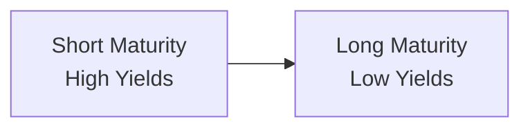
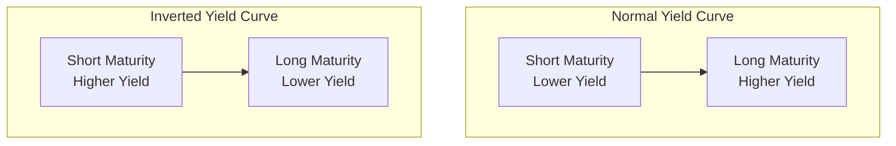

## Introduction
Picture this: You’re sipping coffee, flipping through market data, and you notice the yield on short-term Treasuries creeping above the yield on long-term Treasuries. You might pause and think: “Wait, that’s not the usual pattern.” Well, you’re not the only one who’s paid attention. An inverted yield curve, where short rates exceed long rates, has famously preceded numerous recessions. Analysts, central bankers, and everyday market watchers keep a close eye on inversions—particularly that 2-year vs. 10-year spread—because these flips in slope sometimes warn of a looming economic slowdown. 

But maybe you’re also curious: Why should a shape on the yield curve matter to the broader economic picture? How consistent is this indicator across cycles? And can an inverted curve ever give a “false positive,” scaring market participants for nothing? In this section, we’ll explore empirical evidence on yield curve inversions and how they have been used to predict economic downturns. You’ll see the “why,” the “how,” and the “wrinkles” (because simple relationships in macroeconomics rarely stay simple forever).

## Historical Patterns of Inversions and Recessions
Researchers and policymakers have long documented the connection between yield curve inversions and recessions. One of the most cited statistics is that an inverted curve has preceded every U.S. recession over the past several decades—often by about 6 to 18 months. While there’s no guarantee that the next inversion will bring about a downturn, the historical correlation is striking. 

Common practice is to compare the yield on a shorter-term Treasury (like a 2-year note) with that of a longer-term Treasury (like a 10-year note). If the 2-year yield is higher than 10-year yield, you have a negative spread—and that’s what we call an inversion. Analysts will also check the 3-month vs. 10-year spread. For many, the 3-month vs. 10-year is regarded even more rigorously by researchers at major central banks. 

Let’s briefly visualize the idea:


  
In the diagram above, the node on the left represents shorter maturities (e.g., 3 months, 2 years, etc.) with yields that exceed those for longer maturities (e.g., 10 years). This shape is the hallmark of an inverted yield curve.

## Why the Correlation?
So, why in the world would an inverted yield curve anticipate a recession? Economists often present two main explanations:

• Tight Monetary Policy. Central banks usually raise short-term rates to cool an overheating economy or keep inflation in check. As these rates climb, borrowing costs go up, corporate profits can get squeezed, and consumer spending might soften—frequently paving the way for an economic slowdown.

• Market Anticipation of Rate Cuts. Sometimes, it’s not just that the central bank is pushing short rates higher—markets may also be expecting that a recession is lurking and thus expect policymakers will slash rates in the future. That anticipation for easier monetary policy can drive down longer-term yields today, flattening or inverting the curve.

In many ways, the yield curve aggregates collective expectations of future economic growth, inflation, and monetary policy. When the near term looks riskier or more constrained, short-term yields can overshoot longer-dated ones. 

## Tools for Analysis
Examining a yield curve’s slope is straightforward, but it’s also helpful to look at how that slope changes over time. Even modest flattening (short rates rising or long rates dropping, or both) can be an early signal of shifting sentiment. 

Market participants frequently track:
• 2-year vs. 10-year Spread (2s10s): This is probably the most famous metric in financial media and conversation.  
• 3-month vs. 10-year Spread (3m10s): A more academically supported measure in Fed research and a darling among economists.  

A typical data workflow might involve the following steps:

1. Collect daily yields for the short- and long-term maturities from a reliable source.  
2. Calculate the spread as a simple difference:
   (Spread) = (Long-Term Yield) – (Short-Term Yield).
3. Plot these spreads over time to see where they go below zero.  
4. Compare the negative zones to NBER-designated recession dates or official definitions of recession in other countries.

Below is a small Python snippet for generating a yield curve spread from two arrays, just as an illustration:

```python
import pandas as pd

df['Spread_2s10s'] = df['Yield_10yr'] - df['Yield_2yr']

df['Inversion'] = df['Spread_2s10s'] < 0

inversion_periods = df[df['Inversion'] == True]
print(inversion_periods.head())
```

In a more advanced analysis, you might overlay recession timelines and see if this negative Spread_2s10s alignment shows up 6–18 months before each downturn.

## Deviations from Historical Norms
Not every yield curve inversion is followed by a recession. People sometimes talk about “false positives,” where the curve inverts briefly yet the economy merely slows without tipping into an actual recession. Equally interesting, occasionally you might see flattening or an inversion that emerges from anomalous global factors unrelated to domestic conditions—like aggressive bond-buying by foreign central banks or a global appetite for safe assets driving down long-end yields.

In the era of quantitative easing (QE) by central banks post-global-financial-crisis, the yield curve flattened for reasons beyond the standard “higher short rates” or “growth concerns.” Central banks’ large-scale asset purchases suppressed long yields, thereby flattening the curve. This definitely complicated the classic signal—and had many folks wondering if the yield curve had lost some of its predictive power.

In short, you can’t just rely on the historical correlation blindly. Monitoring the curve is a great practice, but it’s also crucial to check broader monetary policy stances, inflation trends, overall credit conditions, and global risk appetites.

## Central Bank Forward Guidance and Global Factors
In an increasingly interconnected world, forward guidance from major central banks—like the U.S. Federal Reserve, European Central Bank (ECB), Bank of Japan, and others—can significantly influence yields across major economies. Suppose the Fed signals it will keep rates “lower for longer.” In that case, short-term yields might remain subdued, flattening or even reversing typical slope behavior. Meanwhile, global quantitative easing or global risk-off modes can push yields even lower at the long end. 

Given these complexities, yield curve signals need to be interpreted in light of each cycle’s unique macro environment. Historical patterns are instructive but never guaranteed to repeat in precisely the same way.

## Key Terminology
Recession: A significant decline in economic activity, typically identified by two consecutive quarters of GDP contraction or another official measure (e.g., decisions by a recognized economic body).  

Leading Indicator: An economic metric (like yield curve slope) that tends to change before the broader economy, offering a preview of where things might be heading.  

Flattening: Describes a market environment in which the difference between short- and long-term yields narrows.

## Visual Comparison of Curve Shapes
To reinforce what normal vs. inverted yield curves can look like:



The left subgraph is considered normal: You expect a higher return for lending money over a longer period. On the right is the inverted shape that often draws so much attention.

## Best Practices for Analysis
• Stay attuned to monetary policy announcements and rate decisions.  
• Track more than one slope measure (2s10s and 3m10s) to get a broader picture.  
• Compare movements in the yield curve with key economic indicators like unemployment, consumer spending, and manufacturing indexes.  
• Remember that correlation doesn’t always mean causation.  
• Be wary of ignoring “false positives.” They may be uncommon but not impossible.

## Conclusion
Yield curve inversions can be one of those “uh-oh” moments for market watchers. Historically, they’ve proven to be a powerful predictor of recessions, often surfacing well before official economic indicators confirm a downturn. The exact reasons behind the relationship may vary—monetary tightening, market anticipations of slower growth, or global liquidity imbalances. Yet if there’s one takeaway, it’s that yield curve signals never exist in a vacuum; they must be interpreted within the context of broader macro and policy environments.

From an exam standpoint, remember that answering “why does the yield curve invert?” might require discussing both the short-rate policy angle and the market’s forward-looking insight. Also, recall that in the real world, macro data are messy—you want to gather multiple signals to confirm a potential shift in economic momentum.

## Final Exam Tips
• When you see an item set that references yield curves and recession risk, quickly recall how the slope is computed and the central bank’s influence on short rates vs. long rates.  
• Know that both 2s10s and 3m10s are used as indicators, but data-driven models from the Federal Reserve often focus on 3m10s.  
• If the exam question frames a scenario of central bank asset purchases or foreign demand for Treasuries, keep in mind how that might flatten the curve artificially.  
• Make sure you understand how to interpret a “false positive.” Exam questions might trick you by asking if a mild or short-lived inversion always means recession—remember, it does not.  
• Practicing short-run vs. long-run perspectives is important. Some yield curve states can persist longer than expected due to unique forces like heavy QE or credit events.  

## Test Your Knowledge: Yield Curve Inversions and Economic Signals



### Which spread is commonly monitored for yield curve inversion as a recession indicator?
- [ ] 1-year vs. 30-year
- [x] 2-year vs. 10-year
- [ ] 5-year vs. 30-year
- [ ] Overnight vs. 20-year

> **Explanation:** While many parts of the curve can invert, the 2s10s spread is one of the most widely followed measures for predicting economic downturns.

### Which of the following best explains why an inverted yield curve may predict a recession?
- [ ] Investors favor short-term bonds because they have lower volatility.
- [x] Elevated short-term rates indicate tight monetary policy and potentially slower future growth.
- [ ] Long-term rates increase faster than short-term rates due to inflation concerns.
- [ ] Bond market illiquidity inherently inverts the curve.

> **Explanation:** An inverted curve often reflects tight monetary policy or market anticipation of future rate cuts, both of which suggest a risk of slower growth.

### How might quantitative easing programs affect yield curve inversion signals?
- [ ] They make it impossible to observe inversions.
- [x] They may flatten the curve by suppressing long-term yields, potentially creating false signals.
- [ ] They increase short-term rates artificially, causing steepening.
- [ ] They rarely have an impact on bond yields.

> **Explanation:** QE typically involves large-scale purchases of longer-dated securities, lowering their yields and flattening the curve—even in the absence of recessionary fears.

### A “false positive” in the context of yield curve inversion means:
- [x] The curve briefly inverts, yet no recession follows.
- [ ] The short end remains at zero while the long end is strongly positive.
- [ ] The Federal Reserve uses an incorrect calculation of spreads.
- [ ] Long rates invert while short rates remain elevated.

> **Explanation:** A “false positive” refers to an inversion not followed by a recession. Historically, these events are relatively rare but can occur due to unusual market forces.

### If short-term rates surpass long-term rates, what is the immediate shape of the yield curve?
- [ ] Steep
- [x] Inverted
- [ ] Normal
- [x] Flattened (if referring to moderate inversion or near inversion)

> **Explanation:** When short rates exceed long rates, it’s known as an inverted yield curve. In some intermediate cases, the curve might appear nearly flat before fully inverting.

### Which yield spread is emphasized in more academic research, particularly by the Federal Reserve?
- [ ] 6-month vs. 5-year
- [ ] 1-year vs. 2-year
- [x] 3-month vs. 10-year
- [ ] 7-year vs. 20-year

> **Explanation:** The 3-month vs. 10-year spread is a favorite in many Fed research papers, demonstrating statistically significant recession-predictive power.

### Which of the following might be a reason an inverted yield curve does not lead to a recession?
- [x] Extensive global bond-buying programs artificially flatten yields.
- [ ] The economy is already in deep recession.
- [ ] Rising inflation expectations are extremely high.
- [ ] Risk premiums on corporate bonds have skyrocketed.

> **Explanation:** Large-scale asset purchases or similarly strong market-driven demand for long-term bonds can push long yields down, possibly triggering or exacerbating an inversion without an actual economic downturn.

### If analysts notice the yield spread turning negative, they typically expect a recession within:
- [ ] 1–2 weeks
- [ ] 2–3 months
- [ ] 2–3 years
- [x] 6–18 months

> **Explanation:** Historically, most recessions follow an inversion within 6 to 18 months, though timing can vary.

### Which describes a potential global factor influencing yield curve shape?
- [ ] Domestic retail investors only purchase short-term Treasuries.
- [x] Foreign central banks accumulate long-term Treasuries, driving down long-term yields.
- [ ] Local municipalities issue only floating-rate notes.
- [ ] Corporate bond issuance ceases entirely.

> **Explanation:** When foreign central banks and sovereign wealth funds purchase long-dated U.S. Treasuries, long-term yields drop, flattening or inverting the curve.

### True or false: An inverted yield curve 100% guarantees a recession will occur soon.
- [ ] True 
- [x] False

> **Explanation:** Although historically correlated, yield curve inversions do not provide an absolute guarantee. Instances of false positives and unprecedented central bank actions can distort signals.



## References
• Federal Reserve Board research on yield curve inversion as a recession predictor:  
  https://www.federalreserve.gov

• Estrella, A., & Mishkin, F. S. “Predicting U.S. Recessions: Financial Variables as Leading Indicators.”  

• For deeper historical data on yield curve analysis, see the official NBER (National Bureau of Economic Research) website:  
  https://www.nber.org

• Refer to earlier sections on yield curve construction in this volume (especially 7.1 Spot Rates, Par Rates, and Forward Rates) for complementary theoretical frameworks.
