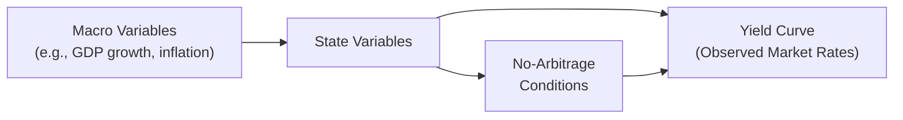

## Introduction

Have you ever sat around with a friend—maybe over coffee—and tried to explain why interest rates differ so much for short-term and long-term bonds? It’s a bit like trying to explain a magic trick you just saw: you kind of know what’s going on, but there are so many moving parts that it’s easy to get lost in details. One way to pin it all down is to use macro-finance models and no-arbitrage approaches—two distinct but complementary frameworks for making sense of the yield curve. This discussion dives into how these models work, the advantages they bring, the challenges they sometimes face, and how you might see them applied in your investment analysis or exam scenarios.

## Macro-Finance Models

Imagine you’re an economist who’s convinced that big-picture variables—like GDP growth, inflation expectations, or monetary policy stances—are the main drivers of the yield curve. Macro-finance models formalize that intuition. They link macroeconomic conditions to the shape and movement of the yield curve, typically by modeling the short-term interest rate as a function of macro variables and allowing those relationships to ripple through the entire term structure.

### Integrating Macroeconomic Variables

Most macro-finance models start by selecting a set of state variables. These might be observable macro indicators (such as inflation, unemployment, or output gap) or some latent (hidden) variables that summarize the current economic environment. Then they specify a dynamic process for how these variables evolve over time.

If the central bank is expected to hike interest rates to curb inflation, you’ll see that prediction show up in higher short-term rates in the model. Conversely, if the economy is expected to slow—well, the model might show falling short-term rates. Over the longer horizon, the yield curve shape adjusts under the expectation that policy would revert once inflation is under control or growth picks up again.

### Structural Interpretation

One of the most common questions is: “Does the slope of the yield curve predict recessions?” Maybe you’ve heard that an inverted yield curve signals trouble. Macro-finance models can attempt to address that by bridging the gap between policy, inflation, and growth outlooks. They give us a story about why the yield curve inverts (e.g., the market expects a future slowdown, forcing the central bank to cut rates) rather than just telling us that it does. This structural interpretation is super handy for folks who want a deeper understanding of the “why” behind the yield curve’s shape.

### Practical Example

Years ago, I was evaluating a government bond portfolio for a friend’s investment fund. We noticed that the yield curve had flattened significantly over a six-month period. Using a basic macro-finance model, we found that the flattening was mainly tied to expectations that the central bank would pivot from a rate-hiking cycle to a neutral stance because inflation data had come in below target. It sure helped to have a framework that explained how a surprise drop in inflation could cause changes in yields across multiple maturities.

## No-Arbitrage Approaches

Now, let’s shift gears to another valuable piece of the yield-curve puzzle: no-arbitrage models. These approaches step away from the macro narrative and focus on ensuring that all bonds and derivative instruments priced off the yield curve are consistent with one another. In other words, if you can replicate the payoff of a five-year bond by combining other instruments, you had better get the same price—otherwise you’d have a riskless profit opportunity (arbitrage), which shouldn’t exist in an efficient market.

### The No-Arbitrage Condition

No-arbitrage simply says that two identical sets of future cash flows must have the same present value. If you think, “Duh, that’s common sense,” you’re absolutely right. But building yield-curve models to enforce that condition thoroughly is trickier than you’d expect.

A typical no-arbitrage model might start with the current short rate—often assumed to be driven by certain risk factors or state variables—and then build out the entire term structure. The model calibrates itself to the observed market prices of various bonds so that it matches real-world data at time zero. Over time, the model evolves, ensuring it never offers a free lunch.

### Affine Yield Curve Models

Affine models are a popular approach in this space. They say the yield of a maturity T bond can be written as:


Y(t,T) = A(T) + B(T) \cdot X(t),


where X(t) is a vector of state variables (like the level, slope, or curvature factor), and A(T), B(T) are functions that determine how sensitive the yield is to each factor. One reason folks love affine models is that they’re mathematically tractable and straightforward to estimate using market data, while still imposing that no-arbitrage condition.

### Risk Premium and Model Calibration

In a no-arbitrage framework, you can’t just guess a yield out of thin air. You have to account for how investors get compensated for locking up money in longer-term bonds. That’s generally called the “term premium” or “risk premium.” The no-arbitrage part ensures that the model lines up with actual bond prices; the risk premium part ensures it realistically reflects how much investors demand for holding longer-term maturities.

## Combining Macro-Finance and No-Arbitrage Insights

If you’re wondering, “So which model is the real MVP?” the answer is often: both at once. Actually, many advanced models combine macroeconomic variables with no-arbitrage constraints—sometimes referred to as “macro-finance no-arbitrage models.” In these hybrids, the macro block (GDP, inflation, etc.) helps explain how the central bank sets short rates, while the no-arbitrage block ensures consistent prices for the entire yield curve. In practice, you might see a vector auto-regression (VAR) describing how macro variables evolve, then an affine term structure model that prices bonds based on those macro factors, making sure no free-lunch opportunities pop up.

This combination can solve a big headache: purely no-arbitrage models sometimes have trouble interpreting yield movements in a straightforward economic sense, whereas purely macro-finance models can mismatch actual bond prices if they don’t carefully embed the no-arbitrage principle. Merge them, and you (hopefully) get the best of both worlds—an economic story about yield curve movements that also lines up with market data.

Below is a simplified diagram that highlights how macro-finance and no-arbitrage insights connect to produce a more unified view of the term structure:

## Advantages

### Consistent Pricing

Because no-arbitrage models force consistent pricing across the term structure, you won’t accidentally find yourself constructing a synthetic derivative whose implied yield conflicts with the direct purchase of the bond. This is a big plus if you trade or manage portfolios of interest rate instruments, where a small mispricing can lead to large arbitrage opportunities (and big losses if you’re on the wrong side).

### Structural Interpretation

Macro-finance models let you interpret yield movements in terms of inflation expectations, monetary policy directions, or economic growth prospects. They’re excellent for storytelling. For instance, a rising slope might mean the market expects robust economic expansion (and possible future policy tightening). A flattening might signal that investors see trouble brewing—something that can be double-checked via the macro variables in the model.

## Challenges

### Complexity and Calibration

Believe it or not, these models can get unwieldy fast. Estimating parameters for a macro-finance, no-arbitrage framework can be quite data-intensive, and small changes in your assumptions—say, about how inflation responds to changes in GDP—might rewrite the entire shape of the yield curve in your model. This complexity can lead to calibration that is sensitive to outliers or short-term shocks.

### Macro Regime Shifts

Models built on a set of historical relationships are only as good as the stability of those relationships. If the monetary policy framework changes dramatically (imagine a shift from a fixed exchange rate to a floating rate, or from a zero-interest-rate policy regime to a more “normal” environment), your neatly calibrated model might no longer reflect the new reality. That can lead to real headaches—and big modeling errors—if not addressed promptly.

## Practical Application Scenario

Let’s say you’re advising a pension fund tracking a global fixed-income index. The fund wants to know if it should lengthen its average portfolio duration. A macro-finance model might suggest that the central bank could keep rates low for another year due to mild economic growth and subdued inflation. However, a no-arbitrage approach might show you that the current yield curve is already pricing in a decent chance of a future rate hike. Combining these bits of information helps you decide if there’s still a premium to be collected by taking on more interest rate risk, or if the potential gains have mostly been “arbitraged away” in the bond market.

## Key Takeaways

• Macro-finance models bridge economic fundamentals with yield-curve dynamics, making them great for interpreting big shifts in interest rates.  
• No-arbitrage models ensure that each portion of the yield curve is consistently priced relative to others, preventing riskless profit opportunities.  
• When combined, these approaches offer a holistic view—tying together the economic rationale of yield-curve changes with the price consistency demanded by real-world markets.

## Conclusion and Exam Tips

You might see exam questions asking you to identify how changes in inflation or GDP growth expectations could shift the short end of the yield curve, or how no-arbitrage constraints ensure consistency in bond pricing. A tricky twist might involve combining both perspectives—like, “If the yield curve flattens and your macro model sees no major policy changes, how might a no-arbitrage framework explain observed bond prices?”

A few tips:

• Always think about the economic “story” behind a yield curve move. Does it align with macro-finance logic?  
• Check for no-arbitrage logic: could a synthetic position be constructed that beats the direct purchase of a bond?  
• Watch out for regime shifts. A major policy overhaul can rewrite historical model relationships quickly.  
• Practice step-by-step reasoning in your answers: link macro expectations to interest rates, then confirm consistency with the no-arbitrage principle.  

Remember, exam graders love to see that you can apply concepts cohesively, not just recite definitions. Explaining, “The flattening yield curve is consistent with changed monetary policy expectations according to the macro-finance model; however, the no-arbitrage principle suggests bond prices already reflect that shift, reducing mispricing opportunities,” is a great way to show you grasp both the theory and the practice.

## References for Further Study

• Ang, A., & Piazzesi, M. (2003). “A No-Arbitrage Vector Auto-Regressive Framework for Term Structure.”  
• Duffie, D., & Kan, R. (1996). “A Yield-Factor Model of Interest Rates.”  
• Piazzesi, M. (2010). “Affine Term Structure Models.” In *Handbook of Financial Econometrics*.  
• Adrian, T., Crump, R.K., & Moench, E. (2013). “Pricing the Term Structure with Linear Regressions.” *Journal of Financial Economics*.  

They’re all excellent readings if you want to dive deeper into building or testing these cutting-edge term structure models. You can also check out advanced finance courses that teach how to set up state-space systems and calibrate them using historical macro data—very cool stuff for quant-minded folks.

---

## Test Your Knowledge: Macro-Finance and No-Arbitrage Yield Curve Quiz



### Which of the following best describes how macro-finance models approach the yield curve?

- [x] They integrate macro variables, such as GDP and inflation, into a structural framework for interest rates.
- [ ] They assume the yield curve is solely driven by random shocks to investor sentiment. 
- [ ] They assert that yield curves can only be explained by past yield curve shapes.
- [ ] They rely exclusively on central bank signals without considering market dynamics.

> **Explanation:** Macro-finance models explicitly incorporate macroeconomic indicators and policy expectations to interpret yield curve shifts.

### In a no-arbitrage term structure model, which condition must hold?

- [ ] Short-term interest rates must exceed long-term rates.
- [ ] Risk premiums must remain constant over time.
- [ ] The economy must be in equilibrium at all times.
- [x] Identical cash flow streams must have the same price.

> **Explanation:** No-arbitrage says that two identical sets of cash flows cannot be priced differently; otherwise, there would be a riskless profit.

### One advantage of macro-finance models over purely statistical models is:

- [x] They can provide economic reasoning behind yield curve changes.
- [ ] They eliminate all arbitrage opportunities in the market.
- [ ] They ignore the role of monetary policy in determining yields.
- [ ] They are simpler to calibrate than reduced-form models.

> **Explanation:** Macro-finance models offer clear, economics-based narratives for changes in interest rates (e.g., changes in inflation or GDP growth).

### Which statement is most accurate regarding the trade-offs of a macro-finance, no-arbitrage model?

- [ ] It avoids needing to estimate macroeconomic parameters.
- [x] It combines economic interpretation with consistent bond pricing but can be complex to calibrate.
- [ ] It assumes that economic regime shifts generally do not occur.
- [ ] It fails to integrate market data on bond prices.

> **Explanation:** The main benefit is merging macroeconomic interpretations with details of bond pricing. However, this added complexity can make calibration challenging.

### Why might a yield curve flatten according to a combined macro-finance and no-arbitrage framework?

- [ ] Short-term rates and long-term rates respond randomly to investor sentiment.
- [x] The macro-finance portion sees a potential slowdown, and the no-arbitrage portion ensures bond prices immediately reflect this expectation.
- [ ] Monetary policy is entirely irrelevant to bond prices.
- [ ] Investors are indifferent to future inflation risk.

> **Explanation:** Macro variables signal a slowdown (or rate cut expectations), and in a no-arbitrage model, prices immediately incorporate that information, causing the curve to flatten.

### In an affine no-arbitrage model, the term “affine” typically implies:

- [ ] The yield curve is modeled using only exponential functions.
- [x] Yields are linear functions of state variables.
- [ ] The short rate is fixed at the current policy rate.
- [ ] Investors have an infinite planning horizon.

> **Explanation:** “Affine” in term structure models typically means that bond yields are linear (affine) in the state variables, which makes the models more tractable.

### When a monetary authority unexpectedly raises rates due to inflation fears, a macro-finance model would likely show:

- [x] A rise in the short end of the yield curve reflecting new policy expectations.
- [ ] No change in yields because markets never react to policy news.
- [ ] A permanent inversion of the yield curve.
- [ ] An automatic deepening of the credit spread for corporate bonds.

> **Explanation:** If the central bank raises rates, macro-finance models capturing monetary policy expectations typically indicate an upward shift in shorter maturities.

### How do risk premiums factor into a no-arbitrage yield curve model?

- [ ] They are completely ignored because investors do not require compensation.
- [ ] They cause the model to fail the no-arbitrage condition.
- [x] They explain differences between observed yields and the average expected path of short rates.
- [ ] They remain constant across all maturities at all times.

> **Explanation:** Risk premiums account for the fact that investors generally demand extra yield for holding longer maturities or riskier instruments, aligning model-implied yields with observed data.

### A major challenge of macro-finance models is:

- [ ] Their inability to model macroeconomic variables.
- [ ] The guarantee that they will always outperform simpler statistical models.
- [ ] Their strict assumption that arbitrage opportunities are prevalent in bond markets.
- [x] Their vulnerability to shifting relationships and parameter instability.

> **Explanation:** One major issue with macro-finance models is that macro relationships may change (policy regimes, shifting inflation dynamics, etc.), leading to unstable parameter estimates.

### True or False: By combining macroeconomic drivers with no-arbitrage conditions, you can derive a yield curve that offers both economic explanations and consistent pricing.

- [x] True
- [ ] False

> **Explanation:** Hybrid models blend macro variables with no-arbitrage constraints, providing a comprehensive perspective on yield curve dynamics.


