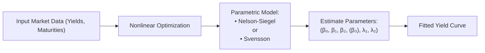

## Introduction and Context

Have you ever noticed how the yield curve can change shapes—sometimes steep, sometimes flat, and occasionally even humped in the middle? Well, somewhere along my early finance career, I asked a supervisor how to derive a consistent curve out of scattered bond quotes. He laughed and said, “Um, you know, that’s a classic question: we use the Nelson-Siegel model.” Soon after, I discovered an entire research stream dedicated to making sense of yields at different maturities. It’s a bit like orchestrating a symphony of short-term, medium-term, and long-term rates in a single model.

The Nelson-Siegel and Svensson models are two well-known parametric approaches to mapping out the term structure of interest rates—that means these approaches define a functional form with a handful of parameters. This can capture the level, slope, curvature, and sometimes an additional twist or hump for the yield curve. Central banks, large asset managers, and other financial institutions often rely on these models because they can provide a nice blend of simplicity and flexibility.

While these approaches are more commonly encountered in advanced yield curve modeling, they’re also relevant for test-taking, especially in scenario-based or multiple-choice questions that examine your ability to connect bond behavior and interest-rate expectations. In a portfolio management context, you might use them to measure interest rate risk and project forward rates for bond-pricing models, swaps, and more. Let’s explore what they are all about, how to fit them, and why they matter.

## Nelson-Siegel Model Foundations

Most parametric yield curve models aim to represent observed yields in the market with as few parameters as possible. The Nelson-Siegel model is the poster child for that approach. It uses three primary factors—level, slope, and curvature—to approximate the behavior of zero-coupon yields at various maturities.

### Conceptual Understanding of the Three Factors

• Level Factor (β₀):  
  Think of the level factor as the general height of the yield curve. If you recall times when rates across all maturities shift up or down together, that’s basically the level factor in action.

• Slope Factor (β₁):  
  The slope factor captures how the short end differs from the long end. If short-term yields are relatively low, and long-term yields are relatively high, the slope is positive (steep). If the curve inverts, the slope factor would become negative.

• Curvature Factor (β₂):  
  The curvature factor focuses on changes in the “middle” of the curve relative to the short and long ends. A positive β₂ can indicate a hump around intermediate maturities, while a negative β₂ can imply a U-shape or a different mid-curve phenomenon.

### The Nelson-Siegel Functional Form

Mathematically, the zero-coupon yield for maturity τ can be expressed as:

<em>Nelson-Siegel Yield Function</em>:


\text{Yield}(\tau) 
= \beta_{0} 
+ \beta_{1}\left(\frac{1 - e^{-\tau/\lambda}}{\tau/\lambda}\right)
+ \beta_{2}\left(\frac{1 - e^{-\tau/\lambda}}{\tau/\lambda} - e^{-\tau/\lambda}\right),


where:  
• \\(\tau\\) is the time to maturity (e.g., in years).  
• \\(\beta_{0}, \beta_{1}, \beta_{2}\\) represent the level, slope, and curvature parameters, respectively.  
• \\(\lambda\\) is a positive parameter that influences the exponential decay behavior of the slope and curvature terms, effectively determining where along the maturity structure the hump or inflection might occur.

You can think of the exponential functions as controlling how quickly certain factors fade from short rates to long rates. This model is “parsimonious,” meaning it uses relatively few parameters to describe the entire curve.

### Why the Nelson-Siegel Model Is Useful

• **Simplicity vs. Fit**: The model typically provides a decent fit to real-world bond yield data with few parameters, thus avoiding massive complexity.  
• **Economic Interpretation**: Level, slope, and curvature can often be tied directly to monetary policy expectations, macroeconomic conditions, and market sentiment.  
• **Stability Over Time**: When re-estimated frequently, the parameters have a tendency to be more stable than those from purely theoretical models.

## The Svensson Extension

While the original Nelson-Siegel model remains popular, some data sets—particularly those with dual humps or more complicated mid-range activities—aren’t always captured perfectly by just one curvature term. Enter the Svensson model (sometimes spelled “Svensson extension”), which adds an extra exponential term.

### Additional Parameter for a Second Hump

In essence, the Svensson version includes one extra factor, effectively doubling the number of decay parameters and adding another β. If we let \\(\beta_3\\) and \\(\lambda_2\\) define an additional curvature/hump term, the functional form can be written as:


\text{Yield}(\tau) 
= \beta_{0} 
+ \beta_{1} \left(\frac{1 - e^{-\tau/\lambda_{1}}}{\tau/\lambda_{1}}\right)
+ \beta_{2} \left(\frac{1 - e^{-\tau/\lambda_{1}}}{\tau/\lambda_{1}} - e^{-\tau/\lambda_{1}}\right)
+ \beta_{3} \left(\frac{1 - e^{-\tau/\lambda_{2}}}{\tau/\lambda_{2}} - e^{-\tau/\lambda_{2}}\right).


Here, \\(\lambda_1\\) and \\(\lambda_2\\) control the positioning of two separate hump components, plus an additional \\(\beta_3\\) that modifies the amplitude of the second hump.

### Pros and Cons of Svensson

• **Pros**:  
  – Better fit for complex yield curves—especially if the yield curve exhibits multiple humps or more pronounced mid-range dynamics.  
  – Often used by central banks (ex: the European Central Bank, Bank of Sweden) to produce smooth yield curves with flexible shapes.

• **Cons**:  
  – Potential for Overfitting: With more parameters, you risk capturing noise in the data rather than the true signal.  
  – Parameter Stability: Estimating the second hump can be more sensitive to initial guesses and data peculiarities.

In practice, you might start with the Nelson-Siegel model. If you consistently see that your fitted curve is missing a second hump or wave-like feature, you might consider the Svensson extension.

## Estimating the Model Parameters

### Data Inputs

You typically gather a set of zero-coupon yields or yield-to-maturity data for bonds across a broad range of maturities (e.g., 1 month, 3 months, 6 months, 1 year, 2 years, 5 years, 10 years, etc.). Some practitioners prefer to use swap rates beyond certain maturities because short-term bond yields might be heavily influenced by monetary policies.

### Minimizing Fitting Errors

Both models are usually estimated via least squares—nonlinear least squares, more precisely. The process tries to minimize the sum of squared differences between observed yields and model-implied yields.

Conceptually:  


\min_{\beta_0,\beta_1,\beta_2,\ldots} 
\sum_{\tau_i} \left( y_{\text{obs}}(\tau_i) - y_{\text{model}}(\tau_i) \right)^2,


where \\(y_{\text{obs}}(\tau_i)\\) is the observed yield for maturity \\(\tau_i\\) and \\(y_{\text{model}}(\tau_i)\\) is the yield from the chosen parametric function.

Because of the exponential terms, this is typically done numerically, relying on iterative optimization algorithms like the Levenberg-Marquardt method. If you’ve been around quantitative finance, you might have used specialized functions or libraries from Python or R to do this.

### Example Using Python

Below is a short conceptual snippet to illustrate how someone might implement a simple Nelson-Siegel fit in Python. This code is not exhaustive but highlights the main ideas:

```python
import numpy as np
from scipy.optimize import least_squares

def nelson_siegel(params, maturities):
    beta0, beta1, beta2, lambd = params
    yields = []
    for tau in maturities:
        if tau == 0:
            # avoid division by zero, hypothetical short rate
            yields.append(beta0 + beta1)
        else:
            term1 = (1 - np.exp(-tau/lambd)) / (tau/lambd)
            term2 = term1 - np.exp(-tau/lambd)
            y = beta0 + beta1*term1 + beta2*term2
            yields.append(y)
    return np.array(yields)

def objective(params, maturities, observed_yields):
    model_yields = nelson_siegel(params, maturities)
    return model_yields - observed_yields

maturities = np.array([0.25, 0.5, 1, 2, 5, 10])  # sample maturities
observed_yields = np.array([0.02, 0.025, 0.03, 0.035, 0.04, 0.045])  # sample yields

initial_guess = [0.02, -0.01, 0.01, 1.0]
result = least_squares(objective, initial_guess, args=(maturities, observed_yields))
print("Fitted parameters:", result.x)
```

In a real-world setting, you’d include constraints and robust checks to ensure that the solution is valid (e.g., \\(\lambda > 0\\)). The output typically yields the best estimates for \\(\beta_0\\), \\(\beta_1\\), \\(\beta_2\\), and \\(\lambda\\).

## Practical Significance in Portfolio Management

### Interest Rate Forecasting

Portfolio managers sometimes like to project how an existing yield curve might evolve under various macroeconomic scenarios. The Nelson-Siegel approach can facilitate factor-based forecasting: you can see how the level, slope, and curvature might shift given expansions or recessions.

For instance, in a rising-rate environment, you might see the level factor ramping up, while a booming economy might steepen the yield curve (changing the slope factor). The curvature factor might reflect mid-term expectations, such as a policy pivot. This is especially important for strategies that depend on capturing yield curve movements, like bond laddering, bullet strategies, or fixed-income derivative overlays.

### Risk Management

If your bond portfolio is particularly sensitive to the middle portion of the curve, you might be more exposed to shifts in the β₂ factor. Once you have these factors estimated, you can run scenario analyses to see how changes in the slope or curvature parameters affect your portfolio’s value. Actually, some large asset managers calibrate their scenario tests to historical changes in these three or four factors, effectively capturing the most common shapes yield curves typically take.

### Liability-Driven Investing (LDI)

From a liability-driven investing standpoint, especially for pension funds or insurance companies, a smooth yield curve estimate is crucial for discounting liabilities of various durations. The Nelson-Siegel or Svensson curve can provide an internally consistent set of discount rates for all relevant maturities. This helps to avoid mismatches that might arise if you piece together yield rates from multiple instruments without imposing consistency across the curve.

### Linking to Other Fixed-Income Models

Often, you might combine yield curve fitting with advanced topics such as forward curve generation, interest rate trees, or even scenario-based short-rate models. In practice, the parametric yield curve from Nelson-Siegel or Svensson can serve as an input into derivative pricing engines (for instance, calibrating a two-factor short-rate model to the observed yield curve shape).

## Diagram: How the Models Are Fitted

Below is a small diagram to visualize the sequence:



This basically sums up the process: you start with data, choose a parametric form, feed everything into an optimizer, and out comes a fitted yield curve that you can then analyze.

## Common Pitfalls and Best Practices

• **Overfitting with Svensson**: Adding more parameters can produce an excellent fit in-sample but lead to poor out-of-sample predictions.  
• **Data Selection**: Blending different data sets (e.g., government bonds, swaps, corporate bonds) might provide inconsistent views of default risk or liquidity. Make sure you’re using a consistent set of risk-free or near-risk-free yields.  
• **Initial Guesses**: Nonlinear optimization can get stuck in local minima if initial guesses are off. A good approach is to run the simpler Nelson-Siegel first, then feed those results as partial starting guesses for Svensson.  
• **Regular Recalibration**: Market conditions shift. Reestimate your model periodically to keep it aligned with the yield environment.  
• **Economic Interpretations**: Don’t just treat β's as black boxes. Usually, β₀ correlates with general risk-free rates, β₁ with policy stance/future growth, and β₂ with mid-range expectations or risk appetite.

## Examination Relevance

In a CFA exam context, you could see item sets or short-answer questions requiring you to:

• Identify which factor of the Nelson-Siegel model captures the slope vs. the curvature.  
• Interpret how a rising β₁ might indicate a steepening yield curve.  
• Compare the advantages and disadvantages of the Nelson-Siegel vs. the Svensson approach.  
• Outline the steps in calibrating these models or the math behind them.  
• Discuss potential reasons a central bank might adopt the Svensson extension for more flexible yield curve representation.  

Sometimes, exam questions also test your understanding with numeric examples, like giving you partial sets of yields at various maturities and asking which model best fits a “double-hump.” Or you might be given a scenario in which emotional or behavioral biases play a role in misreading slope and curvature changes—tying in broader portfolio management or behavioral finance concepts.  

## Real-World Case Studies

### Central Banks’ Adoption

Many central banks (e.g., the ECB) publish yield curve estimates using the Svensson method. If you check out their working papers, you’ll find detailed discussions on parameter stability and the importance of robust data sets. Indeed, these yield curves can guide monetary policy, provide reference rates for mortgage pricing, or measure policy transmission across the economy.

### Emerging Markets

In emerging markets, the yield curve can sometimes exhibit more extreme shapes due to liquidity constraints, currency risks, or policy interventions. The Nelson-Siegel approach can be adapted there, though the \\(\lambda\\) parameters might differ drastically—for instance, capturing faster short-run movements.

### Pension Funds

As a personal anecdote, I once worked with a pension fund that had an extremely long-duration liability portfolio. They used a Svensson model to get a refined view of the 30- to 50-year segment, because one curvature factor simply wasn’t enough to capture the complexity of super-long yields. They ended up calibrating the second hump parameter to ensure stable discount rates for ultra-long liabilities.

## Strategies for the Exam

• **Focus on Factor Interpretations**: You don’t need to memorize every piece of the formula. Instead, aim to understand how changes in β₀, β₁, and β₂ (and in Svensson, β₃) affect the curve’s shape.  
• **Be Comfortable with Exponential Terms**: Know that \\(\lambda\\) affects how quickly short-term or medium-term components decay.  
• **Know When to Apply Svensson**: Watch for question cues about a second hump or additional curvature. That’s your sign the question wants you to mention Svensson’s extension.  
• **Stay on Top of Pitfalls**: Overfitting, data selection, local minima, and so forth could appear in scenario-based questions.  
• **Relate to Portfolio Management**: The exam might link yield-curve modeling to interest-rate risk hedging, bond immunization, or factor analysis.

## Final Exam Tips

• If the question asks about “which factor is associated with short rates vs. long rates,” think slope vs. level.  
• Always highlight interpretive aspects: e.g., an increase in β₂ usually implies a more pronounced mid-curve hump.  
• If you see a question about calibrating a yield curve using advanced parametric models, remember the big difference: Nelson-Siegel has three main factors, while Svensson has an extra curvature factor.  
• Manage time by focusing on clarity rather than memorizing the entire formula. Show the steps you’d use in real life or from a conceptual standpoint.

## References

• Nelson, C.R. & Siegel, A.F. (1987). Parsimonious Modeling of Yield Curves. Journal of Business.  
• Svensson, L.E.O. (1994). Estimating and Interpreting Forward Interest Rates: Sweden 1992–1994. NBER Working Paper 4871.  
• European Central Bank Working Papers on Yield Curve Estimation: (https://www.ecb.europa.eu/pub/pdf/scpwps).  
• BIS Papers and Central Bank Publications on Yield Curves.  
• CFA Institute Level I & Level III Curriculum Readings on Fixed Income and Term Structure Models.

--------------------------------------------------------------------------------

## Test Your Knowledge: Nelson-Siegel and Svensson Yield Curve Models



### Which factor in the Nelson-Siegel model is most commonly associated with the general height of the yield curve?

- [x] β₀ (Level)
- [ ] β₁ (Slope)
- [ ] β₂ (Curvature)
- [ ] λ (Decay)

> **Explanation:** β₀ is the level parameter, capturing the yield curve’s overall height across all maturities.

### Compared to the standard Nelson-Siegel specification, the Svensson extension primarily adds:

- [ ] A new slope term for the very long end of the yield curve
- [ ] A correlation parameter to handle illiquid securities
- [x] An additional curvature term allowing a second hump
- [ ] An inflation factor to account for real yields

> **Explanation:** The Svensson extension introduces an extra (β₃, λ₂) term that lets the curve exhibit a second hump or additional curvature.

### In a typical least squares calibration of the Nelson-Siegel model, what is the principal goal?

- [x] Minimize the sum of squared yield errors across maturities
- [ ] Maximize trading volume in government bonds
- [ ] Eliminate negative yields from the fitted curve
- [ ] Ensure the model has the fewest parameters possible

> **Explanation:** Calibration typically targets minimizing squared deviations between model-implied yields and market-observed yields.

### Which of the following best describes a scenario that might motivate practitioners to move from Nelson-Siegel to Svensson?

- [x] The yield curve exhibits a double hump that the simpler model fails to capture
- [ ] Users seek fewer parameters for a more parsimonious fit
- [ ] The data set has only short-term maturities
- [ ] The slope parameter is no longer statistically significant

> **Explanation:** The Svensson extension shines when the yield curve has a second hump or more complex mid-range structure requiring additional flexibility.

### When we say “overfitting” to describe a potential drawback of the Svensson model, we mean:

- [x] The model fits noise instead of the underlying structure, reducing predictive accuracy
- [x] The model excludes relevant yield data for very long maturities
- [ ] The model’s second curvature factor always becomes zero
- [ ] The model captures real yields but misses nominal yields

> **Explanation:** Overfitting happens when increasing the number of parameters results in capturing random fluctuations in data, undermining the model’s future predictive power.

### Which parameter in the Nelson-Siegel model controls how quickly curvature factors decay as maturity increases?

- [x] λ
- [ ] β₀
- [ ] β₃
- [ ] ρ

> **Explanation:** λ is the decay parameter controlling how strongly or quickly the slope and curvature factors influence the short to medium-term segment.

### An investment firm wants to account for short, intermediate, and long maturities in its yield analysis, capturing non-trivial mid-curve shapes. What factor(s) from the Nelson-Siegel model largely helps capture that mid-curve “hump”?

- [x] β₂ (Curvature)
- [ ] β₀ (Level)
- [x] β₁ (Slope)  
- [ ] λ₂

> **Explanation:** β₂ specifically captures the curvature (or hump) of the curve, often in conjunction with the slope term to distinguish the mid-curve from short and long ends.

### In practice, which type of market data is generally used to calibrate Nelson-Siegel or Svensson models?

- [x] A range of zero-coupon yields or approximated zero-coupon yields across multiple maturities
- [ ] Equities listed on major stock exchanges
- [ ] Real estate market prices
- [ ] Only inflation-indexed bonds

> **Explanation:** Typically, practitioners use zero-coupon bond yields or bootstrapped yields from coupon bonds (or swaps) spanning short, intermediate, and long maturities.

### If β₀ falls significantly while β₁ rises, how might the yield curve’s shape change?

- [x] Overall yield levels drop, but the short end might increase relative to the long end
- [ ] Overall yield levels rise, but the curve becomes flat
- [ ] The short and the long ends flatten significantly
- [ ] There is no meaningful impact on the curve

> **Explanation:** A lower β₀ implies a lower general level of rates, while a positive β₁ going up suggests a steeper slope, raising yields more at the short end compared to the long end.

### True or False: Central banks prefer the Svensson model in all cases because it always outperforms simpler three-parameter models.

- [x] False
- [ ] True

> **Explanation:** While many central banks use Svensson, the statement “always outperforms” is too absolute. The Svensson model can be more flexible but can also risk overfitting if not used carefully.


