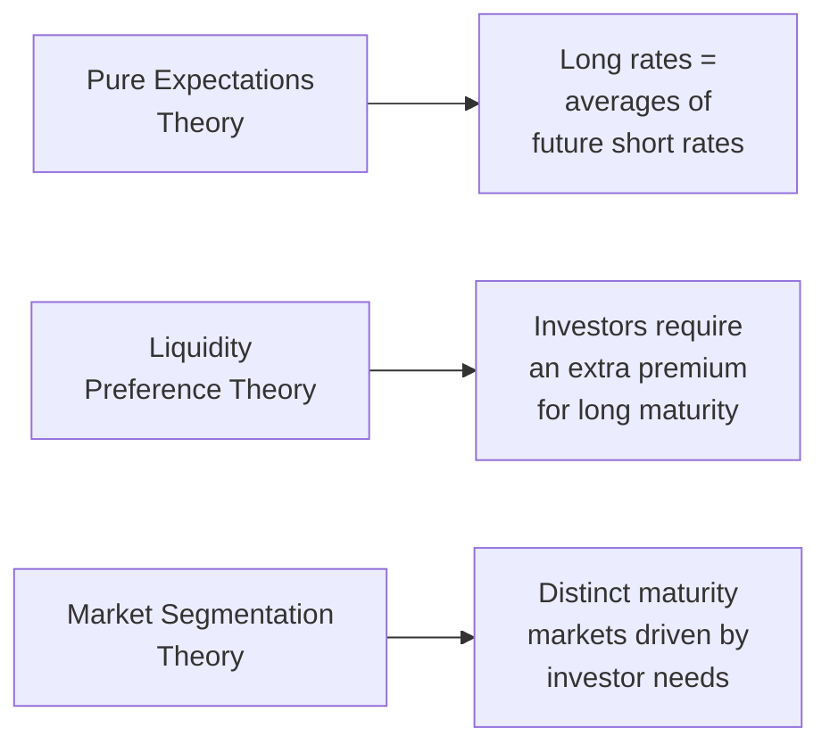

## Introduction

Yield curves are like a window into the market’s collective interest rate outlook. They offer insight into everything from short-term monetary policy expectations to long-run economic growth prospects. In other words, if you want to get a feel for where rates might be headed, analyzing the yield curve is a great place to start.

But where does its shape even come from? You’ll often hear that short-term interest rates are shooting upward or that the curve is flattening as a harbinger of a recession. Various theories attempt to answer the big question: Why do we see particular yield curve shapes at different times? In this section, we’ll explore the main yield curve theories:

• Pure (Unbiased) Expectations Theory  
• Liquidity Preference Theory  
• Market Segmentation (Preferred Habitat) Theory  

We’ll then see how they help us interpret yield curve shifts and what it all means for portfolio management. As we dig in, you might recall times you glanced at interest rates—maybe while researching mortgages or corporate bond issuance—and had trouble explaining why the 30-year yield was higher (or rarely, but sometimes lower!) than the 2-year yield. By the end of this discussion, you’ll feel much more confident interpreting and forecasting those changes.

## Pure (Unbiased) Expectations Theory

### Conceptual Overview

The Pure (Unbiased) Expectations Theory is the simplest explanation of the yield curve’s shape. It says, “Long-term interest rates are basically the geometric averages of expected short-term rates over the life of the longer bond.” Or in plainer language: the yield curve is a direct reflection of where investors believe short-term rates are headed. It doesn’t assume any extra premium for uncertainty or liquidity. If investors think short-term rates will be higher in the future, the yield curve slopes upward; if they expect falling short-term rates, then the curve could flatten or even invert.

### Mathematical Representation

Let’s say we have a two-year zero-coupon bond. According to the Pure Expectations Theory, its yield, denoted as R₂, should be the average of:

• Today’s one-year spot rate (R₁), and  
• Next year’s expected one-year rate (E[R₁,1year from now]).

In formal terms:


(1 + R_2)^2 = (1 + R_1) \times (1 + E[R_1,1\text{year from now}])


Which implies:


R_2 = \sqrt{(1 + R_1)(1 + E[R_1,1\text{year from now}])} - 1


In more general contexts with longer maturities, the yield on an n-year bond is the geometric mean of all the short-term rates the market expects over those n years.

### Strengths and Weaknesses

• Strength: It’s straightforward—no extra bells and whistles. If you want a direct read of future rate expectations, this model is your friend.  
• Weakness: In reality, most bondholders do demand something extra for tying up their money longer (especially if they’re uncertain about liquidity or inflation). Pure Expectations Theory doesn’t incorporate that premium.

You might think of it like planning a road trip. The total drive time is an average of each leg’s speed—but real life might require a detour or a coffee stop. That’s where the other theories come in.

## Liquidity Preference Theory

### Rationale for a Liquidity Premium

The Liquidity Preference Theory proposes that investors demand higher yields for longer maturities because a lot can happen over a prolonged period—economic cycles, changes in monetary policy, unexpected choppiness in markets, or, you know, a global pandemic. Holding a long-maturity bond means tying up your cash for years or decades, exposing you to significant interest rate risk.

Because of this, investors typically want an added “term premium” (also called a liquidity premium) on top of any rate expectations. Even if short-term rates were expected to remain the same, longer-dated bonds would often still yield more due to this extra cushion.

### Impact on the Yield Curve

When the liquidity premium is plugged into yield calculations, you naturally get an upward bias to the curve. This often explains why yield curves are normally upward sloping. Granted, you can still get flat or inverted curves if the market expects dramatic drops in future short-term rates. But in many stable economic environments, the liquidity premium is what keeps longer yields above shorter yields.

### Real-World Example

You can think of this from a personal standpoint: if you let a friend borrow $100 for a week, you might be content earning just a small interest rate. But if you lend that same friend $100 for 10 years—and have to watch inflation, default risks, and a million other life changes—chances are you’ll demand a bigger reward. That’s the liquidity premium at work.

## Market Segmentation (Preferred Habitat) Theory

### Core Idea

Market Segmentation Theory (often referred to in textbooks as Preferred Habitat Theory) suggests that different groups of investors have unique maturity preferences. There’s a group that only wants super-short maturities to avoid interest rate risk (like money market funds or certain banks). Then there’s pension funds or insurers that prefer long-dated bonds to match their long-term liabilities. Each group essentially stays in its own “corner” of the curve.

### Implications for Yield Curve Shape

Because of these distinct preferences (or habitats), yields at particular maturities are heavily influenced by localized supply and demand. If insurers desperately need 20- or 30-year maturities to match liabilities, they may drive up prices for those bonds, pushing yields lower at that segment. Meanwhile, if there’s high demand for short-term T-bills from corporate treasuries, that segment might see yields decline.

All these mini-markets collectively form the overall yield curve, which can sometimes lead to humps or other shapes not fully explained by a pure expectations or liquidity preference framework.

### Where We See This in Practice

Pension funds and life insurance companies often have regulatory or economic capital reasons to invest in certain durations. Corporations focusing on near-term liquidity might heavily prefer short-term bonds or commercial paper. Governments might issue more heavily at certain maturities depending on budget constraints. All of these actions create pockets of differing supply and demand along the curve.

## Comparative Overview of Main Theories

Below is a simple diagram comparing key aspects of these theories:

• **Pure Expectations Theory**: Ignores any risk premium; focuses purely on expected short rates.  
• **Liquidity Preference Theory**: Adds a premium to longer maturities for the added risk taken.  
• **Market Segmentation Theory**: Merges the idea of supply and demand in discrete maturity buckets.

## Interpretations of Curve Shifts

### Upward Slope

Normally, a positively sloped yield curve (i.e., longer maturities with higher yields) can mean the market expects higher future short-term rates (Pure Expectations view) or is demanding a premium for longer maturities (Liquidity Preference view). It also might reflect that investor demand is balanced more toward certain short segments, leaving the longer segments less in demand.

### Flattening or Inversion

A flattening curve can signal that the market expects short rates to level off or even decline in the future. When things invert—where short rates exceed long rates—some folks see that as a strong recession indicator. Indeed, historical data in multiple markets suggests yield curve inversions often precede downturns. But keep in mind, under the Market Segmentation Theory, an inverted curve might also arise because a group of investors or central banks is drastically shifting its demand in the short end (driving short-bond prices up and yields down) or pulling away from the long end (pushing yields higher)—and that localized effect can overshadow the usual flattening logic.

### Real-World Relevance

During certain economic cycles (say, in the run-up to a central bank tightening policy), the short end of the curve might rise sharply, while the long end barely budges because investors think the tightening will control inflation down the road. That can flatten or invert the curve. So, watch out for big supply/demand changes in certain maturity ranges, as that can also drastically shape the curve.

## Implications for Portfolio Management

### Forecasting and Hedging

Portfolio managers who anticipate rising short-term rates might allocate more to shorter maturities or reposition using interest rate futures. On the flip side, if they sense rates are plateauing, they might move out on the curve to capture slightly higher yields. Understanding yield curve theories helps managers hypothesize which forces could shift rates in each segment.

### Immunization and Liability Matching

Life insurers and pension funds often adopt strategies that lock in a certain yield to match expected liabilities. Market Segmentation Theory is quite relevant for these investors since they operate in a specific “habitat” driven by liability durations. Liquidity Preferences can guide them on how much extra yield they might demand if they shift to slightly different maturities.

### Pricing and Spreads

In prior chapters (see Chapter 6 on Bond Pricing and Valuation Basics), you learned about discounting bond cash flows by the appropriate spot rates. The yield curve essentially represents a set of spot rates across maturities. If you think the Liquidity Preference Theory is correct, you might expect the discount rate on a 20-year bond to incorporate a higher premium. Under Pure Expectations, your discount rate might be primarily about where short rates are expected to go.

## Glossary

• **Unbiased Expectations**: The hypothesis that forward rates purely reflect predicted future spot rates, absent any premiums.  
• **Term Premium (Liquidity Premium)**: The additional yield that investors demand for assuming the risks of a longer maturity.  
• **Preferred Habitat**: Zones of the yield curve where investors prefer to operate because of their risk tolerance, regulation, or liability structure.  
• **Convexity Bias**: The phenomenon where longer-term bonds might gain relative value under volatile rate expectations, because of the shape of the price-yield relationship.

## Best Practices, Common Pitfalls, and Strategies

• **Best Practice**: Look at forward rate agreements and see how they compare to your internal rate forecasts. If they differ substantially, examine whether liquidity or segmentation factors might explain the discrepancy.  
• **Common Pitfall**: Blindly applying one theory to all markets. Real-world yield curves can be driven by a combination of expectations, liquidity premiums, and segmentation quirks!  
• **Strategy**: Use scenario analysis to stress test multiple yield curve shapes (steep, flat, inverted). Incorporate your assumptions about term premiums and supply/demand pockets.

## Personal Anecdotes and Observations

I vividly remember reviewing yield curve data when central banks started implementing quantitative easing. The usual upward slope you learn about in textbooks got all out of whack—long yields plummeted as central banks soaked up the supply, while short yields were pinned near zero. It was a perfect example of Market Segmentation in action because, effectively, the central bank became a massive buyer (demand) in a specific zone of the curve. The result? Even if you believed short-term rates would stay at 0% for years, you still needed some context to explain why 10-year yields got as low as they did during those times.

## Further Reading

If you’d like to dive deeper, consider these references:

• Vayanos, D. & Vila, J.-L. (2009). “A Preferred-Habitat Model of the Term Structure of Interest Rates.” NBER.  
• Mishkin, F.S. “The Economics of Money, Banking, and Financial Markets.”  
• Chapter 7 of your official CFA curriculum (especially earlier sections on constructing yield curves).  
• Academic research on term premium decomposition (this can get quite quantitative but is super enlightening).

## Final Exam Tips

1. **Contextualize Your Answers**: On Level III exams, especially in essay or item set formats, you’ll often see scenario-based questions on yield curve shifts. Explain which theory (or combination of theories) best fits the scenario.  
2. **Factor in Risk Premiums**: If a question describes uncertainty or liquidity constraints, you’ll likely need to reference the Liquidity Preference Theory.  
3. **Don’t Dismiss Segmentation**: If the prompt mentions unique demands from pension funds or central banks, bring in Market Segmentation.  
4. **Quantify Where Possible**: If you’re given forward rates, you can show a small formula connecting spot and forward rates, referencing the Pure Expectations Theory.  
5. **Be Aware of Real-World Curves**: Historical examples of inversions or near-inversions often appear. Know what each shape typically implies in practice.  
6. **Time Management**: For constructed-response questions, be concise. The exam graders want clarity: lay out your theory, show your rationale, and provide a conclusion.

## References

• Vayanos, D. & Vila, J.-L. (2009). “A Preferred-Habitat Model of the Term Structure of Interest Rates.” National Bureau of Economic Research.  
• Mishkin, F. S. “The Economics of Money, Banking, and Financial Markets.”  
• CFA Institute. “CFA Program Curriculum.”  

## Test Your Knowledge: Yield Curve Theories and Applications



### Under the Pure Expectations Theory, a positively sloped yield curve would primarily indicate:

- [ ] Investors perceive high inflation risk and demand compensatory yield.
- [ ] Significant regulatory constraints on long-term bond issuance.
- [x] Market expects future short-term interest rates to rise.
- [ ] Central bank interventions across all maturities.

> **Explanation:** Under Pure Expectations Theory, a positively sloped curve suggests the market believes short-term rates will increase in the future.

---

### Which statement is most consistent with the Liquidity Preference Theory?

- [x] Investors require a premium for committing funds to longer maturities due to higher uncertainty.
- [ ] Bond prices reflect purely the average of expected future short-term rates.
- [ ] The yield curve shape is determined solely by central bank policy guidance.
- [ ] Different investor clienteles confine themselves to specific segments of the yield curve.

> **Explanation:** Liquidity Preference Theory centers on the additional premium investors demand for longer maturities due to factors like interest rate risk and reduced liquidity.

---

### Market Segmentation Theory suggests that:

- [ ] Investors have uniform preferences across all maturities, keeping yields equal across the curve.
- [ ] The yield curve only slopes upward when short rates are expected to rise.
- [ ] There is no impact from unique demand segments, leading to uniform supply/demand.
- [x] Different types of investors focus on different maturities, affecting localized supply/demand dynamics.

> **Explanation:** Market Segmentation posits that demand and supply in each maturity segment are relatively independent, driven by distinct investor needs.

---

### Which of the following best explains an inverted yield curve when factoring in Pure Expectations Theory?

- [x] Current short-term rates are high, but the market expects them to fall significantly in later periods.
- [ ] Banks decide to stop lending in the short-term market.
- [ ] Heightened corporate issuance at longer maturities artificially lowers long-term yields.
- [ ] No investors demand long-term paper due to panic.

> **Explanation:** Under Pure Expectations Theory, an inverted curve indicates the market foresees short-term rates declining in the future.

---

### Suppose a pension fund modifies its investment policy to increasingly seek 30-year government bonds to better match its liabilities. Which theory best captures the direct impact on long-end yields?

- [ ] Liquidity Preference Theory
- [ ] Pure Expectations Theory
- [x] Market Segmentation (Preferred Habitat) Theory
- [ ] Real Business Cycle Theory

> **Explanation:** Preferred Habitat or Market Segmentation Theory states that unique investors with specific maturity needs can influence the yield in that part of the curve.

---

### Under Liquidity Preference Theory, if the term premium expands at longer maturities while expectations for future short-term rates remain steady, the yield curve likely:

- [x] Becomes steeper at the long end.
- [ ] Flattens or inverts.
- [ ] Remains unchanged because only expectations matter.
- [ ] Becomes perfectly flat.

> **Explanation:** In Liquidity Preference Theory, higher term premiums increase long-end yields, making the curve steeper if short-rate expectations are stable.

---

### A key limitation of the Pure Expectations Theory is:

- [ ] It consistently predicts inverted curves.
- [x] It ignores any compensation for risk or uncertainty at longer maturities.
- [ ] It places too much emphasis on investor segmentation.
- [ ] It cannot incorporate forward rates.

> **Explanation:** Pure Expectations Theory does not consider risk premiums, leading to potential underestimation of long-term yields.

---

### In Market Segmentation Theory, a “hump” in the yield curve could happen if:

- [x] There is heavy investor demand for bonds at an intermediate tenor, pushing yields down in that region.
- [ ] All investors only trade in the short-term sector.
- [ ] The central bank only sets short-term rates.
- [ ] There is a liquidity premium for longer bonds.

> **Explanation:** Segment-specific demand or supply can create unique shapes like humps or dips in the curve, reflecting localized market pressures.

---

### Which factor is most relevant to Liquidity Preference Theory?

- [ ] Future short-rate forecasts alone.
- [ ] Central bank independence.
- [x] Compensation for holding longer maturities due to increased interest rate risk.
- [ ] The narrow focus of each investor on specific maturities.

> **Explanation:** Liquidity Preference Theory is driven by the notion of extra return for the extra risk and reduced liquidity associated with longer maturities.

---

### True or False: Under the Market Segmentation Theory, a single investor’s maturity preference has no effect on bond yields.

- [ ] True
- [x] False

> **Explanation:** Because Market Segmentation relies on supply and demand within specific maturity “segments,” an investor’s preference can significantly influence yields in that segment depending on size and scale.


