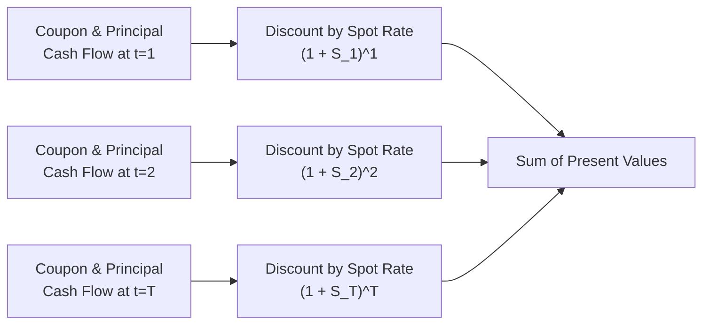

## Introduction
So, I still remember the first time I dove deeply into the subject of term structure applications. I was sitting at a local café (slightly stressed, I’ll admit) wondering how on earth we could take all these different spot rates on the yield curve, piece them together, and come up with a single value for a bond. It turns out, once you get the hang of it, applying the term structure to valuation problems looks a lot more approachable, and (believe me) it’s actually quite satisfying when all the math lines up nicely.

Broadly, the term structure of interest rates tells us how short-term rates differ from longer-term rates at any moment. We can use these different rates—whether spot rates, forward rates, or implied zero-coupon yields—to value anything from a simple coupon bond to complex derivatives or corporate financing decisions. Let’s walk through the major applications you should know: bond valuation, forward rate agreements (FRAs), swaps, risk management, and corporate finance.

## Using the Term Structure for Bond Valuation
One of the most direct applications of the term structure is bond pricing. Instead of applying one uniform yield to discount all future cash flows, we apply specific spot rates to each cash flow based on when it occurs. This “arbitrage-free” approach ensures consistency with the market’s current view on interest rates for different maturities.

### Arbitrage-Free Valuation
Arbitrage-free valuation basically says: “No free lunches.” If a bond’s coupon and principal payments are no different in timing or risk than a portfolio of zero-coupon bonds, they should be priced equivalently. If not, sophisticated traders would spot the mismatch and lock in a riskless profit, which quickly disappears as competing trades bring prices back in line.

In formula form, if a bond has coupon payments C at times t=1, 2, …, T, and a final maturity (face value) M at t=T, its price P is:


P = \sum_{t=1}^{T} \frac{C \cdot \mathbf{1}_{\{t < T\}} + (C + M) \cdot \mathbf{1}_{\{t = T\}}}{(1 + S_t)^t},


where \\( S_t \\) is the spot rate for maturity \\( t \\). Equivalently, some might prefer writing it as separate coupon and principal cash flows, each discounted using the appropriate spot rate.

### Bond Valuation Process (Illustrated)

As shown, each cash flow is discounted by its corresponding spot rate. Summing them all up yields the bond’s fair price.

## Forward Rate Agreements (FRAs)
Forward rate agreements are basically contracts that lock in an interest rate today for borrowing or lending over a future period. The market typically quotes FRAs based on forward rates derived from the term structure. Practitioners extract forward rates from the zero-coupon or spot yield curve.

• Example: Suppose you’re a corporate treasurer who wants to lock in the 3-month interest rate, starting six months from now. You might enter into a 6×9 FRA (meaning the FRA starts in six months and covers three months of borrowing/lending). By extracting forward rates for the 6-month and 9-month maturities off the yield curve, you can figure out the FRA’s implied rate—and compare it to your alternatives.

• Pricing: FRA pricing relies on discounting the difference between the agreed FRA rate and the actual market rate at the future settlement date. Because everything is anchored to zero-coupon rates, it ties neatly back to the yield curve.

## Valuing Swaps (Fixed vs. Floating)
An interest rate swap is often summarized as “exchanging fixed-rate interest payments for floating-rate payments” (or vice versa). But under the hood, a swap can be viewed as the difference between two bond positions: a fixed-rate bond (the fixed leg) and a floating-rate note (the floating leg).

• The Fixed Leg: Discount all scheduled fixed payments using the zero-coupon rates up to each payment date. The notional is generally returned at maturity if structured that way, though in a plain vanilla swap, the notional isn’t actually exchanged—just the difference in interest.

• The Floating Leg: Typically set to something like 3-month LIBOR or SOFR plus a spread. Since the floating-rate payment resets in line with short-term rates, the floating-leg value (right after a reset date) generally equals the notional amount (assuming no default risk or other complexities). Between reset dates, it accrues according to the short-term rate. When you discount those expected floating payments back to present value using the same short-term rates, you end up with the fair value of the floating leg.

When the swap is initiated at market terms, its initial value should be zero—meaning the present value of the fixed leg equals the present value of the floating leg. If one side becomes more valuable over time (say, rates move significantly), that side has a positive mark-to-market value, while the other side has a negative.

## Risk Management
### Duration Matching
Ever been worried about interest rate risk messing up your portfolio returns? One classic fix is duration matching. You can match your asset portfolio’s duration to the duration of your liabilities. This helps ensure that interest rate shifts have a relatively neutral effect on your surplus or net worth.

• Example: A pension fund knows it must pay out a big chunk in 10 years. If the fund invests in a portfolio that has a duration near 10, changes in rates hopefully won’t trigger huge mismatches in funding. The yield curve helps refine that approach, because you can measure *key rate durations* at various points to control for shape changes (twists, butterfly shifts, etc.), not just parallel shifts.

### Scenario Analysis
No yield curve forecast is always right, so we often stress test. We might assume:
• Parallel shift upward/downward by 100 basis points.  
• Twisted curve (short-end up, long-end down, or vice versa).  
• Butterfly shift (the middle of the curve changes more than the short or long ends).

Then we re-value the portfolio under each hypothetical scenario. This helps highlight vulnerabilities—maybe your portfolio is super sensitive to short-end twists that you never saw coming. It’s definitely a moment of self-reflection when you see how a “little shift here” (in the short end) might produce an outsize effect on your bond positions across the curve.

## Corporate Finance Applications: WACC and Beyond
Yes, bond geeks aren’t the only ones who use the term structure. Corporate finance folks often incorporate it to refine discount rates for capital budgeting decisions. Instead of using a single required rate of return for all future periods in a project’s life, you can break it up. By matching each future cash flow with a corresponding discount factor reflecting the yield for that horizon, you get a more precise Weighted Average Cost of Capital (WACC). 

• Real example: If you’re building a new factory expected to generate positive cash flows over 15 years, you might prefer discounting each year’s cash flow using the 1-year, 2-year, 3-year spot rates, and so on, rather than slapping on, say, 8% for every year. This approach accounts for expected upward or downward sloping yield curves (and sometimes flat or even inverted yield curves).

## Glossary Highlights
• Arbitrage-Free Valuation: The concept that the price of a security must align with the prices of equivalent combinations of simpler securities, or else you’d have a riskless profit opportunity (which market forces quickly eliminate).

• Discount Factor: The present value of receiving one unit of currency at a future point in time. In a multi-period setting, discount factors come from zero-coupon bond yields for each maturity.

• Forward Curve: A set of forward rates for various maturities, all extracted from spot rates. The forward rate from 6 to 9 months, for instance, indicates the implied 3-month interest rate, starting 6 months from now.

• Scenario Analysis: A technique where you purposely shift or twist the yield curve in different ways (parallel shift, butterfly, tilt) to see how changes in rates across maturities impact the value of a security or portfolio.

## Potential Pitfalls and Best Practices
• Over-simplifying by ignoring the term structure can lead to big mispricings, especially when a yield curve is steep or changes slope frequently.  
• Relying on historical average yields might produce inaccurate bond valuations if short-term rates and long-term rates move in unexpected ways.  
• For FRAs or swaps, ignoring day-count conventions and exact reset dates can lead to subtle but important pricing errors.

Focus on robust scenario analysis. I think I once priced a swap ignoring the exact day count for the floating leg—yikes, talk about confusion when the final settlement didn’t line up with my theoretical model. Double-checking these practical details is a must.

## Further Readings and References
• Fabozzi, F. J., & Mann, S. V. Handbook of Fixed-Income Securities, McGraw-Hill.  
• CFA Institute, Level I Curriculum (Term Structure & Present Value Topics).  
• Sundaresan, S. Fixed Income Market and Their Derivatives, 3rd ed., Academic Press.

Anyway, you can find more rigorous math details in those references, plus a deeper dive into modeling yield curves in Chapter 7.2 of this text.

----------------------------

## Test Your Knowledge: Term Structure Valuation Essentials



### When applying the term structure to bond valuation, which best describes the main idea behind “arbitrage-free” valuation? 
- [ ] Using the average yield across maturities to discount all cash flows 
- [x] Ensuring the price of a security matches the combined value of equivalent zero-coupon bonds 
- [ ] Discounting the first coupon at the short end of the curve and ignoring later coupons 
- [ ] Using a single forward rate to price all maturities 

> **Explanation:** Arbitrage-free valuation emphasizes matching each bond cash flow with its corresponding spot rate so that no riskless profit can be obtained compared with a portfolio of zero-coupon bonds replicating the same cash flows.

### In bond valuation with a term structure approach, each coupon payment is discounted by: 
- [x] The spot rate corresponding to that specific payment’s time to maturity 
- [ ] The nominal yield of the benchmark government bond 
- [ ] The same yield for all payments 
- [ ] The required yield on corporate debt only 

> **Explanation:** Each specific payment is discounted by the appropriate spot rate for that maturity, ensuring an arbitrage-free price.

### If you anticipate interest rates to rise sharply after six months, which type of derivative might help lock in a future borrowing cost now? 
- [ ] Interest Rate Swap 
- [x] Forward Rate Agreement (FRA) 
- [ ] Currency Future 
- [ ] Mandatory Convertible Bond 

> **Explanation:** An FRA allows you to lock in an interest rate for a future borrowing/lending period, protecting you from anticipated rises in rates.

### Which of the following is a characteristic of an interest rate swap’s floating leg, right after a rate reset? 
- [ ] It always has a negative value to the receiver 
- [ ] It depends on the forward rate set at inception 
- [x] Its value is approximately equal to the notional principal 
- [ ] It must be discounted at the long-term spot rate 

> **Explanation:** Post-reset, the floating leg typically resets to a market rate, making the present value of its future payments close to the notional principal (assuming negligible credit risk).

### Scenario analysis in term-structure-based risk management primarily involves:
- [x] Testing the portfolio against different yield curve shifts like parallel, twist, or butterfly 
- [ ] Avoiding all speculation on yield curve changes 
- [x] Checking how short-end and long-end rates might move differently 
- [ ] Keeping the portfolio fixed and ignoring volatility 

> **Explanation:** Scenario analysis helps see how various curve movements, including parallel shifts and more complex twists, impact bond valuations.

### Under an arbitrage-free framework, the present value of the fixed leg of a standard interest rate swap:
- [x] Is found by discounting each fixed payment using the corresponding zero-coupon rates 
- [ ] Equals the nominal interest payment for the entire swap 
- [ ] Remains constant, irrespective of yield curve movements 
- [ ] Must exceed the value of the floating leg at inception 

> **Explanation:** The standard approach is to discount all expected fixed payments back using market spot rates for each payment date to find the leg’s value.

### Why might a corporate treasurer consider the term structure when computing WACC?
- [x] Different future cash flows correspond to different maturities on the yield curve 
- [ ] To ensure all cash flows are discounted at an arbitrary average rate 
- [x] To reflect potential time-varying financing costs 
- [ ] Because regulators require flat discount rates 

> **Explanation:** A company can refine capital budgeting decisions by matching each future cash flow with the spot rate for its time horizon, yielding a more accurate representation of future capital costs.

### Which method describes a practical application of duration matching?
- [x] Matching a portfolio’s duration to the duration of liabilities 
- [ ] Purchasing only short-term bonds and ignoring liabilities 
- [ ] Setting the portfolio’s coupon payments on random intervals 
- [ ] Using a single forward rate to price long-dated liabilities 

> **Explanation:** Duration matching aligns the weighted average time to receipt of the portfolio’s cash flows with the weighted average time of liability outflows, mitigating interest rate risk.

### If a bond is priced under a steep yield curve scenario and all else is held constant, higher discount factors for longer maturities will:
- [x] Lower the present value of far-dated coupon and principal payments 
- [ ] Raise the present value of near-term coupons 
- [ ] Have no effect on bond price 
- [ ] Increase the bond’s duration automatically 

> **Explanation:** Under a steep curve, future discount factors are higher. Thus, the present value of payments down the line shrinks, lowering the bond’s overall price.

### True or False: In an interest rate swap, the floating leg often pays a fixed amount each period.
- [ ] True
- [x] False

> **Explanation:** The floating leg typically resets periodically based on a reference rate (e.g., 3-month LIBOR or SOFR). The payment changes as the reference rate changes, so it isn’t fixed.


