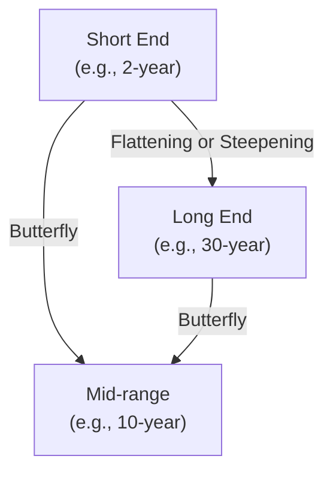

## Introduction
I remember the first time I looked at a yield curve chart—honestly, I was so puzzled by the seemingly simple lines. But yield curves can actually tell us a lot about what’s going on in the economy right now, plus what folks think about the future. In bond markets, the term structure of interest rates often serves as a leading indicator for policymakers, investors, and corporate treasuries alike. 

A yield curve, in essence, plots yields (or interest rates) of bonds of the same credit quality but different maturities. When the yield curve shifts, or changes shape, it’s often signaling how the market is digesting new information about inflation, growth, and monetary policy. In this section, we’ll talk about three big shapes (normal, flat, and inverted) and some classic movements (steepening, flattening, butterfly). Understanding these can help us navigate big decisions in portfolio management—like building a position to benefit from an expected policy shift or hedging out risk from potential economic slowdowns. 

## Common Yield Curve Shapes
Yield curves can come in many shapes, but several fundamental ones appear again and again. Let’s look at these typical shapes and the theories behind them.

### Normal (Upward Sloping)
When short-term instruments have lower yields than longer-term ones, we say the yield curve is “normal.” This shape typically implies that investors require higher return for locking up cash for a longer period. In times of stable growth and moderate inflation, a normal yield curve is pretty standard—it’s the baseline shape you’ll see when markets expect no major disruptions.

### Flat
A flat yield curve occurs when short-term rates and long-term rates converge. The typical difference (or slope) between yields for, say, 2-year bonds and 10-year bonds becomes negligible. Many portfolio managers interpret this as a sign of uncertainty or transition. It can also precede a shift in monetary policy. For instance, a central bank might be raising short-term rates while longer-term rates remain anchored due to subdued expectations for long-run growth or inflation.

### Inverted
An inverted curve forms when short-term yields exceed those at the longer end. This is often a big headliner in financial news, as it’s historically correlated with economic recessions or significant slowdowns—though correlation doesn’t guarantee causation. In practice, an inverted yield curve suggests that investors foresee lower growth or interest rates in the future. Traders may price in upcoming rate cuts, expecting policy accommodation to combat economic weakness.

### Humped Curve
Occasionally, you might see a “humped” yield curve, where intermediate maturities (say, five- to seven-year bonds) yield more than both shorter and longer maturities. This shape can appear around times of transition, especially when markets are expecting short-term rate changes but remain uncertain about very long-term economic and inflation trends.

## Key Yield Curve Movements
Beyond shapes, yield curves shift in ways that can materially affect bond portfolio values. It’s not just about whether yields go up or down; it’s also about which part of the curve changes the most.

### Parallel Shift
A parallel shift is exactly what it sounds like: the entire yield curve moves up or down by roughly the same amount across all maturities. If the Federal Reserve (or another central bank) announces a major policy change that markets interpret as a uniform shift in the interest rate environment, you might see the entire curve jump or drop in tandem.

From a portfolio-management perspective, a parallel shift can be easier to hedge, because you don’t have to worry as much about the uneven movements across maturities. You just have to measure the overall duration of the portfolio and adjust accordingly (e.g., by using interest rate futures, swaps, or other derivative instruments).

### Steepening and Flattening
Steepening and flattening refer to changes in the slope of the yield curve:

• Steepening: The spread between short-term and long-term yields widens. This might happen if short-term rates remain anchored or drop (such as during a monetary easing) while long-term yields rise on expectations of higher future growth or inflation.  
• Flattening: The spread narrows. We often see a flattening curve if short-term rates are rising (monetary tightening) faster than long-term rates—or if long-term rates are falling because of flight-to-quality demand in uncertain times.

Traders might refer to a “bull steepener” or “bear flattener” to describe how yields are moving. A “bull steepener” is when yields are dropping overall, but short-term yields drop more than long-term yields, thus steepening the curve in a rallying bond market. A “bear flattener” is when yields rise generally, but short-term rates increase faster than long-term ones, flattening the curve while the overall yield level is going up.

### Butterfly Shifts
A butterfly shift refers to an asymmetric movement in different parts of the curve—often the middle (intermediate maturities) shifts differently than the short and long ends. Picture the 2-year and 30-year yields going one direction while the 10-year yield shifts in another. This is sometimes called a “positive butterfly” if the yield curve’s wings (short and long ends) rise relative to the belly (middle maturities), and a “negative butterfly” if the belly rises relative to the wings.

From a portfolio standpoint, butterfly trades aim to achieve gains by simultaneously being long in two parts of the curve and short in the middle portion (or vice versa), exploiting mispricings when the market adjusts.

Below is a conceptual Mermaid diagram illustrating yield curve movements:

While not a perfect Cartesian plot, this graphic simply highlights how different segments of the curve (short, mid, long) can move relative to one another.

## Economic Indicators and Market Implications
In many ways, yield curve shapes and movements reflect the market’s collective view on economic indicators:

• A steepening curve might signal optimism about growth or an expectation of rising inflation. It can happen if the central bank is cutting short-term rates to stimulate the economy or markets anticipate robust future expansion that lifts long-term yields.  
• A flattening curve, on the other hand, might signal an approach of a tightening cycle, where short-term rates are climbing. Alternatively, it might reveal bond investors purchasing longer maturities as a safe haven, suppressing long-term yields and narrowing the yield gap.  
• An inverted curve commonly appears when investors expect a slowdown or a recession—though it’s not an ironclad rule. Historically, an inverted curve often preceded recessions in the U.S., but the timing can vary widely.

When analyzing how interest rates across maturities alter portfolio valuations, managers often track real-time economic data, central bank communications, inflation expectations, and risk sentiment (e.g., foreign exchange risk or changes in the equity risk premium). A yield curve that rapidly flattens might also indicate rising caution in credit markets, pushing hedging costs higher.

## Trading and Portfolio Management Strategies
Portfolio managers often use yield-curve-based strategies to align with or hedge against anticipated interest rate movements. Let’s consider some standard plays:

### Flattener
A flattener strategy profits if the yield curve slope decreases. Managers might short longer-dated bonds and go long shorter-dated bonds (or use derivatives), anticipating that long-term yields will converge downward toward short-term yields—or that short-term yields will rise more quickly than long-term yields. This is sometimes referred to as a “bear flattener” if it occurs in a rising rate environment.

### Steepener
A steepener strategy profits if the slope increases. In this setup, you might go long longer-dated bonds and short shorter-dated ones, betting that the spread between short and long yields will widen. This approach can payoff in a “bull steepener” scenario if short-term yields drop rapidly following a monetary stimulus while long-term yields remain stable or move modestly.

### Butterfly 
A butterfly trade typically involves a combination of positions at the short end, intermediate maturities, and the long end of the curve. For instance, you might go long on the short- and long-dated bonds while shorting the intermediate portion (or vice versa). The aim is to exploit relative mispricing in the belly of the curve compared to the wings. 

## Glossary and Additional Terms
• **Twist**: A yield curve shift where short and long rates move in opposite directions, effectively changing the slope.  
• **Humped Curve**: A curve in which yields on intermediate maturities are higher than both short and long maturities.  
• **Bear Flattener**: The curve flattens in an overall rising yield environment: short-term yields increase faster than long-term yields.  
• **Bull Steepener**: Occurs when yields across the board are falling, but the short end falls faster than the long end, increasing the slope.

## Practical Observations and Anecdotes
Perhaps one of the most dramatic flattenings I’ve seen was in the early days of the COVID-19 pandemic, when central banks slashed short-term rates near zero, and risk-averse investors piled into longer-term Treasuries, driving those yields down. The curve initially steepened (as the market priced a ton of monetary accommodation) and then flattened as economic uncertainty persisted. It was a bit dizzying if you’d never witnessed that kind of volatility before!

Similarly, in some past cycles, an inverted curve triggered talk of an impending recession, but the actual slowdown took longer than expected to manifest. Suffice it to say, yield curves aren’t a perfect crystal ball, but they often provide helpful clues about the broader market psyche and credit conditions.

## Best Practices and Common Pitfalls
1. Understand Duration and Convexity: If you build a flattener strategy, you might keep the same duration on both sides (short end vs. long end) so that you isolate slope risk, not overall interest rate risk. 
2. Diversify Across Maturity Buckets: Even if you anticipate a parallel shift, a twist or butterfly can arise unexpectedly. 
3. Watch for Fundamental Drivers: Don’t assume a flattening is always a predictor of recession. Sometimes, unique factors (like strong foreign demand for Treasuries) can cause curve distortions irrespective of local economic conditions. 
4. Manage Liquidity Risk: In order to effectively time a yield curve trade, you need liquidity, especially if you’re using derivatives or if you anticipate rebalancing as the yield curve moves.

## Exam Tips and Considerations
• On the CFA exam, you might see an item set that provides data on short-term, intermediate, and long-term Treasury yields across multiple periods. You’ll be asked to determine whether the yield curve is flattening, steepening, or inverting—and to recommend a trading strategy.  
• Make sure you’re comfortable with the concept of spreads (e.g., 2-year vs. 10-year yield differential) and can quickly interpret changes to those spreads under different economic scenarios.  
• Be prepared to explain how a “bull steepener” or “bear flattener” can occur by referencing central bank policy changes or macroeconomic indicators like inflation, unemployment, or GDP growth.  
• In a constructed-response question, you might be asked to design a butterfly trade or evaluate whether it’s appropriate given a certain outlook on the belly of the curve.  
• Practice using bond valuation tools (e.g., forward rate analysis, duration matching) to ensure you can handle the potential effect of a yield curve shift on a bond’s price.

## References and Further Reading
• Tuckman, B. “Fixed Income Securities”: Detailed chapters on yield curve shape, shifts, and related strategies.  
• Bank for International Settlements (BIS) Quarterly Reviews: Frequent discussions on global yield curve behavior.  
• CFA Institute Official Curriculum: See prior level references on interest rate risk, plus advanced coverage for yield curve dynamics in multi-asset contexts.

## Sample Exam Questions: Yield Curve Movements and Strategies



### In a typical upward-sloping (normal) yield curve, how do yields generally change as maturities increase?
- [ ] Yields decrease with longer maturity.
- [x] Yields increase with longer maturity.
- [ ] Yields remain constant.
- [ ] Yields first rise and then quickly invert.
> **Explanation:** In a normal yield curve, longer-dated bonds tend to offer higher yields, compensating investors for the additional risk of holding bonds over a longer timeline.

### The flattener strategy would be most profitable in which scenario?
- [ ] Long-term yields rise faster than short-term yields.
- [x] Short-term yields rise faster than long-term yields.
- [ ] Short-term yields and long-term yields both drop by the same amount.
- [ ] Yield spreads remain constant across tenors.
> **Explanation:** A flattener strategy is designed to benefit from a narrowing yield spread between short-term and long-term bonds. This often occurs when short-term rates rise rapidly (e.g., due to central bank tightening) while long-term rates either remain unchanged or rise more slowly.

### Which term best describes a yield curve shift where the short end and long end of the curve move in opposite directions, altering the slope?
- [ ] Butterfly
- [ ] Parallel Shift
- [x] Twist
- [ ] Humped
> **Explanation:** A twist describes the situation where the slope of the curve changes because short and long yields move in opposite directions (e.g., the short end rises while the long end falls).

### A portfolio manager believes the yield curve will steepen in a “bullish” environment. Which of the following is consistent with a bull steepener?
- [ ] Both short- and long-term rates rise, but short-term rates rise more quickly.
- [x] Short-term rates fall faster than long-term rates, causing a slope increase.
- [ ] Long-term rates rapidly collapse while short-term rates remain stable.
- [ ] All yields remain unchanged, but the slope readjusts.
> **Explanation:** A bull steepener occurs when rates across the curve are declining, but the short end declines faster than the long end, steepening the slope.

### In a butterfly strategy aimed at profiting from an anticipated increase in intermediate yields, which position best fits?
- [ ] Long intermediate bonds, short short- and long-dated bonds.
- [x] Short intermediate bonds, long short- and long-dated bonds.
- [ ] Long short-dated, short intermediate, no position in long-dated.
- [ ] Short all segments equally.
> **Explanation:** If you expect the belly of the curve (intermediate maturities) to underperform, you’d short that segment and go long the wings (short and long maturities). This is a classic butterfly approach.

### Which statement is most accurate regarding a flattened yield curve?
- [x] It often indicates monetary tightening or a transitional phase in economic expectations.
- [ ] It rarely occurs in well-functioning markets.
- [ ] It makes borrowing cheaper for corporations at the long end of the curve.
- [ ] It suggests unlimited liquidity in money markets.
> **Explanation:** Yield curve flattening usually reflects a tightening cycle (short rates rising) or subdued long-term growth/inflation expectations, hence narrowing the yield spread.

### A “bear flattener” involves which of the following?
- [x] Yields rising across maturities, but short-term rates climbing more than long-term rates.
- [ ] Yields dropping overall, but long-term rates dropping faster than short-term rates.
- [ ] Long-term yields plunging, signaling a potential recession.
- [ ] Only long-term yields rising due to inflation concerns.
> **Explanation:** A bear flattener epitomizes a market where yields move higher overall (“bear” for rising yields), and the short end increases faster than the long end, flattening the curve.

### Which of the following is a potential pitfall when executing a steepener strategy?
- [ ] Failing to match durations on short- and long-dated bond positions.
- [x] Underestimating the possibility of a parallel or butterfly shift instead of a pure steepener.
- [ ] Ignoring the total notional amounts used in the trade.
- [ ] Mixing corporate and government bonds in the same trade.
> **Explanation:** The major risk is that the curve moves in a different manner (e.g., parallel or butterfly shift) rather than steepening in precisely the way you expect, which can erode the profitability of a steepener position.

### Which yield curve shape is usually viewed as a recession indicator, given historical patterns?
- [ ] Humped
- [ ] Flat
- [x] Inverted
- [ ] Normal
> **Explanation:** The inverted yield curve, where short rates exceed long rates, has typically preceded multiple recessions, making it a famous—though not foolproof—recession signal.

### An inverted yield curve always predicts a recession within the next 12 months.
- [ ] True
- [x] False
> **Explanation:** While an inverted curve often signals caution, it is not an infallible predictor. The lead time until a recession can vary, and sometimes recessions do not follow at all.


