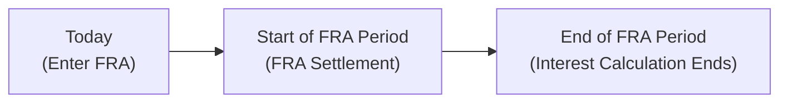
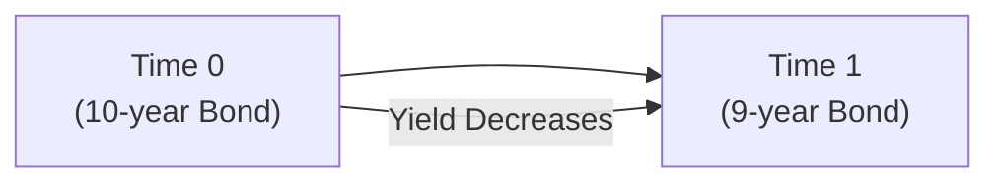

## Introduction and Motivation

Back when I first started studying fixed income, I remember staring at various yield curves on a trading screen, trying to make sense of those interest rates way out in the future. You know how it is—lots of lines and numbers, and you’re wondering: “So, what exactly can I do with all of this?” The notion of “forward curves” was downright intimidating. But as I spent more time with bond traders who used forwards to manage their interest rate exposure, it slowly clicked. Understanding forward rates and how they shape our expectations about future borrowing costs is pretty crucial, especially if you’re aiming to become a well-rounded fixed-income specialist.

In prior sections (particularly in 7.1, 7.2, and 7.3), we talked about spot rates, par curves, and forward rates. Now we take those concepts and see how market participants use them in real-world scenarios. We’ll talk about how to lock in rates, hedge interest rate risk, and (sometimes) even earn extra returns by riding the curve. By the end, I hope you’ll feel as comfortable with forward-based strategies as you do with standard bond trades. Let’s dive in.

## Understanding Forward Rates

Forward rates allow us to estimate, or “imply,” where future interest rates might be. If you see a particular forward rate quoted, it basically says: “The market is willing to lend or borrow at this rate in the future for a certain maturity.” In other words, the forward rate is the break-even rate for a future period that makes the present value of expected cash flows align with today’s observed yield curve.

Mathematically, if you have spot rates for different maturities, you can derive a forward rate between two points in time. For example, you might see something like:

(1 + S₂)² = (1 + S₁)*(1 + 1f₁,₂),

where:
• S₂ is the two-year spot rate  
• S₁ is the one-year spot rate  
• 1f₁,₂ is the 1-year forward rate one year from today  

This formula is a simplified illustration (without continuous compounding). It shows how the forward rate is embedded in the relationship among spot rates.

### Market Expectations

A forward rate often reflects the market’s collective expectation of the future path of rates—though it’s not an exact forecast. Sometimes there’s a risk premium or certain market distortions in there. Traders track forward curves to see if the actual future interest rates end up being higher or lower. If you suspect rates will be higher than what’s implied by the forwards, you might position yourself accordingly (perhaps by shorting interest rate futures or entering a swap). If you think the opposite, well, you could take the other side—maybe going long a futures contract or receiving fixed in a swap.

## Terminal Value Projection

Another important reason to pay attention to the forward curve is terminal value projection, which is basically estimating the value of a bond, note, or swap at some point in the future. You can use forward rates as discount factors, stepping forward through time to get a sense of what your investment might be worth.

• If you’re analyzing a bond’s cash flows, you might discount each coupon and principal payment using forward rates that correspond to those specific times.  
• For swaps and floating-rate notes, you can also project future coupon resets using the forward rates to see how your net payments or receipts might evolve.

This approach helps you anticipate potential gains or losses before they happen. It can be comforting—especially if you’re a portfolio manager with specific liabilities to meet in, say, three years.

## Hedging Approaches

Forward rate strategies aren’t just academic. They have real-life applications in hedging, and that’s where many folks find immediate payoff (no pun intended).

### Futures & Forwards

1. Interest Rate Futures  
   A classic approach is to use interest rate futures (like Eurodollar futures or Treasury futures) to lock in a rate. If you’re worried rates might rise, you might hedge by shorting interest rate futures. If rates do go up, the gain on the futures contract offsets the rise in your borrowing costs—for instance, if you’re planning to issue debt.

2. Forward Rate Agreement (FRA)  
   An FRA is an over-the-counter contract where you lock in an interest rate on a notional principal for a specified future period. So if in, say, six months you’ll need to borrow money for three months, the FRA can set that rate now. If actual interest rates at that time exceed your FRA rate, you end up receiving a compensating payment—hence your effective rate is fixed.

Below is a simple mermaid diagram that might help visualize an FRA’s timeline:

### Interest Rate Swaps

When you do a plain-vanilla interest rate swap (IRS), you typically exchange fixed-rate payments for floating-rate payments. If you have floating-rate debt and you’re worried about rising rates, you can enter a swap in which you receive a floating rate and pay a fixed rate. This effectively transfers your exposure from floating to fixed.

• Notional principal is set but not exchanged (in most plain-vanilla cases).  
• The floating rate typically resets each period, using a reference rate such as 3-month LIBOR (or its replacement) plus a spread.  
• The net payments are exchanged at each settlement date.

Swaps are widely used by corporate treasurers, portfolio managers, and even governments that want to reduce their volatility in financing costs.

## Carry and Roll-Down Strategies

Sometimes, the best strategy is not to fully hedge away interest rate changes but to exploit them. Two such strategies—carry and roll-down—can be powerful tools in a positively sloped yield curve environment.

### Carry

Carry refers to interest earned on a bond or a futures position in excess of financing costs. If you’re getting more yield than what it costs you to fund the position, you’ll generate a positive carry. Imagine you buy a 10-year bond yielding 5% and your financing costs (through repo or some short-term borrowing facility) are only 2%. That difference of 3% is your “carry”—money you can pocket if everything else stays constant.

### Roll-Down (or “Ride the Curve”)

Roll-down is the idea that as time passes, a fixed-income security moves (or “rolls”) along the yield curve to a shorter maturity. If the yield curve is upward-sloping, the yield on a security might naturally go down as it nears maturity, causing its price to rise (all else being equal). Riding the curve can be a neat source of return, but you do have to be mindful of potential yield curve shifts. A flattening or inversion can quickly undermine any expected roll-down gains.

Here’s another mermaid diagram to illustrate roll-down along a positively sloped yield curve:

## Implementation Details

Like most strategies in fixed income, the devil is in the details. Here are a few key considerations:

• Alignment of Hedge Tenors: If you’re hedging a 5-year note, it’s usually best to pick futures, forwards, or swap maturities that match or closely approximate that 5-year horizon. Any mismatch could introduce additional basis risk.

• Basis Risk: Even with careful tenor matching, sometimes the underlying security (e.g., a corporate bond) and the hedging instrument (e.g., Treasury futures) have different credit spreads or liquidity characteristics. That difference can lead to imperfect offsets.

• Hedge Ratio: The proportion of your position you want to hedge. If you want to be fully hedged, you might set the hedge ratio to 1:1 (or slightly adjusted for the duration differences). But if you’re only partially hedging or you have a market view, maybe you go for something else—like hedging half of your exposure, or using a ratio that reflects a difference in durations (duration-based hedging).

• Monitoring: Hedging isn’t a one-and-done practice. Rates shift, yield curves morph, and your underlying asset might change duration faster or slower than your hedge. Active monitoring and rebalancing are a must if you want to keep your hedge effective.

## Practical Examples and Case Studies

### Case Study: Corporate Treasurer Hedging Floating Rate Exposure

Imagine you’re the CFO of a mid-sized manufacturing company. Your firm has a three-year floating-rate loan indexed to 6-month LIBOR. You’re worried that if interest rates jump unexpectedly, you’ll be stuck paying higher interest and that could derail your budget. So you enter a pay-fixed, receive-floating interest rate swap. By doing so, you’ve basically locked in your interest cost at the swap’s fixed rate. If LIBOR skyrockets, sure, you’ll pay more on the loan, but you’ll receive more from the swap’s floating leg, thus offsetting that higher cost.

### Case Study: Fixed-Income Fund “Riding the Curve”

A bond fund manager might identify a sweet spot in the yield curve—say the 5- to 7-year sector—where yields are attractive, and historical yield curve behaviors suggest a decent “roll-down” effect if the curve remains stable. The manager invests in those bonds, expecting that after a year, the 7-year bond (for example) will have “rolled” down to become a 6-year bond at a presumably lower yield, hence supporting a price increase. Meanwhile, the manager earns coupon income along the way. It’s a fairly standard strategy but can be rewarding if the yield curve stays positively sloped and doesn’t flatten too abruptly.

## Glossary Review

• Carry: The net yield advantage a bond offers over its financing or a benchmark.  
• Roll-Down (Ride the Curve): A bond’s potential price appreciation as time passes and it moves to a shorter (and presumably lower-yielding) part of the curve.  
• Hedge Ratio: The proportion of a position to be hedged. Often calculated by matching durations or using additional risk metrics.  
• Forward Rate Agreement (FRA): An OTC contract establishing a future interest rate on a notional amount for a specified period.

## Best Practices and Potential Pitfalls

• Best Practice: Always reconcile your forward-based strategy with your broader portfolio objectives. Are you hedging short-term funding needs? Are you trying to pick up extra yield with carry? Ensure your actions align with your risk tolerance and investment mandate.  
• Potential Pitfall: Relying too heavily on forward rates as flawless predictors of actual interest rates. They aren’t necessarily “right.” They’re simply where supply and demand forces meet in the market.  
• Best Practice: Consider transaction costs and liquidity. Some instruments—like FRA or swaps—can have different liquidity or credit requirements than exchange-traded futures.  
• Potential Pitfall: Overhedging or underhedging due to misalignment in durations or ignoring reinvestment risk, convexity, or embedded options (especially if you have callable or puttable bonds).

## Bringing It All Together

It’s exciting to see how forward curve intelligence helps shape investment and hedging decisions. From establishing the expected path of interest rates to constructing specific trades—like receiving fixed in a swap or shorting a futures contract—these tools provide real, tangible ways to manage interest rate risk.

At the heart of it:  
1. Forward curves help us forecast (or at least hypothesize) future rates.  
2. We can hedge exposures or lock in rates using a variety of instruments—futures, forwards, or swaps.  
3. Carry and roll-down strategies might generate extra returns if the yield curve and market conditions cooperate.  
4. Implementation requires careful matching and constant monitoring, because interest rate risk rarely stands still.

Embrace a dynamic view. The yield curve doesn’t just sit there waiting for you to profit. It moves. Keep a watchful eye, remain flexible with your hedge ratios, and—most importantly—understand the interplay of forward rates with your broader economic outlook. That’s how you’ll sharpen your edge in the fixed-income realm.

## Exam Tips

• When faced with a question about forward rates, be prepared to show short calculations. CFA® exam questions might ask you to derive a forward rate or interpret one.  
• If a question involves a scenario about hedging a future loan, consider which product (FRA, interest rate swap, or futures) best matches the scenario’s time horizon and credit environment.  
• “Carry and roll-down” is a common testable concept. Show you understand that the positive slope of the curve is key to capturing roll-down gains—and that changes in the slope can disrupt it.  
• Don’t forget about basis risk in your answers when discussing partial or full hedges. The exam might specifically ask how you’d address basis risk.  
• Expect to see short vignettes requiring you to propose hedges, compute gains or losses from the hedge, and interpret the final net cost of borrowing or net yield.

## References and Further Reading

• Sundaresan, S. “Fixed Income Markets and Their Derivatives.” (A classic text on bonds, derivatives, and market conventions.)  
• CME Group Educational Resources on Interest Rate Futures:  
  https://www.cmegroup.com/  

Now, let’s test your knowledge with some practice questions.

## Test Your Knowledge: Forward Curve and Interest Rate Hedging Strategies



### Which of the following best describes a forward rate agreement (FRA)?

- [x] An OTC contract to lock in an interest rate on a notional deposit for a future period.
- [ ] An exchange-traded contract referencing a basket of corporate bonds.
- [ ] A contract for pre-issuing government securities at a future auction date.
- [ ] A swap that exchanges floating payments for floating payments tied to different indexes.

> **Explanation:** An FRA is specifically an over-the-counter contract that fixes an interest rate on a notional principal for a set future period. It does not involve exchanging floating rates for floating rates, nor is it exchange-traded like most futures.

### In using forward rates for terminal value projection, investors generally:

- [x] Discount future cash flows using implied forward rates to estimate potential gains or losses.
- [ ] Determine only the spot yield for the entire holding period.
- [ ] Ignore any expected yield curve changes over time.
- [ ] Assume short-term interest rates will remain static.

> **Explanation:** Terminal value projection relies on forward rates as discount factors for future cash flows, thereby estimating a security’s likely value at various points in time. 

### A bond manager employs a “carry and roll-down” strategy on a positively sloped yield curve. Which of the following statements is true?

- [x] The manager benefits if yields remain stable or decline as the bond approaches maturity.
- [ ] The manager is fully hedged and immune to changes in the overall level of rates.
- [ ] The strategy works best in an inverted yield curve scenario.
- [ ] Roll-down refers to the bond’s price rolling downward in the event of rising yields.

> **Explanation:** In a positively sloped yield curve, the bond’s yield declines as the security approaches maturity, which can push its price higher (assuming no other changes). The manager is not fully hedged; the strategy benefits if the curve remains stable or flattens in a favorable manner.

### When using a swap to hedge floating-rate liabilities, the party receiving floating and paying fixed in the swap typically:

- [x] Locks in a fixed cost of funds, mitigating the risk of rising floating rates.
- [ ] Pays floating, which increases exposure to interest rate movements.
- [ ] Eliminates all credit risk in their underlying liabilities.
- [ ] Avoids any net settlement on the swap.

> **Explanation:** By receiving floating in the swap (matching the floating payments on the debt) and paying fixed, the entity converts its exposure to a predetermined fixed rate, thus hedging against floating-rate increases.

### Which of the following is a potential pitfall when implementing forward and futures hedges?

- [x] Basis risk due to differences between the underlying asset and the hedge instrument.
- [ ] Earning a guaranteed excess return over spot investments.
- [ ] The hedge ratio remaining constant regardless of market movement.
- [ ] The inability to close out a position prior to settlement.

> **Explanation:** Basis risk arises if the security being hedged moves differently from the futures or forward contract used. Futures positions can typically be closed out prior to settlement, and there’s no guarantee of excess return.

### A swap is considered an off-balance-sheet instrument primarily because:

- [x] The notional principal is not exchanged, and the main effect is on interest payments.
- [ ] It always involves actual exchange of the entire principal at inception.
- [ ] It requires the full notional to be recorded as an asset.
- [ ] It is not subject to any counterparty risk or regulation.

> **Explanation:** For plain-vanilla interest rate swaps, the notional principal is a reference amount. Only net cash flows (not the principal) are exchanged, so the notional does not appear directly as an asset or liability on the balance sheet.

### If you expect that the market’s forward rates overstate future interest rate levels, you might:

- [x] Consider going long a bond or receiving fixed in a swap.
- [ ] Buy an FRA if you fear interest rates will decline.
- [x] Consider a carry and roll-down strategy to profit from falling rates.
- [ ] Convert existing fixed-rate debt into floating.

> **Explanation:** If you believe rates will actually be lower than the forwards, then you might want to benefit from lower future rates. That could include going long a bond (which benefits if rates go down) or receiving fixed in a swap (anticipating you’ll pay lower floating soon).

### One difference between an interest rate future and a forward rate agreement is:

- [x] Futures are typically exchange-traded, whereas FRAs are OTC contracts.
- [ ] Futures can only be used for hedging, while FRAs are for speculation.
- [ ] FRAs are more liquid and standardized than futures.
- [ ] Interest rate futures always have a longer maturity than FRAs.

> **Explanation:** FRAs are over-the-counter, enabling more customized terms. Futures are exchange-traded, standardized, and typically more liquid.

### Carry in a bond context refers to:

- [x] The coupon or yield advantage relative to financing or reference rates.
- [ ] The incremental capital gain when the bond matures.
- [ ] The difference between a bond’s nominal yield and its yield to call.
- [ ] The profit earned solely from a bond’s credit upgrade.

> **Explanation:** Carry is the yield earned after deducting the financing cost. It’s not limited to capital appreciation or credit improvements.

### True or False: A hedge ratio of 1.0 always guarantees a perfect hedge against interest rate risk.

- [x] True
- [ ] False

> **Explanation:** In theory, if you perfectly match the durations and notional amounts (thus, hedge ratio = 1.0), you can perfectly hedge interest rate risk. However, in practice, basis risk, credit risk differences, and convexity mismatches may cause the hedge to be imperfect. Still, from an exam perspective, 1.0 is considered the “perfect hedge” ratio under ideal assumptions.


