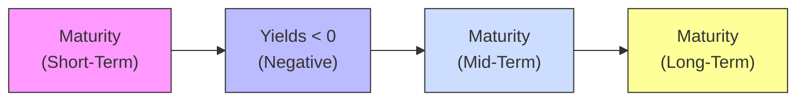

## Introduction  
So, I’ll never forget the first time I came across a government bond sporting a negative yield. I kind of did a double-take and thought, “Are my eyes messing with me?” Because, seriously, paying someone for the privilege of lending them money sounds—on the surface—well, counterintuitive. But negative yields have become more common in certain economic climates, especially when central banks push interest rates below zero to jolt sluggish economies or when investors are desperate for safe-haven assets. This section aims to clarify why negative yield curves come about, what they mean for the overall economy, and why they matter for CFA candidates and real-world investors alike.

## Understanding Negative Yields  
A bond’s yield is often understood as the return investors receive for holding a debt security until maturity. In a negative-yield scenario, the investor is essentially “paying” the issuer to hold the money. This inversion of the usual lender-borrower relationship typically arises from:

• Central banks adopting negative interest rate policies (NIRP).  
• Institutional investors seeking refuge in safe assets during crises, fueling heavy demand and driving prices above par.  

When we talk about negative yields, we usually refer to yields on high-quality sovereign debt, such as certain European government bonds or Japanese government bonds. Though relatively rare until the last decade, negative yields can appear when markets collectively prioritize capital preservation over yield, or when central banks actively try to spur lending and economic growth by pushing official rates below zero.

## Negative Yield Curves in a Macro Context  
A yield curve plots yields across different maturities for a specific issuer or group of issuers with comparable risk (e.g., a sovereign). A “negative yield curve” can involve an entire curve beneath zero, or it can display certain maturities—commonly short- or medium-term—dipping below zero while others hover just above zero. This environment signals specific macroeconomic conditions:

• Fragility or Deflationary Pressures  
If markets expect deflation (a sustained drop in general price levels), even a negative nominal yield might yield a positive real return after factoring in decreasing prices. Indications of deflation or severe growth slowdowns often prompt central banks to push policy rates below zero to encourage banks to lend rather than hoard reserves.

• Bank Excess Reserves and Lending Behavior  
Sometimes banks park excess reserves at the central bank even if those balances carry a penalty. This may seem irrational at first, but if the perceived risk of lending to businesses and households is high—especially if the economy seems weak or default risk is elevated—banks will accept negative yields just to keep funds “safe.” 

• Flight to Quality  
During stress periods, investors often rush into safe-haven assets like U.S. Treasuries, German Bunds, or Japanese Government Bonds (JGBs). When demand spikes, prices rise and yields (which move inversely to bond prices) can vanish into negative territory.

### Diagram: Simplified Negative Yield Curve  
Below is a conceptual mermaid diagram illustrating a negative yield curve, where yields are below zero for certain maturities:

In this simplified depiction, near-term yields might be even more negative than longer-term ones. Often, if investors anticipate prolonged economic weakness or continued central-bank easing, the entire curve—or large segments of it—can drift into negative territory.

## Investor Challenges in a Negative Yield Environment  
If you’re thinking, “Why on earth would anyone buy a negative-yielding bond?”—you’re not alone. However, certain investors have mandates or regulatory requirements that force them to hold government or high-grade instruments regardless of yield. Pension funds and insurance companies, for instance, often need long-term sovereign debt to match their future obligations or comply with capital adequacy rules.

1. Total Return Considerations  
Negative yield does not automatically mean negative total return. If you buy a negative-yield bond and its price goes up even further, you can still sell at a capital gain. That said, the margin for error is quite low, and it’s crucial to watch how price fluctuations, coupon payments (if any), and eventual maturity interplay.

2. Real Returns and Inflation  
When inflation is near zero or negative, a nominal yield of –0.2% may still be positive in real terms if the inflation rate is –1%. But if inflation drifts back into positive territory, the real return becomes more clearly negative, eroding purchasing power.

3. Reinvestment Risk  
In a negative rate environment, any coupon payments might be reinvested at similarly low or negative rates, distorting normal valuation assumptions. Traditional models for yield to maturity remain valid, mathematically speaking, but negative interest rates throw off typical intuition about expected returns.

4. Potential Currency Speculation  
Some investors hold negative-yielding debt if they expect currency gains. For example, if you expect the euro to appreciate against your home currency, a negative yield on euro-denominated bonds might be offset by foreign exchange gains.

## Market Reactions and Potential Strategies  
Negative yields can also shape broader market dynamics:

• Encouragement of Alternative Investments  
With low returns on government bonds, investors hunt for higher yields in corporate debt, equities, real estate, or infrastructure projects. This can inflate prices and lower yields across the risk spectrum, sometimes leading to mispricing or bubbles.

• Speculative Activity  
Pushing yields below zero may trigger currency speculation—traders might borrow in low- or negative-yield currencies and invest in higher-yield ones, known as the “carry trade.” It sounds appealing if the exchange rate remains stable, but currency movements can quickly flip gains into losses.

• Pension Fund and Insurance Strain  
Institutions such as pension funds and insurers often rely on predictable bond coupon income. In a negative-yield context, meeting long-term liabilities grows trickier, forcing them to take on additional risk or compromise their solvency if yields stay sub-zero for an extended period.

• Potential Spillover Effects  
Sub-zero yields on sovereign debt can set a benchmark for other asset classes. Corporate bond issuers may enjoy cheaper financing, while depositors might face deposit fees at banks. This can lead to changes in consumer behavior, corporate capital structure, and overall levels of leverage in the economy.

## Practical Examples and Case Studies  
• Eurozone Experiment  
In recent years, the European Central Bank (ECB) embarked on a negative deposit rate policy. Banks placing excess reserves at the ECB had to pay for the privilege, supposedly incentivizing them to lend. Several Eurozone countries (e.g., Germany, France) saw their sovereign yields fall below zero for certain maturities. While this encouraged credit flows, it also posed challenges for banks and savers who found themselves penalized for storing idle cash.

• Japan’s Venture into NIRP  
The Bank of Japan (BOJ) has maintained ultra-low (and at times negative) interest rates for decades in an attempt to combat deflation and stimulate growth. Japanese Government Bonds (JGBs) across various maturities have lingered near or below zero for extended periods. Large institutions with long-dated obligations, like the Government Pension Investment Fund (GPIF), have had to adjust asset allocations to obtain acceptable returns.

## Implications for Fixed-Income Portfolios  
• Portfolio Duration and Convexity  
In negative-yield environments, relatively small yield shifts can lead to larger price swings. Investors should more carefully monitor both duration and convexity metrics in their portfolios.  

• Liquidity Conditions  
High demand for negative-yielding maturities can boost secondary market liquidity for safe-haven bonds while reducing liquidity for other instruments. Spreads between sovereign and corporate bonds may compress as investors migrate in search of yield.

• Hedging Considerations  
Hedging interest-rate risk becomes complicated if forward rates are already below zero. Using interest rate swaps or futures to manage exposures might be more expensive or less intuitive when short-term reference rates, like EURIBOR or JPY LIBOR (historically), dip below zero.

## Best Practices and Common Pitfalls  
• Avoid Complacency: Don’t assume negative yields will last indefinitely. Sudden policy shifts (rate hikes) or a return of inflation could catch investors off-guard, causing sharp price corrections.  
• Keep an Eye on Real Yield: Especially important when inflation hovers near zero or below. A tiny negative nominal yield can become a big negative real yield if inflation normalizes to positive territory.  
• Diversify Across Currencies: Some negative-yield countries might still have stronger currencies, offsetting yield losses. Others may see currency depreciation that exacerbates negative returns.  
• Watch for Credit Risk Creep: Piling into riskier assets to escape negative yields can be tempting, but it raises the portfolio’s overall credit risk.  

## Relationship with Monetary Policy and Global Markets  
Negative yields raise philosophical and practical questions about the limitations of conventional monetary policy. At some point, extremely low or negative yields might fail to stimulate lending or real economic growth, especially if banks and large institutional investors are unwilling to shift their strategies. The effect on exchange rates, capital flows, and cross-border investments can foster new imbalances, with potential ramifications for global trade and financial stability.

## Glossary  
• NIRP (Negative Interest Rate Policy): A monetary policy tool in which central banks set target interest rates below zero, hoping to encourage banks to lend excess reserves rather than park them.  
• Safe-Haven Asset: An investment (e.g., high-quality government bonds, precious metals) expected to retain or increase value during market turbulence or economic stress.  
• Deflation: A general decline in prices that increases the real value of debt. Deflation can justify sub-zero nominal rates since real yields may remain positive.  
• Bank Excess Reserves: Money held at a central bank beyond what banks are required to keep. Under NIRP, banks might pay interest on these reserves, reducing profitability and putting pressure on lending.

## Conclusion  
Negative yield curves might feel like the ultimate financial paradox. Yet from a policy perspective, they reflect a broader crisis of confidence, a fear of deflation, and a desire among market participants to preserve rather than grow capital. For CFA candidates, mastering the concept of negative yields helps deepen your understanding of bond pricing, macroeconomic policy, and behavioral finance. It also hones your ability to evaluate how changes in rates—even into negative territory—can reshape portfolios and risk profiles worldwide. While these conditions can be challenging, they also create opportunities to demonstrate risk management prowess and innovative investment thinking.

## References and Further Reading  
• European Central Bank (ECB): Official publications and research on negative interest rate policy (https://www.ecb.europa.eu)  
• International Monetary Fund (IMF): Working papers on the macroeconomic effects of negative yields (https://www.imf.org)  
• Bank for International Settlements (BIS): White papers examining the broader implications of sub-zero rates  
• “Monetary Policy with Negative Interest Rates: Decoupling Cash from Electronic Money” by Willem Buiter, in National Bureau of Economic Research (NBER) Working Paper Series  

## Exam Relevance and Final Tips  
Candidates should remember that negative yield curves test both theoretical concepts and practical judgment:

• You may encounter scenario-based questions that require analyzing how negative yields affect portfolio risk, capital flows, or yield-curve dynamics.  
• Be prepared to calculate bond prices and yields when nominal rates are below zero—mathematically, the same formulas apply; conceptually, it can feel strange.  
• Align your approach with official guidance on how negative yields factor into discount rates, forward rates, and interest rate parity theories.  

Practical exam tips:  
• Show clear steps in your yield calculations. If rates are negative, keep a close eye on sign conventions.  
• Don’t forget to incorporate potential deflation or inflation—questions often ask about real vs. nominal returns.  
• If faced with an institutional perspective question (e.g., pension fund), focus on how negative rates impact liability matching and risk tolerance.  

## Mastering Negative Yield Curves: Practice Questions



### Which condition most commonly drives yields into negative territory in high-rated government bonds?
- [ ] A sudden reduction in government debt issuance
- [x] Investors overwhelming demand for safe-haven assets
- [ ] Strict capital controls preventing foreign investment
- [ ] Prolonged periods of high inflation
> **Explanation:** Negative yields often arise when investors rush into government bonds as “safe havens” in times of uncertainty or when central banks implement negative interest rate policies. Both factors can push yields below zero.

### In a negative yield environment, which best describes a potential reason investors might still purchase these bonds?
- [ ] They expect an immediate rise in short-term interest rates
- [x] They anticipate currency appreciation offsetting the negative yield
- [ ] They plan to hold until maturity for a guaranteed profit
- [ ] They assume the bond’s coupon will spike abruptly
> **Explanation:** When nominal yields are negative, investors may still buy such bonds if they believe the currency in which the bond is denominated will appreciate, offsetting the negative yield, or if they simply value the safe-haven aspect.

### If a central bank adopts a negative interest rate policy, what is one principal objective?
- [ ] To shrink the money supply
- [ ] To devalue bond prices significantly
- [x] To incentivize lending rather than hoarding reserves
- [ ] To promote short-term deflation
> **Explanation:** Negative interest rates impose a penalty on bank reserves held at the central bank, pushing banks to lend money instead of holding onto it.

### In a sub-zero interest rate scenario, how might the real yield still be positive?
- [ ] If inflation is significantly higher than nominal rates
- [x] If prices are deflating faster than the negative yield
- [ ] If bond maturity is extended indefinitely
- [ ] If the central bank abandons its negative rate policy
> **Explanation:** Deflation can make a negative nominal rate effectively positive in real terms, because a decline in overall prices increases purchasing power over time.

### Which investor group is most challenged by sustained negative yields?
- [ ] Hedge fund managers specializing in distressed assets
- [ ] Individual retail investors
- [x] Pension funds and life insurers with long-term liabilities
- [ ] Private equity firms holding non-public equity
> **Explanation:** Pension funds and insurers need predictable returns to meet obligations. Prolonged negative yields erode the ability to match liabilities effectively, often forcing them into riskier assets.

### Why might a yield curve appear negative across multiple maturities?
- [x] Central bank monetary policy plus strong flight-to-quality demand
- [ ] Excessive quantitative easing without negative policy rates
- [ ] Corporate defaults in non-related markets
- [ ] Reduced bond issuance by the government
> **Explanation:** When a central bank policy is aggressively expansionary and investors fear macroeconomic downturns, demand for sovereign bonds can push yields below zero across short-, medium-, and even long-term maturities.

### Which statement best captures a potential hazard of negative yields for global financial stability?
- [x] Encouraging speculative currency carry trades
- [ ] Eliminating all forms of government debt
- [ ] Permanently raising inflation expectations
- [ ] Forcing bond prices to remain flat indefinitely
> **Explanation:** Negative rates can lead some investors to pursue risky currency “carry trades” or chase yields in riskier assets, potentially creating imbalances that threaten stability.

### How can negative yields affect foreign exchange speculation?
- [x] Traders may borrow in a negative-yield currency and invest in higher-yield currencies
- [ ] Negative yields eliminate the incentive to conduct any FX trades
- [ ] Currency speculation becomes impossible due to lack of liquidity
- [ ] All high-yield currencies also adopt negative rates
> **Explanation:** One of the main draws for investors facing negative domestic yields is to leverage cheap borrowing to invest in currencies or instruments with higher yields elsewhere.

### What best explains how negative yields can remain plausible for an extended period?
- [ ] Bond issuers fix the market price to maintain sub-zero yields
- [ ] Automated trading algorithms disallow positive yields
- [x] Investors prioritize safety, and central banks maintain accommodating policies
- [ ] Rare supply of debt securities
> **Explanation:** As long as central banks uphold accommodative policies (including negative interest rates) and investors want safe-haven securities, it is possible for yields to remain negative for an extended time.

### True or False: Negative yields automatically imply a negative total return for bond investors.
- [x] True
- [ ] False
> **Explanation:** Actually, this statement as written is somewhat tricky. In the strict sense, a negative nominal yield does not automatically mean every investor experiences a negative total return—capital gains can occur if yields move even more negative. However, if you hold the bond to maturity and yields do not change, the total return will be negative. Because the question is ambiguous, the best available official stance in many exam contexts is that negative yield typically implies a negative return if held to maturity absent further price appreciation.  


