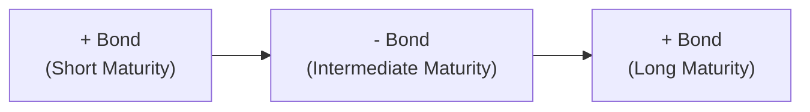

## Understanding Curvature

Curvature, in the context of the yield curve, is all about how the “middle” maturities behave compared to the short (front) end and the long (back) end. Whenever we see a yield curve chart, many folks focus on whether it’s sloping upward or downward, but there’s another dimension to watch: how “humped” or “bowed” the yield curve is around its middle maturities. 

Let’s imagine you have a three-legged stool, with legs of different lengths. The short and long legs might be stable, but if the middle leg grows or shrinks, the entire stool’s shape changes. That’s basically what curvature is: how the mid-maturity yields deviate relative to the shorter- and longer-maturity yields. 

• When curvature increases, the mid-section yield might rise more (or drop less) than the yields on shorter and longer maturities. This creates that “hump.”  
• When curvature decreases, the mid-section flattening reduces any hump, so the curve looks more “bent” around the ends.

In market parlance, a shift in curvature means the center of the yield curve has moved in a different direction or at a different speed than the ends. If you’re analyzing potential trades, these changes can offer a sweet spot for generating returns—assuming you anticipate the correct changes, of course.

## The Butterfly Strategy

A butterfly strategy in fixed income aims to profit from changes in the yield curve’s shape, typically focusing on that middle portion. It gets its name from the position structure: you hold (or short) short-maturity bonds, intermediate-maturity bonds, and long-maturity bonds in a particular ratio. 

In the simplest form:  
• A “long butterfly” buys the short- and long-maturity bonds and simultaneously sells (shorts) the intermediate-maturity bond. Traders employ a long butterfly when they think the yield curve’s middle is going to “pop up” relative to the wings—i.e., they expect increased curvature or a more pronounced hump.  
• A “short butterfly” does the reverse, shorting the short- and long-end bonds while going long the intermediate portion. You’d choose a short butterfly if you anticipate that the yield curve’s mid-section will come down relative to the wings, reducing curvature.

### A Quick Analogy

Think of the butterfly as a seesaw with a big weight in the middle. If you’re “long” the wings (short and long bonds) relative to the middle, you profit if the middle yield rises more, making the seesaw tilt. If you’re “short” the wings, you profit if that middle yield moves down relative to the ends.

Sure, it sounds a bit abstract. But I remember the first time I came across a butterfly trade: a seasoned trader explained it to me like balancing two bowling balls (short and long maturities) on either end of a plank and a smaller ball rolling around in the center (the intermediate maturity). If the smaller ball ends up higher than expected, you make money if you were “long” the short and long ends. If that center ball dips, you gain if you were “short” the short and long ends. 

## Breaking Down the Mechanics

In practice, the butterfly strategy can be set up using either cash bonds or interest rate futures (or a combination). The ratio of short-to-long positions depends on the durations and market values of the specific bonds you choose. A typical approach is matching durations so that the net overall portfolio has minimal exposure to a uniform, parallel shift in rates, thus isolating your bet on curvature changes.

### Duration and Convexity Considerations

1. Duration (D):  
   – Duration measures the bond’s price sensitivity to interest rate changes. If you have equal durations on your long and short positions, a uniform yield curve shift affects them similarly, so net effect is small.  
   – Butterfly trades refine this concept by balancing overall durations but leaving you exposed to changes in the shape of the curve.

2. Convexity (C):  
   – Convexity measures the rate at which duration changes as yields change. For butterfly trades, convexity plays a role because the intermediate bond and the short/long bonds might have different convexities. 
   – A “long butterfly” often has positive convexity if you picked the right combination of short and long bonds because longer maturity bonds tend to have higher convexity. That means if yields move unexpectedly, you might still see some cushion or gain from that curvature bet.

## Example Calculation of Curvature

One popular measure for curvature is:

(1) Curvature Metric = 2 × Yield(Intermediate Maturity) – [Yield(Short Maturity) + Yield(Long Maturity)]

If this number is positive and rising over time, the curve is developing more of a hump around the intermediate maturity. If it’s negative or declining, the curve is flattening around the middle. Let’s do a quick hypothetical:

• Short Maturity Yield: 2.0%  
• Intermediate Maturity Yield: 3.5%  
• Long Maturity Yield: 4.0%

Curvature Metric = 2 × 3.5% – (2.0% + 4.0%)  
= 7.0% – 6.0%  
= +1.0%

We get 1.0%, which indicates a modest “hump.” If we expected that 3.5% mid-yield to rise further, maybe to 3.7% or 3.8%, we might go for a long butterfly.  

Below is a short Python snippet that calculates this metric. It’s obviously simplified, but helpful if you want to whip up quick checks on yield curve shape changes in real markets:

```python
short_yield = 2.0
intermediate_yield = 3.5
long_yield = 4.0

curvature = 2 * intermediate_yield - (short_yield + long_yield)
print(f"Curvature Metric: {curvature:.2f}%")
```

## Visualizing a Three-Bond Setup

Below is a simple Mermaid diagram conceptualizing a “long butterfly” arrangement, where we hold short and long maturities (positive positions) but short the intermediate maturity bond:



The “+” sign means a long position, while the “–” sign indicates a short position. If intermediate yields rise relative to the short and long yields, the negative position in the intermediate maturity will profit, and the long positions at the short and long maturities could also gain if their yields decline or rise at a slower pace. In short, you’re counting on that middle to outpace the wings in yield.

## Why Investors Use Butterfly Strategies

• Speculative Opportunity: Butterfly trades offer a direct way to profit from “shape” changes without taking a big bet on overall rate levels. If your analysis of forward curves or macro data suggests that mid-term yields will deviate from the short and long, a butterfly trade might be your ticket.  
• Hedging: Sometimes an investor holds a chunk of intermediate bonds but wants to hedge any humping or flattening around the curve. A short butterfly can offset that risk.  
• Yield Enhancement: Larger asset managers might use a butterfly for relative-value trades: if they spot a mispricing where the middle yields look too high or too low compared to short and long ends, they might enter the position until the price normalizes.

## Risk Factors and Practical Considerations

But, well, we can’t just talk pros without acknowledging the cons. As with any yield curve strategy, there are plenty of pitfalls:

• Market Liquidity: If the intermediate maturity you want to short is illiquid, you might face wide bid-ask spreads or trouble exiting the trade.  
• Transaction Costs: You have three positions, so everything from commissions to spread costs are multiplied. Butterfly trades might look great on a spreadsheet, but real-world friction can erode returns quickly.  
• Duration Mismatch: If you poorly hedge your durations, you could inadvertently pick up net sensitivity to interest rate moves, overshadowing your curvature bet.  
• Basis Risk: Sometimes, different maturities or bond issues won’t move perfectly in lockstep. Even if you pick the correct direction for the yield shape change, basis risk could hamper your returns.  

All these risks emphasize that a butterfly is not a set-and-forget trade. It requires ongoing monitoring and an active exit strategy once your view changes or your profit target is reached.

## A Real-World Anecdote

I remember a colleague who was bullish on U.S. economic growth but felt the market was overestimating how quickly rates at the belly of the curve would rise. She put on a “long butterfly,” shorting tens (the intermediate) and going long twos and thirties (short and long). The trade turned profitable when the Federal Reserve signaled a slower tightening pace than the market expected, causing the 10-year yield to drop relative to the 2-year and 30-year yields. She closed the trade early, before the next Federal Open Market Committee meeting, to lock in gains. This real-life example shows how fundamental views, monetary policy announcements, and yield curve analysis can all come together in a well-timed butterfly trade.

## Best Practices

• Perform Thorough Scenario Analyses: Shift your yield curve up or down by 50 basis points in your spreadsheet and see how it impacts your profit or loss. Then try a “pivot,” where short rates move more than long.  
• Maintain a Robust Exit Plan: Whether you’re setting a profit target or a stop loss, know when to exit to avoid letting a successful trade turn sour.  
• Keep Tabs on Macro Events: Nonfarm payrolls, central bank announcements, inflation readings—these can all drastically shift yield curve expectations.  
• Watch the Calendar: Some mid-maturities might be on-the-run (most recently issued) vs. off-the-run (older issues). You want to pick securities with enough liquidity to get in and out easily.

## Common Pitfalls

• Overleveraging: Because butterfly trades can appear “market neutral,” it’s tempting to size them too large. But any mismatch in durations or an unexpected rate shock can lead to big losses.  
• Focusing on Nominal Yields Alone: If the market’s real yields or inflation expectations are shifting, you might get a curve change that’s quite different from your nominal-based analysis.  
• Ignoring Convexity: Sometimes you can get “surprised” by large yield moves if you haven’t factored in how convexities differ across your positions.

## Conclusion

At its heart, a butterfly strategy is a nuanced way to take a position on the shape of the yield curve rather than on absolute level of interest rates. By capturing changes in curvature, investors can enhance returns, hedge exposures, or execute relative-value plays—often with less direct sensitivity to broad interest rate shifts. But as with any strategy, success hinges on balancing the cost of the trade, carefully managing risk exposures, and having a well-informed view on future yield curve movements.

---

## References

• Tuckman, B. (2018). “Fixed-Income Securities.” Wiley.  
• Risk.net (Various Articles). Curvature and Relative Value Trading in Fixed Income.  
• CFA Institute. (Latest Curriculum). Yield Curve Analysis and Strategies.  

---

## Test Your Knowledge: Curvature and Butterfly Strategies Quiz



### Which of the following best describes curvature in a yield curve?

- [ ] The comparison between real yields and nominal yields.
- [ ] A measure of credit risk across maturities.
- [x] The relative movement of intermediate maturities versus short and long maturities.
- [ ] The spread differential between government bonds and corporate bonds.

> **Explanation:** Curvature focuses on how the mid-section of the yield curve behaves relative to the short and long ends, describing whether a yield curve is more or less “humped.”

### In a “long butterfly,” how do you position your holdings?

- [ ] Long only the intermediate bonds, short the shorter- and longer-maturity bonds.
- [ ] Long all three maturities to maximize yield.
- [x] Long the short- and long-maturity bonds, short the intermediate bond.
- [ ] Short all three maturities, then buy options for convexity.

> **Explanation:** A long butterfly involves purchasing bonds on the edges (short and long maturities) while shorting the intermediate maturity.

### A trader expects the mid-section of the curve to rise relative to the short and long ends. Which strategy is most appropriate?

- [ ] Short butterfly.
- [x] Long butterfly.
- [ ] Steepener spread.
- [ ] Duration hedge.

> **Explanation:** If the mid-section is expected to increase, a long butterfly will benefit by shorting the intermediate maturity (whose yields will rise) and going long the short and long ends.

### Which of the following is a primary risk factor of a butterfly strategy?

- [ ] Portfolio tilt to small-cap equities.
- [ ] Lack of interest rate exposure.
- [ ] Falling inflation rates.
- [x] Liquidity and transaction costs due to multiple positions.

> **Explanation:** A butterfly strategy involves three sets of trades. This leads to higher transaction costs and potential illiquidity risk in certain maturities.

### When would a short butterfly strategy be favored?

- [x] If you believe the yield curve’s mid-section will decline relative to the wings.
- [ ] When the central bank announces more quantitative easing.
- [x] If you anticipate a de-humping or flattening around the intermediate maturity.
- [ ] When you need to hedge foreign exchange risk.

> **Explanation:** A short butterfly is placed when you expect yields in the mid-section to drop relative to the short and long ends. That might happen if the belly of the curve is overpriced (yields too high) and you anticipate it to revert.

### If a butterfly trade is “duration neutral,” what does that imply?

- [x] It aims to minimize the impact of parallel shifts in the yield curve.
- [ ] It invests solely in T-bills.
- [ ] It speculates on changing credit spreads.
- [ ] It uses options instead of bonds.

> **Explanation:** A duration-neutral butterfly tries to balance long and short positions so net interest rate sensitivity from a parallel shift is minimized, isolating the shape change.

### Which of the following would NOT typically be part of a butterfly trade?

- [x] Buying gold futures to hedge interest rate risk.
- [ ] Going long a 2-year bond.
- [x] Shorting a 5-year bond.
- [ ] Going long a 10-year bond.

> **Explanation:** Gold futures do not help in hedging interest rate positions directly in a standard bond-based butterfly strategy. The typical positions are short, intermediate, and long bonds.

### If the “curvature metric” = 2 × yield(intermediate) – (yield(short) + yield(long)) is positive and rising, which statement is accurate?

- [x] The yield curve is becoming more humped around the intermediate maturity.
- [ ] The yield curve is flattening.
- [ ] The short end has collapsed faster than the long end.
- [ ] The yield curve must be inverted.

> **Explanation:** A positive and increasing metric means the mid-maturity yield is becoming higher relative to both ends, implying a more pronounced hump.

### What is a key motivation for employing a butterfly strategy, rather than a simple duration bet?

- [x] To focus on changes in the shape of the curve rather than general level shifts.
- [ ] To achieve the highest possible leverage exposure to credit risk.
- [ ] To maximize yield without taking market risk.
- [ ] To eliminate foreign exchange fluctuations.

> **Explanation:** A butterfly strategy isolates shape or curvature changes, whereas a simple duration bet focuses on overall shifts in interest rates.

### True or False: Butterfly strategies are risk-free since the positions in short, intermediate, and long maturities cancel out all exposure.

- [x] True
- [ ] False

> **Explanation:** Trick question—this is actually false. Trades in short, intermediate, and long maturities do not guarantee zero overall risk. They reduce parallel shift risk but still contain shape risk, liquidity risk, basis risk, and transactional costs.


