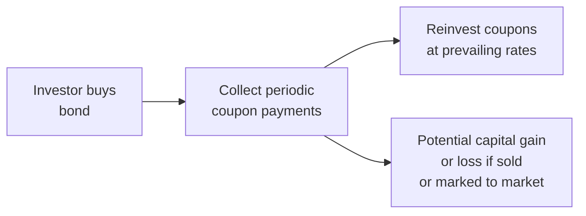

## Introduction

So, have you ever thought about what really influences how much money you make (or lose) from a bond? I remember the first time this really clicked for me—I was analyzing a 10-year bond paying a fixed coupon each year, thinking all I had to do was multiply the coupon percentage by the face value. Easy, right? But then, I realized that once I receive those coupon payments, I have to find a place to reinvest them. And if interest rates go down between coupon payments, I earn less on reinvested money. That’s essentially what we call “reinvestment risk.”

In this section, we’ll dissect the major sources of return for a bond—coupon income, reinvested coupon income, and capital gains or losses—and we’ll explore how changes in interest rates can either help or hurt an investor’s total return.

## Breaking Down the Sources of Bond Return

When you hold a bond, three broad components shape your total return:

• Coupon income  
• Reinvestment of coupon income  
• Capital gain (or loss) when you sell the bond or hold it to maturity  

Let’s look at each source carefully.

### Coupon Income

Coupon income is the most straightforward. A bond’s coupon is set at the time of issuance, typically expressed as a percentage of its face (or par) value. For example, a 5% annual coupon on a bond with a face value of USD 1,000 means the bondholder receives USD 50 each year.

In practice, these coupon payments might be made semiannually (for instance, USD 25 every six months). Regardless of the payment schedule, the nominal yield (or stated coupon rate) doesn’t change. You can think of it as the contracted interest you get simply by holding the bond.

### Reinvestment of Coupon Income

Now, the trickier part: once you receive coupon payments, where do you put that money? You probably want to reinvest it so that your returns continue compounding. If the prevailing interest rates in the market are higher than your original coupon, that can be a big win—your reinvested coupons would earn more interest, boosting your total return. But if rates drop, you’ll be stuck reinvesting at a lower rate, which drags down your total potential return.

This uncertainty is known as reinvestment risk. It’s most pronounced when rates are volatile or trending downward. A bond that pays a hefty coupon in a declining rate environment sounds great at first, but those coupon payments must be reinvested at lower rates, effectively cutting into your compounding gains.

### Capital Gain or Loss

Finally, there’s the possibility that the price of your bond changes while you hold it. Just because you bought a bond at par (e.g., USD 1,000) doesn’t mean it will stay at that price. If market interest rates fall, the bond’s market price usually goes up, meaning you’d enjoy a capital gain if you sold it. Conversely, if rates rise, the bond’s price often drops, causing a capital loss should you exit your position.

Even if you plan on holding the bond until it matures—and thus ultimately receive the face value in full—there may be times when you must mark the bond to market in your portfolio or consider an early sale for cash flow reasons. That’s when changes in bond prices (due to interest rate movements) become quite significant to measure and manage.

## Balancing Price Risk and Reinvestment Risk

What’s interesting is how price risk (the risk that bond prices will change due to interest rate movements) often moves in the opposite direction from reinvestment risk. Think about it this way:

• If rates go down…  
  – Bond prices tend to rise (good for capital gains).  
  – But reinvestment rates also drop (bad for reinvesting coupons).  

• If rates go up…  
  – Bond prices decline (bad for capital gains).  
  – But reinvestment rates rise (good for reinvesting coupons).  

Just like a see-saw, these two can partly offset each other. If your investment horizon aligns with the bond’s duration, changes in rates can have a smaller net effect on total return. That’s because a higher price might offset lower reinvestment rates (and vice versa). However, the degree of offset depends heavily on the timing of cash flows and the steepness of rate changes.

## Practical Example: A 3-Year Bond with Annual Coupons

Imagine you invest in a 3-year bond with a 4% annual coupon and a face value of USD 1,000. Here’s how it might work out:

1. You buy the bond at par for USD 1,000.  
2. Each year, you receive USD 40 in coupon income.  
3. After each coupon payment, you reinvest the USD 40 at the current market yield.  

Now let’s say right after you buy the bond, the market yield falls to 3%. The bond’s price might jump above USD 1,000 (giving you a capital gain if you sold it). But, you will now only reinvest coupons at 3%. If you hold the bond to maturity, you skip the capital gains from selling above par, but you also avoid the capital loss if yields subsequently rise again.

If yields drift up to 5% instead, the bond’s price might drop below USD 1,000. You could realize a capital loss if you sold, yet you’d get to reinvest coupons at 5%, potentially enhancing your total income over that period.

When the dust settles, your actual total return depends on how the interplay of these effects accumulates over the entire holding period.

## Duration, Time Horizon, and Maturity

If you’ve read the upcoming Section 8.2 on duration measures, you’ll learn that duration intricately links to interest rate risk. Duration is basically the weighted average time to receive the bond’s cash flows, and it’s a key metric that measures how sensitive a bond’s price is to changes in interest rates.

• A longer duration indicates higher sensitivity to interest rate changes (i.e., a bigger price swing for a given change in yields).  
• A shorter duration suggests less price fluctuation.  

Meanwhile, shorter-term bonds can see their principal and coupon income reinvested more often, which can increase reinvestment risk frequency—though each individual coupon payment is smaller in total.

Balancing these factors typically involves matching your bond (or bond portfolio) duration to your investment horizon. By doing so, you can reduce the net impact of interest rate fluctuations between price risk and reinvestment risk.

## How to Measure the Total Return

We can formalize total return for a bond over a set horizon with a simplified equation:


\text{Total Return} = \frac{\left(\text{Coupon Income + Reinvestment Income}\right) + \left(P_{\text{end}} - P_{\text{begin}}\right)}{P_{\text{begin}}}


where:  
• \\(P_{\text{begin}}\\) = the bond’s price at the start of your holding period.  
• \\(P_{\text{end}}\\) = the bond’s price at the end of the holding period (or its par value if held to maturity).  
• “Coupon Income + Reinvestment Income” is all the cash flows you receive from coupons, plus whatever extra money you earn from reinvesting those coupons over time.

Of course, in real life, you’d probably measure your effective annual yield or internal rate of return (IRR) that equates the present value of all inflows and outflows. But this breakdown shows how those three components—coupon, reinvestment, and price changes—really drive that final number.

## Visual Overview

Here’s a simple Mermaid diagram to illustrate how these sources of returns flow for a bond investor:

Notice how the capital gain or loss can occur if the investor decides to sell the bond prior to maturity (or is forced to mark it to market for reporting). Meanwhile, the coupon flows out of the bond and into whatever reinvestment opportunity is available at that time.

## Managing Reinvestment Risk

Because reinvestment risk is basically the risk that future coupon or principal payments will be reinvested at an unfavorable interest rate, bond investors often aim to control how frequently and at what rates coupons are reinvested.

### Strategies to Mitigate Reinvestment Risk

• Matching Liabilities with Bond Cash Flows: Some portfolio managers look to match future liabilities with coupon and principal payments. For instance, if you know you’ll need a specific amount of cash in three years, you might purchase a bond that matures at that time, thereby minimizing the need to reinvest coupons.  

• Laddering: Building a “laddered” bond portfolio is a popular approach. This involves purchasing bonds with staggered maturities (e.g., 1-year, 3-year, 5-year, 7-year, etc.). The principal you get back from each maturing bond can be reinvested promptly at current market yields. Although it won’t fully eliminate reinvestment risk, a ladder can help smooth out interest rate fluctuations over time.  

• Using Floating-Rate Instruments: Another approach is to invest in floating-rate notes (FRNs). These bonds pay coupons that adjust periodically based on a reference rate (like SOFR or EURIBOR). When interest rates rise, the coupon payment eventually resets higher, offering a built-in hedge against reinvestment risk—albeit with different credit risk considerations.  

• Bond Fund Reinvestment Policies: Mutual funds or exchange-traded funds (ETFs) reinvest coupons automatically, but they do so continually in new bonds. Fund managers often have strategies in place for managing (though not eliminating) reinvestment risk by diversifying across maturities and credit instruments.

## Considering Maturity and Holding Period

If you’re going to hold a bond to maturity, the reinvestment risk remains relevant for the coupon portions, but the capital gain or loss is realized only if you sell early or mark to market. For a buy-and-hold investor, the biggest unknown might be the reinvestment rates for all those coupon payments received along the way.

If, on the other hand, you actively trade bonds or manage a bond portfolio that must be marked to market, you’ll see a daily price impact from interest rate changes. This price impact can overshadow coupon and reinvestment considerations in the short term. However, it’s all part of the bigger puzzle of achieving your target total return.

## Complex Scenarios: Rising and Falling Rate Environments

### Falling Rate Environment

– Bond prices go up. If you buy or hold a bond, you could lock in a capital gain by selling when rates are lower.  
– Your coupon payments, when received, have fewer reinvestment opportunities at higher rates. So the advantage on the price side is somewhat offset by the disadvantage on coupon reinvestment.  

### Rising Rate Environment

– Bond prices go down. If you sell, you face a capital loss.  
– Coupon payments, when they arrive, can be reinvested at these higher rates, potentially increasing future income.  

In practice, a well-structured bond portfolio can find a balance. Some managers use derivatives (like interest rate swaps or futures) to hedge part of the interest rate or reinvestment risk, although that introduces new complexities and costs.

## Best Practices and Potential Pitfalls

• Know Your Investment Horizon: The interplay of coupon payments, reinvestment risk, and capital gains/losses depends on how long you plan to hold the bond.  

• Pay Attention to Duration and Convexity: Duration helps measure sensitivity to rate changes, but convexity refines that measure for larger swings. If you only use duration, you might underestimate price sensitivity when rates shift dramatically.  

• Avoid Overlooking Reinvestment Assumptions: When performing total return analysis, be sure to set reinvestment rates realistically. Overly optimistic assumptions can lead to disappointment.  

• Monitor Credit Risk: Remember, changes in a bond’s yield stem not only from the general interest rate environment (systemic risk) but also from changes in the issuer’s credit profile. Don’t confuse yield changes from credit events with yield changes from broad market interest rates.  

• Liabilities? Match Them: If you have a specific liability payment schedule, consider matching the dates and amounts to mitigate reinvestment and market risk (liability-driven investing, or LDI approach).  

## Putting It All Together

The big takeaway is that bond return isn’t just about clipping coupons. Even if your coupon rate is fixed, your overall return depends on how efficiently you can reinvest those coupons, and whether you reap (or avoid) capital gains or losses along the way. By carefully considering your holding period, market conditions, and reinvestment strategy, you can better position yourself to manage these competing forces in your bond portfolio.

## Exam Tips

• Be prepared to dissect total return questions that isolate coupon income, reinvestment income, and capital gains/losses.  
• Know how to calculate effective yields or total return under various reinvestment assumptions (for example, if you must reinvest coupons at a declining yield each year).  
• Watch for scenarios testing your understanding of how price risk and reinvestment risk offset (or fail to offset) across different time horizons.  
• In item sets, you may be asked to perform scenario analyses for rising vs. declining interest rate environments.  
• For short-answer or essay responses, demonstrate a nuanced approach—explain how changes in interest rates can both help and hurt bond returns simultaneously.

## References

• Fabozzi, F. J. (2016). Bond Markets, Analysis, and Strategies. Pearson.  
• Tuckman, B., & Serrat, A. (2011). Fixed Income Securities: Tools for Today’s Markets. Wiley.  
• CFA Program Curriculum (Level I), Fixed Income Readings on Bond Returns and Reinvestment Risk.  

## Practice Questions on Sources of Bond Return and Reinvestment Risk



### Which of the following is the best description of reinvestment risk?  
- [ ] The risk of an issuer defaulting on its loan obligations.  
- [x] The risk that future coupon payments will be reinvested at a lower-than-expected rate.  
- [ ] The risk that inflation will erode the real value of coupon payments.  
- [ ] The risk that yield curve movements create parallel shifts.  

> **Explanation:** Reinvestment risk specifically addresses the uncertainty of reinvesting coupon or principal payments at the originally assumed yield, particularly when market interest rates decline.

### In a falling interest rate environment, a bondholder who is reinvesting periodic coupons should expect:  
- [x] A potential increase in the bond’s market value, but decreased yields on reinvested coupons.  
- [ ] A guaranteed increase in both the market price and reinvestment rates.  
- [ ] Lower bond prices and higher reinvestment rates.  
- [ ] No significant effect on either price or coupon reinvestment.  

> **Explanation:** When rates fall, bond prices typically rise, but reinvested coupons receive lower rates, reflecting a key trade-off in total return.

### A bond has a par value of USD 10,000 and an annual coupon rate of 3%. You expect to reinvest all coupons at 4%. Which statement is correct about your reinvested coupon income?  
- [x] Your total reinvested coupon income will be higher than if reinvested at the nominal coupon rate of 3%.  
- [ ] Your total reinvested coupon income will be the same as the nominal coupon income.  
- [ ] Your total reinvested coupon income will be lower than the nominal coupon income.  
- [ ] Reinvestment income has no effect on total return.  

> **Explanation:** If you reinvest coupons at a rate (4%) that’s higher than the coupon rate (3%), your coupon payments will earn more than they would at 3%, increasing total return.

### Which of the following choices best describes the primary components of a bond’s total return over a holding period?  
- [ ] Price change, accrued interest, and inflation.  
- [ ] Time value, fees, and price risk.  
- [x] Coupon income, reinvestment of coupons, and capital gain or loss.  
- [ ] Market liquidity, credit rating, and maturity.  

> **Explanation:** The three main pillars of bond return are coupon income, the reinvestment of those coupons, and any capital gain or loss upon selling or redemption.

### When market interest rates rise significantly after bond issuance, which effect often offsets the resulting price risk?  
- [x] The possibility of reinvesting coupons at higher rates.  
- [ ] The increase in daily price transparency.  
- [x] The capital loss recognized if the bond is sold prior to maturity.  
- [ ] The conversion of the bond into equity.  

> **Explanation:** Rising rates typically cause bond prices to fall (leading to a potential capital loss), but the upside is that coupons can be reinvested at higher rates, partially mitigating the overall negative impact on total returns.

### A bullet bond’s coupon rate is 6%. If interest rates drop from 6% to 4% right after purchase and remain at that level, which statement is most accurate for a buy-and-hold investor?  
- [x] The investor will benefit from a higher bond price but face lower reinvestment rates for coupons.  
- [ ] The investor’s yield to maturity automatically adjusts to 4%.  
- [ ] The investor faces no reinvestment risk because the bond is held to maturity.  
- [ ] The coupon payments themselves will increase to 8%.  

> **Explanation:** With rates dropping, a buy-and-hold investor sees a paper gain in bond price. However, the coupons they receive must be reinvested at the new, lower 4% rate.

### Duration is typically used to measure:  
- [x] The sensitivity of a bond’s price to changes in the market interest rate.  
- [ ] The minimal holding period to avoid capital losses.  
- [x] The amount of yield spread due to credit quality differences.  
- [ ] The exact reinvestment rate of the bond’s coupons.  

> **Explanation:** Duration quantifies price sensitivity to interest rate movements. Although it doesn’t directly predict reinvestment rates, it summarizes how price responds to rate changes.

### Which portfolio strategy is specifically designed to mitigate reinvestment risk by staggering bond maturities?  
- [x] Laddered bond strategy  
- [ ] Barbell bond strategy  
- [ ] Contingent immunization  
- [ ] Duration matching on a single bond  

> **Explanation:** A bond ladder means holding bonds of different maturities so that principal is regularly reinvested, helping to smooth out the impact of fluctuating interest rates.

### What effect best illustrates the offsetting nature of price risk and reinvestment risk?  
- [x] As yields rise, bond prices drop, but coupons are reinvested at higher rates.  
- [ ] When yields rise, bond prices also rise, but coupons are reinvested at lower rates.  
- [ ] As yields decline, bond prices stay constant.  
- [ ] Higher yields cause both bond prices and reinvestment rates to drop.  

> **Explanation:** One of the classic offsets in fixed income is that a rise in yields is typically unfavorable for bond prices but favorable for the reinvestment of coupons.

### True or False: For an investor who always holds bonds to maturity, reinvestment risk is irrelevant.  
- [ ] True  
- [x] False  

> **Explanation:** Even buy-and-hold investors still face reinvestment risk for their coupon payments until maturity. They need to reinvest those coupons as they come due.


