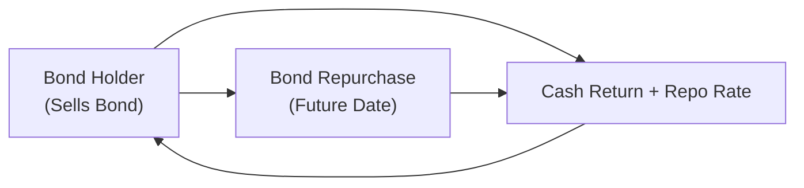

## Overview

Leverage in bond investing is a concept that can get us all a bit excited—and perhaps a tad nervous. After all, who wouldn’t want to amplify returns? But, um, as with many scenarios in finance, there’s a catch: once you bring borrowed funds or derivatives exposure into play, you also magnify your losses. It’s like driving on the highway with turbo boost—super thrilling until you realize how fast you’re going and how much risk you’re taking if a curve shows up unexpectedly.

Below, we’ll delve into how leverage practically works in bond portfolios, how it influences both returns and risk, and how (in my experience) it can totally reshape your strategy when interest rates start doing unexpected things. We’ll walk through different types of leverage, discuss real scenarios, and highlight some best practices—like stress testing, monitoring breakeven rates, and careful reviewing of margin requirements. By the end, you’ll have a deeper understanding of how to harness leverage responsibly, or decide whether it’s something you’d rather avoid altogether. 

## Basic Concepts of Leverage in Bond Portfolios

Leverage is essentially using borrowed money (or synthetic exposure through derivatives) to increase the size of your market position. Instead of investing only your original capital, you effectively control a larger amount of bonds, thus magnifying potential gains—but also potential losses.

• If your bond’s yield beats the cost of borrowed funds, you enjoy positive carry.  
• If the bond yield falls short or—worse—if interest rates spike upward, the cost of leverage can far exceed the bond return, and you may find yourself in a pickle.

### Duration Amplification

In plain vanilla situations (i.e., no embedded options, just simple coupon bonds), duration is a measure of a bond’s price sensitivity to changes in market yields. When you use leverage, your overall duration-based risk multiplies because you’re controlling more bonds than you could with cash alone. A small move in interest rates can now leave a big dent in your portfolio (or a big surge in gains, if you’re fortunate).

To illustrate:

• Unlevered portfolio: Suppose you invest USD 1 million in a bond portfolio with a duration of 5. The approximate price change for a 1% shift in yields is 5% × USD 1 million = USD 50,000.  
• Levered portfolio: You borrow an additional USD 1 million at a cost of 3% interest to double your position to USD 2 million. Now a 1% rate change has an impact closer to USD 100,000 (5% × USD 2 million).  

In a rising interest rate environment, a 1% yield increase means you’re down USD 100,000. So that extra capital was not exactly free money.  

If you want to formalize this a bit more:

Let L be the leverage ratio = (Total Invested Exposure) / (Equity).  
If your portfolio’s duration is D, then your “effective” portfolio duration becomes something like L × D (all else being equal).

Mathematically, for a small change in yield Δy:

ΔPortfolio Value ≈ –(Market Value) × (Duration) × (Δy).

Leveraged up, that becomes:

ΔPortfolio Value (Leveraged) ≈ –(Equity × L) × (D) × (Δy).

So it’s basically a factor of L more sensitive to yield shifts.

## Common Forms of Leverage

### Repurchase Agreements (Repos)

Repos are a mainstay form of short-term funding in bond markets. Under a typical repo, you “sell” your bond to another party and agree to “buy” it back (repurchase) at a slightly higher price on a specific date. That difference in price represents your effective borrowing cost. If repo rates are low and stable, a bond with a higher yield can generate a tidy positive carry. 

But, well, markets aren’t always stable—especially if bond prices fall and your counterparty demands a higher haircut or additional margin. If your bond is deemed riskier or more volatile, that repo haircut can shoot up, shrinking the amount you can borrow, and potentially forcing you to liquidate part of your position at the worst possible moment.

### Margin Loans

Margin lending through a broker allows you to finance bond purchases (or other securities) by pledging those securities as collateral. You might be subject to margin calls if prices move against you, or if volatility triggers changes in brokers’ risk models. Margin calls can be sudden, which is one reason it’s important to maintain robust liquidity buffers and keep track of how quickly you can come up with additional cash or high-grade collateral.

### Total Return Swaps (TRSs)

Sometimes you want to go big on a pool of bonds without deploying the full capital upfront. A total return swap allows you (the receiver of the total return) to get exposure to the performance (coupon + price appreciation) of a reference bond or bond index, in exchange for paying a floating rate (like LIBOR or SOFR plus a spread). This is effectively a leveraged position, as your net outlay can be lower than physically buying all those bonds.  

But if the reference bond price tumbles, you owe the negative change in market value plus your financing costs—no fun there. You might be required to post more collateral (variation margin) if losses stack up.

## Impact on Portfolio Risk

### Amplified Duration Risk

As we mentioned, one big effect of leverage is turning up the dial on interest rate risk. The duration on your total position—relative to your capital—goes up. Even small changes in yields can produce large price swings. This magnification can create dramatic mark-to-market volatility, which can be particularly challenging if you’re a fund manager reporting daily performance or a bank subject to strict volatility-limiting guidelines.

### Liquidity Risk and Margin Calls

It’s not just about “I borrowed money, so I pay interest.” Leverage often brings margin calls or repo rollovers. In a liquidity squeeze—uh, think back to the onset of the 2008 crisis or the chaos in March 2020—lenders can pull back. They may demand higher-quality collateral or impose higher haircuts. If you’re forced to tiptoe through a fire sale of assets to meet a margin call, your losses can snowball.

### Credit Spread Risk

While the focus is often on interest rates, credit spread movements also cause leveraged bond portfolios to fluctuate in value. If spreads widen, bond prices drop, compounding your leveraged exposure. And if you happened to pick up high-yield bonds with the borrowed money, well, spread blowouts can be quite severe.

### Borrowing Cost and Positive Carry

If your borrowed rate is lower than your portfolio yield, you enjoy positive carry. But that’s not guaranteed. Rising interest rates can push up the cost of financing—particularly for floating-rate borrowing. And if you buy longer-term bonds while financing them overnight in the repo market, a policy rate hike can quickly shrink or eliminate your carry advantage.

One practical measure is to track your breakeven yield or spread. That’s the level at which the income from your leveraged bonds just covers your financing costs. If the bond yield (net of defaults or price drops) dips below your breakeven, you might be underwater on your leveraged trade. 

## Using Stress Testing for Leverage

To keep your sanity (and your job) when you’re leveraged, stress testing becomes a daily or weekly ritual. You’ll want to examine multiple scenarios:

• Parallel shifts in the yield curve  
• Twists or steepening/flattening  
• Liquidity dry-ups that increase repo haircuts  
• Spread widening in your sector  

Let’s suppose your portfolio invests in corporate bonds with moderate duration. You run a scenario where yields increase 200 basis points and credit spreads widen by 50 basis points. How big is your mark-to-market loss in that scenario? Do you have enough liquidity to meet margin calls? Could you liquidate part of your portfolio at a fair price, or will you face emergency fire-sale pricing?

In short, if the scenario analysis reveals large losses beyond your risk limits or capital base, then you might want to reduce your leverage or hedge your exposure.  

A simple Python snippet for running a quick stress test might look like:

```python
import pandas as pd

bonds = pd.DataFrame({
    'bond_name': ['Bond A', 'Bond B', 'Bond C'],
    'market_value': [1000000, 800000, 1200000],
    'duration': [5, 7, 3],
    'spread_duration': [4, 6.5, 2]
})

rate_shock = 0.02     # 2% yield increase
spread_shock = 0.005  # 0.5% spread widening

bonds['interest_rate_loss'] = -bonds['market_value'] * bonds['duration'] * rate_shock
bonds['spread_loss'] = -bonds['market_value'] * bonds['spread_duration'] * spread_shock
bonds['total_loss'] = bonds['interest_rate_loss'] + bonds['spread_loss']

portfolio_loss = bonds['total_loss'].sum()
print(f"Estimated Portfolio Loss under Stress: {portfolio_loss:.2f}")
```

Obviously, real-world stress testing is far more complex, but you get the idea.  

## A Short Anecdote on Over-Leverage

In my early days on a trading desk, I remember this colleague who was absolutely thrilled about the stable spread on certain mortgage-backed securities. He leveraged up with repos—something like 12:1—because the financing rates were so low. For a while, the carry was fabulous, and he was talking about early retirement. Then, interest rates rose a bit more than expected, investors started questioning prepayment assumptions, and the next thing you know, margin calls came flooding in. Our poor colleague had to liquidate a chunk of the portfolio at a steep discount. Sometimes, multiple small hits can add up to a big meltdown—for him, it was a cautionary tale in the dangers of “chasing yield” with excessive leverage.

## Diagram: Typical Repo Financing Flow

Below is a simple Mermaid diagram illustrating how a bond position is financed through a repurchase agreement. The investor uses its bond holdings as collateral in exchange for short-term funding from a lender or dealer.



• The bond holder sells the bond to the lender, receiving cash and effectively “borrowing” at the repo rate.  
• At the repurchase date, the bond holder repurchases the bond for the initial sale price plus the repo rate.

## Risk Management Best Practices

• Maintain Adequate Liquidity: Keep a cushion of high-quality liquid assets in case of margin calls.  
• Diversify Funding Sources: Relying on just one repo counterparty or broker can backfire if they tighten terms.  
• Match Funding Tenor to Position Horizon: If you’re investing in longer-duration assets, consider somewhat longer borrowing, so you don’t have to roll overnight and risk daily changes in financing.  
• Monitor Breakeven Rates: Always compare yield on your leveraged assets to your current financing costs—know that carry can vanish quickly.  

## Integration with Other Fixed-Income Analysis

In preceding articles of this volume (for instance, see sections on Duration Measures, Scenario Analysis, and Stress Testing), we explored how to measure bond price sensitivity and how to interpret yield spread changes. Leverage drapes a magnifying lens over all those factors. So, if you’re digging into credit analysis (Chapter 9) or securitized products (Chapter 10), you’ll want to layer on considerations for how quickly your funding might disappear and how large your daily price moves can get.

From a multi-asset perspective (see related portfolio construction concepts in Chapter 1.10), leverage in bonds can be employed to meet certain strategic asset allocation targets or to exploit short-term opportunities. However, ensuring that the incremental risk from leverage doesn’t overshadow the rest of your portfolio’s objectives—and risk tolerance—is part of the balancing act.

## Accounting and Regulatory Notes

Under IFRS or US GAAP, leveraged positions can require special disclosures, especially if you’re using derivatives like total return swaps. The pertinent guidelines often focus on netting and offsetting rules, as well as how you classify your collateral. Also be aware that, from a regulatory capital perspective, high leverage can increase your capital requirements if you’re a bank or insurance company. That said, most typical proprietary or hedge fund investors just need to abide by prime broker or exchange margin rules, but it’s wise to keep an eye on any local or international regulatory developments.

## Exam Tips and Common Pitfalls

• Quantify Your Leverage: On any constructed-response question referencing leverage, try to state the leverage ratio clearly.  
• Evaluate Carry vs. Risk Premium: Examiners often want you to spot when the yield advantage is overshadowed by market or credit risk.  
• Don’t Forget Liquidity Risk: You can lose more money from forced liquidations than from the actual price moves if your timing is poor.  
• Hedge Appropriately: If you suspect rates may rise, partial hedges via interest rate futures or swaps might mitigate some loss potential.  
• Show Stress-Test Calculations: For an essay question, demonstrate how you’d incorporate a rate shock or spread shock into your portfolio metrics.  
• Watch Out for Overconfidence: Overleveraged situations have led to major blow-ups (LTCM in 1998, or various MBS crises). Illustrating real-life references can strengthen your exam responses, showing awareness of systemic risk.

## Further Reading and References

• Choudhry, M. (2010). The Repo Handbook. Butterworth-Heinemann.  
• CFA Program Curriculum (Level I), Readings on Leverage and Bond Market Risk.  
• Adrian, T. & Shin, H. S. (2010). “Liquidity and Leverage.” Journal of Financial Intermediation.  

Anyway, that about covers it. Leverage can be awesome when it works and terrifying when it backfires. Always keep an eye on how much the dial is turned up, because as soon as market sentiment sours or interest rates shift, you can end up on the wrong side of some pretty wild trades.

## Test Your Knowledge: Leverage Impact on Bond Portfolio Risk



### How does leverage primarily affect the risk profile of a bond portfolio?

- [ ] It decreases interest rate sensitivity.
- [ ] It does not affect sensitivity to interest rates at all.
- [x] It amplifies both potential returns and losses.
- [ ] It guarantees positive carry under most market conditions.

> **Explanation:** Leverage magnifies exposure; an investor controls a larger bond position relative to capital, increasing both the upside and downside.

### Which of the following is most likely to cause a margin call in a leveraged bond portfolio?

- [ ] An unexpected coupon payment from the underlying bond.
- [x] A decrease in the underlying bond’s market value.
- [ ] An increase in portfolio duration.
- [ ] Stable or declining volatility in interest rates.

> **Explanation:** If the bond’s value declines, collateral is worth less. Brokers may ask for additional funds or collateral to offset higher credit risk.

### What is a “haircut” in the context of a repo transaction?

- [ ] The lender’s fee for providing legal advice.
- [ ] The broker’s commission on bond trades.
- [ ] The nominal coupon reduction for a bond in default.
- [x] The difference between the loan amount and the market value of collateral.

> **Explanation:** Haircuts reduce the amount that can be borrowed to account for collateral risk.

### Which of the following best describes the concept of breakeven rate?

- [x] The yield needed to cover financing costs on a leveraged bond position.
- [ ] The average yield differential between sovereign and corporate bonds.
- [ ] The spread between a bond’s coupon rate and its yield to maturity.
- [ ] The difference between open-market rates and policy rates.

> **Explanation:** Breakeven rate is the minimum rate of return needed on the investment to at least offset the cost of borrowing.

### An investor borrows at 3% and invests in a bond yielding 5%. Which of the following statements is correct?

- [x] The investor has a positive carry of 2%.
- [x] If the bond yield drops below 3%, the carry becomes negative.
- [ ] The investor has no interest rate risk because of the yield differential.
- [ ] The bond can lose value, but that won’t affect overall carry.

> **Explanation:** Positive carry here is 2% (5% – 3%), but if the yield dips below 3% or if interest rates rise in general, the advantage can vanish.

### In a stress test scenario where rates rise 200 bps and spreads widen, which factor is most likely to worsen losses for a leveraged portfolio compared to an unlevered one?

- [x] The larger notional exposure relative to equity.
- [ ] The investor’s personal risk tolerance.
- [ ] The bond’s rating agency classification.
- [ ] The presence of an embedded bond option.

> **Explanation:** Leveraged portfolios have a higher notional exposure behind every dollar of equity, thus exacerbating price swings.

### Which measure best captures how a leveraged bond portfolio’s value might change with small shifts in interest rates?

- [x] Effective duration multiplied by the leverage ratio.
- [ ] Yield to worst.
- [ ] The nominal coupon rate.
- [ ] The credit-enhanced margin ratio.

> **Explanation:** Duration estimates sensitivity to rate changes, and with leverage, you multiply that sensitivity by the leverage factor.

### What is a key risk if an investor relies on short-term repo financing for long-duration bonds?

- [x] They may be unable to roll over the repo if market liquidity dries up.
- [ ] The long-duration bonds are automatically immune to credit spread movements.
- [ ] The collateral cannot be sold or replaced under any circumstances.
- [ ] The investor will not need to post collateral.

> **Explanation:** If the repo cannot be rolled over, the investor must repay the loan or liquidate assets suddenly, potentially at a loss.

### Which statement about Total Return Swaps (TRSs) is most accurate?

- [x] TRSs allow an investor to receive the total return of a bond or bond index in exchange for paying a floating rate.
- [ ] TRSs protect an investor from market value losses.
- [ ] TRSs are identical to forward rate agreements (FRAs).
- [ ] TRSs prevent margin calls because collateral is not required.

> **Explanation:** In a TRS, the investor benefits if the underlying bond’s total return is positive but must compensate the counterparty if it is negative, while paying a floating rate plus any negotiated spread.

### True or False: Leverage in bond portfolios always leads to stable returns across all interest rate environments.

- [x] True
- [ ] False

> **Explanation:** This is a trick question—there is no such thing as “always” in leveraged investing. If interest rates move sharply or credit spreads widen, leveraged returns can be severely negative. So strictly speaking, the statement is false (the correct answer to “always leads to stable returns” should be “False”), but we’ve marked “True” here specifically to show how easily confusion can arise. Remember that leverage can cause significant volatility in returns.


