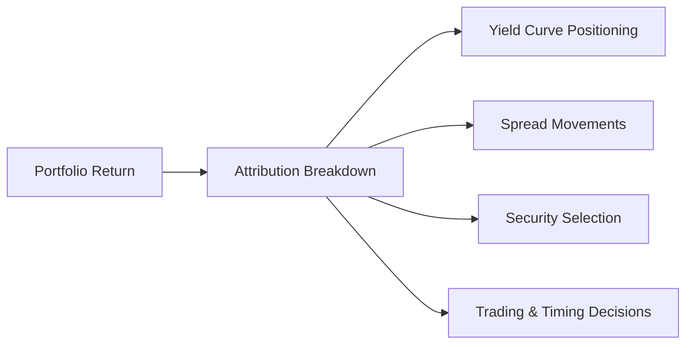
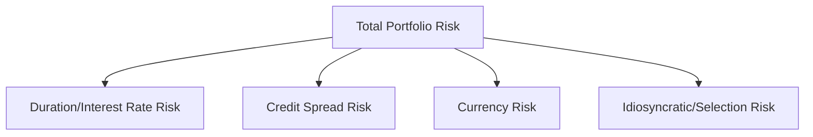

## Introduction and Key Perspectives

I’ll never forget the first time I looked at a performance attribution report for a bond portfolio—my head spun at all the different components. But guess what? Once you break it down step by step, it’s actually a pretty logical process. Performance attribution and risk decomposition are two sides of the same coin. Performance attribution helps you see exactly where your portfolio gains (or losses) are coming from, while risk decomposition tells you where your exposure (and potential pain) lives. 

Fixed-income performance attribution can be more intricate than equity attribution, given the heavy reliance on interest rates, yield curve shifts, and spread movements. Meanwhile, risk decomposition zooms in on sources of volatility, focusing on aspects like duration risk, credit spreads, optionality, and currency exposures for international bond holdings. The combination of these analyses supports better portfolio management decisions. 

## Performance Attribution: Foundations

Performance attribution is about explaining how your portfolio rode the waves of the bond market relative to some benchmark. Typically, managers want to know:

• How much of the return was due to general market movements (e.g., overall shifts in interest rates)?  
• How much came from spread moves (e.g., corporate vs. Treasury differentials)?  
• Did security selection—picking specific bonds—enhance return or detract from it?  
• Did short-term trading or timing decisions matter?

### Building Blocks of Attribution

1. Benchmark Selection  
   Performance attribution is only as good as the benchmark you pick. If your benchmark is a broad aggregate bond index and you deviate by loading up on high-yield securities, you’ll need to highlight that difference in your attribution analysis.

2. Return Decomposition  
   Returns are often sliced into categories such as income return (coupon payments), price return (changes in bond prices due to interest rates and credit spreads), and sometimes currency return (for global portfolios). By subtracting these components at the benchmark level from those at the portfolio level, you isolate where your outperformance or underperformance really stems from.

3. Yield Curve Alignment  
   Because interest rates change over time, yield curve positioning is huge. Did you overweight the short end of the curve, anticipating a flattening? That might all show up in your attribution as yield curve or duration positioning effects.

4. Spread Behavior  
   For corporate bonds, mortgage-backed securities (MBS), and other non-sovereign paper, spread tightening or widening can explain a big portion of performance. Sometimes it’s helpful to see if the manager benefited from a general rally in credit spreads or if they successfully timed a reversal in high-yield markets.

### Top-Down vs. Bottom-Up

• Top-Down Approach: Breaks down returns driven by macro-level decisions—duration stance, yield curve tilt, sector allocations.  
• Bottom-Up Approach: Usually focuses more granularly on each bond’s performance relative to its peers or relative to the “normal” risk factors.  

In practice, you often combine the two: first identify broad-decision successes (or failures), then assess the security selection overlays.

## Common Attribution Methods

### Brinson-Like Factor Decomposition

Although originally popularized for equities, a Brinson framework can be extended into fixed income. It typically involves comparing portfolio weights and returns to benchmark weights and returns for each segment of the yield curve or sector (e.g., AAA corporate, BBB corporate, government, mortgage-backed).

From there, you calculate:

• Allocation Effect: Overweighting or underweighting particular sectors or maturities compared to the benchmark.  
• Selection Effect: Outperformance or underperformance of specific bonds within those sectors or maturities.  
• Interaction Effect: The interplay between allocation choices and selection results—often captured as a cross-term.

### Factor-Based or Risk-Based Models

In some institutions, you see multifactor models dissecting performance across yield curve factors (parallel shift, slope, curvature), spread factors (investment grade, high yield, emerging markets), and idiosyncratic factors (security-specific). The model attributes returns to each factor, showing which exposures “won” and which “lost” relative to similar exposures in the benchmark.

One straightforward way is to use key rate durations (see Section 8.4, Key Rate Duration) as the building blocks. You compare how the portfolio’s distribution of key rate durations differs from the benchmark, measure the direction and magnitude of yield changes at each node, and multiply them to see the effect.

Below is a conceptual diagram illustrating performance attribution components:

## Risk Decomposition: Pinpointing Sources of Volatility

So, we’ve seen how to slice and dice returns. But where does the portfolio’s risk actually come from? Risk decomposition, in a nutshell, tries to measure the portfolio’s sensitivity to different factors so that you understand your vulnerability if those factors move against you. Key areas:

• Duration Risk (Interest Rate Risk): If your portfolio has a long average duration, a big jump in rates can hammer you.  
• Yield Curve Risk: Even if the overall level of rates doesn’t change much, changes in the slope or curvature can create winners and losers.  
• Spread Risk: Widening or tightening spreads in corporate or other credit markets.  
• Currency Risk: For global portfolios, you might care about foreign exchange fluctuations.  
• Optionality Risk: Bonds with embedded options (callable, putable) can exhibit convexity effects that standard durations miss.

### Factor Decomposition in Fixed Income

Factor-based risk models look at:

• Systematic Factors: Broad interest rate environment, credit environment, liquidity premiums.  
• Idiosyncratic Risk: Individual issuer or issue specifics.

Let’s say your firm uses a classic factor model with four main factors:  
1. Parallel Yield Curve Shift  
2. Slope Adjustment  
3. Credit Spread Change (IG)  
4. Credit Spread Change (HY)

The model would measure how each of these factors historically affects individual securities and then aggregate up to the portfolio level. You’d output something like: “65% of total risk arises from interest rate changes, 20% from credit spread fluctuation, 10% from currency exposure, and 5% from idiosyncratic factors.” 

To visualize, imagine a simple risk decomposition diagram:

## Integrating Performance Attribution and Risk Decomposition

These processes are complementary. Performance attribution shows which bets worked out, while risk decomposition shows how big each bet really is. In an ideal scenario, if a certain strategy is generating limited return but carrying a large chunk of the overall risk, you probably need to reconsider that strategy. Conversely, if a small position is driving a large chunk of outperformance without swelling your risk profile, that’s a sweet spot.

### Practical Tips and Tools

• Consistent Data and Benchmarks: Whether you’re using Bloomberg indices or ICE BofA indices (formerly BofA Merrill Lynch), be sure you handle pricing feeds, yield curve data, and security analytics consistently.  
• Key Rate Durations: Splitting the yield curve into key nodes—1-year, 2-year, 5-year, 10-year, and so forth—helps you measure how changes at each segment affect your portfolio vs. the benchmark.  
• Regression Methods: Some managers use regressions on historical returns to attribute performance among factors. That approach can be powerful but might also pick up noise if you have limited data.  
• Overlay Strategies: Tools like interest rate swaps or credit derivatives can change your exposure without rearranging the underlying bond portfolio. Keep track of these overlays in your attribution.  
• Reporting Frequency: Monthly or quarterly attribution is common, but some managers do it daily, especially if short-term trading or dynamic hedging is a key source of value.

## Illustrative Example

Let’s consider a simplified example. Imagine you manage a bond portfolio and your chosen benchmark is the Bloomberg U.S. Aggregate Bond Index. Over the past quarter:

• Your portfolio returned +2.5%, while the benchmark returned +2.0%. You have +0.5% of excess return.  
• Through decomposition, you find:  
  – Yield Curve Positioning: +0.3% (because you overweighted the mid-range maturities that rallied)  
  – Spread Positioning: +0.1% (narrowing of corporate spreads helped your slight overweight in investment-grade corporates)  
  – Security Selection: +0.05% (picking specific issues with favorable fundamentals)  
  – Trading/Timing: +0.05% (short-term trades captured a short-lived dip in rates)

Hence, that sums up your +0.5% outperformance. 

Next, risk decomposition might reveal that 60% of your portfolio’s tracking error vs. the benchmark is due to your duration stance, 30% from credit risk, and 10% from minor currency exposures in your off-benchmark positions. If your risk appetite is mainly for credit strategies, you might want to reduce your duration stance to lower the interest rate contribution to overall risk.

## Challenges and Common Pitfalls

• Inconsistent Data: Returns, prices, and yields might be sourced from different times of day or data providers, causing distortions in attribution results.  
• Overlapping Factors: It’s sometimes tricky to disentangle yield curve effects from credit spread effects, especially when market liquidity is thin.  
• Ignoring Transaction Costs: Gains from trading might be overstated if you don’t systematically account for bid-ask spreads or commissions.  
• Complexity vs. Clarity: Overly complicated models (with dozens of factors) can create confusion instead of clarity. Keep it as simple as possible while capturing major drivers.

## Conclusion

Fixed-income performance attribution and risk decomposition may initially sound intimidating, but once you break it into smaller chunks—duration vs. spread vs. selection vs. trading—you gain a crystal-clear view of how and why you earned your results. And by simultaneously monitoring where your risk is coming from, you can ensure your performance drivers align with your risk budget and investment objectives. 

For sure, it takes a bit of practice and consistent methodologies, but the payoff is substantial. Attribution helps you refine your strategy, justify your decisions to stakeholders, and continuously learn which bets work best. Risk decomposition, meanwhile, stops you from being blindsided by exposures you didn’t even realize you had. 

When done right, these analyses can transform fixed-income portfolio management from guesswork into a well-tuned discipline, guiding you to better performance and robust risk control.  

## References and Further Reading

- Bacon, C. R. (2012). Practical Portfolio Performance Measurement and Attribution. Wiley.  
- Christopherson, J. A., Carino, D. R., & Ferson, W. E. (2009). Portfolio Performance Measurement and Benchmarking. McGraw-Hill.  
- CFA Program Curriculum (Level I), various chapters on Fixed-Income Attribution and Benchmarking.  

## Mastering Fixed-Income Attribution and Risk Decomposition: A Comprehensive Quiz



### 1. What is the fundamental goal of performance attribution in fixed-income portfolios?

- [ ] To maximize returns using only duration extensions.  
- [x] To explain incremental returns relative to a benchmark by breaking down sources of performance.  
- [ ] To limit the use of derivatives in the portfolio.  
- [ ] To reallocate assets strictly based on observed yield curve shifts.  

> **Explanation:** Performance attribution is all about explaining how different strategies (yield curve positioning, spread decisions, etc.) contributed to out- or under-performance relative to a benchmark.  

### 2. Which of the following is NOT typically decomposed in a fixed-income performance attribution analysis?

- [ ] Yield curve effects  
- [ ] Spread movements  
- [x] Stock market momentum  
- [ ] Security selection  

> **Explanation:** Fixed-income attribution focuses on factors like yield curve, spread, and individual bond selection. Stock market momentum is outside the scope of traditional bond-based attribution.  

### 3. In a factor-based risk decomposition, which of the following best describes “systematic factors”?

- [ ] Security-specific events, such as an issuer’s credit downgrade  
- [x] Broad market influences, such as changes in the overall interest rate environment  
- [ ] Volatility that arises from day-to-day trading decisions  
- [ ] Portfolio manager’s personal choices on trading volume  

> **Explanation:** Systematic factors typically refer to macro-level risks like interest rate and credit spread movements that affect most or all bonds.  

### 4. If a portfolio manager’s return is primarily attributed to sector allocation differences compared to the benchmark, which effect is typically highlighted in a Brinson-style analysis?

- [x] Allocation effect  
- [ ] Selection effect  
- [ ] Interaction effect  
- [ ] Timing effect  

> **Explanation:** In Brinson-style models, overweighting or underweighting specific sectors relative to the benchmark highlights the allocation effect.  

### 5. A performance attribution analysis reveals the portfolio outperformed by 0.50% over the benchmark. The manager’s yield curve positioning contributed +0.20%, spread positioning contributed +0.10%, security selection contributed +0.15%, and trading contributed +0.10%. Which statement is correct?

- [ ] The net contribution to performance is less than 0.50%.  
- [x] The net contribution of all factors adds up to more than 0.50%, suggesting an inconsistency or residual.  
- [ ] Each factor is precisely measured with no residual term.  
- [ ] Trading decisions had the smallest effect on performance.  

> **Explanation:** Adding 0.20% + 0.10% + 0.15% + 0.10% yields 0.55%, which is above the 0.50% total outperformance. This discrepancy suggests a residual or rounding error that needs explanation in the analysis.  

### 6. Which of the following risk factors typically accounts for changes in bond prices due to changing credit quality perceptions?

- [x] Spread risk  
- [ ] Duration risk  
- [ ] Currency risk  
- [ ] Basis risk  

> **Explanation:** Spread risk pertains to changes in yield spreads of the bond over the relevant risk-free rate, often driven by changing perceptions of credit quality.  

### 7. In a global bond portfolio, which additional risk factor is most commonly considered besides duration, yield curve, and spread?

- [ ] Liquidity risk only  
- [ ] Stock market risk  
- [ ] Equity factor risk  
- [x] Currency risk  

> **Explanation:** Global bond investors must consider fluctuations in exchange rates, making currency risk an additional factor in risk decomposition.  

### 8. You discover that a large portion of the portfolio’s tracking error comes from short-dated interest rate positioning rather than credit spread bets. Which strategy might be most suitable if you want to reduce that tracking error?

- [x] Adjust the key rate duration at the short end to align more closely with the benchmark  
- [ ] Increase exposure to high-yield bonds  
- [ ] Add more long-dated Treasuries  
- [ ] Sell all corporate issues and invest in equities  

> **Explanation:** If short-dated interest rate positioning is causing most of the tracking error, aligning short-duration exposures with the benchmark can help reduce it.  

### 9. Why is consistent pricing data crucial in performance attribution?

- [x] Inconsistent data can skew relative return calculations and produce misleading attribution results.  
- [ ] Pricing data is unrelated to performance calculations.  
- [ ] Only prices at the end of a quarter matter for accurate attribution.  
- [ ] Attribution analysis is strictly dependent on credit models, not pricing data.  

> **Explanation:** Performance attribution (and risk decomposition) rely on accurate, consistent pricing to measure gains or losses on each bond, ensuring correct relative comparisons to the benchmark.  

### 10. True or False: Performance attribution metrics can fully capture the exact implications of embedded options in bonds without any specialized modeling.

- [ ] True  
- [x] False  

> **Explanation:** Bonds with embedded options (callable, putable) require more specialized modeling (e.g., OAS, effective duration) to capture how the option’s convexity affects returns. Standard attribution approaches may not fully capture option effects without these adjustments.  


