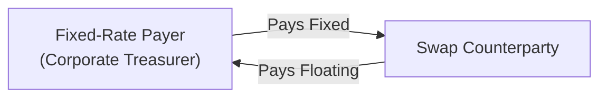
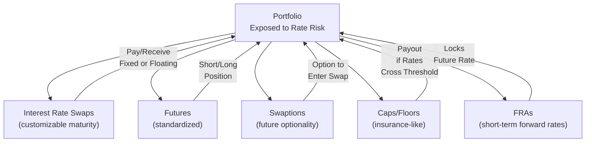

## Introduction and Overview

So, I remember this time early in my career—maybe it was during an internship—when my team discovered that our bond portfolio’s duration was just totally skewed by an unexpected shift in the yield curve. We got blindsided because interest rates went in a direction management hadn’t forecasted, and, honestly, it cost the firm a pretty penny. That was my introduction to interest rate derivatives. I was amazed that with just a few carefully selected instruments—like interest rate swaps or futures—we could have significantly reduced (or even neutralized) our portfolio’s exposure. 

Anyway, in this section, we’ll dive into robust hedging techniques using interest rate derivatives, building on fundamental concepts discussed in earlier parts of this chapter (especially around duration, convexity, and yield curve shifts). We’ll explore how managers use these derivatives—futures, swaps, swaptions, caps/floors, and forward rate agreements—to create sophisticated, targeted hedges. Along the way, we’ll look at real-world scenarios, highlight pitfalls, and tie everything back to the bigger picture of portfolio management. 

## Role of Advanced Interest Rate Derivative Strategies 

Interest rate derivatives aren’t just fancy add-ons; they’re crucial tools that allow bond portfolio managers (and, frankly, any manager with exposure to interest rates) to control or fine-tune interest rate exposure. In particular:

• They permit precise adjustments: A manager can hedge only a specific segment of the curve (like the short end) or the entire duration of a long-term bond portfolio.  
• They often prove more cost-efficient than trading the underlying cash securities, especially with large nominal values or illiquid instruments.  
• They help manage risk without necessarily altering the composition of a portfolio’s core holdings, which might have tax or regulatory constraints.

But it’s not all sunshine. One must be aware of basis risk—where the derivative’s pricing may not track perfectly with the underlying asset. There’s also counterparty risk, especially on over-the-counter (OTC) structures such as interest rate swaps. 

## Key Instruments for Hedging Interest Rate Risk

### Interest Rate Futures

Futures on government bonds (e.g., Treasury futures) or on short-term rates (e.g., Eurodollar futures) are standardized exchange-traded contracts. A quick recap:

• With interest rate futures, you lock in a price (or rate) for a standardized notional amount and a specific maturity.  
• Liquidity is often deep, particularly for popular maturities. Plus, centralized clearing reduces counterparty risk compared to some OTC instruments.  
• The flip side: standardization can be limiting if you need a more tailored hedge or if your bond exposure has certain unique features (like credit risk or embedded options).

In practice, a portfolio manager holding long-term bonds who fears rising rates might short Treasury futures to offset potential price declines. Conversely, if you expect to issue debt soon and are worried about a rate hike, you could buy interest rate futures that profit if rates go up, offsetting any increased borrowing cost.

### Interest Rate Swaps

An interest rate swap is an OTC agreement to exchange fixed rate payments for floating rate payments, or vice versa, on a specified notional principal. For instance, a manager with a floating rate liability might want to pay fixed and receive floating to lock in a stable cash outflow. 

Below is a simple flowchart illustrating the idea of a plain vanilla payer swap (you pay fixed, receive floating):

• Notional principal typically does not exchange hands; it only serves as a reference amount for the interest calculations.  
• Swaps can be customized in terms of maturity, payment frequency, and day-count conventions, making them very flexible.  
• Counterparty risk management becomes critical. Central clearing has become more common after regulatory reforms, but not all swaps (especially more bespoke ones) are cleared.

From a portfolio management perspective, interest rate swaps are often used to transform the duration profile of a portfolio. If you hold a large portion of fixed-rate assets but you’d prefer a floating rate exposure, you might enter into a receive-fixed/pay-floating swap. 

### Swaptions

A swaption is an option on a swap: it grants the right, but not the obligation, to enter into a swap at a later date. You pay a premium upfront, and then if rates move in an unfavorable direction, you can exercise your option to lock in a more favorable swap rate. 

Swaptions can be extremely useful if you anticipate future borrowing or lending but aren’t certain that you’ll do it—or you might just want to protect yourself if rates suddenly spike. The premium is the “cost of insurance.” The manager retains the flexibility not to exercise if it becomes unnecessary or if rates move in a favorable direction.

### Interest Rate Caps and Floors

Caps set an upper limit on interest rates, compensating the holder if the reference floating rate (e.g., LIBOR, or now often SOFR) rises above a specified strike. Floors set a lower boundary, paying off if rates drop beneath the floor rate. Each of these can be viewed as a series of interest rate call/put options on short-term rates for each reset period.

• Borrowers often buy caps to hedge against rates rising above a certain threshold.  
• Investors in floating rate instruments might buy floors to hedge the risk of short-term rates falling too far.  

They operate like insurance policies: you pay a premium, and if the rate crosses the strike, you receive payouts that offset your underlying losses.

### Forward Rate Agreements (FRAs)

An FRA is essentially a forward contract on a short-term interest rate, such as 3-month LIBOR or SOFR starting in, say, three months and lasting for another three months (3×6 FRA). It allows you to lock in an interest rate for future borrowing or lending. So if you know you’ll be borrowing in three months but worry about a rate spike, you can “buy” an FRA to pay a fixed rate and receive the floating rate if rates go up. 

FRA example payoff in KaTeX:


\text{FRA Payoff} = 
\begin{cases}
0, & \text{if } (R_{\text{ref}} - K) \le 0 \\
\frac{(R_{\text{ref}} - K)\times \text{Notional}\times(t)}{1 + R_{\text{ref}}\times t}, & \text{if } (R_{\text{ref}} - K) > 0 
\end{cases}


Where:
- \\( R_{\text{ref}} \\) is the reference (floating) rate at FRA maturity.  
- \\( K \\) is the agreed (fixed) rate, known at the inception of the FRA.  
- \\( t \\) is the fraction of the year (e.g., 0.25 for 3 months).

These are quite common among banks and corporate treasurers looking to stabilize future interest expenses or revenues.

## Designing a Hedge Strategy

### Identifying Target Duration and Yield Curve Exposure

Advanced hedging typically starts with analyzing a portfolio’s duration distribution and key rate durations (as discussed in Section 8.4 on Key Rate Duration). If the goal is to hedge parallel shifts in the yield curve, simpler instruments (like Treasury futures) might suffice. But if you expect a twist or butterfly shift, you might need a combination of instruments—maybe a swap to hedge the mid-range of the curve and a futures contract for the short or long end. 

### Combining Multiple Derivatives

Sometimes mitigating interest rate risk involves layering different products. For instance, you might anticipate both a moderate rise in rates and a possible flattening of the yield curve. One approach is to use a swap to receive fixed (hedging the rise in short-term rates) while simultaneously shorting a long-term Treasury futures contract to protect against the flattening. 

### Scenario Testing and Stress Analysis

Because yield curve shifts aren’t always parallel, it’s good practice to run scenario analyses. That means shifting the entire curve by certain basis points, steepening it, flattening it, or adding a butterfly shift, then seeing how your hedge performs. You also want to see what happens if volatility picks up more than you expected—this is especially true for derivatives with optionality, like caps, floors, or swaptions.

## Real-World Anecdote: Smoothing Cash Flows

Let’s say you’re managing a bond portfolio for a mid-level insurance company. You have a big chunk of liabilities paying out next year, funded by bonds that won’t mature until two years from now. But you suspect rates might rise in the interim. By entering into a receive-fixed/pay-floating swap for that one-year gap, you lock in an effective sale price for those bonds (in a sense) without having to exit your position prematurely and possibly realize capital gains or losses right now. This approach can smooth your cash flows and help you meet internal return objectives while minimizing interest rate surprises.

## Counterparty and Basis Risk Considerations

• Basis risk: It becomes a factor when the reference rate for your derivative doesn’t align perfectly with the rates driving your bond portfolio. For example, you hedge a corporate bond with a Treasury future, but if the corporate spread widens, the hedge might only partially offset your losses.  
• Counterparty risk: Even though central clearing has reduced some concerns, you still need to assess the creditworthiness of your swap counterparties or clearinghouses. Collateral management via margin calls is standard practice.

## IFRS vs. US GAAP Treatments

Under both IFRS and US GAAP, derivatives are generally measured at fair value on the balance sheet. Gains or losses might go to profit and loss (P&L) or be deferred in other comprehensive income, depending on hedge accounting designations (e.g., cash flow hedge vs. fair value hedge). The key differences often lie in the documentation, effectiveness testing, and rebalancing requirements. Here’s a brief overview:

• Hedge Documentation: Both IFRS and US GAAP require strong documentation from inception. Under IFRS 9, there’s more flexibility in hedging relationships than under the older IAS 39. US GAAP has its own set of hedge accounting rules, requiring highly effective hedges, with an emphasis on quantitative testing.  
• Effectiveness Testing: IFRS 9 introduced a more principle-based approach, focusing on an “economic relationship” between the hedged item and the hedging instrument. US GAAP typically still mandates an 80–125% offset range, though it has been relaxed in some areas.  
• Rebalancing: IFRS 9 allows rebalancing the hedge ratio if the underlying changes. This can keep the hedge relationship alive. US GAAP has historically been more rigid, although updated guidance has made it incrementally more flexible.

For a fixed-income portfolio manager, the main takeaway is that you’ll need to maintain consistent, documented practices for measuring hedge effectiveness if you want to qualify for the beneficial hedge accounting treatment that avoids big P&L swings from marking derivatives to market. If hedge accounting isn’t used, derivatives can introduce significant volatility into your reported earnings—even though economically, you’re hedged.

## Potential Pitfalls and Best Practices

• Over-hedging: Hedging more exposure than you actually have can turn your hedge into a speculative position.  
• Ignoring Liquidity: Sometimes the best derivative to hedge your exact exposure might be relatively illiquid, leading to wide bid-ask spreads.  
• Not Revisiting the Hedge: Market conditions change. A hedge that was optimal a few months ago may no longer align with your portfolio’s risk profile.  
• Underestimating Correlation Breakdowns: If you’re hedging a corporate bond with a Treasury derivative, you assume corporate spreads remain stable relative to Treasuries. But in stressed markets, the correlation can break down.  
• Operational Risk: Complex hedges can require multiple trades, margin accounts, and settlement processes that introduce administrative complexities.

## Diagram: Linking Key Hedging Instruments

Below is a simplified diagram showing how different derivatives “attack” various aspects of interest rate exposure:

## Putting It All Together: A Quick Example

Let’s take a manager who, in six months, needs to issue a floating rate note to finance a new project expansion. The manager expects rates could shoot up before that issuance. One strategy might be:

1. Immediately buy a 6×12 FRA to lock in a favorable 6-month borrowing rate starting in 6 months.  
2. Additionally, purchase an interest rate cap if the FRA size doesn’t cover the entire exposure or if a sudden spike beyond the FRA coverage is feared.  

This combination ensures that if rates climb above a certain threshold, the cap kicks in, and if rates remain moderate, the worst-case is the premium paid for the cap plus any FRA loss (which is offset by savings in the actual interest paid on the note). 

## Exam Tips and Best Practices

It’s easy to get caught up in memorizing formulas, but simulation-based questions often test if you can reason about various hedging instruments under different yield curve environments. Keep in mind:

• Understand the trade-offs among all derivative types—liquidity, customization, premium costs, and standardization.  
• Show your ability to apply scenario testing: “What if the curve steepens by 50 bps at the short end but flattens at the long end?”  
• Practice analyzing basis risk. State clearly in your explanations how the underlying might deviate from the hedge.  
• Remember that in the exam, you might see a question about a future liability or asset purchase and will need to pick the best derivative or set of derivatives.

Managers who thoroughly prepare for credit risk, basis risk, liquidity risk, and operational intricacies (margining, documentation, settlement) tend to design more robust real-world hedges, a skill that the CFA Program consistently emphasizes.

## References and Further Reading

• Hull, J. (2018). Options, Futures, and Other Derivatives. Pearson.  
• CFA Program Curriculum (Level I), Derivatives for Fixed Income Hedging.  
• Choudhry, M. (2019). Fixed Income Markets: Management, Trading, and Hedging. Wiley.  
• BIS (Bank for International Settlements) – Publications on OTC Derivatives Markets.  
• CFA Institute Code and Standards – Guidance on Prudent Risk Management.

--------------------------------------------------------------------------------

## Test Your Knowledge: Advanced Interest Rate Derivative Strategies



### 1. Which of the following interest rate derivatives is most likely to be used for locking in a future short-term borrowing rate?

- [ ] Interest rate caps
- [ ] Interest rate swaps
- [x] Forward Rate Agreements
- [ ] Swaptions

> **Explanation:** FRAs are specifically designed to lock in a future borrowing or lending rate for a short-term period. Caps, swaps, and swaptions serve different but related purposes.

### 2. A portfolio manager wants to hedge against rising interest rates on her 10-year fixed-rate bond holdings. She decides to pay fixed and receive floating in a swap. What is the direct effect of such a swap position on her portfolio’s duration?

- [x] It reduces the effective duration of the portfolio.
- [ ] It increases convexity while leaving duration unchanged.
- [ ] It creates a leveraged exposure to interest rates.
- [ ] It has no effect unless rates actually rise.

> **Explanation:** Paying fixed in a swap effectively transforms the fixed-rate exposure to floating. This lowers the portfolio’s sensitivity to interest rate changes, thus reducing duration.

### 3. A swaption grants the buyer the right, but not the obligation, to:

- [ ] Buy or sell a government bond at a specified price before expiry.
- [ ] Cancel an existing interest rate swap at a predetermined future date.
- [x] Enter into a specific interest rate swap at a future date.
- [ ] Convert a floating rate instrument to fixed at any time.

> **Explanation:** A swaption is an option that permits entering (or not entering) into a swap contract under certain pre-agreed terms.

### 4. You are hedging a corporate bond with a Treasury futures contract. Which of the following risks is most relevant if corporate spreads widen significantly?

- [ ] Reinvestment risk
- [x] Basis risk
- [ ] Settlement risk
- [ ] Interest rate risk

> **Explanation:** Basis risk arises because the hedge instrument (Treasury futures) tracks government bond yields, not corporate bond spreads. If corporate spreads widen, the hedge might not fully cover the loss on the corporate bond.

### 5. Which derivative would an entity typically purchase to limit the maximum interest rate on a floating rate loan?

- [x] An interest rate cap
- [ ] An interest rate floor
- [ ] A receive-fixed interest rate swap
- [ ] A short Treasury futures position

> **Explanation:** A cap is structured to protect borrowers by paying out whenever rates exceed the cap’s strike rate.

### 6. A manager who expects to borrow in 3 months and wants to hedge against rising rates could do which of the following?

- [x] Buy a 3×6 FRA
- [ ] Sell a 3×6 FRA
- [ ] Pay fixed in a current interest rate swap
- [ ] Sell an interest rate cap

> **Explanation:** Buying a 3×6 FRA locks in the borrowing rate for the 3- to 6-month period, protecting against rate increases.

### 7. A portfolio manager wants the option to switch from floating to fixed in a year but is not sure if market conditions will warrant it. Which instrument is most appropriate?

- [x] A receiver swaption
- [ ] A payer swaption
- [ ] A forward rate agreement
- [ ] A long Treasury future

> **Explanation:** A receiver swaption gives the holder the right to receive fixed and pay floating in a swap, thus converting from floating to fixed if it becomes advantageous.

### 8. Under IFRS 9, which of the following best describes the approach to hedge accounting effectiveness testing?

- [x] A principle-based approach focusing on the existence of an economic relationship
- [ ] Strict 80–125% offset guidelines for all hedges
- [ ] No requirement for quantitative documentation
- [ ] Prohibits rebalancing of the hedge ratio after inception

> **Explanation:** IFRS 9 uses a principles-based approach with less rigid thresholds, allowing rebalancing and focusing on economic substance rather than numerical strictness alone.

### 9. When using multiple derivatives to hedge a potential flattening of the yield curve, which of the following is crucial?

- [ ] Ignoring scenario analysis to avoid confusion
- [ ] Matching the delta of all instruments perfectly
- [ ] Selecting only standardized instruments
- [x] Conducting scenario testing to see how each instrument performs in different yield curve shapes

> **Explanation:** Scenario analysis helps ensure that each component of the hedge strategy works together under various yield curve shifts.

### 10. True or False: Paying fixed in an interest rate swap is essentially equivalent to issuing a fixed-rate bond.

- [x] True
- [ ] False

> **Explanation:** Paying fixed on a swap and receiving floating emulates the cash flows of a fixed-rate liability, much like issuing a fixed-rate bond.


