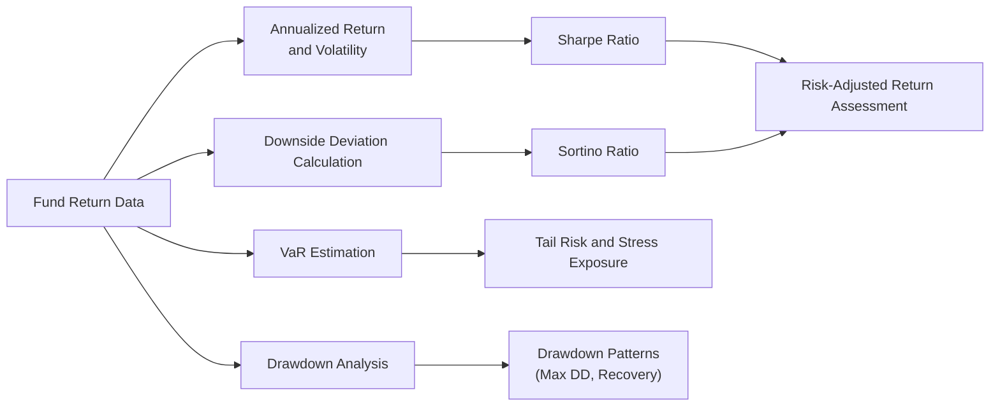

## Introduction

Ever bumped into a fixed-income hedge fund that promises steady returns regardless of what the market does? Well, you’re not alone. Many investors look to these funds for diversification, downside protection, or even a chance to profit from interest rate dislocations. But how do you honestly figure out if a hedge fund’s performance stats hold water? That’s where performance measures come in. They’re like the scoreboard of the investing world—useful only if you know which metrics matter, how they’re derived, and what might be lurking behind that smooth, upward-sloping NAV.

In fixed-income hedge funds, managers often work with leveraged strategies, short-selling, or complex relative value plays. While these strategies can be exciting and potentially lucrative, they also add layers of complexity and risk that aren’t always apparent at first glance. This section explores key performance measures that can help you cut through that complexity: annualized return and volatility, the Sharpe Ratio, the Sortino Ratio, Value at Risk (VaR), and drawdown analysis. We’ll also share a few cautionary tales about illiquidity, redemption gates, and how monthly NAVs might not tell the entire story.

## Foundations of Fixed-Income Hedge Fund Strategies

Fixed-income hedge funds incorporate a wide range of approaches—long/short credit, global macro, convertible bond arbitrage, or relative value trading, just to name a few. The idea is to capture inefficiencies in bond pricing, exploit interest rate differentials, or take advantage of credit spread opportunities. Many of these positions might be centered in obscure corners of the market where liquidity is limited or volatility is understated.

While those positions can create opportunities for alpha, they also introduce unique risks. And if you add leverage on top—borrowing to amplify your bets—things get even trickier. So, from a performance measurement standpoint, it’s crucial to distinguish between skill-based returns and returns simply magnified by leverage or artificially smoothed by illiquid pricing.

## Common Performance Measures

### Annualized Return and Volatility

One of the first steps in evaluating a fixed-income hedge fund is looking at its annualized return and volatility. 

• Annualized Return: This measure shows the compounded growth rate of the fund over a specified period (often monthly returns aggregated over a year).  

• Volatility (Standard Deviation): This indicates the variability of returns. Higher volatility often implies higher risk, though in a hedge fund context, volatility can be subdued by “smooth” reporting techniques if the underlying assets are illiquid.  

From an exam perspective, it’s straightforward to calculate annualized returns if you have monthly returns:

Let rₘ be the monthly return for month m, then the annualized return over M months can be approximated (geometrically) by:


(1 + r_\text{annualized}) = \prod_{m=1}^{M} (1 + r_m)^{\frac{12}{M}} 


Volatility is typically measured by the standard deviation of returns. If σₘ is the standard deviation of monthly returns, the annualized volatility is often approximated as:


\sigma_\text{annualized} = \sigma_m \times \sqrt{12}


But watch out. If the hedge fund invests in private credit or other illiquid bonds, then monthly statements might not reflect true day-to-day price fluctuations, which can artificially reduce measured volatility.

### Sharpe Ratio

The Sharpe Ratio is a popular gauge of risk-adjusted returns:


\text{Sharpe Ratio} = \frac{R_p - R_f}{\sigma_p}


• Rₚ = Portfolio Return  
• R_f = Risk-Free Rate (often a short-term Treasury rate)  
• σₚ = Standard Deviation of the Portfolio’s Excess Return  

If you see a high Sharpe Ratio, it ostensibly means the fund is generating above-average returns for the amount of risk taken. But, especially in fixed-income hedge funds, a high Sharpe Ratio might be propped up by illiquidity, which suppresses volatility estimates. I once reviewed a fund that bragged about a Sharpe Ratio above 3 for three consecutive years, only to discover that most positions were in lightly traded emerging market debt. When liquidity dried up, the fund took a major hit and that storied Sharpe Ratio was exposed as artificially inflated. The lesson? Always check how the underlying valuations are determined and whether the standard deviation is truly representative.

### Sortino Ratio

Sometimes, it feels like the Sharpe Ratio punishes both positive and negative volatility equally. That’s when the Sortino Ratio comes into play. Instead of standard deviation, it focuses on downside deviation:


\text{Sortino Ratio} = \frac{R_p - R_f}{\sigma_{d}}


• σ₍d₎ is the standard deviation of the portfolio’s negative returns, also called “downside deviation.”  

The idea is that investors mainly care about volatility on the downside, not the upside. For example, if your fixed-income strategy occasionally jumps to an unusually high return, that’s a “good surprise” you probably don’t want penalized. In a fixed-income hedge fund that invests in credit instruments, the Sortino Ratio can be especially insightful. These funds might experience moderate returns most of the time but occasionally get hammered by credit events. The Sortino Ratio zeroes in on those negative tails, which is precisely where the real heartbreak often occurs.

### Value at Risk (VaR)

Value at Risk estimates how much the portfolio might lose, given normal market conditions, in a specific time frame with a stated confidence level (e.g., 99% over one month). 

For instance, saying “There is a 1% chance the fund will lose more than $2 million in a month” is a typical VaR statement. It’s a neat measure, but:

1. VaR might not capture extreme tail events (“Black Swan” scenarios).  
2. Historical VaR depends heavily on the period chosen; if your sample didn’t include any major credit crisis, your VaR might look deceptively calm.  
3. For heavily leveraged positions or derivative overlays, VaR calculation can get complicated real fast.  

Exam questions often test your ability to interpret VaR in the context of varying confidence levels or different return distributions. Also, remember that VaR is not a guarantee. It’s just the tip of the iceberg in many risk management discussions and should be complemented by other analyses like stress tests or scenario analyses.

### Drawdown Analysis

Drawdown measures how much an investment (or fund) falls from its previous peak. Hedge funds can go for months (or even years) without a large drawdown if markets are calm or if the fund’s strategy thrives in certain market conditions. But once trouble hits—credit events, liquidity crises, or macro shocks—drawdown analysis helps you see how severely the fund might lose capital and how quickly it recovers. 

• Maximum Drawdown: The largest peak-to-trough decline during a specified period.  
• Recovery Period: The time it takes to climb back from that trough to a new peak.  

For instance, if a bond arbitrage fund experiences a 15% loss over two months and then takes another 18 months to regain the prior high-water mark, that’s a pretty significant drawdown. In the real world, drawdowns can be triggered by credit downgrades, unexpected interest rate hikes, or forced selling if the fund’s financing is yanked. These scenarios often appear in exam questions that require interpreting what a sustained drawdown might mean for the fund’s viability.

## The Challenge of Illiquidity and NAV Smoothing

Unlike a plain-vanilla mutual fund that invests in liquid, exchange-traded securities, a fixed-income hedge fund might hold positions in private loans or complex structured products. Managers could mark these assets to “model” instead of market, which can smooth monthly returns. 

When returns are artificially stabilized:

• Volatility is understated.  
• Sharpe (and Sortino) Ratios might be overstated.  
• Drawdowns might not appear until the manager is forced to liquidate or face a redemption wave.  

It’s not that managers are always trying to mislead investors; sometimes there just isn’t a readily observable market price. But as an investor or analyst, you have to approach performance metrics with a healthy dose of skepticism—or you might find yourself in an unwelcome surprise if the fund gates redemptions or locks up your capital to avoid forced asset sales.

## Strategy Alignment with Investor Risk Tolerance

Fixed-income hedge funds can be all over the map:  
• Relative Value strategies: Might deliver smaller returns but with lower volatility.  
• Distressed Debt strategies: Can offer large payoffs if the manager successfully restructures undervalued bonds, but these positions may be illiquid and carry event risk.  
• Macro-Driven strategies: More volatile, with returns tied to interest rate calls or currency bets that can swing widely.

From a practical perspective, it’s essential to match the hedge fund’s strategy—with all its quirks, potential illiquidity, and reliance on leverage—to an investor’s risk tolerance. One manager might promise an annualized 8%–10% with minimal drawdowns, while another might deliver 15%–20% but with the potential for big monthly hits. Both can be “right” depending on your objectives and your ability to stomach short-term gains or losses.

## Lockup Periods and Redemption Gates

Lockup periods, redemption gates, and side pockets are unique features in many hedge funds that can affect how you interpret performance measures:

• Lockup Period: Specifies how long your capital must remain in the fund before it can be redeemed.  
• Redemption Gate: Limits the proportion of total shares that can be redeemed at any one time.  
• Side Pockets: Allow the manager to separate illiquid assets from the main portfolio.  

During market turbulence, if the fund experiences a wave of redemptions, managers might enforce these contractual features. It’s a double-edged sword: they help the manager avoid forced selling, which could crush the portfolio’s value, but they also prevent you from accessing your capital when you may need it most.

Performance metrics like drawdown or VaR don’t typically factor in the effect of gates or lockups. So, the largest drawdown might remain hidden if capital is locked up and positions aren’t priced to reflect market conditions.

## Practical Example of a Sharpe Ratio Calculation in Python

To illustrate some of these concepts, consider a brief code snippet (purely hypothetical) that calculates the Sharpe Ratio for a fixed-income hedge fund based on a year’s worth of monthly returns:

```python
import numpy as np

monthly_returns = np.array([0.01, 0.015, -0.005, 0.02, 0.01, -0.002, 0.012, 0.007, 0.013, 0.018, -0.004, 0.016])
risk_free_rate_annual = 0.02

risk_free_rate_monthly = (1 + risk_free_rate_annual)**(1/12) - 1

excess_returns = monthly_returns - risk_free_rate_monthly

mean_excess_return = np.mean(excess_returns)
std_excess_return = np.std(excess_returns, ddof=1)

mean_excess_return_annual = mean_excess_return * 12
std_excess_return_annual = std_excess_return * np.sqrt(12)

sharpe_ratio = mean_excess_return_annual / std_excess_return_annual

print(f"Annualized Sharpe Ratio: {sharpe_ratio:.2f}")
```

In reality, a fixed-income hedge fund might adjust its monthly NAV using models, which could make the standard deviation artificially low. But from a purely mechanical standpoint, this is how you could compute a Sharpe Ratio from historical data. Exam questions might also provide you with monthly returns, a risk-free rate, and ask you to do a quick calculation. Pay attention to whether the risk-free rate is monthly or annual and how the question wants you to handle compounding.

## Using Diagrams to Compare Measures

Below is a simplified Mermaid diagram illustrating how different performance measures connect to each other and to your overall hedge fund analysis:



This diagram shows that everything flows from the same data set—your fund’s returns. You can compute annualized return, volatility, VaR, and so on, each feeding into your assessment of risk-adjusted return or tail-risk exposure.

## Best Practices, Pitfalls, and Strategies to Overcome Them

• Correlation and Hidden Risks: Hedge funds might appear to have low correlations in calm markets but become highly correlated in stress events. It’s wise to incorporate scenario analyses or stress tests in your approach.  
• Use Multiple Measures: Don’t rely on a single ratio (like Sharpe). Look at Sortino, VaR, and drawdowns as well.  
• Understand the Leverage: Ask if the fund’s returns are stable because of skill or because it’s leveraged 5:1 in a stable interest-rate environment. If rates shift, that stable structure could unravel.  
• Note the Lockup Terms: A strong performance record might be tied to illiquid holdings. Check if there are redemption gates that might lock you in when you want out.  
• Distinguish Systematic vs. Idiosyncratic Risk: A relative value strategy might be more about mispricings in certain bonds rather than a big macro bet on rates. Examine if the manager’s track record stems from specialized knowledge or from a market regime that may not persist.

## Exam Relevance: Tips for Tackling Constructed-Response Questions

1. Read the Scenario Thoroughly: The exam might describe a fixed-income portfolio with certain credit exposures, derivatives overlay, or mention lockup periods. Identify relevant performance measures that best capture risk and return in that scenario.  
2. Show Your Work for Formulas: For instance, if asked to compute the Sharpe Ratio, demonstrate each step—annualizing returns, subtracting the risk-free rate, dividing by standard deviation.  
3. Use Clear Reasoning: If a question asks you to critique a hedge fund’s “high Sharpe Ratio,” mention the possibility of illiquid assets, NAV smoothing, or the limited data frequency.  
4. Allocate Time Wisely: Some questions might combine a performance calculation (like a quick Sharpe Ratio computation) with an interpretive discussion, so pace yourself to handle both math and analysis.

## Conclusion

Measuring the performance of fixed-income hedge funds isn’t a mere numbers exercise. It’s a thoughtful process that requires piecing together returns, volatility, tail risks, and drawdowns—all while keeping an eye on how the fund’s lockup mechanisms or illiquid assets might skew the data. The Sharpe and Sortino Ratios are powerful, but they can be misleading if you fail to consider the nature of the underlying holdings. VaR can help you quantify tail risk, but it may be silent about extreme outliers. And drawdown analysis, well, it’s priceless for understanding worst-case scenarios and your appetite for adversity.

Ultimately, success in this arena hinges on choosing the right blend of performance measures for the strategy at hand, verifying that the data used to calculate these measures are high quality, and grasping the interplay of leverage and liquidity. By staying rigorous, you give yourself—the investor, the analyst, or the exam candidate—the best shot at seeing through the haze and evaluating fixed-income hedge fund performance for what it really is.

## References

• McCrary, S. A. (2010). Hedge Fund Course. Wiley.  
• Lhabitant, F. (2006). Handbook of Hedge Funds. Wiley.  
• CFA Program Curriculum (Level I), Readings on Alternative Investments and Hedge Fund Analysis.

--------------------------------------------------------------------------------

## Test Your Knowledge: Fixed-Income Hedge Fund Performance Metrics



### Which of the following best describes the risk that illiquid fixed-income securities might artificially dampen a fund’s volatility measure?

- [ ] Style drift
- [ ] Beta compression
- [x] NAV smoothing
- [ ] Interest rate refraction

> **Explanation:** NAV smoothing occurs when infrequently traded or hard-to-value securities appear to have low volatility because the fund’s valuation process does not regularly capture price fluctuations.

### If a hedge fund’s Sortino Ratio is significantly higher than its Sharpe Ratio, which statement is most likely true?

- [x] The fund’s upside volatility is skewing the total standard deviation in the Sharpe Ratio upward.
- [ ] The fund is only invested in short-duration Treasuries.
- [ ] The fund’s performance metrics cannot be relied upon.
- [ ] The risk-free rate used is inapplicable for the portfolio.

> **Explanation:** The Sortino Ratio focuses on downside risk, ignoring positive volatility. If the fund shows a high Sortino Ratio relative to the Sharpe Ratio, it may mean returns are more often positive and that the overall standard deviation used in the Sharpe Ratio includes beneficial upside volatility.

### In calculating a 99% monthly VaR, which of the following statements is correct?

- [ ] It guarantees losses will not exceed the VaR amount.
- [ ] It includes extreme black swan events.
- [x] It states there is a 1% chance of exceeding the specified loss in a month under normal conditions.
- [ ] It cannot be applied to leveraged portfolios.

> **Explanation:** VaR is a probabilistic measure indicating that in 1% of cases (at the 99% confidence level), losses could surpass the VaR amount. It does not account for extreme tail events, nor does it guarantee losses will be contained under crisis scenarios.

### A hedge fund with a lockup period and redemption gates might still show a low drawdown even during major market stress because:

- [ ] Drawdown is only calculated once a year.
- [x] The fund may not be forced to sell illiquid holdings at distressed prices due to restricted redemptions.
- [ ] All hedge funds are required by regulation to stop trading during stress events.
- [ ] The manager likely invests only in highly liquid government bonds.

> **Explanation:** With a lockup period and redemption gates, the manager may not have to mark assets down to a market price or meet redemptions immediately, thus artificially keeping drawdown low.

### If you are given 12 monthly returns for a hedge fund and the annual risk-free rate to compute the Sharpe Ratio, which step should you take first?

- [x] Convert the annual risk-free rate to a monthly rate.
- [ ] Ignore the risk-free rate because it’s less than 1%.
- [ ] Add 1% to each monthly return to adjust for inflation.
- [ ] Annualize the monthly returns first, then add the risk-free rate.

> **Explanation:** The typical process is to align the time periods. You must convert the annual risk-free rate to a monthly equivalent before calculating excess returns.

### A primary drawback of using the Sharpe Ratio to evaluate credit-focused hedge funds is:

- [x] Volatility might be understated if assets are illiquid or marked infrequently.
- [ ] Sharpe Ratio is unknown to most credit analysts.
- [ ] It cannot incorporate interest rate movements at all.
- [ ] It is a negative number when returns are positive.

> **Explanation:** A frequent concern is that illiquid holdings can lead to artificially low volatility estimates, making the Sharpe Ratio appear higher.

### Which scenario would most likely result in an inflated Sharpe Ratio for a fixed-income hedge fund?

- [ ] Daily mark-to-market of a portfolio of government Treasuries.
- [ ] Absence of any leverage in the fund’s strategy.
- [x] Using valuation models that rarely mark down potentially distressed bonds.
- [ ] Strictly following IFRS guidelines for real-time pricing.

> **Explanation:** Using valuation models that seldom adjust to reflect market distress can keep reported volatility (and thus risk) artificially low, boosting the Sharpe Ratio.

### Which of the following ratios or measures best focuses on downside risk specifically?

- [ ] Sharpe Ratio
- [ ] Annualized Volatility
- [ ] Beta to an index
- [x] Sortino Ratio

> **Explanation:** The Sortino Ratio explicitly measures a strategy’s returns relative to downside deviations (negative volatility), making it particularly suitable for strategies sensitive to losses.

### Assume a hedge fund invests in highly leveraged mortgage-backed securities. Which measure is most helpful in understanding the fund’s tail risk?

- [ ] Upside capture ratio
- [ ] Information ratio
- [x] VaR (Value at Risk)
- [ ] Annualized return

> **Explanation:** VaR helps capture potential tail losses based on historical or model-based analysis, which is especially important for leveraged portfolios that may suffer large drops.

### A 10% maximum drawdown in a fixed-income hedge fund means:

- [x] The fund’s NAV fell at least 10% from its most recent peak before rebounding.
- [ ] The fund will never lock up capital.
- [ ] The fund’s total volatility is 10%.
- [ ] The 10-year Treasuries in the portfolio lost 10% in value.

> **Explanation:** A 10% maximum drawdown indicates the magnitude of the largest peak-to-trough price (or NAV) decline over a set period. It does not necessarily imply anything else about redemption features, total volatility, or the performance of individual securities.


