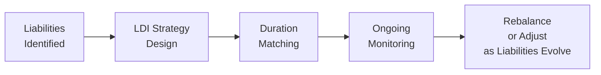

## Introduction

Liability-Driven Investing (LDI) and immunization strategies might seem intimidating at first—trust me, I remember the first time I tried explaining them to a friend and ended up gesturing wildly to illustrate concepts like “duration matching.” But once you peel away the layers, these strategies serve one fundamental purpose: ensuring that the assets in your portfolio can systematically meet future liabilities by closely (and strategically) matching their interest-rate sensitivities. In many cases, the biggest puzzle is aligning your assets’ performance with uncertain, sometimes long-term obligations such as pension payments or insurance claims.

Below, let’s walk through how LDI works, how immunization helps guard against interest rate risk, and how you can deploy them together. We’ll take a slightly informal tone, but the objective is professional mastery of these concepts—so let’s dive in.

## Liability-Driven Investing (LDI)

LDI revolves around a simple but powerful idea: an investor's priority is to fund future liabilities, not just to chase returns for their own sake. For instance, if you manage a pension plan, your ultimate goal is meeting retirees’ benefit payments. A well-structured LDI strategy zeroes in on making sure your asset portfolio behaves in tandem with your liabilities. Think of it like an extended waltz—the assets and the liabilities are dancing together, and you want them in sync so that sudden changes in interest rates (the music’s tempo) don’t trip you up.

Instead of saying, “Let’s just buy bonds and hope for the best,” an LDI approach systematically tailors your investment mix so that if rates go up or down, you mitigate potential shortfalls. That usually involves holding assets with durations and cash flows that track or hedge the interest-rate fluctuations of the liabilities. Key examples include:

• Long-duration bonds that mimic the payment structure of your liabilities.  
• Interest rate swaps that help match your liability profile without necessarily tying up capital in physical bonds.  

### Surplus Volatility

In LDI, the difference between assets and liabilities is called the “surplus.” If interest rates rise and your liability value drops (because it’s discounted at a higher rate), but your assets also drop in value in a similar way, that’s not too terrible as the surplus remains relatively stable. On the other hand, if your liabilities shrink more than your assets or vice versa, you get big swings—known as surplus volatility—which can be catastrophic for institutions like pension funds or insurers. LDI solutions aim to keep that surplus as stable and predictable as possible.

### Practical Note for Pension Funds

A close friend who acts as a CFO for a mid-sized pension plan once told me that his biggest challenge wasn’t picking winning stocks but dealing with unexpected shortfalls when interest rates changed. By allocating a good chunk of their portfolio to long-dated government bonds and using interest rate swaps, they smooth out fluctuations so that, hopefully, no retiree gets shortchanged. This is an excellent illustration of LDI in real life.

## Immunization

While LDI sets the overarching framework of aligning assets with liabilities, immunization is a specific technique that locks in a desired return over a given time horizon—regardless of interest rate movements (within reason). Immunization typically involves setting the portfolio’s Macaulay Duration equal to the duration of the liability (or liabilities). If you perfectly match durations and re-invest coupon payments appropriately, changes in interest rates have offsetting effects on the price of bonds and the reinvestment rates.

At its core, immunization says: “Let’s manage interest rate risk by matching the timing and sensitivity of our inflows with the timing and sensitivity of our outflows.” When done correctly, it can help ensure that a future liability (such as a bond to be repaid at time T or pension payments at various intervals) will be funded no matter which way rates go.

### Quick Macaulay Duration Refresher

Macaulay Duration is basically the weighted average time to receive the bond’s cash flows. In formula terms:


D_{\text{Macaulay}} = \frac{\sum_{t=1}^{n} t \times C_t \times (1 + y)^{-t}}{\sum_{t=1}^{n} C_t \times (1 + y)^{-t}}


where:  
• \\( C_t \\) are the cash flows (coupon or final principal) at time \\( t \\).  
• \\( y \\) is the yield to maturity.  
• \\( n \\) is the total number of periods.

To immunize a single liability, you can choose a portfolio whose Macaulay Duration matches that liability’s duration. The combination usually looks like a portfolio of bonds or bond-like instruments whose aggregated duration equals that of the liability. When rates move, the loss in portfolio value from price changes is theoretically offset by the gains from reinvesting coupon payments at higher yields (or the inverse if rates move the other way).

## Combining LDI and Immunization

LDI is broader in scope, often focusing on the entire set of liabilities—many of which might not have a fixed schedule or might hinge on uncertain events (like mortality rates in a pension fund). Immunization is one tool (albeit a vital one) under the LDI umbrella. In practice, you often see:

• LDI strategies that incorporate immunized “sub-portfolios” for predictable liabilities (e.g., upcoming pension payments).  
• Overlay strategies using interest rate swaps that mimic a high-duration liability structure, achieving immunization without transacting in large volumes of underlying bonds.  

In short, immunization is the detailed blueprint while LDI is the bigger architectural plan, ensuring everything meets the eventual obligations.

## Cash Flow Matching and Contingent Immunization

### Cash Flow Matching

An extension of immunization is plain old cash flow matching, which is exactly what it sounds like: the portfolio’s incoming cash flows (coupons and principal repayments) line up date-by-date with the outgoing liability payments. If you owe a lump sum of $1 million in year 10, you hold a bond that matures at year 10 for (roughly) that amount. The alignment helps avoid reinvestment risk because you’re not depending on future coupon reinvestments to meet that payment. However, full cash flow matching can be expensive and inflexible. You might tie up capital in a way that you miss out on better opportunities if market conditions change.

### Contingent Immunization

Here’s a nifty hybrid approach: contingent immunization starts with an active management style. You invest in a more flexible (potentially higher-yielding, but also riskier) portfolio until the value drops to a minimum threshold. If it hits this threshold, you switch gears to a full immunization approach, locking in the available funds to guarantee the critical liability. It’s kind of like an “emergency brake.” Many institutional investors like this approach because they can still aim for extra returns but have a safety mechanism to ensure they can pay future obligations if markets turn against them.

## Challenges in LDI and Immunization

• Liabilities aren’t always fixed. If you’re dealing with pensioners who might live a lot longer (that’s longevity risk), or with an insurance product that has uncertain claim patterns, it’s tricky to match exact durations.  
• Market instruments might not offer durations long enough to match very long-dated liabilities. That’s where derivatives like swaps and forward rate agreements become especially useful.  
• Rebalancing is a must. Duration matching isn’t a one-and-done exercise. As time passes, both the liability duration and portfolio duration shift naturally, so you’ll need to rebalance to stay immunized or aligned.  
• Regulatory frameworks can complicate how institutions set up LDI. For instance, different jurisdictions have different rules for discount rate assumptions and capital requirements.

## Practical Tip

Try to identify assets with stable correlations to the liabilities. For pension obligations, that might mean using long-duration corporate or government bonds or interest rate swaps tied to the same discount rates used for valuing liabilities. Then, periodically adjust your LDI solution as participants retire, new participants join, and discount rates shift. Keep an eye on credit risk as well. After all, if you buy a long-duration corporate bond that defaults, it defeats the purpose of immunizing anything.

## Visualizing LDI with a Simple Flow Diagram

Below is a basic Mermaid diagram illustrating how an LDI process might look. It follows a logical progression from identifying liabilities to ongoing adjustments:

## Real-World Mini Case

Suppose a mid-sized insurance company has liabilities that stretch out 15 years into the future. The CFO decides to partially immunize these liabilities by building a portfolio of long-term treasury bonds and complementing them with interest rate swaps. The treasury bonds handle a chunk of the liability coverage with minimal credit risk, while the swaps extend effective duration to match the liabilities’ sensitivity to interest rates. Should the swap not perform as expected, or if the rates environment shifts dramatically, the firm can rebalance its portfolio or replace the existing swap. Thanks to this approach, the surplus remains relatively stable, and the CFO can sleep just a little better at night knowing they won’t wake up to a giant mismatch due to a random spike in rates.

## Conclusion and Best Practices

Liability-driven investing fosters a mindset that your sole measure of success is the ability to meet future obligations. It's not about beating your neighbor’s fund (though that can be fun to boast about). By combining LDI with immunization, institutions can systematically reduce interest rate risk—the leading driver of surplus volatility.

A few final tips:

• Duration Matching: Ensure you match the duration of liabilities as closely as you can, and keep re-matching over time.  
• Use Derivatives Wisely: Swaps can be powerful tools, but always understand their complexities (e.g., collateral requirements).  
• Monitor Continually: Both your liabilities and market conditions evolve. Reevaluations are essential.  
• Stay One Step Ahead: If your liabilities might grow or shift, factor in those possibilities and plan a dynamic approach.  
• Document: For exam success, remember the theoretical underpinnings—especially the differences between LDI, immunization, cash flow matching, and contingent immunization.  

Thank you for reading. Remember: at the end of the day, it all boils down to ensuring a consistent, predictable way to meet obligations—whether that’s paying pensions, insurance claims, or any other future liabilities.

## References

• Fabozzi, F. J. & Pollack, G. (1980). “Immunization Strategies for Funding Pension Liabilities.” Journal of Financial and Quantitative Analysis.  
• CFA Program Curriculum (Level I), Readings on Immunization and Liability-Driven Investing.  
• Martellini, L., & Milhau, V. (2012). “Optimal Design of Corporate Market Debt Programs in the Presence of Interest-Rate and Inflation Risks.” EDHEC Working Paper.

---

## Test Your Knowledge on Liability-Driven Investing and Immunization



### Which of the following best describes the goal of Liability-Driven Investing (LDI)?
- [x] Aligning assets’ interest rate sensitivity with that of the liabilities
- [ ] Maximizing short-term returns regardless of liability structure
- [ ] Minimizing credit risk at all costs
- [ ] Holding only equities to offset pension liabilities

> **Explanation:** LDI focuses on matching the interest rate risk (and sometimes other risks) of liabilities with the asset portfolio. The idea is to ensure that when interest rates fluctuate, assets and liabilities move in tandem, reducing surplus volatility.

### Which of the following techniques best locks in a return by matching portfolio duration to the duration of future obligations?
- [x] Immunization
- [ ] High-frequency trading
- [ ] Fundamental indexing
- [ ] Laddered bond strategy

> **Explanation:** Immunization is a strategy whereby a portfolio’s Macaulay Duration matches that of the liability, ensuring that changes in interest rates have minimal net impact on the ability to fund the liability.

### In a contingent immunization strategy, an asset manager typically begins with:
- [x] An active strategy until a certain threshold return is threatened
- [ ] A fully immunized portfolio from the outset
- [ ] A purely passive approach without rebalancing
- [ ] Zero interest rate sensitivity in the portfolio

> **Explanation:** Contingent immunization is a hybrid strategy that starts with an active management style to capture additional returns. If portfolio value falls to a level where the liability is no longer overfunded, the approach switches to immunization.

### What is surplus volatility in the context of LDI?
- [x] The fluctuation in the difference between assets and liabilities
- [ ] The variance of bond prices over a discrete time interval
- [ ] The standard deviation of equity performance vs. a benchmark
- [ ] The risk that future liabilities might be misstated

> **Explanation:** Surplus volatility is the variability of the difference between the asset portfolio and the liabilities the portfolio is designed to meet. LDI aims to manage and minimize these fluctuations.

### Which of the following would likely be most useful for extending a portfolio’s effective duration when matching long-dated pension liabilities?
- [x] Interest rate swaps
- [ ] Short-term Treasury bills
- [x] Long-duration Treasury bonds
- [ ] High-yield corporate bonds with short maturities

> **Explanation:** Long-duration Treasury bonds or swaps can extend the overall duration of the portfolio to match long-dated liabilities. Short-term Treasuries or shorter corporate bonds have lower durations and won’t match well with very long obligations.

### Which best characterizes the advantage of simple cash flow matching over immunization?
- [x] Eliminates reinvestment rate risk by precisely matching payment dates
- [ ] Maximizes yield for a given interest rate environment
- [ ] Requires no initial funding cost
- [ ] Reduces the need for long-duration instruments

> **Explanation:** Cash flow matching precisely aligns bond maturities and coupon payments to liability due dates, thereby avoiding reinvestment risk. However, it can be more restrictive and potentially costlier to implement.

### One major challenge in applying LDI is:
- [x] Uncertain or changing liability profiles
- [ ] Perfect knowledge of future interest rates
- [x] Inherent difficulties in rebalancing equity positions
- [ ] The guarantee of zero-credit-risk assets

> **Explanation:** Liabilities (e.g., pension obligations, insurance payouts) can shift over time. This makes it challenging to maintain alignment with assets, necessitating ongoing adjustments.

### When liabilities extend beyond available bond maturities in the market, institutional investors often use:
- [x] Derivatives such as swaps to extend duration
- [ ] High-yield bonds for higher returns
- [ ] Structured equity derivatives
- [ ] Municipal bonds exclusively for long maturities

> **Explanation:** Long-dated liabilities may exceed standard bond maturities. Using interest rate swaps or other interest rate derivatives can help create effective longer-duration exposures.

### In immunization, rebalancing is required over time primarily to:
- [x] Adjust for changes in portfolio and liability duration
- [ ] Avoid paying too many brokerage commissions
- [ ] Manage equity volatility
- [ ] Convert fixed coupons into floating rates

> **Explanation:** As time passes and coupons are paid, both the portfolio’s duration and the liability’s duration change. Rebalancing keeps the duration match intact.

### True or False: A portfolio that is perfectly immunized against interest rate changes requires no further monitoring or adjustments.
- [x] True
- [ ] False

> **Explanation:** Technically, once a perfectly immunized strategy is established for a single known liability and no external factors change (like liability timing or coupon reinvestment scenarios), you can lock in your returns. However, in real-world settings, multiple liabilities change over time, so periodic reviews are typically still necessary.  


