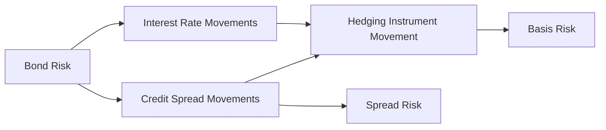
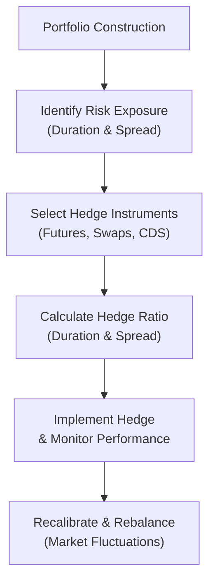

## Introduction and Overview

Spread risk and basis risk lie at the heart of modern fixed-income portfolio management. We know from earlier sections in this volume (especially around interest rate risk and return analysis) that bond prices are influenced not just by changes in benchmark interest rates but also by shifts in credit risk perceptions, liquidity conditions, and the interplay of hedging instruments. While interest rate risk often gets the lion’s share of attention, spread risk and basis risk can be equally worrying—particularly during periods of market stress.

In this section, we’ll explore what spread risk and basis risk look like in practice, how to measure and monitor them, and ways you can mitigate unexpected losses. I remember vividly, back in my early days as a junior fixed-income analyst, how startled I was when a “perfectly good corporate bond” experienced a blowout in spreads just because of a market rumor about poor earnings. It taught me that interest rate hedges alone might not be enough; you also need to keep an eagle eye on credit spreads, sector correlations, and the overall environment in which your bond thrives.

## Understanding Spread Risk

Spread risk is essentially the possibility that the difference (or spread) between a corporate or non-government bond’s yield and the yield of a “risk-free” benchmark (often a Treasury or high-quality government bond) will widen or narrow in a way that surprises us. The spread itself, of course, is meant to compensate investors for additional credit, liquidity, or other types of risk. 

But, um, that little spread can suddenly balloon if a credit event spikes investor concern or if liquidity evaporates. Or it can narrow if the bond’s fundamentals improve. These changes often happen independently of broader moves in the risk-free rate. Let’s look at the main reasons behind spread changes:

• Credit Events: A deterioration in the issuer’s financial condition (like missing earnings targets or suffering a ratings downgrade) can dramatically widen spreads.  
• Liquidity Shifts: When overall market liquidity dries up (e.g., the aftermath of a global crisis), investors may demand higher yields to compensate. Liquidity-driven sell-offs can almost feel irrational, but they happen.  
• Changes in Risk Appetite: If global markets become risk-averse, high-yield or lower-rated bonds can see spreads blow out. Conversely, rallies in risk-on markets can tighten corporate spreads, boosting bond prices relative to benchmark Treasuries.  

### Measuring Spread Risk

A common approach to quantifying spread risk is to decompose a bond’s yield into the risk-free rate plus a spread component. Analysts often model the relationship between a bond’s spread and certain risk factors (credit rating, sector, maturity, etc.). For instance, one might estimate how a 50-basis-point (bps) change in spreads would impact the price of a corporate bond. This can be done by conversions using standard bond pricing formulas (similar to Macaulay duration for interest rate changes, but isolating the portion of price risk driven by spreads).

Mathematically, you might see something like:

(1)  
Price Change due to Spread = –(Modified Spread Duration) × (ΔSpread)

Where ΔSpread is the change in the credit spread and Modified Spread Duration is an estimate of bond price sensitivity to changes in credit spreads.

But be aware that spread duration can vary considerably across bonds, especially those with embedded options or unique structural complexities (e.g., subordinated debt, convertible bonds).

## Understanding Basis Risk

Basis risk arises when two instruments—often used in a hedge—don’t move in perfectly correlated ways. In fixed income, you might hedge a corporate bond with a Treasury future or an interest rate swap to manage interest rate exposure. But the corporate bond’s yield also includes a credit (or liquidity) spread. If that spread changes unpredictably, your hedge might not offset your losses.

### Example of Basis Risk

Imagine you hold a corporate bond from Company X with a yield of 6%. You hedge interest rate movements by shorting a Treasury future. If government yields rise by 20 bps, purely due to macro factors, you might see both the corporate bond yield and the Treasury yield drift upward in tandem. So, the hedge sort of works. However, if, out of nowhere, corporate spreads widen by an additional 50 bps (due to a rumor about X’s finances), the corporate bond’s price will fall significantly more than the Treasury future’s price. Ta-da: basis risk. Your hedge covers the interest rate movement but not the credit spread blowout.

### Sources of Basis Risk

• Different Credit Profiles: Hedging a BBB-rated corporate bond with a Treasury future leaves the credit portion unhedged.  
• Mismatch in Maturities: Using a short-dated futures contract to hedge a bond with a long maturity means the hedge won’t move in perfect sync with the bond.  
• Structural Features: Bonds with embedded options (like call or put features) can produce different price dynamics than a plain-vanilla instrument used for hedging.

## Hedging Spread and Basis Risk

Minimizing spread or basis risk requires finding or creating a hedge that moves as closely as possible with the hedged instrument. This typically involves instruments that share similar credit quality, maturity, liquidity, and embedded option characteristics.

• **More Precise Hedging with CDS**  
  A Credit Default Swap (CDS) can hedge the credit risk of a specific issuer directly. If Company X’s spreads widen, the CDS on X should appreciate in value for the protection buyer—offsetting losses on the bond. In practice, you might combine interest rate swaps or futures to handle the interest rate portion, plus a CDS to mitigate the issuer-specific credit spread risk. The advantage here is much closer alignment to the bond’s actual risk. But it can be more expensive, and you have to watch out for mismatches in contract terms (like the notional amount or maturity).

• **Hedge Ratios**  
  A hedge ratio indicates the size of your hedge position relative to your original holding. For example, if you want to hedge 80% of a $10 million corporate bond position, you might purchase or sell derivatives with an equivalent notional amount of $8 million. The big question, though, is how to calibrate that ratio over time because spreads are dynamic. As the bond’s price changes or as your view on the issuer evolves, that hedge ratio might need frequent recalibration.

Here is a commonly used formula for a bond hedged with a futures position:

(2)  
Hedge Ratio = (Bond Modified Duration ÷ Futures Modified Duration) × (Face Value of Bonds ÷ Contract Multiplier)

Though the formula is more directly used for interest rate hedging, you can adapt the concept to incorporate spread durations or to factor credit exposures. However, it still might not fully offset credit events—you’d typically need to incorporate a credit-specific overlay, like a CDS or a corporate bond index future.

## Recalibrating Hedges

Hedging is rarely a “set and forget” deal. Markets evolve, the creditworthiness of issuers changes, and your portfolio might shift in composition. As we discussed in prior chapters (see Section 8.6 on “Interest Rate Risk Management Strategies”), dynamic hedging is a big part of your job.

• **Monitor Spreads Frequently**: A monthly or quarterly recheck might have been enough in calm times, but now, many traders watch spreads daily—if not more frequently—especially for lower-rated or more volatile bonds.  
• **Balance Hedging Costs**: Hedging each bond individually using single-issuer CDS can be expensive. An alternative approach uses CDS index products (like the CDX or iTraxx), though that reintroduces basis risk if your issuer differs from the index composition.

## Example: Hedging a Portfolio of Corporate Bonds

Suppose you manage a $100 million portfolio of various corporate bonds, mostly investment-grade, with an average rating of A–BBB, an average maturity of 7 years, and a combined spread duration of 5. You believe that credit spreads might widen soon due to weakening economic data.

1. **Treasury Future Hedge:**  
   You could short 7-year Treasury futures to offset the interest rate portion of your portfolio. Say you estimate you need $80 million notional in futures to hedge about 80% of the interest rate duration. But this leaves you with significant spread risk if corporate yields blow out relative to Treasuries.

2. **CDX Investment-Grade Index:**  
   To tackle credit spread risk, you might buy protection on an investment-grade credit index (like CDX.IG) with a notional of $50 million. This means if the index spread widens, your protection pays off. However, if your portfolio composition doesn’t match the index exactly (some bonds might be from different sectors or rating categories), you’ll still have some mismatch—i.e., basis risk.

3. **Spread Risk Minimization:**  
   You adjust the hedge ratio over time, noticing that your portfolio has more exposure to BBB segments than the index. One might add a bit more protection or find a separate hedge for high-yield exposures if your portfolio strays below investment grade. The entire process involves ongoing monitoring of the portfolio composition, credit events, liquidity conditions, and the correlation across these instruments.

## Best Practices and Pitfalls

• **Correlation Isn’t Static**: Even if you historically measure a high correlation (say, 0.95) between your bond and a hedge instrument, that correlation can break down under stress.  
• **Hidden Liquidity Constraints**: If you attempt to close or roll over a CDS or futures contract, liquidity lapses can cause transaction costs to spike, reducing hedge effectiveness.  
• **Cost vs. Benefit**: Perfect hedges can be so pricey that they erode any yield advantage. Measuring the cost of hedging real-time is crucial—especially in tight-spread environments where yield pickup is modest.  
• **Operational Challenges**: Managing multiple hedges can be operationally complex. Settlement terms, collateral management, and legal documentation can vary across derivatives.  

## A Mermaid Diagram on Spread and Basis Risk Dynamics

Below is a simplified depiction of how spread and basis risk fit into an overall fixed-income risk framework:

• Bond Risk is influenced by interest rate movements (benchmark yield changes) and credit spread movements (credit/loss risk).
• We often hedge interest rate risk with instruments correlated to B.  
• However, mismatch in credit spread correlation can lead to basis risk.  
• Meanwhile, changes in spreads themselves remain a separate dimension of risk (spread risk).

## Real-World Illustration

In 2020, when the COVID-19 crisis emerged, corporate spreads widened significantly compared to risk-free benchmarks—even for high-quality issuers. Investors holding corporate bonds and hedging only with Treasury futures discovered that their hedge was, well, basically incomplete. Those hedgers experienced negative returns as corporate spreads blew out. Meanwhile, owners of credit protection via single-name CDS or index CDS had a more accurate hedge—that is, until monetary and fiscal interventions caused a snapback and some basis relationships changed yet again. It’s a never-ending puzzle to keep up with.

## Additional Considerations: IFRS and US GAAP Accounting

From an accounting perspective, IFRS and US GAAP often prescribe different treatments for hedge accounting. If you’re using derivatives to hedge interest rate risk or credit risk, you must meet specific criteria to qualify for hedge accounting. Some highlights:

• **IFRS 9 (Financial Instruments)**: Emphasizes whether the hedge is effective on an ongoing basis, including measuring and documenting the hedge relationship at inception.  
• **US GAAP (ASC 815)**: Also calls for robust documentation and testing that the hedge relationship remains “highly effective.”  

In practice, if your hedge fails effectiveness tests, you might face volatility in earnings statements, which can deter certain institutions from implementing robust hedging strategies—even when the economic logic is sound.

## Incorporating Stress Testing and Scenario Analysis

Chapters 8.7 (on negative interest rate environments) and 8.8 (scenario analysis and stress testing) underscore the importance of adopting scenario-based approaches to gauge the performance of hedges under extreme conditions. Some key steps:

1. **Define Stress Scenarios**: Widen corporate spreads by 200 bps and see what happens if the risk-free rate stays the same or even drops.  
2. **Mark-to-Market Hedge Gains or Losses**: Check how your Treasury futures, interest rate swaps, and/or CDS positions would behave.  
3. **Model Liquidity and Transaction Costs**: In stressed markets, friction is higher. Price slippage might escalate.  
4. **Review Hedge Ratios**: A scenario might reveal that certain sectors or credit tiers require more or less coverage.  

This stress test approach helps calibrate how comfortable you are with partial hedges or more comprehensive (and possibly more expensive) coverage.

## Mermaid Diagram: Typical Hedging Workflow

## Strategies to Manage Basis Risk

1. **Use Multiple Instruments**: If you have a diverse corporate bond portfolio, you might combine Treasury futures (to hedge interest rate risk) with one or more credit index swaps. This reduces basis risk relative to using Treasuries alone.  
2. **Short Comparable Corporate Bonds**: Sometimes an investor might short a corporate bond of very similar credit profile to offset spread risk for the bond they own long. This is known as a bond basis trade, though it comes with its own complexities (and potential short squeezes if the borrowed security is scarce).  
3. **Layered Hedging**: Introduce hedges that focus on different points of the yield curve or sectors to refine how your entire portfolio is hedged.

## Practical Tips and Final Thoughts

• **Start Small**: If you’re new to hedging spread risk, pick a small portion of your portfolio and test your approach.  
• **Ongoing Education**: Tools like credit default swaps and index futures can feel daunting at first. Keep learning, consult your risk manager, and, if needed, collaborate with specialized traders.  
• **Do the Math**: Approximate models are better than nothing, but you should strive for realistic assumptions about the correlation between the bond and your hedge instruments.  
• **Review Collateral Requirements**: If you use derivatives, margin and collateral can significantly affect your liquidity profile.  

Spread and basis risk are rarely “fully eliminated” in real-world portfolios. Instead, your job is to juggle them in a way that optimizes risk/return, costs, and operational feasibility. By combining carefully chosen hedge instruments with frequent recalibration, you put your fixed-income portfolio in a stronger position to weather credit events, liquidity squeezes, and changing investor sentiment.

## References

- Choudhry, M. (2018). The Moorad Choudhry Anthology: Past, Present and Future Principles of Banking and Finance. Wiley.  
- CFA Program Curriculum (Level I), Readings on Credit Spreads, Basis Risk, and Hedge Ratios.  
- Kalotay, A., Williams, G., & Fabozzi, F. J. (2008). “The Refinancing Threshold of a Callable Bond.” Journal of Portfolio Management.  

---

## Test Your Knowledge: Spread and Basis Risk in Fixed-Income Portfolios



### Which of the following best describes spread risk?  
- [ ] The risk of interest rates rising faster than expected  
- [ ] The risk of bonds defaulting with no chance of recovery  
- [ ] The risk of lower liquidity in government bond futures  
- [x] The risk that the yield differential between a risky bond and its benchmark widens adversely  

> **Explanation:** Spread risk arises when the difference (spread) between a corporate or non-government bond’s yield and the risk-free rate changes unexpectedly in a way that hurts the market value of the risky bond.

### Which scenario typically illustrates basis risk?  
- [ ] A bond is called early by the issuer.  
- [x] A corporate bond’s credit spread widens while an offsetting hedge in Treasury futures stays relatively stable.  
- [ ] A bond’s coupon reset mechanism results in variable payments.  
- [ ] A bond’s yield rises due to a central bank policy shift.  

> **Explanation:** Basis risk is the mismatch that occurs when hedging instruments and the hedged asset do not move in perfect correlation. In this case, corporate bond yields moved differently than the Treasury futures used to hedge interest rate risk.

### Which factor most directly drives an increase in spread risk for an investment-grade corporate bond?  
- [ ] A decrease in the risk-free interest rate  
- [x] Worsening credit fundamentals or liquidity conditions  
- [ ] Upward parallel shifts of the Treasury yield curve  
- [ ] Lower coupon frequency  

> **Explanation:** Although interest rate changes could affect overall yields, spread risk is driven primarily by changes in credit and liquidity conditions specific to the bond or sector.

### In managing spread risk using CDS, which statement is true?  
- [x] A CDS can hedge issuer-specific credit risk if its notional and tenor match the bond.  
- [ ] CDS only protect against interest rate hikes.  
- [ ] CDS often fail during credit stress events due to lack of correlation.  
- [ ] CDS are not recognized under IFRS or US GAAP.  

> **Explanation:** A credit default swap provides protection against specific issuer default or credit events, ideally matching the bond’s notional amount and maturity to minimize mismatch.

### Which best describes a hedging strategy to reduce both interest rate risk and spread risk?  
- [x] Combining Treasury futures (or swaps) for rate risk and CDS/index swaps for credit spread risk.  
- [ ] Hedging only the interest rate portion but ignoring changes in spreads.  
- [x] Shorting a corporate bond with exactly the same maturity, coupon, and issuer.  
- [ ] Buying put options on the broad equity index.  

> **Explanation:** By separately hedging the rate portion (e.g., with Treasury futures) and credit portion (e.g., with a CDS), you address the two main components of bond yield. Also, shorting an identical corporate bond position can offset spread risk if it matches perfectly.

### Why do many fixed-income managers regularly recalculate hedge ratios?  
- [x] Because market conditions, durations, and credit spreads evolve.  
- [ ] Because regulation mandates daily rebalancing in all jurisdictions.  
- [ ] Because hedges become illegal after a certain time.  
- [ ] Because the hedge ratio has no effect on a bond portfolio’s performance.  

> **Explanation:** Hedge parameters (asset durations, spread durations, liquidity) shift over time. Managers need to keep the hedge ratio aligned with the new market realities.

### Which method is most effective for stress testing spread and basis risk in a bond portfolio?  
- [x] Applying scenario analysis where spreads widen while interest rates remain stable or shift.  
- [ ] Holding the spread constant and ignoring credit events.  
- [x] Applying multiple, realistic stress tests including different degrees of correlation breakdown.  
- [ ] Using only historical volatility data of Treasury futures.  

> **Explanation:** Stress testing must combine different potential movements in interest rates and credit spreads, plus it should consider correlations that may break down in severe market conditions.

### If a fund manager uses a broad corporate bond index to hedge the spread risk of a single BBB-rated issuer, what type of risk remains?  
- [x] Basis risk due to mismatch between the issuer’s specific spread behavior and the index average.  
- [ ] Duration risk eliminated fully by the index hedge.  
- [ ] Liquidity risk is not an issue anymore.  
- [ ] Credit event risk is automatically zero.  

> **Explanation:** Even though a corporate index might partially hedge credit spread moves, the single issuer’s spread could behave differently from the index average, introducing basis risk.

### Which of the below is a common pitfall when implementing hedges against spread risk?  
- [ ] Having too many hedge instruments across different issuers.  
- [ ] Ignoring interest rate risk entirely.  
- [x] Believing correlations are static and will hold through market crises.  
- [ ] Transacting only with central counterparties.  

> **Explanation:** Correlation breakdown during market turmoil is a key vulnerability. Many managers are caught off-guard when historically high correlations vanish during stress.

### Hedging spread risk perfectly is generally not feasible because:  
- [x] Costs may outweigh the benefits and instruments may be imperfect matches.  
- [ ] Spread risk never materializes for investment-grade bonds.  
- [ ] Spread risk is strictly an academic concept.  
- [ ] Liquidity is always unlimited.  

> **Explanation:** Perfect hedges can be both very costly and impractical, and available hedge instruments often have incomplete correlations with the specific credit exposure.


