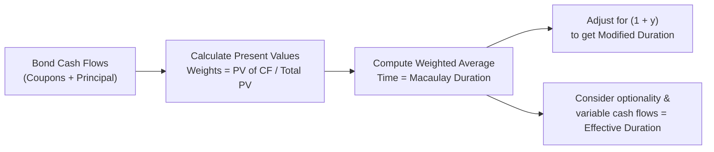

## Introduction and Context

When I was first learning about bonds, I remember sitting in a small classroom and feeling slightly anxious: “Wait, so we’re talking about measuring a bond’s sensitivity to interest rates by some kind of ‘average maturity’ measure?” My teacher smiled and said, “Exactly—let’s call it Duration.” That was my introduction to this fascinating topic, which is crucial for managing interest rate risk in bond portfolios. 

Even though we’re tackling Duration in the context of CFA 2025 Level I, the concept is essential at every stage of a professional’s fixed-income journey. In this section, we won’t just define Duration; we’ll also dive into the practical details: Macaulay Duration, Modified Duration, and Effective Duration. By the end, you’ll see how these measures form the bedrock of risk management for everything from simple Treasury securities to esoteric, option-embedded instruments.

## Macaulay Duration

Macaulay Duration is often described as the weighted average time (in years) required to collect a bond’s cash flows (both coupon payments and principal). If you’ve ever thought, “How long until I get my money back, in present value terms?”—that’s the intuition behind Macaulay Duration.

### Conceptual Underpinnings

Think of each coupon payment and the final redemption amount (principal) as separate “cash flow checkpoints.” Each checkpoint occurs at a specific time, and we discount each amount to figure out its present value. Macaulay Duration weights these times by their share of the total present value. 

Sometimes I like to compare Macaulay Duration to an “average pickup time” if you had multiple deliveries scheduled. The bigger (more significant) deliveries get heavier weight, and so do deliveries scheduled earlier (because there is less discounting among earlier cash flows).

### Formula and Calculation

Macaulay Duration (D_Mac) is mathematically expressed as:


D_{\text{Mac}} = \frac{\sum_{t=1}^{T} \left( t \times C_t \times (1 + y)^{-t} \right)}{\sum_{t=1}^{T} \left( C_t \times (1 + y)^{-t} \right)}


Where:

• \\( t \\) is the time period (in years) when the cash flow is received.  
• \\( C_t \\) is the cash flow at time \\( t \\) (coupon plus principal if it’s the final payment).  
• \\( y \\) is the bond’s yield per period (assuming annual compounding for simplicity).  
• \\( T \\) is the total number of periods until the bond’s maturity.  

In simpler terms:  
• The numerator represents the time-weighted present value of each cash flow.  
• The denominator is the total present value of all cash flows (i.e., the bond’s price).  

Let’s do a tiny example to illustrate:

Suppose you have a 2-year bond with a 5% annual coupon, face value of \$1,000, and a yield of 5% (annual). That means:  
• End of Year 1: You get \$50 (coupon only).  
• End of Year 2: You get \$1,050 (coupon plus principal).  

First, let’s discount these payments:

• PV of \$50 at year 1: \\( 50 / (1 + 0.05)^{1} = 47.62 \\)  
• PV of \$1,050 at year 2: \\( 1050 / (1 + 0.05)^{2} \approx 952.38 \\)  

Price of the bond = \\( 47.62 + 952.38 = \$1,000 \\) (makes sense, as coupon = yield and the bond is at par).

Macaulay Duration:


D_{\text{Mac}} = \frac{ (1 \times 47.62) + (2 \times 952.38)}{1,000} = \frac{47.62 + 1904.76}{1,000} \approx 1.95 \ \text{years}


That 1.95 means: on average, in present value terms, you receive your money 1.95 years from now.

## Modified Duration

While Macaulay Duration is the weighted average time to receive cash flows, we often want to know: “How much will my bond’s price change if yields change?” That’s where Modified Duration (D_Mod) comes in.

### From Macaulay to Modified

The simplest relationship is:


D_{\text{Mod}} = \frac{D_{\text{Mac}}}{1 + y}


Here \\( y \\) is typically the yield per compounding period (annual, if we are using annual compounding). 

Modified Duration is basically Macaulay Duration adjusted by a factor of \\( (1 + y) \\). If yields are higher, the bond is less sensitive to a small change in yield, so the Modified Duration is smaller compared to Macaulay Duration.

### Interpretation and Usage

Modified Duration tells us the approximate percentage change in bond price for a 1% (or 100-basis-point) change in yield, assuming small yield changes. For instance, if a bond has a Modified Duration of 5, and yields rise by 1%, the bond’s price is expected to fall by 5% (all else being equal). 

However, watch out: we assume a linear relationship when using Modified Duration. For large changes in yields, this linear approximation can be inaccurate—introducing us to a concept called Convexity, which we’ll look at in Topic 8.3.

### Practical Case Study

Imagine you’re analyzing a 10-year corporate bond with a 6% coupon and yield of 6%. After computing the Macaulay Duration, you find it’s around 8 years. Modified Duration then becomes \\( 8 / 1.06 = 7.55 \\). That 7.55 is your best guess at how much the bond’s price will change, in percentage terms, for a 1% shift in market yields (again, for small rate changes). 

## Effective Duration

Effective Duration is especially critical when analyzing bonds with embedded options or uncertain future cash flows (callable, putable, or mortgage-backed securities). If there’s one piece of advice I like to give my friends, it’s: “When in doubt, and your bond has optionality—go for Effective Duration.”

### Why We Need Effective Duration

Macaulay and Modified Duration assume cash flows are fixed. But when a bond is callable, for example, the issuer may repay principal early if rates drop—thus altering the timing (and sometimes the amount) of cash flows. 

Effective Duration incorporates the possibility that yield changes can alter future cash flow patterns. We measure it by seeing how the bond’s price changes under slight shifts in the yield curve, revaluing the bond under these different interest-rate scenarios and capturing the effect of optionality.

### Computation Approach

We often use a “shock” approach with small parallel shifts in the yield curve:


D_\text{Effective} \approx
\frac{P_{-} - P_{+}}{2 \times (P_0) \times \Delta y}


Where:

• \\( P_{-} \\) is the bond’s price if yields go down by a small amount (e.g., 0.01).  
• \\( P_{+} \\) is the bond’s price if yields go up by the same small amount.  
• \\( P_0 \\) is the bond’s current price.  
• \\( \Delta y \\) is the yield change (e.g., 0.01 if 1% shift).  

This formula basically tries to capture how the bond’s price moves in the upward and downward yield scenarios. If the bond is callable, we might see a smaller price increase when yields fall (because the call option caps the upside if the issuer can call the bond early). That effect will show up in the difference between \\( P_{-} \\) and \\( P_{+} \\), giving a more accurate sense of the bond’s real sensitivity to yields.

### Real-World Example

Suppose you have a 10-year callable corporate bond. You suspect that if rates drop, the issuer might call the bond in five years. Instead of ignoring that optionality, you decide to do a scenario:

1. Price the bond if the yield is 5.0%. Let’s call that \\( P_{0} \\).  
2. Price the bond if the yield is 4.9%. Let’s call that \\( P_{-} \\).  
3. Price the bond if the yield is 5.1%. Let’s call that \\( P_{+} \\).  

You then plug those three prices into the Effective Duration formula. Because the bond’s call feature is likely to be in the money if yields drop enough, \\( P_{-} \\) might not rise as much as you would expect for a vanilla bond—leading to a lower Effective Duration (the call option limits the potential price gain).

## Comparing the Three Durations

Below is a simple diagram illustrating the relationship among Macaulay, Modified, and Effective Duration.



The difference is primarily about assumptions regarding changes in cash flows:

• Macaulay Duration: purely timing-based, no changes in cash flows assumed.  
• Modified Duration: same timing-based approach, but scaled to reflect interest rate sensitivity for standard, non-callable bonds.  
• Effective Duration: scenario-based approach that accounts for changes in the bond’s cash flow structure (e.g., due to calls, puts, or prepayments).

## Portfolio Construction and Immunization

One reason most portfolio managers swear by duration measures is immunization. In an immunization strategy, you try to match your portfolio’s duration to the duration of your future liabilities or investment horizon, hoping that changes in interest rates won’t drastically affect your ability to meet those obligations.

• If your liability is due in 10 years, you might aim for your bond portfolio to have a Macaulay or Modified Duration of 10—so if rates change, your portfolio value shifts in roughly the same way as the present value of the liability.  
• For a mortgage-backed security, you’d rely on Effective Duration because of uncertain prepayments.  

Hedging and immunization rely heavily on your ability to measure interest rate sensitivity accurately. A mismatch in duration can open you up to reinvestment risk or price risk—both forms of interest rate risk that can ruin a carefully laid plan.

## Convexity Adjustments: Looking Ahead

You might be thinking, “What if yields move drastically?” or “What about the curvature in the price-yield relationship?” Indeed, that’s where Convexity comes in (discussed more in Topic 8.3). Duration alone—especially Modified Duration—provides only a linear approximation of price changes. The bigger the yield move, the more likely we need a Convexity adjustment. For now, remember that durations are partial measures; they’re great for small changes and fundamental insights, but they’re not the whole story.

## Practical Tips, Pitfalls, and Reminders

• Don’t Overlook Annual vs. Semi-Annual Compounding: If your bond’s yield is stated on a semi-annual basis, ensure you use the correct yield figure in your duration calculations.  
• Use Effective Duration for Bonds with Embedded Options: Always check the bond’s structure—callable, putable, or other features can drastically alter cash flow behavior.  
• Keep an Eye on Large Yield Changes: Modified Duration works best for small yield changes. For large yield moves, factor in Convexity.  
• Duration Mismatch is Risky: If your bond portfolio’s duration is much higher than your investment horizon, you could be blindsided by interest rates rising at the worst possible time.  
• Immunization is Not Magic: Even if you match durations, real-life factors like yield curve twists, changes in credit spreads, or large changes in rates can leave you exposed.

## A Brief Python Example

Below is a short Python snippet to illustrate how you might compute Macaulay and Modified Duration for a simple, fixed-rate bond:

```python
import numpy as np

def bond_durations(face_value, coupon_rate, ytm, years):
    """
    face_value: e.g. 1000
    coupon_rate: annual coupon as decimal, e.g. 0.05
    ytm: yield to maturity as decimal, e.g. 0.05
    years: number of years to maturity, assuming annual payments
    Returns: (Macaulay Duration, Modified Duration)
    """
    cash_flows = [face_value * coupon_rate] * years
    cash_flows[-1] += face_value  # add principal at maturity
    
    discount_factor = 1 + ytm
    pv_cash_flows = [cf / discount_factor**(t+1) for t, cf in enumerate(cash_flows)]
    bond_price = sum(pv_cash_flows)
    
    weighted_times = [(t+1) * pv for t, pv in enumerate(pv_cash_flows)]
    macaulay_duration = sum(weighted_times) / bond_price
    
    modified_duration = macaulay_duration / discount_factor
    return macaulay_duration, modified_duration

D_mac, D_mod = bond_durations(face_value=1000, coupon_rate=0.05, ytm=0.05, years=2)
print("Macaulay Duration: ", round(D_mac, 4))
print("Modified Duration: ", round(D_mod, 4))
```

In practice, you could expand this code for more complex cash flow setups or bonds with embedded options, but calculating Effective Duration often involves price scenarios rather than a simple static formula.

## Closing Thoughts

Duration is the foundation of interest rate risk analysis. Whether you’re brand new or preparing your final steps before the CFA exam, keep these points in mind:

• Macaulay Duration is about timing.  
• Modified Duration translates that timing into price sensitivity for plain-vanilla bonds.  
• Effective Duration navigates uncertain or changeable cash flows.  

And if you’re someone who has to juggle a portfolio containing all sorts of exotic structures—mortgage-backed securities, callable bonds, or something else—Effective Duration should become your best friend. Ultimately, in real-world fixed-income portfolio management, no single measure suffices without a thorough understanding of the bond’s structure and the broad interest rate environment.

## References and Further Reading

• Hull, J. (2018). Options, Futures, and Other Derivatives. Pearson.  
• CFA Program Curriculum (Level I), Fixed Income Readings on Duration Measures.  
• Bierwag, G. O. (1987). Duration Analysis: Managing Interest Rate Risk. Ballinger Publishing.  
• Fabozzi, F. J. (2016). Bond Markets, Analysis, and Strategies. Pearson.  
• Tuckman, B., & Serrat, A. (2011). Fixed Income Securities: Tools for Today’s Markets. Wiley.

----------------------------------------------------------------------------------------------------------------------------

## Assessing Your Knowledge of Duration Measures: Macaulay, Modified, and Effective



### Which best defines Macaulay Duration?

- [ ] The nominal yield of a bond.  
- [x] The weighted average time to receive the bond’s cash flows in present value terms.  
- [ ] The expected price decline for a 1% increase in yield.  
- [ ] The slope of the yield curve.  

> **Explanation:** Macaulay Duration is the time-weighted measure (in years) of a bond’s cash flows, reflecting when, on average, the investor will recoup the bond’s price in present value terms.


### If a bond’s Macaulay Duration is 8 years and the yield is 6%, what is the Modified Duration (assuming annual compounding)?

- [ ] 8.00  
- [x] 7.55  
- [ ] 10.43  
- [ ] 6.99  

> **Explanation:** Modified Duration = Macaulay Duration ÷ (1 + yield) = 8 ÷ 1.06 ≈ 7.55.


### Which duration measure specifically accounts for changes in bond cash flows due to embedded options?

- [ ] Macaulay Duration  
- [ ] Modified Duration  
- [x] Effective Duration  
- [ ] Zero-Coupon Duration  

> **Explanation:** Effective Duration is designed for callable, putable, or otherwise option-embedded bonds where actual cash flow timing can shift with changes in interest rates.


### A standard coupon bond with no embedded options is most accurately analyzed by:

- [ ] Effective Duration only.  
- [x] Either Macaulay or Modified Duration.  
- [ ] Equity Duration.  
- [ ] No need for duration; price remains fixed.  

> **Explanation:** For a vanilla bond, Macaulay Duration and Modified Duration offer reliable insights. Effective Duration is critical only when cash flows are uncertain.


### For an immunization strategy, one typically matches:

- [x] The portfolio’s duration with the liability’s duration.  
- [ ] The portfolio’s coupon payments with the Fed’s discount rate.  
- [ ] The average maturity date to tomorrow’s interest rate movements.  
- [ ] The bond’s yield to the U.S. GDP growth rate.  

> **Explanation:** Immunization is the strategy of offsetting interest rate risk by aligning a portfolio’s duration with liability duration.


### If yield changes are very large, Modified Duration’s estimate of price change can be significantly off because:

- [x] It is a linear approximation and ignores convexity.  
- [ ] It accounts for too much convexity in large changes.  
- [ ] It’s based on unweighted average maturity.  
- [ ] It fails to discount cash flows.  

> **Explanation:** Modified Duration is based on a linear assumption, and large changes in yield require a convexity adjustment to accurately measure price changes.


### Which of the following best describes a key difference between Modified Duration and Macaulay Duration?

- [de] They are both the same if cash flows are fixed.  
- [ ] Macaulay Duration is always higher by definition.  
- [x] Modified Duration scales Macaulay Duration by (1 + yield) to show price sensitivity.  
- [ ] Modified Duration surpasses Macaulay Duration by discounting principal only.  

> **Explanation:** Modified Duration = Macaulay Duration ÷ (1 + y). This relationship outlines how Macaulay Duration is converted into a measure of price sensitivity for a 1% yield change.


### When a callable bond is likely to be called if yields fall, its price appreciation:

- [x] Is limited, reducing Effective Duration.  
- [ ] Increases significantly, increasing Macaulay Duration.  
- [ ] Stays the same, as yield changes don’t impact the call decision.  
- [ ] Goes to zero immediately after issuance.  

> **Explanation:** An embedded call option caps the bond’s price appreciation in a falling rate environment, which lowers the bond’s Effective Duration.


### In calculating duration for a mortgage-backed security, the biggest complication is:

- [ ] The bond has no coupon.  
- [ ] The bond cannot default.  
- [x] The principal could be prepaid sooner or later, altering cash flows.  
- [ ] The bond is never traded in the secondary market.  

> **Explanation:** Mortgage-backed securities come with uncertain prepayment schedules, requiring Effective Duration to capture changing cash flow patterns.


### True or False: Matching your portfolio’s Macaulay Duration to your investment horizon ensures zero price volatility in all scenarios.

- [x] True  
- [ ] False  

> **Explanation:** While matching durations is an immunization strategy designed to reduce interest rate risk, many real-world factors (yield curve twists, changes in spreads, or large yield shocks) can still create deviations. However, within the theoretical framework, matching your horizon with Macaulay Duration is a key step in mitigating interest rate risk.


