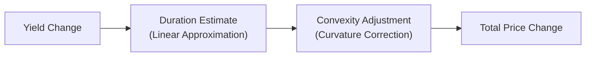

## Introduction
Have you ever been surprised by the actual price move of a bond after a sizable change in market yields? Maybe you sized up your trades using duration, only to find that the bond’s actual price shift was slightly off from your expectation. It’s a bit like expecting a straight path on your road trip but encountering winding detours. That discrepancy is where convexity comes into play. Convexity refines duration’s linear estimate by accounting for the curve in the price–yield relationship. While duration is a “first-order” measure of interest rate risk, convexity is the crucial “second-order” term that helps us model more intricate (and realistic) bond price moves.

Sometimes I remember my early days in bond portfolio management when I’d rely heavily on duration to gauge sensitivity. Everything looked fine for small yield changes, but then, boom—an unexpectedly large swing in yields left me scratching my head. Incorporating convexity into the price estimates would have saved me a few sleepless nights. This section will clarify why convexity is essential, how to estimate it, and how to use it in real-world practices.

## Revisiting Duration Versus Convexity
Duration, covered in detail in section 8.2, provides a linear approximation of how much a bond’s price changes in response to yield shifts. For small yield moves, this linear approximation works decently well. But if yields swing by a larger amount, the actual price change forms a curve rather than a neat line.

• Duration is to bond price sensitivity what the slope is to a simple linear function.  
• Convexity is the curvature—a measure of how that slope changes as the yield changes.

If we only use duration (the slope) and ignore convexity (the curvature), we might underestimate or overestimate the bond’s price change. The bigger the yield move, the bigger the potential error. Convexity steps in to provide that extra piece of information we need for a more robust estimate.

## Positive Convexity
Most plain-vanilla, fixed-coupon bonds and zero-coupon bonds exhibit positive convexity. This means that when yields fall, the price gain is larger than the drop we’d have predicted solely with duration. Conversely, when yields rise, the price drop is a bit less severe than the linear approximation would have suggested.

Positive convexity is typically desirable because it gives you a nice cushion during volatile periods. Essentially, positive convexity says: “You’ll lose less if yields jump up, and you’ll gain more if yields go down.”

Let’s illustrate with a quick scenario. Suppose you have a bond with an estimated duration of 5 and a convexity of 30 (measured in typical bond risk units, which we’ll explain in a moment). If the yield drops by 40 basis points (0.40%), the naive duration-only price change might be around 5 × 0.40% = 2.0%. But that’s just the linear approximation. The convexity term refines it:

Price Change ≈ (−Duration × ΔYield) + (½ × Convexity × (ΔYield)²).

Plugging in numbers (noting yield changes can be positive or negative, so we keep careful track of signs):

• −(5 × (−0.0040)) = +0.020 (2.0% increase) from duration  
• ½ × 30 × (−0.0040)² = 15 × 0.000016 = 0.00024 (0.024%)  

So, the convexity “add-on” is +0.024%. When we add that to our duration-based estimate, the total price change is approximately +2.024%. While 0.024% might sound small, for large positions or larger yield moves, it becomes more critical. When yields move significantly more—say 100 basis points—the difference can become material.

## Negative Convexity
So far, the story’s been great for your typical high-grade corporate or Treasury bond: they have that lovely positive convexity. But it gets trickier with bonds that have embedded optionality, like callable bonds, mortgage-backed securities (MBS), or putable structures. Among them, those with call features or prepayment characteristics can show negative convexity in certain yield environments.

Negative convexity means your bond’s price gains aren’t as robust when yields fall. Why? Because if yields tumble steeply, the issuer is likely to refinance (call the bond away from you, or in the case of MBS, homeowners might prepay). Your upside is capped. This capping effect at lower yields leads to a phenomenon we call “negative convexity” because the price–yield relationship starts to bend in a less favorable way.

Picture a homeowner with a mortgage: when rates drop, they’ll probably prepay or refinance. When rates rise, they’ll keep paying that old lower rate, hurting your portfolio if you hold an MBS security. It’s not that it’s inherently “bad,” but your bond’s price sensitivity doesn’t follow the typical positive convexity shape. Managing these positions—often with robust interest rate risk modeling or advanced hedging strategies—becomes pivotal for portfolio managers.

## Estimating Price Sensitivity Using Duration and Convexity
At a fundamental level, the total approximate percentage price change of a bond, for a yield change Δy, can be written as:

Price Change ≈ (−Duration × Δy) + (½ × Convexity × (Δy)²).

• The term (−Duration × Δy) is the first-order (linear) approximation of the price change.  
• The second term (½ × Convexity × (Δy)²) is the convexity adjustment that refines our estimate.

This formula comes from a second-order Taylor expansion of the bond’s price–yield function. If that terminology sounds a bit math-heavy, don’t sweat it. A simpler mental model is: the first term says “Here’s the immediate effect from yields,” and the second term says “Here’s the extra effect because the relationship is curved.”

### Practical Computation
In practice, duration and convexity can be estimated using partial derivatives of the bond pricing function, or by applying standard formulas for certain bond structures (e.g., for plain-vanilla bonds). For more complicated bonds with embedded options, specialized option-pricing or tree-based models are often employed.

If you’re more algorithmically inclined—or you just enjoy rolling up your sleeves in Python—here’s a small snippet showing how you might approximate a bond’s new price with an original price P₀, given small changes in yield:

```python
import math

def bond_price_estimate(P0, duration, convexity, delta_y):
    # duration, convexity in appropriate decimal form
    # delta_y is the change in yield (e.g., 0.005 for 50 bps)
    first_order = -duration * delta_y
    second_order = 0.5 * convexity * (delta_y ** 2)
    # approximate percentage change
    pct_change = first_order + second_order
    # approximate new price
    new_price = P0 * (1 + pct_change)
    return new_price

P0 = 100.0
duration = 5.0
convexity = 25.0
delta_y = 0.01  # 100 basis points
estimated_price = bond_price_estimate(P0, duration, convexity, delta_y)
print(f"Estimated bond price after yield change: {estimated_price:.2f}")
```

In a professional setting, you’d refine these estimates for specific day count conventions, compounding assumptions, or use advanced term-structure models. For instance, you might need to break out the key rate durations (see section 8.4) or do scenario analyses (see section 8.8).

## Visualizing Convexity with Mermaid
Even though none of us are going to chart the price–yield function by hand every day, it helps to see how convexity modifies the linear approximation:



Here, the total price change is the sum of the duration-based linear move plus the additional “bend” captured by convexity. Positive convexity “arches” upward, adding value when yields change. Negative convexity partially flattens or inverts that arch.

## Real-World Applications and Cases

### Portfolio of Mortgage-Backed Securities
In a portfolio that’s loaded up on mortgage-backed securities, you’ll likely experience negative convexity. During falling-rate environments, MBS holders face heavier prepayments, effectively truncating potential price gains. For risk management, many MBS specialists use sophisticated models or hedging strategies with interest rate swaps and swaptions, aiming to offset that negative convexity.

### Callable Corporate Debt
Corporations often issue callable bonds to lock in lower coupons if interest rates decline. These bonds exhibit negative convexity around the yield range where the call option becomes valuable. You’ll see the bond’s price stop rising as aggressively once yields approach or cross the call trigger point.

### Beyond Bond Selection
Convexity plays a critical role in multi-asset portfolio strategies, liability-driven investing (LDI), or immunization strategies (see section 8.15). Suppose you’re a pension fund manager matching assets to long-dated liabilities. You might seek high-convexity bonds (e.g., long-duration Treasuries) to help you ride out sudden yield shifts. The more convex the assets, the less rebalancing you need in tumultuous rate movements.

## Common Pitfalls and Best Practices
• Forgetting Convexity in Large Yield Moves: Relying purely on duration for sizable rate swings can result in mispricing. Even if you believe changes will be small, it’s good practice to have convexity estimates on hand.  
• Misinterpretation of Negative Convexity: Sometimes people assume negative convexity always means the bond is a poor choice. Not necessarily. It can still be appropriate if the yield spread is compensating enough for that embedded risk.  
• Overlooking the Cost of Hedging: Trying to perfectly hedge negative convexity exposures can be costly and hamper portfolio return. There’s a balance between controlling risk and paying for optionality.  
• Ignoring “Key Rate” Durations: Large yield changes rarely move every point on the curve equally. Combining key rate durations (section 8.4) with a convexity perspective helps produce a more refined interest rate risk profile.

## Exam Tips: Leveraging Convexity in Scenario Questions
• Pay Attention to Bond Type: Different embedded features (calls, puts, or mortgage prepayments) will shape whether your bond has negative or positive convexity.  
• Calculate Approximate Price Changes: Be sure to use the formula:  
  Price Change ≈ (−Duration × ΔYield) + (½ × Convexity × (ΔYield)²).  
• Watch Out for Sign Conventions: A yield increase is typically positive ΔYield. Duration-based price changes are negative for a positive ΔYield (i.e., bond price falls if yields rise).  
• Stress Test: If the question indicates a major rate shift, be especially vigilant about the convexity effect. The exam might test whether you recognize the second-order effect.  
• Tied to Other Topics: Convexity might appear coupled with credit risk or derivative overlays. For instance, you might see a question about using an interest rate swap to hedge the negative convexity in your MBS portfolio.

## References
• Tuckman, B., & Serrat, A. (2011). Fixed Income Securities: Tools for Today’s Markets. Wiley.  
• Fabozzi, F. J. (2016). Bond Markets, Analysis, and Strategies. Pearson.  
• CFA Program Curriculum (Level I), Readings on Convexity and Bond Price Sensitivity.  
• Various IFRS/US GAAP guidelines regarding embedded derivatives accounting.  

## Test Your Knowledge: Convexity and Price Sensitivity in Action



### A bond’s convexity can be best described as:
- [ ] The linear price sensitivity of a bond to yield changes.
- [x] The measure of curvature in the price–yield relationship.
- [ ] The difference between spread duration and effective duration.
- [ ] The spread differential between callable and non-callable bonds.

> **Explanation:** Convexity captures the second-order effect in the price–yield relationship, complementing duration’s linear measure.

### Which of the following is most likely to exhibit negative convexity?
- [ ] A long-term Treasury bond.
- [ ] A zero-coupon bond.
- [x] A callable corporate bond.
- [ ] A floating-rate note tied to LIBOR.

> **Explanation:** Callable bonds exhibit negative convexity when yields fall because the issuer can redeem the bond, limiting its upside price potential.

### In the formula for bond price change, (−Duration × ΔYield) + (½ × Convexity × (ΔYield)²), the (½ × Convexity × (ΔYield)²) term primarily:
- [x] Captures the curvature adjustment to the duration-based estimate.
- [ ] Represents the linear effect of yields on price.
- [ ] Accounts for accrued interest adjustments.
- [ ] Reflects pull-to-par effects as maturity approaches.

> **Explanation:** The second-order term accounts for the fact that price sensitivity is not strictly linear for larger yield changes, refining the duration-based estimate.

### What typically happens to price changes for a positively convex bond when yields fall by 50 bps versus when yields rise by 50 bps?
- [x] The price increase is greater than the price decrease (in absolute terms).
- [ ] The price change is identical for both.
- [ ] The bond underperforms in a falling-rate environment.
- [ ] The price decrease is greater than the price increase.

> **Explanation:** Positive convexity ensures that gains outweigh losses in symmetrical yield movements.

### A mortgage-backed security (MBS) often demonstrates negative convexity because:
- [ ] Its maturity is very short, limiting coupon reinvestments.
- [ ] Its principal payments are fixed until maturity.
- [x] Homeowners can prepay, limiting price appreciation in falling-rate environments.
- [ ] It only pays interest at maturity.

> **Explanation:** MBS investors risk losing out on higher prices when yields drop, as prepayments increase, capping potential upside.

### Which of the following statements is true regarding duration and convexity?
- [x] Duration measures first-order sensitivity, while convexity refines that estimate for larger yield shifts.
- [ ] Duration and convexity both only apply to zero-coupon bonds.
- [ ] Duration alone is always sufficient for measuring price sensitivity.
- [ ] Convexity is unnecessary in portfolio management.

> **Explanation:** Duration and convexity together provide a more robust view of how bond prices respond to yield changes.

### In a portfolio context, why might an LDI (liability-driven investing) manager seek higher convexity bonds?
- [x] To minimize the need for frequent rebalancing in volatile rate environments.
- [ ] To decrease the potential for price gains in a falling-rate environment.
- [ ] Because higher convexity bonds always have higher yields.
- [ ] To pay off short-term obligations more quickly.

> **Explanation:** Greater convexity reduces the risk of significant mismatches between assets and liabilities when yields unexpectedly shift.

### When yields change dramatically, relying on duration’s linear approximation alone might result in:
- [ ] Exact estimates of price changes.
- [ ] A stricter correlation with credit risk.
- [x] Significant under- or overestimation of the bond’s price movement.
- [ ] No effect on risk management.

> **Explanation:** Over larger yield changes, the bond’s price–yield curve bends, making duration’s linear approach insufficient without a convexity adjustment.

### For a callable bond with negative convexity being priced close to its call price, if market yields drop significantly:
- [ ] Its price will keep rising with no cap.
- [ ] Its price will move in line with a zero-coupon bond.
- [ ] Its price will drop due to credit risk.
- [x] Its price appreciation will likely be capped as the bond becomes callable.

> **Explanation:** The call feature caps the upside price potential, creating negative convexity.

### Convexity accounts for the curvature in the price–yield relationship. True or False?
- [x] True
- [ ] False

> **Explanation:** By definition, convexity measures the non-linear aspect of how prices respond to yield changes, refining duration’s linear estimate.


