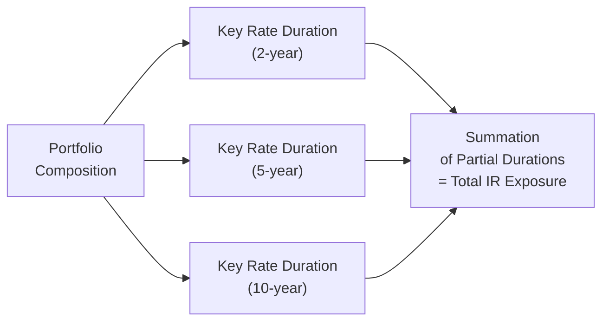

## Introduction

Interest rate risk doesn’t always show up like a neat parallel shift in the yield curve. You know, sometimes short-term rates bounce around while the longer end barely stirs, or maybe the middle of the curve moves the most. If you only look at a standard duration measure, you might miss those twists and turns. And that’s precisely where Key Rate Duration (KRD) and Empirical Duration (ED) come in.

KRD focuses on the sensitivity of a bond (or portfolio) to rate changes at specific maturities along the curve—like the 2-year, 5-year, or 10-year points. Meanwhile, ED takes a more real-world, data-driven angle, looking at historical price and yield movements to figure out how a specific bond behaves when interest rates move.

Below, we’ll dig into these concepts in detail, chat about why they matter in practice, and hopefully set you up for success when you see tricky yield curve scenarios and exam questions coming your way.

## Understanding Key Rate Duration

Key Rate Duration—sometimes called partial duration—zeroes in on the changes in bond prices (or portfolio values) triggered by shifts at individual maturity points on the yield curve. Let’s say you want to see how your position is exposed to a 10-year yield change but not necessarily to a 2-year or 30-year yield move. KRD can isolate that 10-year effect.

### Why Conventional Duration Isn’t Always Enough

Conventional duration assumes a uniform shift in interest rates across all maturities—often dubbed a parallel shift. But in reality, yield curves can flatten, steepen, or even adopt humped shapes. If your portfolio is particularly sensitive to mid-maturity rates, a parallel-shift assumption could fail to capture the real risk.

### The Mechanics of Key Rate Duration

1. Identify Key Points on the Yield Curve.  
   Typical key rates might be the 1-year, 2-year, 5-year, 10-year, and 30-year yields. Each is often chosen based on maturity buckets that matter for your portfolio.  

2. Shock or Shockless Twist Each Key Point.  
   You might consider, for instance, a small upward movement (say 25 basis points) only at the 5-year yield, while leaving other maturities unchanged.

3. Recalculate Your Bond (or Portfolio) Value.  
   The portfolio value’s change, relative to the initial value, over the size of the shock yields your Key Rate Duration for the 5-year point.

4. Repeat for Each Point.  
   Perform this for other maturities of interest, like the 2-year or the 10-year, to build a “partial duration profile.”

### Example: Single Bond’s KRD

Imagine a 10-year corporate bond. You want to know where it’s most “duration vulnerable.” You test 25 bps increases for the 2-year, 5-year, and 10-year points, one at a time:

• 2-year point shock ↑ 25 bps: Value drops by 0.40%.  
• 5-year point shock ↑ 25 bps: Value drops by 1.10%.  
• 10-year point shock ↑ 25 bps: Value drops by 2.05%.  

From these changes, you see the 10-year sensitivity is highest, consistent with the fact that it’s a 10-year bond. However, the 5-year KRD is also non-trivial, hinting that the bond’s price is meaningfully exposed to the mid-curve yield.

### Visualizing Partial Durations

Below is a simple mermaid diagram to help illustrate how partial durations sum up to form a total interest rate exposure for a portfolio:

## Portfolio Perspective: Hedging with KRD

In practice, portfolio managers often use KRD to shape or hedge interest rate risk. Perhaps you believe the curve will steepen (long rates will rise more than short rates). You can adjust the portfolio’s partial durations so that you:
- Minimize the effect of a big jump in long rates.
- Benefit from stable or falling short rates.

By systematically looking at each key point, you can see exactly where you’re over- or under-exposed. This approach makes KRD incredibly useful for multi-billion-dollar fixed-income portfolios, where a small mismatch in the 7-year sector could result in big losses if yields there suddenly spike.

## Empirical Duration: A Real-World Twist

While Key Rate Duration is typically model-based (you shift yields by certain amounts and see how that would theoretically affect price), Empirical Duration tries to measure actual historical relationships between bond prices and interest rates.

### Defining Empirical Duration

Empirical Duration is derived from past price-yield data. Imagine you track daily changes in a bond’s price along with changes in a reference interest rate (like the relevant Treasury yield). By running a regression of price changes on interest rate changes, you observe how sensitive the bond is in practice.

### A Quick Regression Example

Let ΔP be the bond’s price return (percentage change), and let ΔY be the change in the relevant yield measure. Suppose you run a simple linear regression:

(1)  ΔP = α + β × (ΔY) + ε  

Once you estimate β, you can interpret it (with a negative sign, typically) as your Empirical Duration measure—assuming the changes are small and focusing on the slope of that relationship. If β is around –6, it implies that a 1% (100 bps) rise in rates historically led to roughly a 6% decline in the bond’s price, on average.

### Strengths and Weaknesses

• Strengths:  
  – Uses actual real-world data, capturing how market liquidity, credit spreads, and other forces influence bond pricing.  
  – May reveal if a bond has different interest rate sensitivity than theoretical models predict.  

• Weaknesses:  
  – You often need a sufficient sample of historical data. If the bond is relatively new or hasn’t experienced a full rate cycle, your data might be limited.  
  – Historical relationships may not hold in the future if the bond’s credit quality or the market environment changes drastically.  

## Combining Key Rate Duration and Empirical Duration

While Key Rate Duration zooms in on different segments of the yield curve, Empirical Duration zeroes in on real observed behavior over time. In many professional settings, analysts use both. For instance, you might run a KRD analysis on your bond portfolios and then compare those partial durations to historical price moves under various yield scenarios. If your theoretical partial durations differ significantly from the historical pattern, you might adjust your hedging approach.

## Case Study: Securitized Products

Structured or securitized products, like mortgage-backed securities (MBS) or asset-backed securities (ABS), can have complicated cash flow patterns. An MBS can behave differently when short rates move vs. when long rates move (prepayment risk is often more influenced by longer rates), making Key Rate Duration essential for analyzing the effect of yield-curve twists.

At the same time, the optionality (prepayment) embedded in many MBS products renders theoretical models less accurate if they fail to capture borrower behavior. That’s where an Empirical Duration estimate might help you see how those MBS historically performed when mortgage rates changed.

## Best Practices for Implementation

• Data Frequency and Quality.  
  For Empirical Duration, consistent high-quality historical price and yield data are crucial. Low-frequency or noisy data can produce misleading regressions.  

• Multiple Key Rates.  
  You can use 2-year, 5-year, 10-year, 30-year, and so on, but choose these points based on your portfolio’s structure, typical market benchmarks, and liquidity considerations.  

• Stress Testing.  
  Don’t just rely on KRD or ED in isolation. Employ scenario analysis: flattening, steepening, shifting yield curves. Potentially overlay historical scenarios (like the 2008 crisis environment) to see how your partial durations line up with real market dynamics.  

• Keep an Eye on Credit Spreads.  
  Sometimes yield movements are overshadowed by credit spread changes. If you’re holding corporate bonds, changes in the risk premium can overshadow changes in the risk-free rate.  

## Common Pitfalls

• Overfitting Historical Data.  
  Relying solely on empirical measures over a short time frame might not be robust. Market rotations, changing monetary policies, or random short-run events can skew your regression.  

• Ignoring Embedded Options.  
  Some bonds have call or put features, or are subject to early redemption. If you use vanilla duration calculations (even Key Rate Duration) without adjusting for optionality, you can easily underestimate or overestimate risk.  

• Failing to Diversify by Maturity Bucket.  
  Sometimes, analysts do a top-down approach focusing only on the “overall” duration. Missing the deeper partial durations can lead to nasty surprises if, say, your 7-year sector is particularly vulnerable.

## Exam Relevance and Preparation Tips

• For scenario-based exam questions, you might see references to how a bond portfolio responds to a 25 bps shift in the 2-year vs. the 10-year yield. Having a strong grasp of KRD helps you articulate the difference in price impacts.  
• You may be presented with historical data of bond prices and yields, asked to calculate an Empirical Duration via a regression formula. Knowing how to interpret α (the intercept) and β (the slope) is essential.  
• Watch out for multi-part items that ask for a Key Rate Duration analysis under one scenario, then an Empirical Duration analysis under a second scenario. The exam might want you to compare and contrast them, or to discuss which approach is more applicable under certain conditions.

## Conclusion

Key Rate Duration is your friend when interest rate movements get complicated and you suspect non-parallel yield curve shifts. Empirical Duration is your real-world buddy for capturing how a bond or portfolio actually performed historically. Knowing both helps you paint a thorough picture of interest rate risk—exactly the kind of perspective you’ll need if you’re managing fixed-income portfolios or responding to advanced exam scenarios.

In my own experience—well, the first time I tried to evaluate an MBS portfolio with a single duration figure, I practically got whiplash from all the unexpected rate changes. Once I broke it down by partial durations, I finally saw how the middle part of the curve was quietly fueling a big chunk of my risk. Adding an empirical check made me more confident that the partial durations lined up with reality. Hopefully, the next time you face a twisted or flattening yield curve question, you’ll feel prepared to do the same.

## References

• Christopherson, J. A., Carino, D. R., & Ferson, W. E. (2009). Portfolio Performance Measurement and Benchmarking. McGraw-Hill.  
• CFA Program Curriculum (Level I), Fixed Income Topics on Key Rate Duration and Yield Curve Shifts.  
• Fabozzi, F. J. (Editor). (2007). Bond Portfolio Management. Wiley.  

## Test Your Knowledge: Key Rate Duration and Empirical Duration



### Which statement best describes Key Rate Duration (KRD)?
- [ ] KRD measures the average duration across all maturities.
- [x] KRD measures the price sensitivity for particular maturity points on the yield curve.
- [ ] KRD measures the real-time market-based relationship between prices and yields.
- [ ] KRD measures default risk sensitivity for each maturity point.

> **Explanation:** Key Rate Duration isolates the effect of non-parallel yield curve shifts by testing how changes at individual maturities affect bond (or portfolio) values.

### How does Empirical Duration (ED) differ from theoretical duration?
- [ ] ED includes a parallel yield curve assumption.
- [ ] ED excludes short-term historical data to remove noise.
- [x] ED looks at historical price and yield changes to estimate duration-like sensitivity.
- [ ] ED is only used for government bonds in practice.

> **Explanation:** Empirical Duration uses regression analysis (or a similar statistical approach) on actual price changes and yield changes to estimate interest rate sensitivity, rather than a purely theoretical approach.

### A five-year corporate bond shows higher KRD at the 10-year point than at the 2-year point. What can this imply?
- [ ] The bond is equally sensitive to short and long rates.
- [x] The bond’s cash flows are influenced more heavily by movements in longer maturities.
- [ ] The bond’s coupon resets every six months.
- [ ] The bond is not affected by non-parallel shifts.

> **Explanation:** A higher KRD at the 10-year point means that a change in the 10-year yield impacts the bond’s price more, possibly because of the timing and structure of its cash flows.

### Which scenario would likely require focusing on Key Rate Duration rather than relying solely on a single effective duration?
- [ ] A stable yield curve with uniform shifts.
- [x] A yield curve that is expected to steepen significantly.
- [ ] A bond unaffected by interest rates.
- [ ] A market with extremely low trading volume for Treasuries.

> **Explanation:** When the yield curve is expected to move in a non-parallel way (like steepening), Key Rate Duration is crucial in identifying which maturities will have the greatest price impact.

### When estimating Empirical Duration using regression, which data consideration is most important?
- [x] Having enough historical price and yield observations.
- [ ] Only using annual data points.
- [ ] Exploring yields on unrelated instruments.
- [ ] Combining multiple bonds in a single regression for simplicity.

> **Explanation:** Sufficient data points help ensure the regression results are meaningful and not skewed by short-term anomalies.

### Why might Empirical Duration differ significantly from a bond’s theoretical duration?
- [ ] Calculation errors in discounting future cash flows.
- [x] Real market factors (credit spreads, liquidity) that alter the bond’s price sensitivity.
- [ ] Errors in final exam question design.
- [ ] Duration is typically unaffected by real-world data.

> **Explanation:** Empirical Duration can capture effects like changing credit spreads and liquidity conditions, which pure theoretical duration models may overlook.

### A high Key Rate Duration at the 5-year point typically tells a portfolio manager that:
- [ ] The bond is not correlated to any changes in long-term rates.
- [ ] The bond’s coupons are risk-free.
- [x] A shift in the 5-year interest rate significantly affects the bond’s price.
- [ ] No rebalancing is needed.

> **Explanation:** A high partial duration at a specific maturity indicates the bond’s price is highly sensitive to rate changes at that maturity segment.

### In practice, why might a manager combine KRD with Empirical Duration?
- [x] To incorporate both the shape of the yield curve and real historical price behavior.
- [ ] Because parallel shifts are the only valid measure of interest rate risk.
- [ ] To eliminate the need to track credit spread changes.
- [ ] To reduce the long-term data requirement.

> **Explanation:** KRD can pinpoint exposure to certain maturities, while ED can validate that theoretical partial durations align with actual historical market performance.

### Which best describes a “non-parallel shift” in the yield curve?
- [ ] All yields across maturities change by the same amount.
- [x] Different maturities experience varying changes in yields.
- [ ] Short and long rates remain unchanged while intermediate rates move.
- [ ] The yield curve is anchored by the central bank’s target rate.

> **Explanation:** Non-parallel shifts occur when some parts of the yield curve rise or fall more than others, altering the slope or shape of the curve.

### True or False: Empirical Duration can only be applied to government securities.
- [ ] True
- [x] False

> **Explanation:** Empirical Duration can be calculated for any security for which you can observe historical price and yield data, including corporate bonds, MBS, or other structured products.


