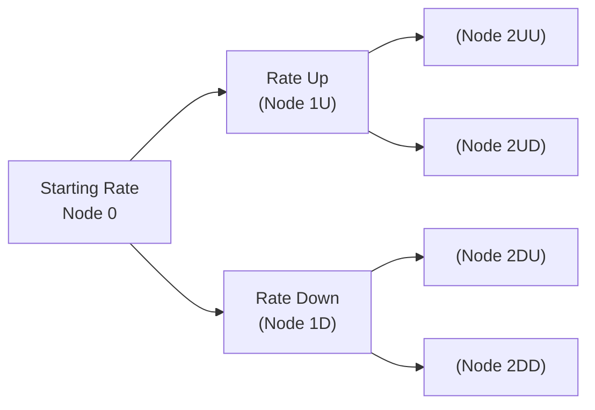

## Understanding the Basics of OAS

Option-Adjusted Spread (OAS) can sometimes feel like a puzzle piece you never knew you needed—until you realize how many curves, possible call or put features, and embedded options exist in the bond market. OAS is essentially the spread you’d see on a bond over a specified benchmark yield curve once you factor out the “noise” (or value) coming from any embedded options. The embedded option might be an issuer call feature, an investor put, or more complex forms of optionality such as those in mortgage-backed securities (MBS).

Why does this matter? When a bond includes an option—for instance, a call option that allows the issuer to redeem the bond early—part of that bond’s yield compensates the investor for the likelihood that the issuer will call the bond. This can skew the apparent spread. OAS aims to “adjust” for that, helping you compare bonds on a more level footing. 

You might be thinking: “That sounds fancy, but is it really a game changer?” Well, yes. Without removing the embedded option effect, comparing yields across various fixed-income instruments becomes a bit like comparing apples to apple pies—both share some similarities, but the extra ingredients can distort your sense of value. 

## Why OAS Matters for Bonds with Embedded Options

Let’s say you’ve got a callable bond. The call feature is valuable to the issuer because they can refinance the debt at more attractive rates if interest rates decline. From your perspective, that call option means your bond might get “taken away” just as prices rise from falling interest rates— diminishing the potential upside. The nominal spread that’s quoted on this callable bond will reflect some premium for that risk. But if you want to compare that bond’s pure credit and liquidity spread with a similar non-callable bond, you have to adjust for that optionality. That’s where OAS comes in.

For putable bonds, it’s the investor who has the right to sell the bond back at a predetermined price before maturity. This is obviously a good thing for you as an investor. If yields spike or credit quality deteriorates, you can choose to “put” the bond, limiting your downside. The nominal yield on a putable bond might be lower than a straight bond because the investor owns a valuable put option. But again, to compare apples to apples, you want to adjust for that embedded put. That adjusted spread is the OAS.

Finally—my favorite and probably the most storied example: mortgage-backed securities. Homeowners have the right to prepay their mortgages at any time, effectively embedding a call option in MBS. This phenomenon complicates MBS pricing because it depends on consumer behavior, market interest rates, and a variety of other dynamic factors. OAS models are widely used here to account for all possible prepayment scenarios so you can figure out the “true” spread you’re receiving for taking on MBS credit and liquidity risks.

## Decomposing the Elements of a Bond’s Yield

To visualize exactly what’s going on, you can think of a bond’s yield as being composed of a few building blocks:

(1) The risk-free rate (e.g., from a Treasury curve)
(2) A credit spread (compensation for default or downgrade risk)
(3) A liquidity or marketability premium
(4) Embedded option costs or benefits (call, put, prepayment, conversion, and so on)

When you remove that option cost from (4)—perhaps through a binomial tree valuation or a Monte Carlo simulation—what remains is your OAS. This approach isolates the portion of the yield spread that compensates you for risk and liquidity, rather than for the potential gains or losses from the embedded option.

## Modeling OAS with a Binomial Interest Rate Tree

Modeling OAS can get quite technical, but the concept remains straightforward: you generate many potential interest rate paths, project the bond’s cash flows (considering if the option will be exercised in each scenario), and discount those cash flows back at each node using the appropriate risk-free rate plus the OAS.

A typical binomial tree for interest rates might look like this:



At each node, you forecast what the bond’s cash flow would be. For a callable bond, the issuer might call at a certain node if interest rates have fallen sufficiently. For a putable bond, the investor might put the bond back if rates have risen enough or if credit spreads widened. You discount each possible path’s cash flows at the appropriate short rate (plus the trial OAS) and iterate until the present value equals the bond’s observed market price. The OAS that equates the model’s price to the bond’s actual market price is, in fact, the bond’s “option-adjusted” spread.

## Incorporating Monte Carlo Simulations

While a binomial tree is relatively intuitive, Monte Carlo simulations can capture interest rate paths in a more flexible and continuous manner. You might specify a volatility parameter σ and a drift μ for interest rates, then simulate thousands of possible rate paths. You estimate bond cash flows (again, embedding optionality logic at each step) and discount them back to present. 

If you ever open up a large fixed-income analytics platform—and see it chugging away for a while—it’s probably crunching these thousands (or millions) of paths to figure out how embedded options affect your bond’s fair price, and from that, it extracts the OAS. 

One personal anecdote: I recall the first time I tried a Monte Carlo approach for an MBS portfolio. I didn’t realize how computationally heavy it would be—my old laptop nearly melted! But the payoff was that I got to see which MBS tranches offered a higher OAS relative to their credit risk. That’s powerful, especially if you manage a multi-sector bond portfolio and need to fine-tune your exposures.

## Differences Between Nominal Spread, Z-Spread, and OAS

It’s easy to get lost in the universe of bond spreads, so let’s quickly contrast three common measures:

• Nominal Spread: A simple difference between the bond’s yield and a comparable benchmark yield (like a Treasury or LIBOR-based swap yield), but it doesn’t adjust for shape of the yield curve or embedded options.

• Zero-Volatility Spread (Z-Spread): The constant spread added to each point of the spot yield curve to discount a bond’s cash flows back to today’s price. Z-spread does not specifically remove the value of any embedded option. If you’re dealing with a callable or putable bond, the Z-spread alone can be misleading.

• OAS: Takes a similar idea to the Z-spread but specifically adjusts for the bond’s embedded optionality. OAS is what you’d see if the embedded option did not exist.

In general, for a callable bond in a stable interest rate environment, you might have:  
Nominal Spread > Z-Spread > OAS  
That’s because the nominal spread might overstate how much compensation you’re actually getting once the call option’s negative effect is stripped out. 

## Volatility Assumptions and OAS

OAS is highly sensitive to volatility assumptions—you tweak vol up or down, you’ll tweak the option value, which in turn changes the OAS. Higher implied or expected interest rate volatility usually makes the call option more valuable to the issuer (bad for the investor) or the put option more valuable to the investor (good for the investor). If your volatility assumption is off, your computed OAS might be misleading. 

## A KaTeX Glimpse: OAS and Pricing

We can express the relationship between price, discount factors, and OAS as follows:


\text{Price} = \sum_{t=1}^{T} \mathbb{E}\Big[\text{CF}_t \times e^{-(r_t + \text{OAS}) \times t}\Big]


Where:
- \\(\text{CF}_t\\) denotes the expected cash flow at time \\(t\\), incorporating the fact that an option could alter that cash flow (e.g., call or put),  
- \\(r_t\\) is the interest rate for period \\(t\\) from your interest rate model (risk-free or benchmark curve),  
- \\(\text{OAS}\\) is the option-adjusted spread you incorporate to reflect credit/liquidity risk outside the pure interest rate environment.

In practice, you compute \\(\text{OAS}\\) by solving the above pricing equation for OAS (given the bond’s market price).

## Using Python to Sketch a Simple Binomial OAS

If you enjoy a bit of coding, here’s a toy example in Python-like pseudocode that attempts to estimate a bond’s OAS using a two-step binomial interest rate model. Keep in mind, real implementations can be far more complex.

```python
import math

def bond_price_with_oas(interest_rate_up, interest_rate_down, 
                        up_probability, oas, 
                        coupon_rate, face_value, periods):
    # This is a highly simplified approach, ignoring complexities of call/put decisions.
    # In a real setting, you'd embed logic to check if the bond is called or put at each node.

    # Step 1: Calculate up and down interest rates for each period
    # Step 2: Discount expected CFs at risk-free + OAS
    # ... Real code would have branching logic.

    # For demonstration, assume one period to maturity, no complicated option logic:
    expected_next_period_value = (up_probability * (face_value + face_value*coupon_rate)) + \
                                 ((1 - up_probability) * (face_value + face_value*coupon_rate))
    discount_factor = 1 / (1 + (oas + (interest_rate_up if up_probability > 0.5 else interest_rate_down)))
    return expected_next_period_value * discount_factor

def main():
    # Example parameters
    up_rate = 0.04
    down_rate = 0.02
    p_up = 0.5
    test_oas = 0.01
    cpn_rate = 0.05
    fv = 1000
    T = 1

    estimated_price = bond_price_with_oas(up_rate, down_rate, p_up, test_oas, cpn_rate, fv, T)
    print("Estimated Bond Price with OAS of {:.2f}%: {:.2f}".format(test_oas*100, estimated_price))

if __name__ == "__main__":
    main()
```

Obviously, this is a toy. Real OAS modeling is more robust, especially when factoring in early exercise decisions for calls and puts at each node or simulating mortgage prepayments. But hopefully it gives a small sense of how the logic might look in code.

## OAS in Mortgage-Backed Securities

Mortgage-backed securities throw in the extra complexity of homeowner prepayments. You’re not just modeling an issuer’s rational decision to call; you’re modeling individuals who may (or may not) refinance their mortgage. As a result, MBS bond analytics can incorporate prepayment models that rely on historical data, projected rates, seasonality, and even borrower credit scores. 

Often, MBS is quoted in terms of “spread to swaps” or “spread to Treasuries,” but you might prefer an OAS measure to see how richly or cheaply an MBS might be trading, once that prepayment option is dissected. When you see an MBS with a wide nominal spread, it doesn’t always mean the bond is a bargain—maybe it’s because everyone suspects faster prepayments that reduce your effective yield. OAS can help cut through that confusion.

## Common Pitfalls and Best Practices

• Overlooking Volatility: Underestimating interest rate volatility can lead you to overestimate OAS on callable bonds or underestimate it on putable bonds.  
• Model Complexity: Too coarse a binomial tree or too few paths in Monte Carlo can produce inaccurate results.  
• Implementation Errors: It’s easy to slip up in the accounting for partial-year coupon accrual or ignoring real-world constraints (like call notice periods).  
• Inconsistent Data Sources: Using different yield curves or mismatch between your model’s discount rates and the bond’s currency region can distort OAS analysis.

A best practice is to continually validate your models with market quotes on more liquid bonds with embedded options. If your model’s OAS for a well-traded callable bond is significantly off from what dealers imply, then you might need to revisit your assumptions (especially volatility and path-dependence logic).

## A Brief Personal Reflection

I still remember my first “aha” moment with OAS. While working on a small team analyzing corporate bonds, we had two similar names in the same rating category. One was a plain-vanilla bond, the other was callable. At first glance, the callable bond was priced cheaply and carried a pretty tempting nominal yield. But after we plugged it into an OAS model, it turned out that the embedded call option essentially gobbled up a good chunk of coupon potential. The bond wasn’t the “steal” it initially seemed. That was a lesson I never forgot: always check optionality. 

## Practical Exam Tips

• Be ready for both essay-type and item set questions asking you to calculate or interpret OAS.  
• In practice problems, pay attention to the underlying interest rate model assumptions. If the question states a certain volatility level, that’s a hint you should incorporate it in your approach.  
• Keep track of partial-year periods, frequency of coupon payments, and how the call/put schedule is structured—these details matter on a real exam.  
• If you’re short on time in an exam scenario, a quick conceptual approach is to recall how OAS < Z-spread for a callable bond and OAS > Z-spread for a putable bond (generally). This can help eliminate wrong answers fast.  
• For MBS, watch out for questions about prepayment assumptions and the differences between nominal spread and OAS-based valuation.

## References for Further Study

• Fabozzi, F. J. (2016). The Handbook of Mortgage-Backed Securities. Oxford University Press.  
• Kalotay, A. J. (1982). “A Bond Valuation Formula That Incorporates Option Features.” Financial Analysts Journal.  
• CFA Program Curriculum (Level I), Readings on OAS and Embedded Options in Fixed Income.  

## Test Your Knowledge: Understanding OAS and Embedded Options



### Which best describes the purpose of Option-Adjusted Spread (OAS) in bond analysis?

- [ ] It measures the difference between a corporate bond’s yield and the 10-year Treasury yield only.  
- [x] It isolates the credit and liquidity spread by removing the effect of embedded options.  
- [ ] It is a spread that only applies to bonds without any option features.  
- [ ] It is the constant spread that, when added to each point on the spot curve, discounts a callable bond’s cash flows to its par value.  

> **Explanation:** OAS focuses on removing the embedded option effect, allowing you to isolate the bond's credit and liquidity spread.

### How does a callable bond’s OAS typically compare to its nominal spread?

- [ ] OAS is always higher because calls must be exercised.  
- [x] OAS is generally lower than the nominal spread because the call option is costly to bondholders.  
- [ ] They are usually the same in a stable interest rate environment.  
- [ ] OAS is greater than the nominal spread in extremely volatile markets only.  

> **Explanation:** Issuer calls reduce cash flows when rates decline, so the nominal spread appears higher; adjusting for the call option drives OAS down.

### When using a Monte Carlo framework to price an MBS, which factor most significantly affects computed OAS?

- [ ] Bond indentures and covenant details.  
- [ ] The borrower’s initial loan-to-value ratio alone.  
- [x] Interest rate volatility assumptions and prepayment modeling.  
- [ ] The presence of normal or inverted yield curves.  

> **Explanation:** MBS valuations hinge heavily on interest rate path simulations and prepayment assumptions, both of which directly influence OAS.

### Which statement about Z-spread vs. OAS is correct for a callable bond?

- [ ] Z-spread equals OAS plus the bond’s coupon rate.  
- [ ] Z-spread always equals OAS in any scenario.  
- [x] Z-spread is generally larger than the OAS because it includes the cost of the embedded call.  
- [ ] OAS is always greater than the Z-spread because calls are beneficial for investors.  

> **Explanation:** The Z-spread doesn’t remove the embedded option’s value, so it is generally higher than OAS for a callable bond.

### What is the primary drawback of using a simple binomial tree for OAS calculations?

- [x] It may oversimplify interest rate movements and embedded option execution.  
- [ ] It is always more accurate than a Monte Carlo approach.  
- [ ] It does not require a volatility input, making it incomplete.  
- [ ] It cannot handle multiple coupon rates.  

> **Explanation:** A simple binomial model can be too coarse, especially when modeling complex exercise features (calls/puts) over many periods.

### Which is likely to happen if an analyst underestimates interest rate volatility when using OAS models for callable bonds?

- [x] The call option value is understated, potentially overstating the OAS.  
- [ ] The OAS will be understated because callable bonds are less sensitive to volatility.  
- [ ] There is no effect because volatility does not affect optionality.  
- [ ] The resulting price is always higher, negating any effect on OAS.  

> **Explanation:** If volatility is underestimated, the call option is valued too cheaply, so the computed OAS appears higher than reality.

### How does a put option embedded in a bond generally affect OAS?

- [x] The put option tends to increase the OAS relative to a similar non-putable bond.  
- [ ] The put option always decreases the bond’s coupon rate, making spreads irrelevant.  
- [x] It allows the investor to benefit from a higher spread if interest rates rise significantly.  
- [ ] It generally leads to a lower yield than a non-putable bond in all scenarios.  

> **Explanation:** A put gives the investor a safety net, so the nominal yield might be lower, but the OAS (net of option effect) is typically higher than a standard bond’s spread for the same issuer.

### In a Monte Carlo simulation for OAS, what is the main purpose of generating many possible interest rate paths?

- [x] To capture a range of possible outcomes for cash flows and embedded option exercises.  
- [ ] To ensure the bond is priced exactly at par.  
- [ ] To avoid the use of volatility assumptions entirely.  
- [ ] To replicate the binomial model results without using trees.  

> **Explanation:** Multiple interest rate paths allow a model to evaluate a broad spectrum of exercise (call/put/prepayment) scenarios and derive an accurate expected present value.

### Which is true regarding mortgage-backed securities (MBS) OAS analysis?

- [x] MBS prepayments are path-dependent and require elaborate models to evaluate the bond’s real spread.  
- [ ] MBS do not include any embedded options.  
- [ ] OAS for MBS is unaffected by volatility.  
- [ ] MBS OAS calculations are identical to those for vanilla corporate bonds.  

> **Explanation:** Mortgage loans allow borrowers to prepay at any time. This path-dependent option requires detailed modeling for credible OAS calculations.

### In valuing a callable bond, which of the following statements is most accurate?

- [x] True
- [ ] False

> **Explanation:** The higher the interest rate volatility, the more valuable a call option is to the issuer, leading to a lower OAS for the investor once that option cost is deducted.


